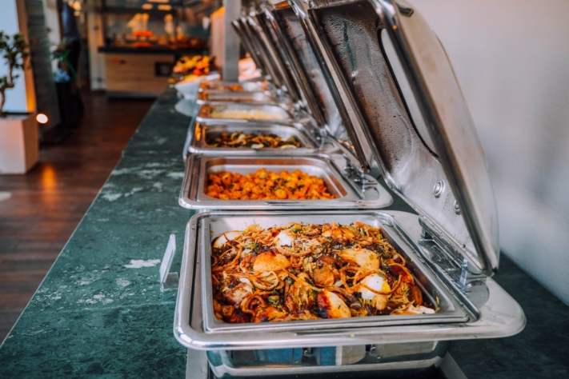

Pronto llegará de nuevo esa época. Mientras algunos todavía están de luto por el verano pasado, los primeros panes de jengibre y galletas en los estantes de los supermercados ya nos recuerdan la próxima temporada navideña. Pero incluso si aún no tiene espíritu navideño: La próxima fiesta de Navidad de la empresa ya le está esperando. Para que su fiesta de Navidad 2025 sea inolvidable, no puede empezar a planificarla con suficiente antelación.

¿Tomas cada año vino caliente con tus colegas en el mercado navideño o sales a comer a un restaurante? ¿Estás pensando en cómo organizar un evento de empresa único con tu equipo en 2025? Entonces nuestras variadas ideas para su próxima fiesta de Navidad son justo lo que necesita.

## Ideas para una fiesta de Navidad fuera de la empresa

Sus empleados ya ven la oficina y el edificio de la empresa cada semana. ¿Qué le parece un lugar que sus colegas aún no conozcan? Una fiesta de Navidad fuera de la empresa siempre aporta un toque especial y ofrece la oportunidad perfecta para dejar atrás la rutina diaria del trabajo. Dependiendo del presupuesto de que disponga para su fiesta, existen numerosas posibilidades, pero debe planificarlas con suficiente antelación.

### Thriller navideño

Una elegante cena misteriosa garantiza una fiesta de Navidad diferente. Usted y su equipo se visten según el tema del crimen e intentan descubrir los secretos de los demás invitados para resolver un caso de asesinato. Mientras tanto, disfrutará de un ambiente único y de deliciosas comidas y bebidas. Si lo desea, los actores también pueden involucrar juguetonamente en la trama a determinados empleados o incluso al jefe.

El thriller navideño interactivo es sin duda una velada inolvidable, con mucha diversión y alguna que otra carcajada. Para reducir al mínimo el esfuerzo de planificación, puede reservar el thriller navideño con varios proveedores y vivir el espectáculo en lugares especialmente diseñados cerca de usted. Alternativamente, la cena de misterio también puede tener lugar en las instalaciones de su propia empresa.

### Salas de Escape

Aquellos que no quieran perderse los complicados rompecabezas ni siquiera en la fiesta de Navidad, seguro que sacarán partido a su dinero en Escape Room. Colabora con tu equipo, resuelve las complicadas tareas y escapad juntos de las diferentes salas. No sólo ofrece emoción y diversión, sino que también fomenta el espíritu de equipo gracias a su carácter interactivo. ¿Qué equipo conseguirá superar el reto más rápido?

Termine la fiesta de Navidad con una acogedora reunión con deliciosa comida y bebida. Hoy en día se pueden encontrar salas de escape en todas las grandes ciudades. Sin embargo, esta idea también se puede poner en práctica con Juegos de Escape móviles que puedes distribuir en las mesas de tu fiesta de Navidad. Sólo tienes que pedir que te lleven los utensilios para los rompecabezas al lugar del evento e instruir a los propios invitados en la aventura lúdica.

Una elegante cena de misterio o las salas de escape navideñas pueden convertirse en un emocionante evento corporativo.

### Ruta del vino caliente

Para los que no quieren prescindir del vino caliente en su fiesta de Navidad, una excursión con vino caliente podría ser justo lo que necesitan. Disfrute con su equipo de diferentes tipos de vino caliente mientras recorren juntos paisajes invernales. Con esta idea, combinará un ambiente de equipo relajado con ejercicio en la naturaleza.

Tras completar con éxito la excursión, podrá redondear la celebración con una deliciosa y reconfortante cena. Puede reservar cómodamente en línea excursiones con vino caliente en una gran variedad de lugares y con varios organizadores. Con un poco más de planificación, también puede organizarla usted mismo.

### Hüttengaudi

Fondue de queso y Kaiserschmarrn, además de aguardiente de frutas y otros clásicos, todo ello en un acogedor ambiente de cabaña. ¿Le parece único? Pues sí. Una fiesta en una cabaña es sin duda una de nuestras favoritas cuando se trata de una fiesta de Navidad de empresa. Alquile un lugar en los Alpes u otras montañas pintorescas para su equipo e implemente el Hüttengaudi con decoración y música a juego.

Una acogedora cabaña rodeada de un paisaje nevado: el lugar perfecto para una fiesta en una cabaña como celebración navideña.

Un programa social colorido e interactivo, salpicado de actividades divertidas como curling, un concurso navideño o una fiesta après-ski, redondea su fiesta de Navidad y garantiza unas horas inolvidables con su equipo. Con esta idea, deberá prever una noche de hotel y unos costes relativamente elevados debido al largo viaje de ida y vuelta.

### Juegos Olímpicos de Invierno

Una idea especialmente deportiva para tu fiesta de Navidad son los Juegos Olímpicos de Invierno. Compite contra tus colegas en varias disciplinas y pon a prueba tus habilidades y tu espíritu de equipo. Te esperan disciplinas como el curling, el lanzamiento de bolas de nieve, el clavado de competición o el lanzamiento de abetos. Y para que no te quedes sin fuerzas con tanta actividad deportiva, puedes reponer fuerzas en un iglú caldeado con vino caliente y galletas.

Una vez finalizadas todas las disciplinas y elegidos los ganadores, el evento de empresa puede completarse, por supuesto, con una cena conjunta. Puedes reservar estas olimpiadas de invierno en distintos lugares, como un estadio de hielo. Si no quiere desplazarse hasta el lugar de celebración y dispone de un gran espacio abierto (por ejemplo, un aparcamiento), la pista de hielo también puede instalarse fácilmente en las instalaciones de la empresa.

## Más ideas para fiestas de Navidad

¿Le apetece salir de fiesta pero nuestros 5 mejores planes aún no le han convencido? Aquí tienes más ideas:

- **Fiesta de Navidad, ¡a la vista!** Contrata un barco y su tripulación, sube a tus empleados a bordo y organiza una animada fiesta en un río o lago de tu zona.
- **Velada en el castillo:** Invite a sus empleados a una fiesta en un castillo o una casa solariega cercana. El año no puede acabar con una nota más noble.
- **Mesa redonda caballeresca:** puede celebrar una fiesta de Navidad con comida y bebida como en la Edad Media en castillos, bodegas abovedadas o posadas rústicas.

¿Qué te parece un castillo de cuento de hadas o un castillo medieval para tu fiesta de Navidad?

## Ideas para la fiesta de Navidad en la empresa

Si no desea celebrar su fiesta de Navidad en un lugar externo, sino que prefiere utilizar cómodamente las instalaciones de su empresa, esto no significa en absoluto que su fiesta no pueda ser también extraordinaria. También hay muchas ideas para hacer de su fiesta de Navidad in situ un evento corporativo especial.

### Fiesta del lema

Una fiesta temática es un acontecimiento popular que requiere relativamente poco esfuerzo. Decídete por un tema inusual, por ejemplo una Fiesta del Gran Gatsby al estilo de los años 20, vístete en consecuencia junto con tu equipo y disfrutad de una velada elegante y festiva. Asegúrate de que tanto la decoración como la música estén en consonancia con el tema. Desde una recepción con champán hasta un menú de tres platos adecuado, pasando por un bar de cócteles: en una fiesta así no puede faltar un catering culinario acorde con el lema. Si es necesario, consigue ayuda externa para la organización de tu fiesta temática.

### Casino Royale

Convertir su local en un casino es una idea extraordinaria y divertida para su fiesta de Navidad. Lleve la glamurosa sensación de Las Vegas directamente a su empresa. Croupiers profesionales esperan a sus invitados con juegos como el blackjack, el póquer o la ruleta. ¿No suena nada navideño? Pues sí. Con un menú navideño y la decoración adecuada, puede conseguir fácilmente un ambiente navideño.

Por supuesto, el objetivo de una fiesta de Navidad no es apostar dinero real, sino el humor y la diversión de sus empleados. No obstante, puede ofrecer premios a los empleados que reúnan más fichas a lo largo de la velada. Los proveedores externos le ayudan a organizar la velada, se encargan de los crupieres y le entregan el material de casino.

### Pastelería navideña

Una idea para la fiesta de Navidad de su empresa que puede llevarse a cabo rápidamente y sin demasiados preparativos es la elaboración conjunta de pasteles de Navidad. Los requisitos para ello son que disponga de una cocina de empresa bien equipada con horno y que su equipo o departamento esté formado por un número manejable de compañeros. Reviva los recuerdos de la infancia y pasen juntos horas acogedoras preparando una gran variedad de galletas navideñas. Las creaciones horneadas resultantes, como medias lunas de vainilla, estrellas de canela y similares, pueden envasarse juntas y, por supuesto, comerse.

Hornear Navidad con los compañeros: una idea sencilla para que la fiesta de Navidad de la empresa sea un éxito.

Mientras las galletas se hornean y se enfrían, puedes preparar un delicioso menú navideño y terminar tu fiesta de Navidad en una acogedora tertulia con comida y bebida.

## Planificación de los pilares de su fiesta de Navidad

Dependiendo del tamaño de su empresa, el esfuerzo necesario para planificar su fiesta de Navidad puede variar enormemente. Un equipo con 10 empleados probablemente pueda aclarar los puntos clave de un evento de empresa en una sola reunión. Sin embargo, más allá de este número de participantes, la preparación de una fiesta de Navidad requiere un enfoque profesional.

### Fijar el presupuesto

En primer lugar, debe fijar un presupuesto para su fiesta de Navidad. Un buen punto de referencia para ello podría ser la desgravación fiscal alemana: Como en cualquier evento de empresa, los gastos de tu fiesta de Navidad están exentos de impuestos hasta 110 euros por participante. Esta cantidad es realista si se hace cargo de la comida y la bebida de sus empleados, pero no incluye los gastos importantes de un local o un programa de apoyo.

### Buscar ideas

Entonces podrá pensar cómo quiere celebrarlo con sus empleados y qué ideas son factibles con su presupuesto. En la parte superior de este artículo ya le ofrecemos varias ideas para su fiesta de Navidad. Busque en Internet posibles proveedores para su programa previsto. Haz una lista con los costes estimados por persona y reduce las opciones en función de tu presupuesto.

### Determinar fechas y lugares

Busque fechas y lugares adecuados. Si tiene la opción de celebrar la fiesta de Navidad en su propio local, probablemente sea la opción más barata. Además, entonces podrá elegir la fecha libremente, siendo especialmente adecuados los viernes de diciembre. Si, por ejemplo, se decide por una cena misteriosa o una fiesta en una cabaña, la elección de fechas y lugares ya está predeterminada por los proveedores. Es aconsejable empezar a reservar lo antes posible.

### Invitar y entrevistar a invitados

Probablemente ya tenga una idea aproximada de cuántas personas asistirán potencialmente a su fiesta de Navidad. Sin embargo, antes de empezar a planificar los detalles, debería comprobar la disponibilidad de sus invitados. Por ejemplo, puede incluir en su invitación el enlace a una encuesta en línea. Además de la preferencia de fechas, puede pedir a sus empleados que indiquen directamente, por ejemplo, si asistirán con pareja, si necesitan alojamiento para pasar la noche y si tienen preferencia por la comida vegana, vegetariana o sin gluten.

## Planifique los detalles de su fiesta de Navidad

Una vez que sepas cuándo, dónde y cómo vas a celebrarlo con tus empleados, debes aclarar los detalles de tu fiesta de Navidad.

### Comida y bebida para su fiesta de Navidad

Probablemente el aspecto más importante de su fiesta de Navidad sea el catering para sus invitados. Unas bebidas selectas y un menú delicioso suelen ser la mitad de la batalla y garantizan el buen humor y la satisfacción de sus invitados. Incluso con un presupuesto relativamente pequeño, tiene varias opciones a su alcance. Visiten juntos un restaurante, contraten un servicio de catering para un bufé o reserven un food truck para ofrecer a sus colegas deliciosa comida in situ. Dependiendo del tamaño de tu equipo y del equipamiento de tu local, también puede ser una buena idea preparar tú mismo una comida de Navidad conjunta.

Ya sea una visita a un restaurante, un servicio de catering o cocinar juntos: El catering para tus invitados sienta las bases de una fiesta de Navidad de éxito.

**Comida y bebida: ideas para la fiesta de Navidad:**

- Entrantes calientes como la crema de calabaza o la sopa de patata
- Los clásicos: ganso de Navidad relleno y gulash de caza con albóndigas y lombarda
- Degustación de bebidas alcohólicas (por ejemplo, degustación de vino, whisky o cócteles)
- Postres navideños como strudel de manzana, stollen navideño o pan de especias

### Programa de animación para su fiesta de Navidad

Si se ha decidido por una de las ideas anteriores, gran parte del programa de su fiesta de Navidad ya está decidido. En este caso, coordínate con el organizador del evento reservado y aclara lo que aún tengas que organizar tú mismo. Si estás planeando la fiesta de Navidad por tu cuenta, deberías plantearte cómo organizar el programa de la noche. A continuación te proponemos tres ideas:

1. Si quieres coronar tu fiesta de Navidad con música, puedes contratar a un grupo de música en directo o a un DJ para poner a bailar a tus invitados a última hora de la noche.
2. ¿O prefieres reírte mucho juntos? Por ejemplo, invita a un cómico que dé una charla divertida e interactúe con tus invitados.
3. Adivinar juntos también aligera el ambiente y, sin duda, proporciona alguna que otra carcajada. Un concurso navideño con un moderador profesional sería perfecto para ello.

¿Tiene un presupuesto limitado, pero quiere pasar una velada divertida con sus empleados? No hay problema. Incluso así podrá ofrecer a sus colegas un evento de empresa que recordarán durante mucho tiempo. Puedes encargarte tú mismo de algunos puntos del programa: Por ejemplo, crea una lista de reproducción con la música adecuada para tu fiesta de Navidad o prepara tú mismo varios juegos de preguntas y respuestas.

## Conclusión:

La fiesta anual de Navidad es el mayor acontecimiento de fin de año para muchas empresas. En consecuencia, sus empleados tienen grandes expectativas puestas en este evento de empresa. Para garantizar una fiesta de Navidad en armonía, es esencial empezar a planificarla con varios meses de antelación. Dependiendo de su presupuesto, tiene diferentes [opciones](https://www.lebegeil.de/weihnachtsfeier-ideen-firma/). Ya se trate de un thriller navideño, de una fiesta temática o de repostería navideña, sea creativo e invente algo original. Porque una cosa es segura: la enésima visita al mercado navideño o al restaurante italiano de la esquina tiene más probabilidades de provocar resaca a sus empleados que espíritu navideño.

### Consejos de software para organizar su fiesta de Navidad

Para tenerlo todo controlado a la hora de planificar y organizar su fiesta de Navidad, puede organizar todas las cosas importantes con la solución gratuita de tablas y bases de datos SeaTable. Por ejemplo, puede utilizar un [formulario web]() para inscribir a sus invitados. Compare fácilmente los precios y ofertas de diferentes lugares y organizadores de eventos o calcule los costes de la comida y la bebida. Varias funciones para visualizar sus datos (por ejemplo, línea de tiempo, calendario, mapa, tablero Kanban o estadísticas) le ofrecen la oportunidad de preparar a la perfección la próxima fiesta de Navidad de su empresa.

Pruebe la [plantilla]() SeaTable registrándose [aquí]() de forma gratuita. Por supuesto, puede rellenar las tablas con sus propios datos y personalizarlas para adaptarlas a sus necesidades.
