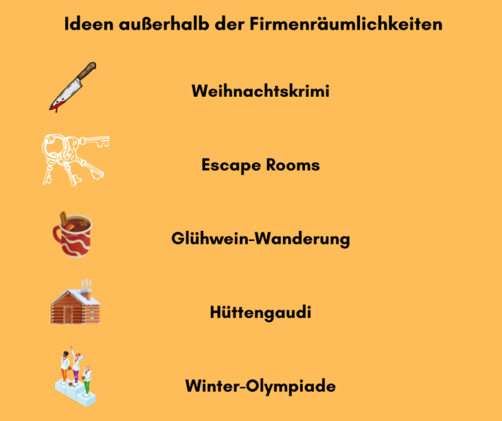
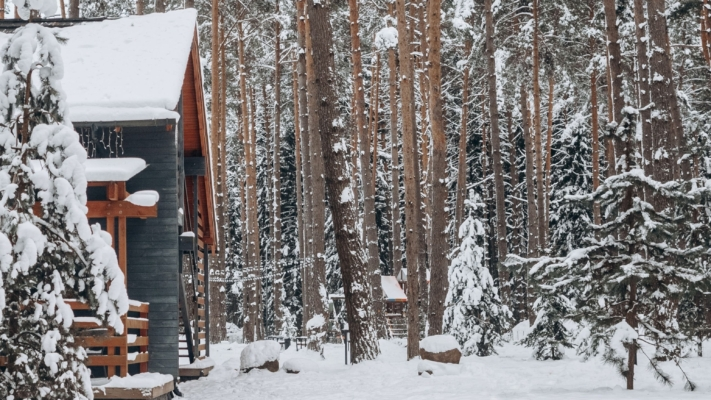
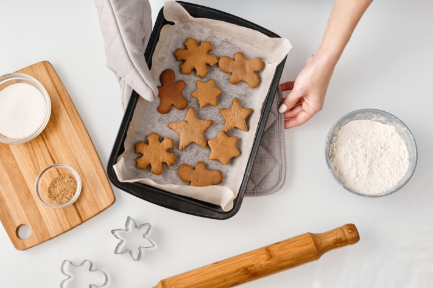

Скоро снова наступит это время! Пока одни еще оплакивают ушедшее лето, первые пряники и печенье на полках супермаркетов уже напоминают нам о приближении рождественского сезона. Но даже если вы еще не прониклись рождественским духом: Следующая рождественская вечеринка в компании уже ждет вас. Чтобы сделать рождественскую вечеринку 2025 года незабываемой, нельзя начинать планировать ее раньше!

Вы каждый год пьете глинтвейн с коллегами на рождественском базаре или ходите ужинать в ресторан? Вы думаете о том, как организовать уникальное корпоративное мероприятие для своей команды в 2025 году? Тогда наши разнообразные идеи для предстоящей рождественской вечеринки - то, что нужно!

## Идеи для проведения новогодней вечеринки вне помещения компании

Ваши сотрудники уже видят офис и здание компании каждую неделю. А как насчет того, чтобы провести рождественскую вечеринку там, где ваши коллеги еще не знают? Рождественская вечеринка за пределами компании всегда привносит особый колорит и дает прекрасную возможность оставить позади повседневную рабочую рутину. В зависимости от бюджета, которым вы располагаете для проведения вечеринки, существует множество возможностей, но планировать их следует заблаговременно.

### Рождественский триллер

Стильный таинственный ужин гарантирует рождественскую вечеринку с отличием. Вы и ваша команда одеваетесь в соответствии с криминальной тематикой и пытаетесь разгадать секреты других гостей, чтобы раскрыть дело об убийстве. При этом вы наслаждаетесь уникальной атмосферой, вкусными блюдами и напитками. При желании актеры могут в игровой форме вовлечь в сюжет отдельных сотрудников или даже начальника.

Интерактивный рождественский триллер - это, безусловно, незабываемый вечер, много веселья и смеха! Чтобы свести к минимуму затраты на планирование, вы можете заказать рождественскую загадку у различных провайдеров и увидеть это зрелище в специально отведенных для этого местах поблизости от вас. Кроме того, таинственный ужин может состояться и на территории вашей компании.

### Комнаты побега

Те, кто не хочет пропускать хитрые головоломки даже на новогодней вечеринке, обязательно получат свою выгоду в Escape Room. Работайте вместе с командой, решайте хитрые задачи и вместе выбирайтесь из разных комнат. Это не только увлекательное и веселое развлечение, но и способствует сплочению коллектива благодаря своей интерактивности. Какая команда быстрее всех справится с заданием?

Завершите рождественскую вечеринку уютной встречей с вкусной едой и напитками. Эскейп-румы сегодня можно найти в каждом крупном городе. Однако эту идею можно реализовать и с помощью мобильных эскейп-игр, которые можно разложить на столах во время рождественской вечеринки. Достаточно просто заказать доставку инвентаря для головоломок на место проведения мероприятия, и гости сами будут участвовать в игровом приключении.

Стильный ужин с тайнами или рождественские эскейп-румы могут стать увлекательным корпоративным мероприятием.

### Поход за глинтвейном

Для тех, кто не хочет обходиться без глинтвейна на рождественской вечеринке, поход за глинтвейном может оказаться как раз кстати. Наслаждайтесь различными сортами глинтвейна вместе со своей командой, прогуливаясь по ветреным пейзажам. Эта идея позволяет совместить расслабленную атмосферу в коллективе с физическими упражнениями на природе.

После успешного завершения похода можно завершить праздник вкусным и насыщающим ужином. Походы за глинтвейном можно удобно забронировать через Интернет в самых разных местах и у разных организаторов. Приложив больше усилий для планирования, его, конечно, можно организовать и самостоятельно.

### Хюттенгауди

Сырное фондю и кайзершмаррн, фруктовый бренди и другие классические блюда - и все это в уютной хижине. Звучит уникально? Так и есть! Вечеринка в хижине - это, безусловно, один из наших любимых вариантов проведения новогоднего корпоратива. Арендуйте для своей команды место в Альпах или других живописных горах и организуйте "Хюттенгауди" с соответствующими декорациями и музыкой.

Уютная хижина в окружении снежного пейзажа: идеальное место для проведения новогодней вечеринки в хижине.

Красочная и интерактивная социальная программа, включающая такие увлекательные мероприятия, как керлинг, рождественская викторина или вечеринка после катания на лыжах, завершит рождественскую вечеринку и обеспечит незабываемые часы общения с коллективом. При реализации этой идеи следует предусмотреть ночлег и относительно высокие расходы, связанные с длительной поездкой на мероприятие и обратно.

### Зимние Олимпийские игры

Особенно спортивной идеей для новогодней вечеринки являются зимние Олимпийские игры. Соревнуйтесь с коллегами в различных дисциплинах, проверяйте свои навыки и командный дух. Вас ждут такие дисциплины, как керлинг, метание снежков, конкурсное забивание гвоздей или метание елок. Чтобы не выдохнуться от такой спортивной активности, вы можете восстановить силы в отапливаемом иглу с глинтвейном и печеньем.

После завершения всех дисциплин и определения победителей корпоративное мероприятие, конечно же, можно завершить совместным ужином. Проведение зимних Олимпийских игр можно заказать в различных местах, например, на ледовом стадионе. Если нет необходимости добираться до места проведения соревнований и есть большая открытая площадка (например, автостоянка), то каток можно легко организовать и на территории компании.

## Другие идеи для проведения рождественских вечеринок

Вы хотите повеселиться на славу, но наши 5 лучших вариантов вас еще не убедили? Вот еще несколько идей:

- **Рождественская вечеринка!** Наймите корабль и команду, пригласите на борт своих сотрудников и устройте зажигательную вечеринку на реке или озере в вашем регионе.
- **Праздник в замке:** Пригласите своих сотрудников на праздник в ближайший замок или поместье. Вряд ли год можно завершить на более благородной ноте!
- **Рыцарский круглый стол:** Рождественский праздник с едой и напитками можно отметить, как в Средние века, в замках, в сводчатых подвалах или деревенских трактирах.

Как насчет сказочного или средневекового замка для рождественской вечеринки?

## Идеи для проведения новогодней вечеринки на территории компании

Если вы не хотите проводить новогоднюю вечеринку на улице, а предпочитаете комфортно использовать помещение своей компании, это вовсе не означает, что ваша вечеринка не может быть необычной. Существует множество идей, как сделать новогоднюю вечеринку на территории компании особенным корпоративным событием.

### Девиз партии

Популярное мероприятие, которое не требует особых усилий, - это тематическая вечеринка. Выберите необычную тему, например "Великий Гэтсби" в стиле 1920-х годов, оденьтесь вместе со своей командой соответствующим образом и проведите стильный и праздничный вечер. Позаботьтесь о том, чтобы и декорации, и музыка соответствовали теме. От приема с шампанским до подходящего меню из трех блюд и коктейль-бара: кулинарный кейтеринг в соответствии с темой не должен отсутствовать на такой вечеринке. При необходимости привлеките стороннюю помощь для организации тематической вечеринки.

### Казино "Рояль

Превращение вашего помещения в казино - необычная и забавная идея для новогодней вечеринки. Перенесите ощущение гламурного Лас-Вегаса прямо в вашу компанию! Профессиональные крупье ждут Ваших гостей с такими играми, как блэкджек, покер или рулетка. Звучит совсем не по-рождественски? Еще как звучит! С помощью рождественского меню и подходящих декораций можно легко добиться рождественской атмосферы.

Конечно, основной акцент на новогодней вечеринке делается не на игре на реальные деньги, а на настроении и веселье сотрудников. Тем не менее, можно предложить призы сотрудникам, собравшим за вечер наибольшее количество фишек. Сторонние провайдеры помогут вам в организации вечера, организуют крупье и доставят оборудование для казино на место.

### Рождественская выпечка

Одна из идей для новогоднего корпоративного праздника, которую можно реализовать быстро и без особой подготовки, - совместное приготовление новогодней выпечки. Для этого необходимо, чтобы у вас была хорошо оборудованная кухня с духовкой и чтобы в вашем коллективе или отделе было достаточное количество коллег. Оживите детские воспоминания и проведите уютные часы за совместным приготовлением разнообразного рождественского печенья. Получившуюся выпечку, такую как ванильные полумесяцы, звездочки с корицей и т.п., можно упаковать и, конечно же, съесть.

Рождественская выпечка с коллегами: простая идея для успешной новогодней вечеринки в компании.

Пока печенье печется и остывает, можно приготовить вкусное рождественское меню и завершить рождественскую вечеринку в уютной обстановке с едой и напитками.

## Планирование основных элементов новогодней вечеринки

В зависимости от размера компании усилия, необходимые для планирования новогодней вечеринки, могут сильно различаться. Команда из 10 сотрудников, скорее всего, может уточнить ключевые моменты корпоративного мероприятия за одну встречу. Однако при большем количестве участников подготовка новогодней вечеринки требует профессионального подхода.

### Установить бюджет

Прежде всего, необходимо определить бюджет рождественской вечеринки. Хорошим ориентиром для этого может послужить немецкая налоговая льгота: Как и в случае с любым другим корпоративным мероприятием, расходы на рождественскую вечеринку не облагаются налогом в размере до 110 евро на одного участника. Эта сумма вполне реальна, если вы позаботитесь о еде и напитках для своих сотрудников, но не будете включать в нее крупные расходы на место проведения мероприятия или вспомогательную программу.

### Найти идеи

Затем вы можете подумать о том, как вы хотите отметить праздник вместе со своими сотрудниками и какие идеи могут быть реализованы в рамках вашего бюджета. Разнообразные идеи для рождественской вечеринки уже представлены в верхней части этой статьи. Поищите в Интернете возможных поставщиков услуг для запланированной программы. Составьте список с указанием предполагаемых расходов на одного человека и сузьте круг возможных вариантов, исходя из вашего бюджета.

### Определение сроков и места проведения

Поищите подходящие даты и места. Если у вас есть возможность провести рождественскую вечеринку в собственном помещении, то это, вероятно, самый дешевый вариант. Кроме того, в этом случае можно свободно выбирать дату - особенно хорошо подходят пятницы в декабре. Если же вы решили провести, например, ужин с тайнами или вечеринку в хижине, то выбор даты и места проведения уже предопределен поставщиками. Рекомендуется начинать бронирование как можно раньше.

### Приглашение и интервьюирование гостей

Вероятно, вы уже примерно представляете, сколько человек будет присутствовать на вашей новогодней вечеринке. Однако прежде чем приступать к планированию деталей, необходимо проверить готовность гостей. Например, в приглашение можно встроить ссылку на онлайновый опрос. В дополнение к предпочтениям по дате проведения мероприятия можно попросить сотрудников прямо указать, например, будут ли они присутствовать на празднике с партнером, нуждаются ли они в ночлеге и предпочитают ли они веганскую, вегетарианскую или безглютеновую пищу.

## Планирование деталей новогодней вечеринки

После того как вы узнали, когда, где и как вы будете отмечать праздник вместе с сотрудниками, следует уточнить детали новогодней вечеринки.

### Продукты и напитки для новогодней вечеринки

Пожалуй, самым важным аспектом новогодней вечеринки является организация питания гостей. Выбранные напитки и вкусное меню - это зачастую половина успеха и залог хорошего настроения и удовлетворенности гостей. Даже при относительно небольшом бюджете у вас есть несколько вариантов. Посетите вместе ресторан, наймите кейтеринга для организации фуршета или закажите фудтрак, чтобы обеспечить своих коллег вкусной едой на месте. В зависимости от численности коллектива и оснащенности помещения, возможно, стоит приготовить совместное рождественское блюдо самостоятельно.

Будь то посещение ресторана, кейтеринговая служба или совместное приготовление пищи: Организация питания гостей закладывает основу для успешного проведения новогодней вечеринки.

**Еда и напитки - идеи для новогодней вечеринки:**

- Теплые закуски, такие как тыквенный суп-пюре или картофельный суп
- Классика: фаршированный рождественский гусь и сытный гуляш из дичи с кнедликами и красной капустой
- Дегустация алкогольных напитков (например, дегустация вина, виски или коктейлей)
- Рождественские десерты, такие как яблочный штрудель, штоллен или имбирные пряники

### Развлекательная программа для новогодней вечеринки

Если вы остановились на одной из вышеперечисленных идей, то значительная часть программы новогодней вечеринки уже определена. В этом случае согласуйте с организатором заказанное мероприятие и уточните, что еще придется организовывать самостоятельно. Если вы планируете всю новогоднюю вечеринку самостоятельно, то вам следует подумать о том, как организовать вечернюю программу. Ниже мы предлагаем вам три идеи:

1. Если вы хотите сделать рождественскую вечеринку музыкально насыщенной, можно нанять живую группу или диджея, чтобы гости танцевали до позднего вечера.
2. Или вы предпочитаете много смеяться вместе? Например, пригласите стендап-комика, который выступит с забавным рассказом и пообщается с гостями.
3. Совместное отгадывание загадок также поднимает настроение и, конечно, позволяет посмеяться. Рождественская викторина с профессиональным ведущим как раз подходит для этого.

Вы ограничены в бюджете, но все равно хотите провести веселый вечер с сотрудниками? Нет проблем! Даже в этом случае вы сможете подарить своим коллегам корпоративное мероприятие, которое запомнится им надолго. Некоторые пункты программы вы можете полностью взять на себя: Например, составить плейлист с подходящей музыкой для новогодней вечеринки или самостоятельно подготовить различные игры-викторины.

## Заключение

Ежегодная рождественская вечеринка - главное событие конца года для многих компаний. Соответственно, ваши сотрудники возлагают большие надежды на это корпоративное мероприятие. Чтобы обеспечить всестороннее гармоничное проведение рождественской вечеринки, необходимо начать планирование за несколько месяцев до ее начала. В зависимости от вашего бюджета у вас есть разные [варианты](https://www.lebegeil.de/weihnachtsfeier-ideen-firma/). Будь то рождественский триллер, тематическая вечеринка или рождественская выпечка - будьте креативны и придумайте что-нибудь оригинальное. Ведь одно можно сказать наверняка: уже десятый поход на рождественский рынок или в итальянский ресторан за углом скорее вызовет у ваших сотрудников похмелье, чем рождественское настроение.

### Программный совет по организации новогодней вечеринки

Чтобы уследить за всем при планировании и организации рождественской вечеринки, вы можете организовать все важные вещи с помощью бесплатного решения для работы с таблицами и базами данных SeaTable. Например, вы можете использовать [веб-форму]() для регистрации гостей. Легко сравнить цены и предложения различных мест и организаторов мероприятий или рассчитать расходы на еду и напитки. Различные функции для визуализации данных (например, временная шкала, календарь, карта, доска Канбан или статистика) позволят вам идеально подготовить предстоящую рождественскую вечеринку.

Просто попробуйте [шаблон]() SeaTable, бесплатно зарегистрировавшись [здесь](). Конечно, вы можете заполнить таблицы собственными данными и настроить их под свои нужды.
