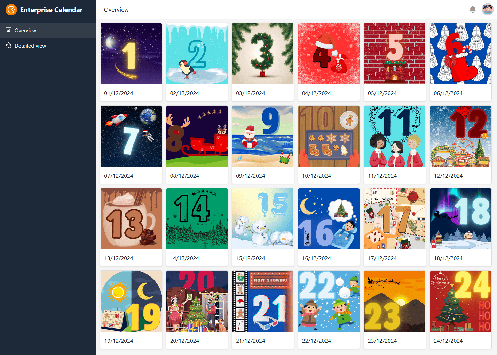

Weihnachten steht vor der Tür und Sie möchten Ihren Mitarbeitern, Geschäftspartnern oder Kunden eine kleine Aufmerksamkeit als Zeichen Ihrer **Wertschätzung** zukommen lassen. Doch was könnten passende Weihnachtsgeschenke für Mitarbeiter und Kunden sein? Ideenreichtum und Fingerspitzengefühl sind gefragt! Welche **Weihnachtsgeschenke** Ihre Mitarbeiter und Kunden erfreuen und mit welchem **Budget** Sie rechnen können, erfahren Sie in diesem Artikel.

## 5 Geschenkideen im Überblick

Ob große Gesten oder kleine Aufmerksamkeiten – jeder freut sich über ein Geschenk. Doch es muss nicht immer ein Geschenk in Form eines materiellen Gegenstands oder Gutscheins sein. Etwas zu verschenken geht über das Materielle hinaus und kann sich in vielen Arten zeigen.

Welche Idee werden Sie dieses Weihnachten umsetzen?

## 1\. Social Responsibility

Als Unternehmen gemeinsam soziale Verantwortung übernehmen: Darum geht es bei **Social Responsibility**. Besonders zur Weihnachtszeit kommt das Bedürfnis auf, im Zeichen der **Nächstenliebe** Menschen zu helfen – sei es durch Sach- und Geldspenden oder den eigenen Einsatz vor Ort. Auch Sie als Unternehmen können helfen, indem Sie selbst **spenden** oder auch Ihre Kunden dazu animieren, einen guten Zweck zu unterstützen.

Viele Hilfsorganisationen und soziale Einrichtungen freuen sich über Ihren Beitrag und stellen Ihnen als kleines Dankeschön diverse Kommunikationsmittel zur Verfügung. Damit können Sie Ihr Engagement auch öffentlich gebührend präsentieren und weitere Außenstehende inspirieren, ebenfalls zu spenden.

## 2\. Adventskalender

24 Türchen, 24 Überraschungen! Es müssen nicht immer große Weihnachtsgeschenke für Mitarbeiter und Kunden sein, denn die Weihnachtszeit ist vor allem von Vorfreude geprägt. Ein **Adventskalender** bringt jeden Tag ein bisschen Freude an den Arbeitsplatz, egal ob gefüllt mit Leckereien oder digital mit Fotos, Videos und Botschaften.

### Adventskalender mit Firmenlogo

Schokolade, aber mit Pep? Kein Problem! Gestalten Sie für Ihre Mitarbeiter und Kunden einen Adventskalender mit Ihrem Firmenlogo oder fügen Sie individuelle Botschaften hinzu.

Egal in welcher Form, Schokolade schmeckt immer gut!

In [ausgewählten Onlineshops](https://www.weihnachtsplaner.de/adventskalender?p=1) können Sie ganz einfach einen Kalender auswählen und diesen an Ihre Vorstellungen anpassen.

### Selbstgemachter Adventskalender

Möchten Sie nur für ausgewählte Personen einen Adventskalender zusammenstellen, können Sie auch selbst Hand anlegen. Hierbei ist der Vorteil, dass Sie den Kalender individuell auf die Person abstimmen können. [Wie Sie einen Adventskalender selbst basteln und womit Sie diesen befüllen können, erfahren Sie in diesem Artikel](https://seatable.io/adventskalender-selber-machen/).

### Online-Adventskalender

Eine schöne Alternative zum klassischen analogen Adventskalender ist eine digitale Variante. Ihren unternehmenseigenen Online-Adventskalender können Sie mit Bildern, Videos oder Weihnachtszitaten befüllen und dann einfach per Link als Weihnachtsgeschenk an Mitarbeiter und Kunden verschicken.

Das Team von SeaTable hat für Sie [eine Vorlage]() erstellt, welche Sie nach Ihren Bedürfnissen anpassen können. Geben Sie dem Kalender eine persönliche Note und freuen Sie sich auf die erstaunten Gesichter Ihrer Mitarbeiter, wenn diese täglich eine neue Überraschung hinter einem der Türchen entdecken.

Wenn Sie SeaTable für die Erstellung eines Online-Adventskalenders nutzen möchten, [registrieren]() Sie sich einfach kostenlos und passen Sie die Vorlage nach Belieben an. In der Vorlage finden Sie zudem 24 Ideen, welche Weihnachtsgeschenke für Mitarbeiter und Kunden in Frage kommen.

## 3\. Geschenk mit Unternehmensbezug

Den Bogen zwischen Weihnachtsstimmung und Arbeit zu schlagen, ist eine Herausforderung. Schließlich ist ein Besuch auf dem Weihnachtsmarkt oder eine Runde Schlittschuhlaufen viel verlockender als den ganzen Tag im Büro zu verbringen. Es liegt nun an Ihnen, die **Weihnachtsstimmung** in Ihr Unternehmen zu bringen!

Individuelle Notizbücher mit Logoprägung von LEUCHTTURM1917.

- **Logo? Na logo!** Verzieren Sie Kunden- oder Mitarbeitergeschenke mit Ihrem Branding, um aus der Masse hervorzustechen. Nützliche Alltagshelfer in Ihrem Firmendesign oder mit einer Logoprägung veredelt eignen sich dafür besonders gut. Mit schön gestalteten Notizbüchern oder Kalendern machen Sie nicht nur Ihren Kunden eine Freude sondern verschenken Markenbotschafter. Bei [ausgewählten Anbietern](https://www.leuchtturm1917.de/fuer-unternehmen/corporate-gift/) können Sie ganz einfach passende Notizbücher auswählen und individuell gestalten.
- **Hingucker auf dem Schreibtisch**: Ein Geschenk, das am Arbeitsplatz von Nutzen ist? Ja, gerne! Sei es eine Pflanze, ein Nackenkissen oder ein Stiftehalter – alles, was den Arbeitsalltag verschönert, ist ein gutes Geschenk.
- **Musikalische Untermalung**: Ein Geschenk für alle! Musik bei der Arbeit verbessert die Laune und regt zum Mitsingen an.
- **Herausforderung angenommen**: Ein Geschenk gibt es erst, wenn alle weihnachtlichen Challenges erfüllt wurden. Das hält den Spaßfaktor hoch.

## 4\. Selbstgemachtes von Herzen

Ein **selbstgemachtes Geschenk** bereitet große Freude, denn es zeigt, dass Sie Arbeit, Zeit und Liebe investiert haben. In großen Unternehmen ist es kaum möglich, jedem Mitarbeiter und Kunden ein persönliches Geschenk zu machen. Trotzdem können Sie durch kleine, durchdachte Weihnachtsgeschenke zeigen, wie sehr Sie Ihre Mitarbeiter und Kunden schätzen.

- **Grußkarte**: Der Klassiker zu Weihnachten. Gestalten Sie die Weihnachtskarte Ihrer Firma mit einem spannenden Motiv und einer persönlichen Botschaft. Oder wie wäre es mit einem selbstgeschriebenen Gedicht oder einer persönlichen Widmung? Machen Sie Ihre Grußkarte zur schönsten auf dem Schreibtisch Ihrer Kunden und Mitarbeiter!

Der Fantasie sind keine Grenzen gesetzt.

- **Unternehmensfilm**: Film ab, und zwar mit Humor! Ein professionelles [Unternehmensvideo](https://seatable.io/storyboard/) gibt zwar einen anschaulichen Überblick darüber, was Sie als Firma tun, ist aber kaum als Weihnachtsgeschenk für Mitarbeiter oder Kunden geeignet. Ein kreativer Film über Sie und Ihre Mitarbeiter, ermöglicht es Ihren Kunden und anderen Mitarbeitern, Sie auf einer persönlichen Ebene besser kennenzulernen.
- **Persönliche Auswahl**: Ein weiterer Klassiker unter den Weihnachtsgeschenken für Mitarbeiter ist ein gut gefüllter Geschenkkorb. Um dem Ganzen eine persönlichere Note zu geben, überlegen Sie sich, was Sie und Ihre Mitarbeiter gerne mögen. Auch ein Bezug zu Ihrem Hauptsitz, zum Beispiel regionale Produkte von nahegelegenen Betrieben, ist denkbar. Fügen Sie zu dem Geschenkkorb eine Nachricht hinzu und schreiben Sie darauf, warum Sie sich für die Inhalte entschieden haben. Damit drücken Sie aus, dass Sie sich Gedanken über das Geschenk und dessen Wirkung gemacht haben.

## 5\. Gemeinsame Erlebnisse

**Gemeinsame Zeit** ist für viele, besonders im oft stressigen Alltag, das schönste Geschenk. Organisieren Sie als Weihnachtsgeschenk für Ihre Mitarbeiter gemeinsame Aktivitäten neben der Arbeit und schaffen Sie damit unvergessliche Erinnerungen.

Ein gemeinsamer Weihnachtsmarktbesuch oder abendliches Plätzchenbacken hilft, sich besser kennenzulernen und den Teamgeist nachhaltig zu stärken. Und natürlich darf auch eine Weihnachtsfeier nicht fehlen! Wie Sie diese erfolgreich planen, erfahren Sie [hier](https://seatable.io/weihnachtsfeier/).

Die beste Weihnachtsstimmung gibt es hier.

Aber auch über Ihre Unternehmensgrenzen hinaus können Sie durch gemeinsame Aktionen den Weihnachtsgeist verbreiten. Nutzen Sie Social Media, um zu lustigen Weihnachtswettbewerben einzuladen und sich mit Kunden zu vernetzen.

## Budget gemäß Steuerfreibetrag

Wie viel Zeit, Geld und Arbeit Sie in die Planung Ihrer Weihnachtsgeschenke für Mitarbeiter und Kunden einfließen lassen möchten, ist letztendlich Ihnen überlassen. Jedoch gibt es **staatlich festgelegte Obergrenzen** für die steuerfreie Ausgabe von Weihnachtsgeschenken. Diese bieten eine sinnvolle Orientierung zur Planung Ihres Budgets für Geschenke oder auch eine unternehmensinterne Weihnachtsfeier.

### Weihnachtsgeschenke für Mitarbeiter

Sie möchten Ihren Mitarbeitern zu Weihnachten eine Freude machen, aber die Kosten möglichst gering halten? Dann nutzen Sie den **Steuerfreibetrag**! Jeden Monat können Sie Ihren Mitarbeitern für maximal 50 Euro pro Person eine kleine Aufmerksamkeit zukommen lassen. Bei der Art sowie dem Anlass des Geschenks gibt es jedoch einiges zu beachten:

- **Geschenkgutscheine:** Ein beliebtes Weihnachtsgeschenk für Mitarbeiter und Kunden sind Gutscheine. Diese sind jedoch nur unter der steuerbegünstigten Freigrenze, wenn sie neben dem maximalen Wert von 50 Euro auch drei weitere Kriterien erfüllen. Die Geschenkkarten dürfen ausschließlich zum Bezug von Waren und Dienstleistungen berechtigen und nur für eine geringe Anzahl an Läden einsetzbar sein. Zudem gilt es zu beachten, dass die Ausstellung der Gutscheine _zusätzlich zum ohnehin geschuldeten Arbeitslohn_ erfolgen muss.
- **Persönliche Ereignisse:** Hat einer Ihrer Mitarbeiter Geburtstag oder hat ein rundes Firmenjubiläum, beträgt der Freibetrag bis zu 60 Euro. Dies gilt jedoch nicht für Weihnachten, da dies **nicht** als persönliches Ereignis zählt.

Bei Weihnachtsfeiern gibt es noch einiges zu beachten…

- **Weihnachtsfeier:** Sie planen eine [Weihnachtsfeier](https://seatable.io/weihnachtsfeier/) für alle Ihre Mitarbeiter? Dann achten Sie auf das Budget von 150 Euro pro Teilnehmer. Wird dieser Betrag nicht überschritten, sind Ihre Ausgaben steuerfrei. Jedoch zählen Weihnachtsgeschenke für Mitarbeiter oder Kunden, welche bei der Weihnachtsfeier übergeben werden, in das oben genannte Budget mit hinein. Das heißt, dass Sie die 50 Euro für Geschenke nicht zu den 150 Euro für die Feierlichkeiten addieren dürfen.
- **Weihnachtsgeld:** Das Auszahlen von Weihnachtsgeld ist hingegen immer steuerpflichtig und muss als _sonstiger Bezug_ in der Gehaltsabrechnung angegeben werden.

### Weihnachtsgeschenke für Kunden

Möchten Sie Ihren Kunden oder Geschäftspartnern zu Weihnachten eine Freude bereiten, gibt es auch hier eine Freigrenze zu beachten. Bis zu 50 Euro dürfen Sie sich ein Geschenk pro Geschäftskunden kosten lassen, um die steuerliche Absetzbarkeit wahrzunehmen. Geschenke bis zu dieser Obergrenze können Sie als **Betriebsausgabe** gewinnbringend geltend machen.



Beachten Sie außerdem, dass Sie zu jedem Geschenk, welches einen Wert von 10 Euro überschreitet, die begünstigte Person oder Firma sowie den Anlass in der Buchhaltung festhalten müssen.

## Weihnachten online planen

Die Weihnachtszeit ist stressig, deswegen ist eine durchdachte Vorbereitung umso wichtiger. Mit SeaTable können Sie Ihre [Weihnachtsfeier planen](https://seatable.io/weihnachtsfeier/) oder einen [kostenlosen digitalen Adventskalender](https://seatable.io/adventskalender-selber-machen/) als Weihnachtsgeschenk für Ihre Mitarbeiter und Kunden anlegen und ganz einfach individualisieren.

Suchen Sie nach weiteren Anregungen rund um passende Weihnachtsgeschenke für Mitarbeiter und Kunden? In unserer Adventskalender-Vorlage für Unternehmen finden Sie viele spannende Ideen!

Wenn Sie SeaTable für die Planung Ihrer Weihnachtsfeier oder Ihrer Weihnachtsgeschenke für Mitarbeiter und Kunden nutzen möchten, [registrieren]() Sie sich einfach kostenlos und passen Sie die oben verlinkten Vorlagen nach Belieben an Ihre individuellen Wünsche an.
