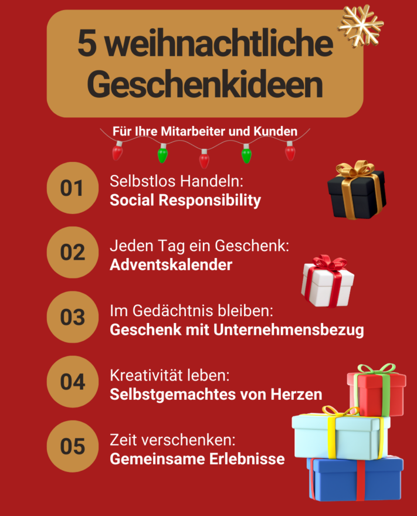

Christmas is just around the corner and you would like to give your employees, business partners or customers a small gift as a token of your **appreciation**. But what could be suitable Christmas gifts for employees and customers? A wealth of ideas and a sure instinct are required! In this article, you can find out which **Christmas gifts** will delight your employees and customers and what **budget** you can expect.

## 5 gift ideas at a glance

Whether it's a grand gesture or a small token of appreciation - everyone is happy to receive a gift. But it doesn't always have to be a gift in the form of a material object or voucher. Giving a gift goes beyond the material and can take many forms.

Which idea will you be implementing this Christmas?

## 1\. social responsibility

Taking social responsibility together as a company: This is what **social responsibility** is all about. Especially at Christmas time, there is a need to help people in the spirit of **charity** - be it through donations in kind and money or through your own efforts on site. You as a company can also help by making **a donation** yourself or by encouraging your customers to support a good cause.

Many aid organizations and social institutions appreciate your contribution and provide you with various communication tools as a small thank you. This allows you to present your commitment to the public and inspire others to donate as well.

## 2nd advent calendar

24 doors, 24 surprises! It doesn't always have to be big Christmas presents for employees and customers, because the Christmas season is characterized above all by anticipation. An **advent calendar** brings a little joy to the workplace every day, whether filled with treats or digitally with photos, videos and messages.

### Advent calendar with company logo

Chocolate, but with pep? No problem! Design an Advent calendar for your employees and customers with your company logo or add individual messages.

No matter what form it takes, chocolate always tastes good!

In [selected online stores](https://www.weihnachtsplaner.de/adventskalender?p=1), you can easily select a calendar and customize it to your liking.

### Homemade advent calendar

If you only want to put together an Advent calendar for selected people, you can also do it yourself. The advantage here is that you can tailor the calendar to the individual person. [You can find out how to make your own Advent calendar and what you can fill it with in this article]().

### Online Advent calendar

A nice alternative to the classic analog Advent calendar is a digital version. You can fill your company's own online Advent calendar with pictures, videos or Christmas quotes and then simply send it to employees and customers via a link as a Christmas gift.

The SeaTable team has created [a template]() for you that you can customize according to your needs. Give the calendar a personal touch and look forward to the astonished faces of your employees when they discover a new surprise behind one of the little doors every day.

If you would like to use SeaTable to create an online Advent calendar, simply [register]() for free and customize the template as you wish. The template also contains 24 ideas for Christmas gifts for employees and customers.

## 3\. gift with a connection to the company

Striking a balance between Christmas spirit and work is a challenge. After all, a visit to the Christmas market or a round of ice skating is much more tempting than spending the whole day in the office. Now it's up to you to bring the **Christmas spirit** into your company!

Individual notebooks with embossed logo from LEUCHTTURM1917.

- **Logo? That's right!** Decorate customer or employee gifts with your branding to stand out from the crowd. Useful everyday helpers in your company design or finished with an embossed logo are particularly suitable for this. With beautifully designed notebooks or calendars, you not only make your customers happy but also give away brand ambassadors. You can easily select suitable notebooks from [selected suppliers](https://www.leuchtturm1917.de/fuer-unternehmen/corporate-gift/) and design them individually.
- **An eye-catcher on the desk**: A gift that is useful in the workplace? Yes, of course! Whether it's a plant, a neck cushion or a pen holder - anything that brightens up everyday working life is a good gift.
- **Background music**: a gift for everyone! Music at work improves the mood and encourages people to sing along.
- **Challenge accepted**: A present is only given once all the Christmas challenges have been completed. This keeps the fun factor high.

## 4\. homemade things from the heart

A **homemade gift** brings great joy because it shows that you have invested work, time and love. In large companies, it is hardly possible to give every employee and customer a personal gift. Nevertheless, you can show how much you value your employees and customers with small, thoughtful Christmas gifts.

- **Greeting card**: The classic Christmas card. Design your company's Christmas card with an exciting motif and a personal message. Or how about a self-written poem or a personal dedication? Make your greetings card the most beautiful on your customers' and employees' desks!

There are no limits to the imagination.

- **Corporate video**: film it, and with humor! Although a professional [corporate video]() provides a clear overview of what you do as a company, it is hardly suitable as a Christmas present for employees or customers. A creative film about you and your employees allows your customers and other employees to get to know you better on a personal level.
- **Personal selection**: Another classic Christmas gift for employees is a well-filled gift basket. To give it a more personal touch, think about what you and your employees like. It is also possible to include a link to your head office, for example regional products from nearby businesses. Add a message to the gift basket and write on it why you have chosen the contents. This shows that you have thought about the gift and its impact.

## 5\. shared experiences

**Time together** is the best gift for many, especially in the often stressful everyday life. Organize joint activities outside of work as a Christmas gift for your employees and create unforgettable memories.

A visit to the Christmas market together or baking cookies in the evening helps to get to know each other better and strengthen team spirit in the long term. And of course, a Christmas party is a must! Find out how to plan it successfully [here]().

The best Christmas atmosphere can be found here.

But you can also spread the Christmas spirit beyond your company boundaries through joint campaigns. Use social media to invite people to fun Christmas competitions and network with customers.

## Budget according to tax allowance

How much time, money and work you want to put into planning your Christmas gifts for employees and customers is ultimately up to you. However, there are **government-imposed upper limits** for tax-free spending on Christmas gifts. These provide a useful guide for planning your budget for gifts or even an in-house Christmas party.

### Christmas gifts for employees

Would you like to make your employees happy at Christmas, but keep the costs as low as possible? Then take advantage of the **tax-free allowance**! Every month, you can give your employees a small gift for a maximum of 50 euros per person. However, there are a few things to bear in mind regarding the type of gift and the occasion:

- **Gift vouchers: Gift** vouchers are a popular Christmas present for employees and customers. However, these are only subject to the tax-privileged exemption limit if they meet three further criteria in addition to the maximum value of 50 euros. The gift cards may only be used to purchase goods and services and may only be used for a small number of stores. It should also be noted that the vouchers must be issued _in addition to the wages owed anyway_.
- **Personal events:** If one of your employees has a birthday or a milestone company anniversary, the allowance is up to 60 euros. However, this does not apply to Christmas, as this **does not** count as a personal event.

There are still a few things to consider at Christmas parties...

- **Christmas party:** Are you planning a [Christmas party]() for all your employees? Then pay attention to the budget of 150 euros per participant. If this amount is not exceeded, your expenses are tax-free. However, Christmas gifts for employees or customers, which are presented at the Christmas party, are included in the above-mentioned budget. This means that you may not add the 50 euros for gifts to the 150 euros for the festivities.
- **Christmas bonus:** The payment of a Christmas bonus, on the other hand, is always taxable and must be declared as a _miscellaneous payment_ in the payslip.

### Christmas gifts for customers

If you would like to make your customers or business partners happy at Christmas, there is also a tax-free limit to consider here. You can spend up to 50 euros on a gift per business customer in order to take advantage of the tax deduction. You can claim gifts up to this upper limit as a **business expense**.



Please also note that you must record the beneficiary or company and the occasion in the accounts for every gift that exceeds a value of 10 euros.

## Plan Christmas online

The Christmas season is stressful, which is why thoughtful preparation is all the more important. With SeaTable, you can plan your [Christmas party]() or create a [free digital Advent calendar]() as a Christmas gift for your employees and customers and easily customize it.

Are you looking for more ideas for suitable Christmas gifts for employees and customers? You'll find lots of exciting ideas in our Advent calendar template for companies!

If you would like to use SeaTable to plan your Christmas party or your Christmas gifts for employees and customers, simply [register]() for free and customize the templates linked above to suit your individual requirements.
