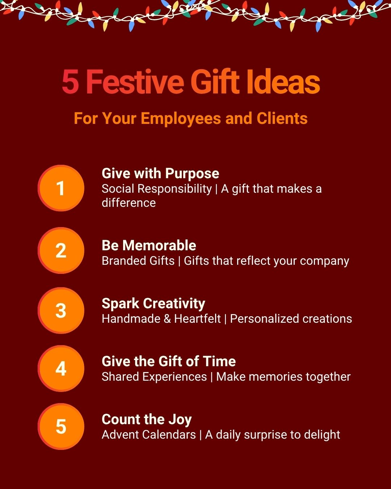
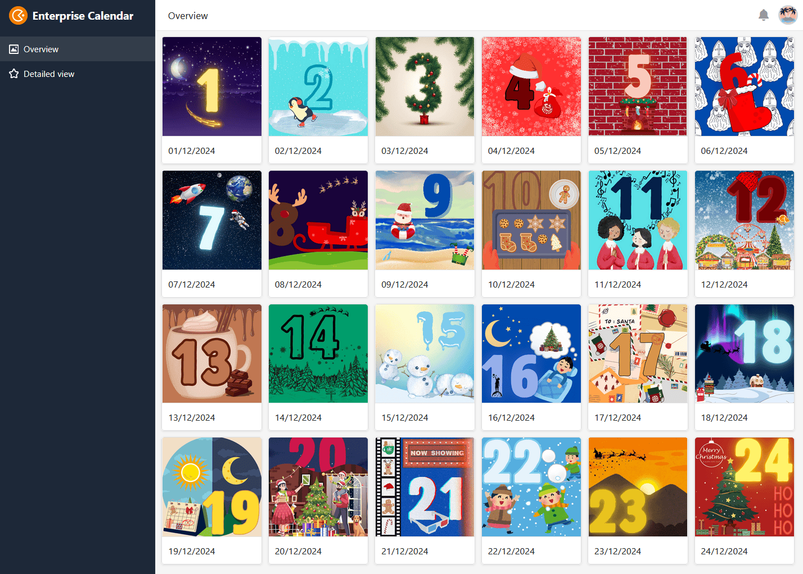
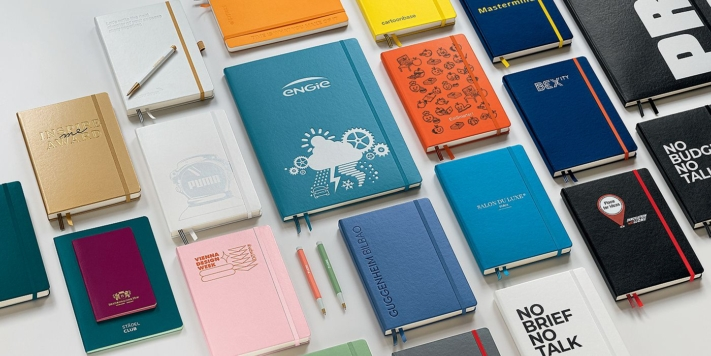

La Navidad está a la vuelta de la esquina y a usted le gustaría obsequiar a sus empleados, socios comerciales o clientes con un pequeño regalo como muestra de su **agradecimiento**. Pero, ¿cuáles podrían ser los regalos de Navidad adecuados para empleados y clientes? Se necesitan muchas ideas y un instinto certero. En este artículo descubrirá qué **regalos de Navidad** harán las delicias de sus empleados y clientes y con qué **presupuesto** puede contar.

## 5 ideas de regalo de un vistazo

Ya sea un gran gesto o una pequeña muestra de agradecimiento, a todo el mundo le gusta recibir un regalo. Pero no siempre tiene por qué ser un regalo en forma de objeto material o vale. Hacer un regalo va más allá de lo material y puede adoptar muchas formas.

¿Qué idea harás realidad estas Navidades?

## 1\. responsabilidad social

Asumir juntos la responsabilidad social como empresa: En eso consiste la **responsabilidad social**. Especialmente en Navidad, es necesario ayudar a la gente con un espíritu **caritativo**, ya sea mediante donaciones en especie o en metálico, o con sus propios esfuerzos in situ. Usted, como empresa, también puede ayudar haciendo **una donación** o animando a sus clientes a apoyar una buena causa.

Muchas organizaciones de ayuda e instituciones sociales aprecian tu contribución y te proporcionan diversas herramientas de comunicación como pequeño agradecimiento. Esto te permite presentar tu compromiso al público e inspirar a otros para que también donen.

## 2º calendario de adviento

24 puertas, 24 sorpresas No siempre tienen que ser grandes regalos de Navidad para empleados y clientes, porque la época navideña se caracteriza sobre todo por la expectación. Un **calendario de adviento** trae cada día un poco de alegría al lugar de trabajo, ya sea lleno de golosinas o digitalmente con fotos, vídeos y mensajes.

### Calendario de Adviento con el logotipo de la empresa

¿Chocolate, pero con pep? No se preocupe. Diseñe un calendario de Adviento para sus empleados y clientes con el logotipo de su empresa o añada mensajes personalizados.

Sea cual sea su forma, ¡el chocolate siempre sabe bien!

En [determinadas tiendas en línea](https://www.weihnachtsplaner.de/adventskalender?p=1), puede elegir fácilmente un calendario y personalizarlo según sus necesidades.

### Calendario de Adviento casero

Si sólo quieres confeccionar un calendario de Adviento para determinadas personas, también puedes hacerlo tú mismo. La ventaja es que puedes personalizarlo a tu gusto. [En este artículo descubrirás cómo hacer tu propio calendario de Adviento y con qué puedes rellenarlo]().

### Calendario de Adviento en línea

Una gran alternativa al clásico calendario de Adviento analógico es la versión digital. Puedes llenar el calendario de Adviento online de tu empresa con fotos, vídeos o citas navideñas y enviarlo a tus empleados y clientes a través de un enlace como regalo de Navidad.

El equipo de SeaTable ha creado para usted [una plantilla]() que podrá personalizar según sus necesidades. Dale un toque personal al calendario y espera con impaciencia las caras de asombro de tus empleados cuando descubran cada día una nueva sorpresa detrás de una de las puertecitas.

Si desea utilizar SeaTable para crear un calendario de Adviento en línea, sólo tiene que [registrarse]() gratuitamente y personalizar la plantilla como desee. La plantilla también contiene 24 ideas de regalos de Navidad para empleados y clientes.

## 3\. regalo con referencia de la empresa

Compaginar el espíritu navideño con el trabajo es todo un reto. Al fin y al cabo, una visita al mercado navideño o una partida de patinaje sobre hielo son mucho más tentadoras que pasarse todo el día en la oficina. Ahora te toca a ti llevar el espíritu **navideño** a tu empresa.

Cuadernos personalizados con logotipo en relieve de LEUCHTTURM1917.

- **¿Logotipo? Así es.** Decore los regalos para clientes o empleados con su marca para destacar entre la multitud. Los útiles de uso diario con el diseño de su empresa o acabados con un logotipo en relieve son especialmente adecuados para ello. Con cuadernos o calendarios de bonito diseño, no sólo hará felices a sus clientes, sino que también obsequiará a los embajadores de su marca. Puede seleccionar y personalizar fácilmente cuadernos adecuados de [proveedores seleccionados](https://www.leuchtturm1917.de/fuer-unternehmen/corporate-gift/).
- **Un punto de atracción en el escritorio**: ¿un regalo útil en el lugar de trabajo? Sí, ¡con mucho gusto! Ya sea una planta, un cojín para el cuello o un portabolígrafos: cualquier cosa que alegre la jornada laboral es un buen regalo.
- **Música de fondo**: ¡un regalo para todos! La música en el trabajo mejora el humor y anima a cantar.
- **Reto aceptado**: Sólo se entrega un regalo cuando se han completado todos los retos navideños. Así se mantiene el factor diversión.

## 4\. cosas hechas en casa con el corazón

Un **regalo hecho en casa** da mucha alegría porque demuestra que se ha invertido trabajo, tiempo y cariño. En las grandes empresas, es difícil hacer un regalo personalizado a cada empleado y cliente. Sin embargo, puede demostrar lo mucho que valora a sus empleados y clientes con pequeños y atentos regalos de Navidad.

- **Tarjeta de felicitación**: la clásica tarjeta navideña. Diseñe la tarjeta navideña de su empresa con un motivo emocionante y un mensaje personal. ¿O qué tal un poema escrito por usted mismo o una dedicatoria personal? Convierta su tarjeta de felicitación en la más bonita de las mesas de sus clientes y empleados.

Su imaginación no tiene límites.

- **Vídeo corporativo**: ¡filme, y con humor! Aunque un [vídeo corporativo]() profesional ofrece una visión clara de lo que haces como empresa, no es muy adecuado como regalo de Navidad para empleados o clientes. Una película creativa sobre ti y tus empleados permite que tus clientes y otros empleados te conozcan mejor a nivel personal.
- **Selección personalizada**: Otro regalo clásico de Navidad para los empleados es una cesta de regalo bien llena. Para darle un toque más personal, piense en lo que le gusta a usted y a sus empleados. También es concebible un vínculo con tu sede, por ejemplo productos regionales de empresas cercanas. Añada un mensaje a la cesta de regalo y escriba en ella por qué ha elegido el contenido. Esto demuestra que ha pensado en el regalo y en su impacto.

## 5\. experiencias compartidas

El **tiempo juntos** es el mejor regalo para muchos, sobre todo en la a menudo estresante vida cotidiana. Organice actividades conjuntas fuera del trabajo como regalo de Navidad para sus empleados y cree recuerdos inolvidables.

Visitar juntos el mercado navideño o hacer galletas por la noche ayuda a conocerse mejor y refuerza el espíritu de equipo a largo plazo. Y, por supuesto, no puede faltar una fiesta de Navidad. [Aquí]() encontrará información sobre cómo organizarla con éxito.

Aquí encontrará el mejor ambiente navideño.

Pero también puede difundir el espíritu navideño más allá de los límites de su empresa mediante campañas conjuntas. Utiliza las redes sociales para invitar a la gente a divertidos concursos navideños y establecer contactos con los clientes.

## Presupuesto según desgravación fiscal

El tiempo, el dinero y el trabajo que quiera dedicar a planificar los regalos de Navidad para sus empleados y clientes depende, en última instancia, de usted. Sin embargo, existen **límites máximos impuestos por el gobierno** para el gasto libre de impuestos en regalos de Navidad. Estos límites son una guía útil para planificar su presupuesto para regalos o incluso para una fiesta de Navidad en la empresa.

### Regalos de Navidad para los empleados

¿Quiere hacer felices a sus empleados en Navidad pero mantener los costes lo más bajos posible? Aproveche la **desgravación fiscal**. Cada mes, puede hacer un pequeño regalo a sus empleados por un máximo de 50 euros por persona. Sin embargo, hay que tener en cuenta algunas cosas en relación con el tipo de regalo y la ocasión:

- **Cheques regalo:** Los cheques regalo son un regalo navideño muy popular entre empleados y clientes. Sin embargo, sólo están sujetos al límite de exención fiscal si, además del valor máximo de 50 euros, cumplen otros tres criterios. Las tarjetas regalo sólo pueden autorizar la compra de bienes y servicios y sólo pueden utilizarse en un número reducido de comercios. También hay que tener en cuenta que _, en cualquier caso,_ los vales deben expedirse _además de los salarios adeudados_.
- **Eventos personales:** Si uno de sus empleados cumple años o celebra un aniversario importante de la empresa, la indemnización asciende a 60 euros. Sin embargo, esto no se aplica a la Navidad, ya que **no** cuenta como acontecimiento personal.

Todavía hay que tener en cuenta algunas cosas en las fiestas de Navidad...

- **Fiesta de Navidad:** ¿Está planeando una [fiesta de Navidad]() para todos sus empleados? Entonces preste atención al presupuesto de 150 euros por participante. Si no se supera esta cantidad, sus gastos están exentos de impuestos. Sin embargo, los regalos de Navidad para empleados o clientes, que se entregan en la fiesta de Navidad, están incluidos en el presupuesto mencionado. Esto significa que no puede sumar los 50 euros de regalos a los 150 euros de la fiesta.
- **Paga extra de Navidad:** El pago de la paga extra de Navidad, en cambio, siempre tributa y debe declararse como _pago diverso_ en la nómina.

### Regalos de Navidad para los clientes

Si quiere hacer felices a sus clientes o socios comerciales en Navidad, también hay un límite libre de impuestos que debe tener en cuenta. Puede gastar hasta 50 euros en un regalo por cliente profesional para utilizar la desgravación fiscal. Puede reclamar los regalos hasta este límite máximo como **gasto empresarial**.



Tenga en cuenta también que debe registrar en la contabilidad el beneficiario o la empresa y la ocasión para cada regalo cuyo valor supere los 10 euros.

## Planificar la Navidad en línea

La época navideña es estresante, por eso es tan importante prepararla bien. Con SeaTable, puede planificar su [fiesta de Navidad]() o crear un [calendario de Adviento digital gratuito]() como regalo de Navidad para sus empleados y clientes, y personalizarlo fácilmente.

¿Busca más ideas de regalos de Navidad adecuados para empleados y clientes? Encontrará muchas ideas interesantes en nuestra plantilla de calendario de Adviento para empresas.

Si desea utilizar SeaTable para planificar su fiesta de Navidad o sus regalos navideños para empleados y clientes, sólo tiene que [registrarse]() gratuitamente y personalizar las plantillas enlazadas más arriba para adaptarlas a sus necesidades individuales.
