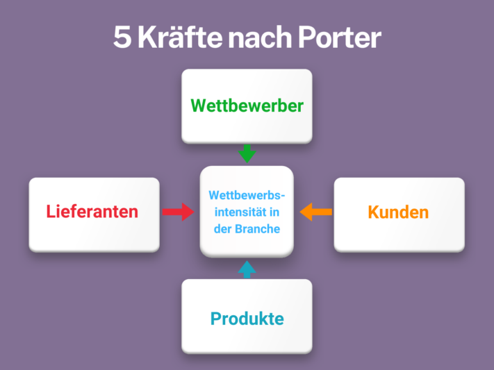
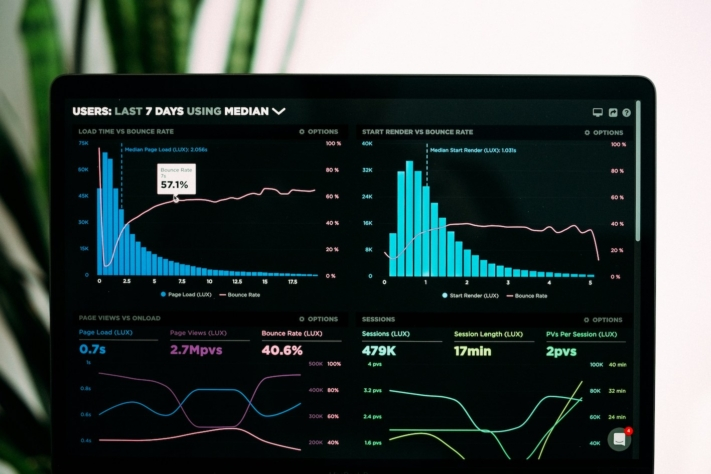

Are you planning to expand your product line and want to know which **product features** are particularly in demand in your industry? Or have you noticed a decline in **sales** and want to find out what your competitors are doing better? A targeted competitive analysis can provide you with valuable insights to help you optimize your **strategy** and target the **needs of** your customers.

In this article, we present a comprehensive guide with all the important information and competitive analysis methods. In order to carry out your analysis in a structured and efficient manner, we will then introduce you to a powerful tool that will help you to organize your data clearly and precisely.

The main aim of competitive analysis is to identify and exploit competitive advantages.

## What is a competitive analysis?

A competitive analysis is an essential part of market analysis that serves to compare competitors within an industry. It not only examines the **strengths** and **weaknesses** of the competition, but also takes a detailed look at relevant factors such as **market opportunities** and **risks**.

This comprehensive analysis provides insights into why certain competitors are successful and which strategic approaches they are pursuing. The competitive analysis also enables you to make well-founded **forecasts** about the future development of the industry and the **positioning** of your own products or services on the market.

## The advantages of a thorough competitive analysis

A strategic competitive analysis provides you with insights into how successful your competitors are and whether new market players are emerging. It enables you to assess the status of your company in comparison to other players in the industry and identify any performance deficits.

In addition, the analysis provides information on how your products or services are positioned in the market and what unique**selling point** they offer compared to the competition. This information is helpful for adjusting your market strategy in a targeted manner and strengthening your position in the long term.

Understanding customer needs is central to competitive analysis.

## The right time for a competitive analysis

A thorough competitive analysis can make the difference between success and failure by providing you with the information you need to make smart strategic decisions.  
But when is the right time to conduct such an analysis? Below you will find situations in which a competitive analysis is particularly useful:

- **New company:** If you are starting a new business, it is essential to carry out a market and competition analysis and plan your positioning.
- **Expansion into new markets:** When entering new markets, a competitive analysis helps to evaluate market conditions and potential competitors.
- **Website relaunch:** If you are redesigning your website, a competitive analysis provides valuable insights into your competitors' online presence and digital strategies.
- **Paid media activities:** If paid advertising measures are not bringing the desired success, a competitive analysis can reveal which approaches your competitors are taking and how you can optimize your own campaigns.
- **Industry trends:** In order to stay up to date and recognize current industry trends, regular competitive analysis is essential.

A competitive analysis is particularly important before a website relaunch or entering a new market.

## Proven methods for a competitive analysis

Among the competitive analysis methods, there are two major approaches that provide valuable tools for competitive assessment. You can use these individually or combine them to gain even deeper insights.

### Porter's five forces

Michael E. Porter's [five forces model](https://de.wikipedia.org/wiki/Branchenstrukturanalyse) offers a structured method for **analyzing the intensity of competition** within an industry. It looks at five central forces: competition among existing companies, the threat of new market entrants, the threat of substitute products, the bargaining power of suppliers and the bargaining power of customers.

Porter's competitive analysis enables companies to better understand the dynamics of their industry and develop strategies to gain a competitive advantage. This competitive analysis method helps to assess the **attractiveness** and **profitability** of an industry and to make well-founded business decisions.

Michael E. Porter's model, which analyzes five forces that determine competition in an industry.

### Grant's resource-based approach and the VRIO analysis

Robert Grant's [Resource-Based View](https://www.researchgate.net/publication/292714014_The_Resource-Based_Theory_of_Competitive_Advantage_Implications_for_Strategy_Formulation) (RBV) is also one of the competitive analysis methods. In contrast to the market-based approach, however, it emphasizes the importance **of internal resources** and **capabilities** as the main source of sustainable competitive advantage. This forms the theoretical framework for the **VRIO analysis**.

Accordingly, this method begins with the identification of a company's core competencies. You can then check these for their **value**, **rarity**, **imitability** and **organization** (VRIO criteria):

- Skills that enable your company to exploit opportunities, generate profits or reduce costs are **valuable**.
- Competencies that are unique to your company or that few other companies possess are **rare**.
- Competencies that are expensive or difficult to imitate, such as patented inventions, **cannot be imitated**.
- A competence is considered **organized** if your company can fully exploit the potential of the skill or resource.

Resources must be valuable, rare, non-imitable and organized in order to offer a competitive advantage.

On this basis, you can make strategic decisions based on your internal strengths to differentiate yourself in the market and secure competitive advantages. Focus on what makes your company unique and how you can leverage this uniqueness. Also analyze your competitors to identify competencies that you may be lacking.

## What all belongs to a competitive analysis

Depending on your chosen focus, you should specifically adapt the competitive analysis criteria. By carefully planning and conducting the analysis, you can not only better understand your own market position, but also develop targeted strategies to successfully differentiate yourself and grow in the long term.

Nevertheless, there are some key aspects that you should take into account when creating a competitive analysis and comparing yourself with competitors. These include

- Location factors
- Company size
- Sales figures
- Competencies (strengths and weaknesses)
- Value proposition and image
- Product range and pricing
- Advertising measures and sales channels

## Instructions for carrying out a competitive analysis

Creating a strategic competitive analysis may seem complicated at first glance - and you may not know exactly where to start. Don't worry, we have developed a precise roadmap for you to analyze your competition step by step.

### 1\. define goals

In addition to strategic positioning in the market, minimizing risks, for example, can also be a relevant goal.

Determine which insights you would like to gain from the analysis and how they can help you. Would you like to find out more about the **market positioning** of your competitors? Or are you looking for **inspiration** for your own product development and marketing strategies? Clear objectives will help you to proceed in a focused and efficient manner.

### 2\. identify competitors

Make sure to identify the competitor from the customer's point of view as well, not just from the company's perspective.

Create a list of your main competitors. This includes **direct competitors** who offer similar products or services, as well as **indirect competitors** who offer alternative solutions that meet the needs of your target group. Also consider **new market entrants** that could potentially pose a threat.

### 3\. collect data

Use the analysis of existing data sources such as market reports, industry studies and company reports.

Gather comprehensive information about your competitors. Use public sources such as **websites**, **annual reports**, **press releases** or **social media channels** of your competitors as well as **tools** and **services** for market and competitive analyses.



### 4\. perform analysis

Take the time to create detailed profiles of your main competitors.

Compare and evaluate the collected data. To do this, use the **competitive analysis methods** mentioned above or choose other proven analysis methods such as the [SWOT analysis](https://seatable.io/en/swot-analyse-template/). This allows you to identify the strengths and weaknesses of your competitors as well as opportunities and risks in the market. In addition to the **VRIO analysis**, the **benchmark analysis** can also help you to evaluate the performance of your company in comparison to your competitors.

### 5\. derive strategies

Break away from rigid business models and focus on the continuous creation of new competitive advantages.

Use the insights gained to improve your own strategies. This could mean **adapting** your **product development**, **rethinking** your **pricing policy**, developing **new marketing strategies** or **optimizing** your **sales channels**. The aim is to position yourself better in the market and gain a competitive advantage.

### 6\. repeat regularly

In particularly dynamic markets, monthly reviews can even be useful.

Creating a competitive analysis is not a one-off project. Review and update your analysis regularly to stay up to date and be able to react quickly to market changes. This will help you to remain competitive and successful in the long term.

## How you can use the results of your competitive analysis effectively

The results of a strategic competitive analysis not only provide you with valuable information - they can put your company in the fast lane. By identifying weaknesses in your competitors' strategies, you can **avoid** similar **pitfalls** and **optimize** your own **processes**. At the same time, a well-founded analysis enables you to formulate **clear business objectives**. With a precise plan in mind, you know exactly where the journey is heading and what steps are necessary to get there.

With the help of competitive analyses, you can also define your long-term corporate goals more clearly.

But that's not all: the findings from the competitive analysis are also the key to improving and strengthening your **strategic plan**. They give you the tools you need to adapt and refine your tactics. The result? A robust plan that is up to the challenges of the market.

In addition, a well thought-out competitive analysis helps you to reach your **target group** faster and more effectively. You will gain a better understanding of what your customers want and can target your offers accordingly. Finally, knowledge of current trends will not remain hidden from you. By keeping a watchful eye on **developments in your sector**, you won't miss any opportunities and can react flexibly to changes.

## The right tool for your competitive analysis

The free SeaTable tool is ideal for efficiently carrying out your strategic competitive analysis and clearly documenting your results. In this competitive analysis template, you can compare companies, brands, products, features and other relevant information in tabular form.

File PDF documents (e.g. annual reports, press releases) and screenshots of advertisements or websites of your competitors to see interesting sources in direct comparison. Describe the strengths and weaknesses of the competition or note down information about prices, unique selling points and target groups. With the free competitor analysis template, which you can find [here](https://seatable.io/en/vorlage/rv0aemhnqjufipzfycgc8w/), you can visualize your analysis data at a glance and develop strategies as easily as possible.

If you're ready to put your competitors through their paces, [register](https://seatable.io/en/registrierung/) with SeaTable for free today. You can then get started right away, use the template and fill it with your own data.
