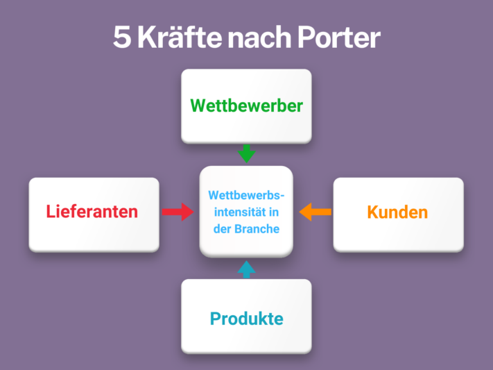
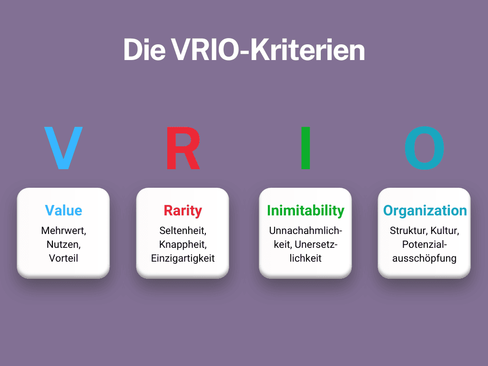

Está a planear expandir a sua linha de produtos e pretende saber que **caraterísticas dos produtos** são particularmente populares no seu sector? Ou notou um declínio nas **vendas** e quer descobrir o que os seus concorrentes estão a fazer melhor? Uma análise da concorrência orientada pode fornecer-lhe informações valiosas para otimizar a sua **estratégia** e responder especificamente às **necessidades dos** seus clientes.

Neste artigo, apresentamos um guia completo com todas as informações importantes e métodos de análise da concorrência. Para efetuar a sua análise de forma estruturada e eficiente, apresentamos-lhe uma ferramenta poderosa que o ajudará a organizar os seus dados de forma clara e precisa.

O principal objetivo da análise da concorrência é identificar e utilizar as vantagens competitivas.

## O que é uma análise competitiva?

A análise da concorrência é uma parte essencial da análise de mercado que serve para comparar os concorrentes de um sector. Não só são analisados os **pontos fortes** e **fracos** da concorrência, como também são examinados em pormenor factores relevantes como **as oportunidades** e **os riscos** **do mercado**.

Esta análise exaustiva permite perceber porque é que certos concorrentes são bem sucedidos e quais as abordagens estratégicas que estão a seguir. A análise da concorrência também lhe permite fazer **previsões** bem fundamentadas sobre o desenvolvimento futuro da indústria e o **posicionamento** dos seus próprios produtos ou serviços no mercado.

## As vantagens de uma análise da concorrência aprofundada

Uma análise estratégica da concorrência fornece-lhe informações sobre o sucesso dos seus concorrentes e sobre a emergência de novos intervenientes no mercado. Permite-lhe avaliar a situação da sua empresa em comparação com outros intervenientes no sector e identificar eventuais défices de desempenho.

A análise também fornece informações sobre a forma como os seus produtos ou serviços estão posicionados no mercado e qual o**ponto de venda** único que oferecem em comparação com a concorrência. Esta informação é útil para ajustar a sua estratégia de mercado de uma forma direcionada e reforçar a sua posição a longo prazo.

A compreensão das necessidades dos clientes é fundamental para a análise da concorrência.

## O momento certo para uma análise da concorrência

Uma análise completa da concorrência pode fazer a diferença entre o sucesso e o fracasso, fornecendo-lhe as informações necessárias para tomar decisões estratégicas inteligentes.  
Mas qual é o momento certo para efetuar essa análise? De seguida, encontrará situações em que uma análise da concorrência é particularmente útil:

- **Nova empresa:** Se está a iniciar uma nova empresa, é essencial analisar o mercado e a concorrência e planear o seu posicionamento.
- **Expansão para novos mercados:** Ao entrar em novos mercados, uma análise da concorrência ajuda a avaliar as condições do mercado e os potenciais concorrentes.
- **Relançamento do sítio Web:** Se estiver a remodelar o seu sítio Web, uma análise da concorrência fornece informações valiosas sobre a presença em linha e as estratégias digitais dos seus concorrentes.
- **Actividades nos meios de comunicação social pagos:** Se as medidas de publicidade paga não estiverem a produzir o sucesso desejado, uma análise da concorrência pode revelar quais as abordagens que os seus concorrentes estão a adotar e como pode otimizar as suas próprias campanhas.
- **Tendências do sector:** Para se manter atualizado e reconhecer as tendências actuais do sector, é essencial analisar regularmente a concorrência.

Uma análise da concorrência é particularmente importante antes do relançamento de um sítio Web ou da entrada num novo mercado.

## Métodos comprovados de análise da concorrência

Entre os métodos de análise da concorrência, existem duas abordagens importantes que oferecem ferramentas valiosas para a avaliação da concorrência. Pode utilizá-las individualmente ou combiná-las para obter conhecimentos ainda mais profundos.

### As cinco forças de Porter

[O modelo das cinco forças](https://de.wikipedia.org/wiki/Branchenstrukturanalyse) de Michael E. Porter oferece um método estruturado para **analisar a intensidade da concorrência** num sector. Analisa cinco forças centrais: a concorrência entre as empresas existentes, a ameaça de novos operadores no mercado, a ameaça de produtos substitutos, o poder de negociação dos fornecedores e o poder de negociação dos clientes.

A análise competitiva de Porter permite às empresas compreender melhor a dinâmica do seu sector e desenvolver estratégias para obter uma vantagem competitiva. Este método de análise da concorrência ajuda a avaliar a **atratividade** e a **rentabilidade** de um sector e a tomar decisões comerciais bem fundamentadas.

O modelo de Michael E. Porter, que analisa as cinco forças que determinam a concorrência num sector.

### A abordagem baseada nos recursos da Grant e a análise VRIO

A [visão baseada nos recursos](https://www.researchgate.net/publication/292714014_The_Resource-Based_Theory_of_Competitive_Advantage_Implications_for_Strategy_Formulation) (RBV) de Robert Grant é também um dos métodos de análise da concorrência. No entanto, ao contrário da abordagem baseada no mercado, esta enfatiza a importância **dos recursos** e **capacidades** **internas** como a principal fonte de vantagem competitiva sustentável. Esta abordagem constitui o quadro teórico para a **análise VRIO**.

Assim, este método começa com a identificação das competências essenciais de uma empresa. De seguida, é possível verificar o seu **valor**, **raridade**, **imitabilidade** e **organização** (critérios VRIO):

- Os conhecimentos especializados que permitem à sua empresa explorar oportunidades, gerar lucros ou reduzir custos são **valiosos**.
- Os conhecimentos especializados que só a sua empresa possui ou que poucas outras empresas possuem são **raros**.
- Os conhecimentos especializados que são caros ou difíceis de imitar, como as invenções patenteadas, **não podem ser imitados**.
- Uma competência é considerada **organizada** se a sua empresa puder explorar plenamente o potencial da aptidão ou do recurso.

Os recursos devem ser valiosos, raros, não imitáveis e organizados para oferecerem uma vantagem competitiva.

Nesta base, pode tomar decisões estratégicas com base nos seus pontos fortes internos, a fim de se diferenciar no mercado e garantir vantagens competitivas. Concentre-se naquilo que torna a sua empresa única e na forma como pode tirar partido dessa singularidade. Analise também os seus concorrentes para identificar as competências que lhe podem faltar.

## O que faz parte de uma análise da concorrência

Dependendo do foco escolhido, deve adaptar especificamente os critérios da análise da concorrência. Ao planear e realizar cuidadosamente a análise, pode não só compreender melhor a sua própria posição no mercado, mas também desenvolver estratégias específicas para se diferenciar com sucesso e crescer a longo prazo.

No entanto, há alguns aspectos fundamentais que devem ser tidos em conta na análise da concorrência e na comparação com os concorrentes. Estes aspectos incluem

- Factores de localização
- Dimensão da empresa
- Números de vendas
- Competências (pontos fortes e fracos)
- Proposta de valor e imagem
- Gama de produtos e preços
- Acções de publicidade e canais de venda

## Instruções para a realização de uma análise da concorrência

Criar uma análise estratégica da concorrência pode parecer complicado à primeira vista - e pode não saber exatamente por onde começar. Não se preocupe, desenvolvemos um roteiro preciso para que possa analisar a sua concorrência passo a passo.

### 1\. definir objectivos

Para além do posicionamento estratégico no mercado, a minimização dos riscos pode também ser um objetivo relevante.

Determine quais os conhecimentos que gostaria de obter com a análise e de que forma o podem ajudar. Gostaria de saber mais sobre o **posicionamento** de **mercado** dos seus concorrentes? Ou está à procura de **inspiração** para o seu próprio desenvolvimento de produtos e estratégias de marketing? A definição de objectivos claros ajudá-lo-á a proceder de forma orientada e eficiente.

### 2\. identificar os concorrentes

Certifique-se de que identifica o concorrente também do ponto de vista do cliente e não apenas do ponto de vista da empresa.

Crie uma lista dos seus principais concorrentes. Isto inclui tanto **os concorrentes diretos** que oferecem produtos ou serviços semelhantes, como **os concorrentes indirectos** que oferecem soluções alternativas que satisfazem as necessidades do seu grupo-alvo. Considere também **os novos participantes no mercado** que possam constituir uma ameaça potencial.

### 3\. recolher dados

Utilizar a análise de fontes de dados existentes, como relatórios de mercado, estudos do sector e relatórios de empresas.

Recolha informações completas sobre os seus concorrentes. Utilize fontes públicas, como **sítios Web**, **relatórios anuais**, **comunicados de imprensa** ou **canais de redes sociais** dos seus concorrentes, bem como **ferramentas** e **serviços** de análise do mercado e da concorrência.



### 4\. efetuar análises

Dedique algum tempo a criar perfis pormenorizados dos seus principais concorrentes.

Comparar e avaliar os dados recolhidos. Para o efeito, utilize os **métodos de análise da concorrência** acima mencionados ou escolha outros métodos de análise comprovados, como a [análise SWOT](https://seatable.io/pt/swot-analyse-template/). Esta pode ser utilizada para identificar os pontos fortes e fracos dos seus concorrentes, bem como as oportunidades e os riscos no mercado. Para além da **análise VRIO**, a **análise de benchmark** pode também ajudá-lo a avaliar o desempenho da sua empresa em comparação com os seus concorrentes.

### 5\. derivar estratégias

Romper com os modelos empresariais rígidos e concentrar-se na criação contínua de novas vantagens competitivas.

Utilize os conhecimentos adquiridos para melhorar as suas próprias estratégias. Isto pode significar **adaptar o desenvolvimento do** seu **produto**, **repensar** a sua **política de preços**, desenvolver **novas estratégias de marketing** ou **otimizar** os seus **canais de venda**. O objetivo é posicionar-se melhor no mercado e obter uma vantagem competitiva.

### 6\. repetir regularmente

Em mercados particularmente dinâmicos, as revisões mensais podem mesmo ser úteis.

A criação de uma análise da concorrência não é um projeto único. Reveja e actualize a sua análise regularmente para se manter atualizado e ser capaz de reagir rapidamente às mudanças do mercado. Isto ajudá-lo-á a manter-se competitivo e bem sucedido a longo prazo.

## Como pode utilizar eficazmente os resultados da sua análise da concorrência

Os resultados de uma análise estratégica da concorrência não só lhe fornecem informações valiosas, como também podem colocar a sua empresa na via mais rápida. Ao identificar os pontos fracos das estratégias dos seus concorrentes, pode **evitar armadilhas** semelhantes e **otimizar** os seus próprios **processos**. Ao mesmo tempo, uma análise bem fundamentada permite-lhe formular **objectivos comerciais claros**. Com um plano preciso em mente, sabe exatamente para onde vai a viagem e que passos são necessários para lá chegar.

Com a ajuda de análises da concorrência, pode também definir mais claramente os seus objectivos empresariais a longo prazo.

Mas não é tudo: os resultados da análise da concorrência são também a chave para melhorar e reforçar o seu **plano estratégico**. Dão-lhe as ferramentas necessárias para adaptar e aperfeiçoar as suas tácticas. O resultado? Um plano robusto que está à altura dos desafios do mercado.

Além disso, uma análise da concorrência bem pensada ajuda-o a atingir o seu **grupo-alvo de** forma mais rápida e eficaz. Compreenderá melhor o que os seus clientes querem e poderá direcionar as suas ofertas em conformidade. Por último, o conhecimento das tendências actuais não lhe será ocultado. Ao acompanhar atentamente a **evolução do seu sector**, não perderá nenhuma oportunidade e poderá reagir de forma flexível às mudanças.

## A ferramenta certa para a sua análise da concorrência

A ferramenta gratuita SeaTable é ideal para efetuar eficazmente a sua análise estratégica da concorrência e documentar claramente os seus resultados. Neste modelo de análise da concorrência, pode comparar empresas, marcas, produtos, caraterísticas e outras informações relevantes em forma de tabela.

Arquive documentos PDF (por exemplo, relatórios anuais, comunicados de imprensa) e capturas de ecrã de anúncios ou sítios Web dos seus concorrentes para ver fontes interessantes em comparação direta. Descreva os pontos fortes e fracos da concorrência ou anote informações sobre preços, pontos de venda exclusivos e grupos-alvo. Com o modelo gratuito de análise da concorrência, que pode encontrar [aqui](https://seatable.io/pt/vorlage/rv0aemhnqjufipzfycgc8w/), pode visualizar rapidamente os dados da sua análise e desenvolver estratégias o mais facilmente possível.

Se está pronto para pôr os seus concorrentes à prova, [registe-se]() gratuitamente no SeaTable hoje mesmo. Pode então começar imediatamente, utilizar o modelo e preenchê-lo com os seus próprios dados.
