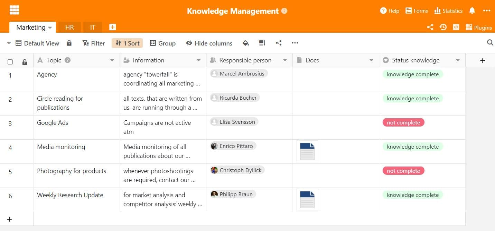

Knowledge is one of the most important resources in any company. It is not for nothing that knowledge is already cited as a [production factor](https://de.wikipedia.org/wiki/Produktionsfaktor) alongside land, capital and labor when it comes to the success of a company. But what does it take to make the knowledge of your employees available to others in your company? The answer: a functioning **knowledge management system**!

Find out here how you can successfully manage the accumulated knowledge in your company, what challenges or opportunities arise from this and what you should look out for when selecting a suitable **knowledge management system**.

## What is knowledge management?

Optimizing the handling of knowledge in the company - that's what knowledge _management_ is all about. The overarching aim is to build up a **knowledge database** that is intended to make company processes more efficient and innovative.

You can achieve this by collecting the knowledge hidden in your company, processing it, making it accessible to everyone and ultimately applying it effectively.



## Not all knowledge is the same

If you want to use accumulated knowledge in your company, you first need to distinguish the type of knowledge.

### Explicit knowledge

**Explicit** refers to all knowledge that you or your employees can write down in an easily understandable way. This includes, for example, instructions for devices or written company guidelines.

### Implicit knowledge

**Implicit knowledge**, on the other hand, is any know-how of your specialists that they find difficult to put into words and communicate to others in writing. For example, you can probably intuitively distinguish good work from bad without necessarily defining the exact criteria. This knowledge is stored implicitly in your head and must be converted into explicit knowledge so that you can make it accessible to all employees.

The key to knowledge management in your company is therefore to record the individual solutions developed by your employees in a knowledge management system.

A pleasant working atmosphere helps you to gather and share knowledge.

For your knowledge management to be as efficient as possible, explicit and tacit knowledge should go hand in hand. Therefore, create a **culture** in your company in which employees are motivated to share their hidden knowledge treasures with each other and actively pass on knowledge.

## Two strategies in knowledge management

How is the knowledge of one employee made accessible to all others? There are two **strategies** for circulating knowledge so that the entire organization can benefit from the tacit knowledge of individual employees.

### People-to-document strategy

With this variant, you bundle the knowledge of individuals in a **central storage location** that is accessible to everyone. You should make sure that the knowledge is presented in an understandable way so that the information is quickly understood and can be applied immediately.

### People-to-people strategy

This variant is used when the knowledge is too complex for everyone to understand. **Experts** are then needed to pass on their knowledge personally to specific colleagues and are also available to answer questions.

If you have experts in your company, they should be available quickly and easily in the event of problems.

You can also combine the two strategies, e.g. pass on your knowledge in a workshop and document the most important results and make them available in a knowledge database.

## What knowledge management should achieve

To be able to use your company's accumulated knowledge efficiently, you should be aware of the **eight building blocks** that make up knowledge management.

Classification according to Probst, Raub and Romhardt

This results in a kind of guideline that you can use to develop an effective knowledge management system.

- **Knowledge identification:** Identify sources of knowledge in the company and analyze their relevance.
- **Knowledge development:** Generating knowledge internally and making it explicitly available in digital systems.
- **Knowledge acquisition:** Buying in knowledge from external experts to close knowledge gaps.
- **Knowledge sharing:** Open access to and active sharing of existing knowledge.

A variety of well-known methods can be used to distribute knowledge, for example [workshops](), lessons learned, [team meetings](), mentoring, [onboarding]() or internal newsletters.

An active exchange is important for good knowledge management.

The other modules are:

- **Knowledge utilization:** Using existing knowledge to improve work and company results.
- **Knowledge retention:** Save accumulated knowledge in a central storage location and update it continuously.
- **Knowledge objectives:** Definition of the desired goals to be achieved through knowledge management.
- **Knowledge assessment:** Evaluation of the extent to which knowledge has been gained and objectives achieved.

## What you can use knowledge management for

Knowledge management can achieve a great deal and can therefore be used profitably for various company processes. You can roughly divide the areas of application into **internal** and **external** use.

### External use

In **customer support**, for example, a sophisticated knowledge management system can relieve you of many tasks. For questions such as "How do I change my address details?" or "Where can I deactivate notifications?", customers rarely need a personal contact by phone or email. Instead, a **self-service portal** is set up in which the most frequent customer queries can be viewed with an immediately available solution.

Save your employees a lot of work by offering your customers help to help themselves.

[This help area]() is an example of a well-managed knowledge management system. On the one hand, this reduces the support workload for your employees and, on the other, saves your customers a long wait.

### Internal use

However, it is even more important for the continued existence of a company to make knowledge effectively available for internal use. It is becoming increasingly relevant to make the collected knowledge on products, customers, employees and work processes available across departments.

A **corporate culture** based on shared knowledge helps each individual employee to complete their tasks, encourages them to acquire knowledge independently and makes processes more efficient. A knowledge management system can also help you to break down **information silos**.

## Opportunities and challenges in knowledge management

If you are considering whether a knowledge management system is worthwhile for your company, don't worry: knowledge management is always worthwhile in the long term! However, there are some **challenges** that you should be aware of.

Weigh up the two sides against each other.

### Advantages:

- **Increased efficiency**: By systematically organizing information, your employees can find it more quickly and use it for their work.
- **Independent further training**: The clear and comprehensible presentation of existing knowledge gives your employees the opportunity to acquire knowledge independently.
- **Faster decision-making processes**: As all employees have access to relevant data and documents, they can make informed decisions independently.
- **Long-term knowledge retention**: In a knowledge management system, knowledge is stored for a long time and can be retained independently of individual persons.

### Disadvantages:

- **High start-up costs**: In order to introduce a knowledge management system, you need to plan financial and time resources for setting up digital systems and developing, structuring and processing knowledge.
- **Outdated knowledge**: Keeping knowledge up to date costs a lot of time and energy and requires discipline from your employees.
- **Security risks**: Nowadays, sensitive information is usually stored on a central server. However, the access authorizations and the associated data protection guidelines also harbour risks.
- **Complex system**: Knowledge management systems are usually complex. A long training period is therefore required so that your employees can use the system efficiently.

## Which knowledge management system is right for you?

If you want to set up successful knowledge management in your company, you can hardly avoid a **knowledge management system** in the form of software. There is a large selection of suitable **software solutions**. Depending on your requirements, there is an enormous range of systems with different focuses:



Examples: Confluence, Guru




Examples: BSCW, Microsoft SharePoint




Examples: Slack, Microsoft Teams




Examples: Seafile, Nextcloud, iCloud, Google Drive, OneDrive, Dropbox




Examples: Pipedrive, Salesforce




Examples: Asana, Jira




Examples: Personio, DATEV




Examples: WordPress, TYPO3



To find the right software for your company, you should test several solutions and ask yourself the following questions:

- How easy is it for my employees to enter and manage new knowledge?
- How quickly can searchers find specific entries in the software?
- Can my employees collaborate and share information in real time?
- On which servers is the data stored? Can I host the system myself?
- Is the software scalable if the company should grow strongly in the future?
- Is the activity of my employees documented so that the change history can be tracked?
- Are there other types of visualization besides text to present information in an understandable way?

## Flexible and efficient knowledge management with SeaTable

A good answer to all these questions is the intuitive and easy-to-use **SeaTable** knowledge database. At various levels (bases, tables, views, rows), it enables you and your employees to record information in a structured way, find it quickly, share it easily with others or filter it according to relevance for a particular group of people. This means you and your employees always have an overview.

When you choose SeaTable, you give your employees a whole toolbox with which they can build a flexible knowledge database. SeaTable supports real-time [collaboration](), including [comments]() and [a]() complete [change history](). This allows you and your employees to convert your personal, implicit knowledge into explicit knowledge and make it available to others. SeaTable also allows you to visualize data graphically using various [plugins]() and [apps]().

You can use SeaTable in the cloud, which is hosted in GDPR-compliant German data centers, or install it [on-premises]() on your own servers. So your data is safe in any case! You can also use authorizations in many places in SeaTable to control exactly who can see and edit which data.

## Conclusion: Build up your own knowledge management

Every beginning is hard, but it's worth it! Invest time and effort in knowledge management to harness the knowledge hidden in your company.

Would you like to use SeaTable for your knowledge management? Then simply [register]() free of charge.
