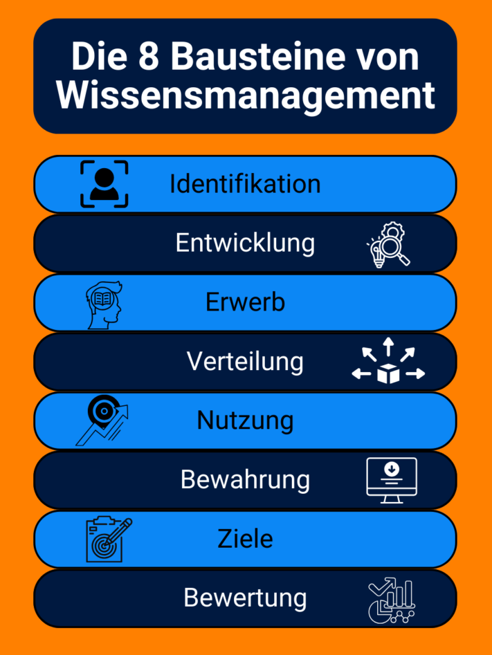

El conocimiento es uno de los recursos más importantes de cualquier empresa. No en vano ya se menciona el conocimiento como [factor de producción](https://de.wikipedia.org/wiki/Produktionsfaktor) junto con la tierra, el capital y la mano de obra cuando se trata del éxito de una empresa. Pero, ¿qué hace falta para que los conocimientos de sus empleados estén a disposición de los demás en su empresa? La respuesta: ¡un **sistema de gestión del conocimiento** que funcione!

Descubra aquí cómo puede gestionar con éxito el conocimiento acumulado en su empresa, qué retos u oportunidades se derivan de ello y en qué debe fijarse a la hora de seleccionar un **sistema de gestión del conocimiento** adecuado.

## ¿Qué es la gestión del conocimiento?

Optimizar el manejo del conocimiento en la empresa: de eso trata _la gestión_ del conocimiento. El objetivo general es crear una **base de datos de conocimientos** que haga más eficientes e innovadores los procesos de la empresa.

Puede conseguirlo recopilando y procesando los conocimientos ocultos en su empresa, haciéndolos accesibles a todos y, en última instancia, aplicándolos eficazmente.



## No todos los conocimientos son iguales

Si quiere utilizar el conocimiento acumulado en su empresa, primero tiene que distinguir el tipo de conocimiento.

### Conocimientos explícitos

**Explícito** es el término utilizado para describir todos los conocimientos que usted o sus empleados pueden escribir de forma fácilmente comprensible. Esto incluye, por ejemplo, las instrucciones de los dispositivos o las directrices escritas de la empresa.

### Conocimientos implícitos

**El conocimiento implícito**, por su parte, es cualquier pericia de sus especialistas que les resulte difícil poner en palabras y comunicar a otros por escrito. Por ejemplo, probablemente pueda distinguir intuitivamente un buen trabajo de uno malo sin definir necesariamente los criterios exactos. Este conocimiento está almacenado implícitamente en su cabeza y debe convertirse en conocimiento explícito para que pueda hacerlo accesible a todos los empleados.

Por lo tanto, es crucial para la gestión del conocimiento en su empresa registrar las soluciones individuales desarrolladas por sus empleados en un sistema de gestión del conocimiento.

Un ambiente de trabajo agradable ayuda a reunir y compartir conocimientos.

Para que su gestión del conocimiento sea lo más eficaz posible, el conocimiento explícito y el tácito deben ir de la mano. Por lo tanto, cree una **cultura** en su empresa en la que los empleados se sientan motivados para compartir entre sí sus tesoros ocultos de conocimientos y transmitirlos activamente.

## Dos estrategias en la gestión del conocimiento

¿Cómo se consigue que los conocimientos de un empleado sean accesibles a todos los demás? Hay dos **estrategias** para hacer circular el conocimiento de modo que toda la organización pueda beneficiarse del conocimiento tácito de cada empleado.

### Estrategia "de persona a documento

Con esta variante, se agrupan los conocimientos de las personas en un **almacén central** accesible para todos. Debe asegurarse de que los conocimientos se presentan de forma comprensible para que la información se entienda rápidamente y pueda aplicarse de inmediato.

### Estrategia interpersonal

Esta variante se utiliza cuando los conocimientos son demasiado complejos para que todos puedan entenderlos. Entonces se necesitan **expertos** que puedan transmitir sus conocimientos personalmente a determinados compañeros y que también estén disponibles para responder a preguntas.

Si tiene expertos en su empresa, debe poder acceder a ellos rápida y fácilmente en caso de problemas.

También puede combinar las dos estrategias, por ejemplo, transmitir sus conocimientos en un taller y documentar los resultados más importantes y ponerlos a disposición en una base de datos de conocimientos.

## Qué debe conseguir la gestión del conocimiento

Para utilizar eficazmente los conocimientos acumulados en su empresa, debe conocer los **ocho componentes básicos** de la gestión del conocimiento.

Clasificación según Probst, Raub y Romhardt

El resultado es una especie de pauta que puede utilizar como guía para desarrollar un sistema eficaz de gestión del conocimiento.

- **Identificación del conocimiento:** identificar las fuentes de conocimiento en la empresa y analizar su relevancia.
- **Desarrollo del conocimiento:** generar conocimiento internamente y hacerlo explícitamente disponible en sistemas digitales.
- **Adquisición de conocimientos:** compra de conocimientos a expertos externos para colmar lagunas de conocimiento.
- **Intercambio de conocimientos:** acceso abierto a los conocimientos existentes y puesta en común activa de los mismos.

Para compartir conocimientos pueden utilizarse diversos métodos bien conocidos, por ejemplo [talleres](https://seatable.io/es/workshop-planen/), lecciones aprendidas, [reuniones de equipo](https://seatable.io/es/in-4-schritten-zu-effizienteren-teammeetings/), tutorías, [incorporación](https://seatable.io/es/onboarding/) o boletines internos.

Un intercambio activo es importante para una buena gestión del conocimiento.

Los otros componentes son:

- **Aprovechamiento de los conocimientos:** utilizar los conocimientos existentes para mejorar el trabajo y los resultados de la empresa.
- **Retención de conocimientos:** Guardar los conocimientos acumulados en un almacén central y actualizarlos continuamente.
- **Objetivos del conocimiento:** Definición de los objetivos deseados que deben alcanzarse mediante la gestión del conocimiento.
- **Evaluación de los conocimientos:** Evaluación de la medida en que se han adquirido los conocimientos y se han alcanzado los objetivos.

## Para qué se puede utilizar la gestión del conocimiento

La gestión del conocimiento puede dar mucho de sí y, por tanto, puede utilizarse provechosamente en diversos procesos de la empresa. A grandes rasgos, los ámbitos de aplicación pueden dividirse en uso **interno** y **externo**.

### Uso externo

En **atención al cliente**, por ejemplo, un sofisticado sistema de gestión del conocimiento puede aliviarle de muchas tareas. Para preguntas como "¿Cómo cambio los datos de mi dirección?" o "¿Dónde puedo desactivar las notificaciones?", los clientes rara vez necesitan un contacto personal por teléfono o correo electrónico. En su lugar, se crea un **portal de autoservicio** en el que se pueden consultar las consultas más frecuentes de los clientes con una solución inmediatamente disponible.

Ahorre mucho trabajo a sus empleados ofreciendo a sus clientes ayuda para ayudarse a sí mismos.

[Esta área de ayuda](https://seatable.io/es/docs/) es un ejemplo de un sistema de gestión del conocimiento bien gestionado. Por un lado, reduce la carga de trabajo de asistencia de sus empleados y, por otro, ahorra a sus clientes una larga espera.

### Uso interno

Sin embargo, para que una empresa siga existiendo es aún más importante poder utilizar eficazmente los conocimientos para uso interno. Cada vez es más importante poner a disposición de todos los departamentos los conocimientos recopilados sobre productos, clientes, empleados y procesos de trabajo.

Una **cultura empresarial** basada en el conocimiento compartido ayuda a cada empleado a cumplir sus tareas, les anima a adquirir conocimientos de forma independiente y hace que los procesos sean más eficientes. Un sistema de gestión del conocimiento también puede ayudarle a romper **los silos de información**.

## Oportunidades y retos de la gestión del conocimiento

Si está pensando si un sistema de gestión del conocimiento merece la pena para su empresa, no se preocupe: ¡la gestión del conocimiento siempre merece la pena a largo plazo! Sin embargo, hay algunos **retos** que debe tener en cuenta.

Sopesa las dos partes entre sí.

### Ventajas:

- **Mayor eficacia**: al organizar sistemáticamente la información, sus empleados pueden encontrarla más rápidamente y utilizarla para su trabajo.
- **Formación continua independiente**: Gracias a la presentación clara y comprensible de los conocimientos existentes, sus empleados tienen la oportunidad de adquirir conocimientos de forma independiente.
- **Procesos de toma de decisiones más rápidos**: Como todos los empleados tienen acceso a los datos y documentos pertinentes, pueden tomar decisiones informadas de forma independiente.
- **Retención del conocimiento a largo plazo**: en un sistema de gestión del conocimiento, éste se almacena durante mucho tiempo y puede conservarse independientemente de las personas.

### Desventajas:

- **Elevados costes de puesta en marcha**: para implantar un sistema de gestión del conocimiento, hay que planificar los recursos financieros y de tiempo necesarios para establecer sistemas digitales y desarrollar, estructurar y procesar el conocimiento.
- **Conocimientos obsoletos**: Mantener los conocimientos actualizados cuesta mucho tiempo y energía y exige disciplina por parte de sus empleados.
- **Riesgos de seguridad**: Hoy en día, la información sensible suele almacenarse en un servidor central. Sin embargo, las autorizaciones de acceso y las directrices de protección de datos asociadas también entrañan riesgos.
- **Sistema complejo**: los sistemas de gestión del conocimiento suelen ser complejos. Por ello, es necesario un largo periodo de familiarización para que sus empleados puedan utilizar el sistema de forma eficiente.

## ¿Qué sistema de gestión del conocimiento le conviene?

Si quiere implantar con éxito la gestión del conocimiento en su empresa, difícilmente podrá prescindir de un **sistema de gestión del conocimiento** en forma de software. Existe una amplia selección de **soluciones de software** adecuadas. En función de sus necesidades, existe una enorme variedad de sistemas con diferentes enfoques:



Ejemplos: Confluence, Guru




Ejemplos: BSCW, Microsoft SharePoint




Ejemplos: Slack, Microsoft Teams




Ejemplos: Seafile, Nextcloud, iCloud, Google Drive, OneDrive, Dropbox




Ejemplos: Pipedrive, Salesforce




Ejemplos: Asana, Jira




Ejemplos: Personio, DATEV




Ejemplos: WordPress, TYPO3



Para encontrar el software adecuado para su empresa, debe probar varias soluciones y plantearse las siguientes preguntas:

- ¿Hasta qué punto es fácil para mis empleados introducir y gestionar nuevos conocimientos?
- ¿Con qué rapidez pueden los buscadores encontrar entradas concretas en el programa?
- ¿Pueden mis empleados colaborar y compartir información en tiempo real?
- ¿En qué servidores se almacenan los datos? ¿Puedo alojar yo mismo el sistema?
- ¿Es el software escalable en caso de que la empresa crezca mucho en el futuro?
- ¿Está documentada la actividad de mis empleados para poder seguir el historial de cambios?
- ¿Existen otros tipos de visualización además del texto para presentar la información de forma comprensible?

## Gestión flexible y eficaz del conocimiento con SeaTable

Una buena respuesta a todas estas preguntas es la base de datos de conocimientos **SeaTable**, intuitiva y fácil de usar. En varios niveles (bases, tablas, vistas, filas), le permite a usted y a sus empleados registrar información de forma estructurada, encontrarla rápidamente, compartirla fácilmente con otros o filtrarla según su relevancia para un grupo concreto de personas. De este modo, usted y sus empleados siempre tendrán una visión de conjunto.

Cuando elige SeaTable, proporciona a sus empleados toda una caja de herramientas con la que pueden construir una base de datos de conocimientos flexible. SeaTable soporta la [colaboración](https://seatable.io/es/docs/seatable-nutzen/zusammenarbeit/) en tiempo real, incluyendo [comentarios](https://seatable.io/es/docs/arbeiten-mit-zeilen/die-kommentarfunktion-in-seatable/) y [un](https://seatable.io/es/docs/historie-und-versionen/historie-und-logs/) completo [historial de cambios](https://seatable.io/es/docs/historie-und-versionen/historie-und-logs/). Esto le permite a usted y a sus empleados convertir sus conocimientos personales e implícitos en conocimientos explícitos y ponerlos a disposición de los demás. SeaTable también le ofrece la posibilidad de visualizar los datos gráficamente mediante varios [plugins](https://seatable.io/es/docs/plugins/alle-plugins-in-der-uebersicht/) y [aplicaciones](https://seatable.io/es/docs/apps/universelle-app/).

Puede utilizar SeaTable en la nube, que se aloja en centros de datos alemanes que cumplen la normativa GDPR, o instalarlo [in situ](https://seatable.io/es/on-premises/) en sus propios servidores. Así, sus datos estarán seguros en cualquier caso. También puede utilizar autorizaciones en muchos lugares de SeaTable para controlar con precisión quién puede ver y editar qué datos.

## Conclusión: Construya su propia gestión del conocimiento

Todos los comienzos son duros, pero merecen la pena. Invierta tiempo y esfuerzo en la gestión del conocimiento para aprovechar los conocimientos ocultos en su empresa.

¿Desea utilizar SeaTable para su gestión del conocimiento? Entonces [regístrese]() gratuitamente.
