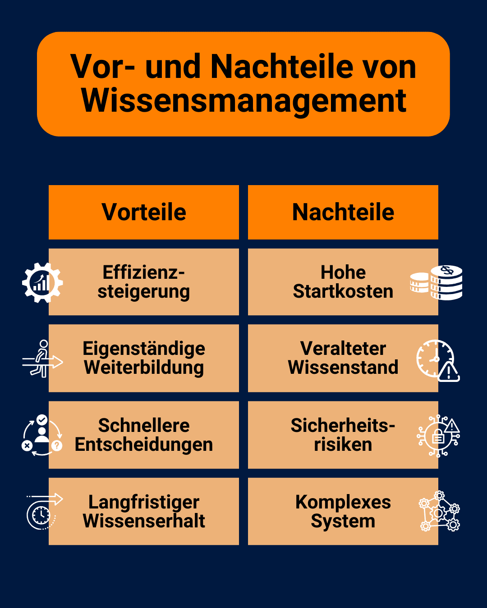

O conhecimento é um dos recursos mais importantes de qualquer empresa. Não é por acaso que o conhecimento já é citado como um [fator de produção](https://de.wikipedia.org/wiki/Produktionsfaktor), a par da terra, do capital e do trabalho, quando se trata do sucesso de uma empresa. Mas o que é que é preciso para tornar o conhecimento dos seus empregados disponível para os outros na sua empresa? A resposta: um **sistema de gestão do conhecimento** funcional!

Descubra aqui como pode gerir com sucesso o conhecimento acumulado na sua empresa, quais os desafios ou oportunidades que daí advêm e o que deve ter em atenção ao selecionar um **sistema de gestão do conhecimento** adequado.

## O que é a gestão do conhecimento?

Otimizar o tratamento do conhecimento na empresa - é disso que se trata a _gestão_ do conhecimento. O objetivo principal é construir uma **base de dados de conhecimentos** que se destina a tornar os processos da empresa mais eficientes e inovadores.

Pode consegui-lo recolhendo e processando o conhecimento escondido na sua empresa, tornando-o acessível a todos e, por fim, aplicando-o eficazmente.



## Nem todos os conhecimentos são iguais

Se quiser utilizar o conhecimento acumulado na sua empresa, tem de começar por distinguir o tipo de conhecimento.

### Conhecimento explícito

**Explícito** é o termo utilizado para descrever todo o conhecimento que você ou os seus empregados podem escrever de uma forma facilmente compreensível. Isto inclui, por exemplo, instruções para dispositivos ou directrizes escritas da empresa.

### Conhecimento implícito

**O conhecimento implícito**, por outro lado, é qualquer conhecimento especializado que os seus especialistas têm e que têm dificuldade em pôr em palavras e comunicar aos outros por escrito. Por exemplo, é provável que consiga distinguir intuitivamente um bom trabalho de um mau, sem necessariamente definir os critérios exactos. Este conhecimento está armazenado implicitamente na sua cabeça e deve ser convertido em conhecimento explícito para que possa ser acessível a todos os empregados.

Por conseguinte, é crucial para a gestão do conhecimento na sua empresa registar as soluções individuais desenvolvidas pelos seus empregados num sistema de gestão do conhecimento.

Um ambiente de trabalho agradável ajuda-o a reunir e a partilhar conhecimentos.

Para que a sua gestão do conhecimento seja o mais eficiente possível, os conhecimentos explícitos e tácitos devem andar de mãos dadas. Por isso, crie uma **cultura** na sua empresa em que os empregados sejam motivados a partilhar os seus tesouros de conhecimento escondidos uns com os outros e a transmitir ativamente o conhecimento.

## Duas estratégias de gestão do conhecimento

Como é que o conhecimento de um trabalhador se torna acessível a todos os outros? Existem duas **estratégias** para fazer circular o conhecimento de modo a que toda a organização possa beneficiar do conhecimento tácito de cada trabalhador.

### Estratégia "pessoas-para-documento

Com esta variante, agrupa-se o conhecimento dos indivíduos num **local de armazenamento central** que é acessível a todos. Deve certificar-se de que o conhecimento é apresentado de uma forma compreensível, para que a informação seja rapidamente compreendida e possa ser aplicada imediatamente.

### Estratégia interpessoal

Esta variante é utilizada quando o conhecimento é demasiado complexo para ser compreendido por todos. Nesse caso, são necessários **especialistas** que possam transmitir os seus conhecimentos pessoalmente a determinados colegas e que estejam também disponíveis para responder a perguntas.

Se a sua empresa dispõe de especialistas, estes devem estar disponíveis de forma rápida e fácil em caso de problemas.

Também pode combinar as duas estratégias, por exemplo, transmitir os seus conhecimentos num workshop, documentar os resultados mais importantes e disponibilizá-los numa base de dados de conhecimentos.

## O que a gestão do conhecimento deve alcançar

Para utilizar eficazmente os conhecimentos acumulados pela sua empresa, deve conhecer os **oito elementos** que constituem a gestão do conhecimento.

Classificação de acordo com Probst, Raub e Romhardt

O resultado é uma espécie de diretriz que pode ser utilizada como guia para desenvolver um sistema eficaz de gestão do conhecimento.

- **Identificação do conhecimento:** Identificar as fontes de conhecimento na empresa e analisar a sua relevância.
- **Desenvolvimento do conhecimento:** Gerar conhecimento internamente e torná-lo explicitamente disponível em sistemas digitais.
- **Aquisição de conhecimentos:** aquisição de conhecimentos de peritos externos para colmatar as lacunas de conhecimento.
- **Partilha de conhecimentos:** Acesso aberto e partilha ativa dos conhecimentos existentes.

Podem ser utilizados vários métodos bem conhecidos para partilhar conhecimentos, por exemplo, [workshops](https://seatable.io/pt/workshop-planen/), lições aprendidas, [reuniões de equipa](https://seatable.io/pt/in-4-schritten-zu-effizienteren-teammeetings/), orientação, [integração](https://seatable.io/pt/onboarding/) ou boletins informativos internos.

Um intercâmbio ativo é importante para uma boa gestão do conhecimento.

Os outros componentes são:

- **Utilização dos conhecimentos:** utilizar os conhecimentos existentes para melhorar o trabalho e os resultados da empresa.
- **Retenção de conhecimentos:** Guardar os conhecimentos acumulados num local de armazenamento central e actualizá-los continuamente.
- **Objectivos do conhecimento:** Definição dos objectivos desejados a atingir através da gestão do conhecimento.
- **Avaliação dos conhecimentos:** avaliação da medida em que os conhecimentos foram adquiridos e os objectivos alcançados.

## Para que pode utilizar a gestão do conhecimento

A gestão do conhecimento pode alcançar muitos objectivos e, por isso, pode ser utilizada de forma rentável em vários processos da empresa. As áreas de aplicação podem ser divididas, grosso modo, em utilização **interna** e **externa**.

### Utilização externa

No **apoio ao cliente**, por exemplo, um sistema sofisticado de gestão do conhecimento pode aliviá-lo de muitas tarefas. Para perguntas como "Como posso alterar os meus dados de endereço?" ou "Onde posso desativar as notificações?", os clientes raramente precisam de um contacto pessoal por telefone ou correio eletrónico. Em vez disso, é criado um **portal de autosserviço** no qual as perguntas mais frequentes dos clientes podem ser consultadas com uma solução imediatamente disponível.

Poupe muito trabalho aos seus empregados, oferecendo aos seus clientes ajuda para se ajudarem a si próprios.

[Esta área de ajuda]() é um exemplo de um sistema de gestão do conhecimento bem gerido. Por um lado, reduz o volume de trabalho de apoio dos seus empregados e, por outro, poupa aos seus clientes uma longa espera.

### Utilização interna

No entanto, é ainda mais importante para a continuidade da existência de uma empresa poder utilizar eficazmente os conhecimentos para uso interno. Está a tornar-se cada vez mais relevante tornar os conhecimentos recolhidos sobre produtos, clientes, empregados e processos de trabalho disponíveis para todos os departamentos.

Uma **cultura empresarial** baseada na partilha de conhecimentos ajuda cada colaborador a cumprir as suas tarefas, incentiva-o a adquirir conhecimentos de forma independente e torna os processos mais eficientes. Um sistema de gestão do conhecimento pode também ajudá-lo a eliminar **os silos de informação**.

## Oportunidades e desafios na gestão do conhecimento

Se está a considerar se um sistema de gestão do conhecimento vale a pena para a sua empresa, não se preocupe: a gestão do conhecimento vale sempre a pena a longo prazo! No entanto, há alguns **desafios** a que deve estar atento.

Pesar os dois lados um contra o outro.

### Vantagens:

- **Maior eficiência**: Ao organizar sistematicamente a informação, os seus empregados podem encontrá-la mais rapidamente e utilizá-la no seu trabalho.
- **Formação contínua autónoma**: A apresentação clara e compreensível dos conhecimentos existentes dá aos seus colaboradores a oportunidade de adquirirem conhecimentos de forma autónoma.
- **Processos de decisão mais rápidos**: Como todos os funcionários têm acesso a dados e documentos relevantes, podem tomar decisões informadas de forma autónoma.
- **Retenção do conhecimento a longo prazo**: Num sistema de gestão do conhecimento, o conhecimento é armazenado durante muito tempo e pode ser retido independentemente das pessoas.

### Desvantagens:

- **Elevados custos de arranque**: Para introduzir um sistema de gestão do conhecimento, é necessário planear os recursos financeiros e de tempo para a criação de sistemas digitais e para o desenvolvimento, estruturação e processamento do conhecimento.
- **Conhecimentos desactualizados**: Manter os conhecimentos actualizados custa muito tempo e energia e exige disciplina dos seus empregados.
- **Riscos de segurança**: Atualmente, as informações sensíveis são geralmente armazenadas num servidor central. No entanto, as autorizações de acesso e as directrizes de proteção de dados associadas também comportam riscos.
- **Sistema complexo**: Os sistemas de gestão do conhecimento são normalmente complexos. Por conseguinte, é necessário um longo período de familiarização para que os seus empregados possam utilizar o sistema de forma eficiente.

## Qual é o sistema de gestão do conhecimento mais adequado para si?

Se pretende estabelecer uma gestão **do** conhecimento bem sucedida na sua empresa, dificilmente pode evitar um **sistema de gestão do conhecimento** sob a forma de software. Existe uma grande seleção de **soluções de software** adequadas. Dependendo das suas necessidades, existe uma enorme variedade de sistemas com diferentes objectivos:



Exemplos: Confluence, Guru




Exemplos: BSCW, Microsoft SharePoint




Exemplos: Slack, Microsoft Teams




Exemplos: Seafile, Nextcloud, iCloud, Google Drive, OneDrive, Dropbox




Exemplos: Pipedrive, Salesforce




Exemplos: Asana, Jira




Exemplos: Personio, DATEV




Exemplos: WordPress, TYPO3



Para encontrar o software certo para a sua empresa, deve testar várias soluções e colocar a si próprio as seguintes questões:

- Quão fácil é para os meus funcionários introduzir e gerir novos conhecimentos?
- Com que rapidez podem os pesquisadores encontrar entradas específicas no software?
- Os meus funcionários podem colaborar e partilhar informações em tempo real?
- Em que servidores são armazenados os dados? Posso alojar o sistema eu próprio?
- O software é escalável se a empresa crescer fortemente no futuro?
- A atividade dos meus funcionários está documentada de modo a que o histórico de alterações possa ser acompanhado?
- Existem outros tipos de visualização para além do texto para apresentar a informação de forma compreensível?

## Gestão do conhecimento flexível e eficiente com o SeaTable

Uma boa resposta a todas estas perguntas é a base de dados de conhecimentos **SeaTable**, intuitiva e fácil de utilizar. A vários níveis (bases, tabelas, vistas, linhas), permite-lhe a si e aos seus colaboradores registar informações de forma estruturada, encontrá-las rapidamente, partilhá-las facilmente com outros ou filtrá-las de acordo com a relevância para um determinado grupo de pessoas. Isto significa que o utilizador e os seus empregados têm sempre uma visão global.

Quando escolhe o SeaTable, dá aos seus colaboradores uma caixa de ferramentas completa com a qual podem construir uma base de dados de conhecimentos flexível. O SeaTable suporta a [colaboração]() em tempo real, incluindo [comentários](https://seatable.io/pt/docs/arbeiten-mit-zeilen/die-kommentarfunktion-in-seatable/) e [um histórico]() completo [de alterações](). Isto permite-lhe a si e aos seus colaboradores converter o seu conhecimento pessoal e implícito em conhecimento explícito e torná-lo disponível para os outros. O SeaTable também permite a visualização gráfica dos dados através de vários [plugins]() e [aplicações]().

Pode utilizar o SeaTable na nuvem, que está alojado em centros de dados alemães em conformidade com o RGPD, ou instalá-lo [no local](), nos seus próprios servidores. Assim, os seus dados estão seguros em qualquer caso! Também pode utilizar autorizações em muitos locais no SeaTable para controlar exatamente quem pode ver e editar que dados.

## Conclusão: Construa a sua própria gestão do conhecimento

Todo começo é difícil, mas vale a pena! Invista tempo e esforço na gestão do conhecimento para utilizar o conhecimento escondido na sua empresa.

Gostaria de utilizar o SeaTable para a sua gestão do conhecimento? Então, basta [registar-se]() gratuitamente.
