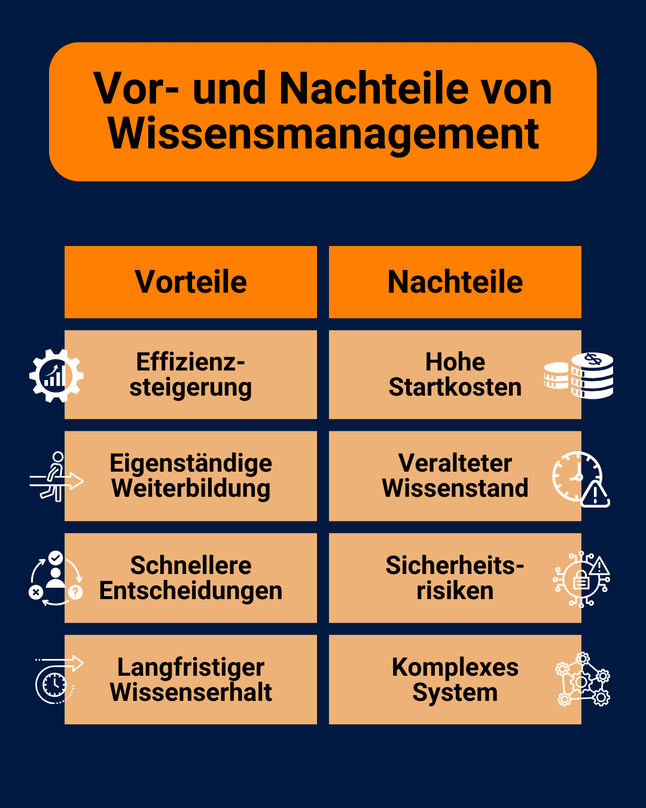
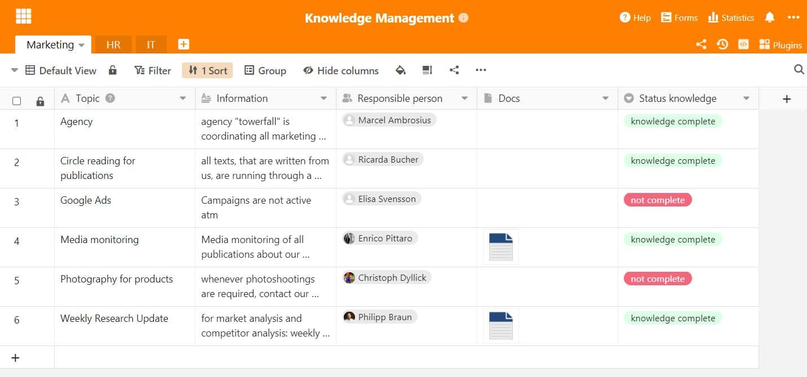

Знания - один из самых важных ресурсов в любой компании. Не зря знания уже упоминались как [фактор производства](https://de.wikipedia.org/wiki/Produktionsfaktor) наряду с землей, капиталом и трудом, когда речь шла об успехе компании. Но что нужно сделать, чтобы знания ваших сотрудников стали доступны другим сотрудникам компании? Ответ: функционирующая **система управления знаниями**!

Узнайте здесь, как можно успешно управлять накопленными знаниями в вашей компании, какие проблемы или возможности возникают в связи с этим и на что следует обратить внимание при выборе подходящей **системы управления знаниями**.

## Что такое управление знаниями?

Оптимизация работы со знаниями в компании - вот что такое _управление_ знаниями. Главная цель - создать **базу знаний**, которая должна сделать процессы в компании более эффективными и инновационными.

Вы можете добиться этого, собирая и обрабатывая знания, скрытые в вашей компании, делая их доступными для всех и, в конечном счете, эффективно применяя их.



## Не все знания одинаковы

Если вы хотите использовать накопленные знания в своей компании, сначала нужно определить их тип.

### Эксплицитные знания

**Явные** - это термин, используемый для описания всех знаний, которые вы или ваши сотрудники можете записать в легко понятной форме. К ним относятся, например, инструкции к приборам или письменные руководства компании.

### Неявное знание

С другой стороны, **неявные знания** - это те знания, которыми обладают ваши специалисты, но которые им трудно выразить словами и передать другим в письменном виде. Например, вы, вероятно, можете интуитивно отличить хорошую работу от плохой, не определяя точных критериев. Эти знания неявно хранятся в вашей голове, и их необходимо преобразовать в явные знания, чтобы сделать их доступными для всех сотрудников.

Поэтому для управления знаниями в вашей компании крайне важно регистрировать индивидуальные решения, разработанные вашими сотрудниками, в системе управления знаниями.

Приятная рабочая атмосфера помогает вам накапливать и обмениваться знаниями.

Чтобы управление знаниями было максимально эффективным, явные и неявные знания должны идти рука об руку. Поэтому создайте в своей компании **культуру**, в которой сотрудники будут мотивированы делиться друг с другом своими скрытыми сокровищами знаний и активно передавать их.

## Две стратегии в управлении знаниями

Как сделать знания одного сотрудника доступными для всех остальных? Существует две **стратегии** циркуляции знаний, чтобы вся организация могла воспользоваться негласными знаниями отдельных сотрудников.

### Стратегия "от людей к документам

В этом варианте вы объединяете знания отдельных людей в **центральном хранилище**, доступном для всех. Вы должны убедиться, что знания представлены в понятной форме, чтобы информация была быстро понята и могла быть немедленно применена.

### Стратегия взаимодействия между людьми

Этот вариант используется, когда знания слишком сложны для понимания всеми. Тогда требуются **эксперты**, которые могут лично передать свои знания конкретным коллегам, а также ответить на вопросы.

Если в вашей компании есть специалисты, они должны быть быстро и легко доступны в случае возникновения проблем.

Вы также можете комбинировать эти две стратегии, например, передавать свои знания на семинаре, документировать наиболее важные результаты и размещать их в базе знаний.

## Чего должно достичь управление знаниями

Чтобы эффективно использовать накопленные компанией знания, необходимо знать **восемь составных элементов**, из которых состоит управление знаниями.

Классификация по Пробсту, Раубу и Ромхардту

В результате получается своего рода руководство, которое вы можете использовать в качестве ориентира при разработке эффективной системы управления знаниями.

- **Идентификация знаний:** определение источников знаний в компании и анализ их актуальности.
- **Развитие знаний:** генерирование знаний внутри компании и их явный доступ в цифровых системах.
- **Приобретение знаний:** покупка знаний у внешних экспертов для устранения пробелов в знаниях.
- **Обмен знаниями:** открытый доступ к существующим знаниям и активный обмен ими.

Для обмена знаниями можно использовать различные известные методы, например, [семинары](), извлечение уроков, [командные встречи](), наставничество, [введение в должность]() или внутренние информационные бюллетени.

Активный обмен важен для эффективного управления знаниями.

Другие компоненты:

- **Использование знаний:** применение имеющихся знаний для улучшения результатов работы и компании.
- **Сохранение знаний:** сохраняйте накопленные знания в центральном хранилище и постоянно обновляйте их.
- **Цели знаний:** Определение желаемых целей, которые должны быть достигнуты с помощью управления знаниями.
- **Оценка знаний:** оценка степени, в которой знания были получены и цели достигнуты.

## Для чего можно использовать управление знаниями

Управление знаниями позволяет достичь многого, а значит, может быть выгодно использовано для различных процессов компании. Области применения можно условно разделить на **внутренние** и **внешние**.

### Внешнее использование

Например, в **службе поддержки клиентов** сложная система управления знаниями может избавить вас от многих задач. Для решения таких вопросов, как "Как изменить адрес?" или "Где я могу отключить уведомления?", клиентам редко требуется личный контакт по телефону или электронной почте. Вместо этого создается **портал самообслуживания**, на котором можно ознакомиться с наиболее частыми запросами клиентов и сразу же найти решение.

Сэкономьте своим сотрудникам много работы, предложив клиентам помочь себе самим.

[Эта справочная область]() - пример хорошо управляемой системы управления знаниями. С одной стороны, это снижает нагрузку на сотрудников службы поддержки, а с другой - избавляет ваших клиентов от долгого ожидания.

### Внутреннее использование

Однако для дальнейшего существования компании еще важнее уметь эффективно использовать знания для внутреннего пользования. Становится все более актуальным сделать собранные знания о продуктах, клиентах, сотрудниках и рабочих процессах доступными для всех отделов.

**Корпоративная культура**, основанная на совместном использовании знаний, помогает каждому сотруднику выполнять свои задачи, стимулирует их к самостоятельному приобретению знаний и делает процессы более эффективными. Система управления знаниями также поможет вам преодолеть **информационные барьеры**.

## Возможности и проблемы в области управления знаниями

Если вы раздумываете над тем, стоит ли внедрять систему управления знаниями в вашей компании, не волнуйтесь: в долгосрочной перспективе управление знаниями всегда оправдывает себя! Однако существуют некоторые **проблемы**, о которых вам следует знать.

Взвесьте обе стороны друг против друга.

### Преимущества:

- **Повышение эффективности**: благодаря систематическому упорядочиванию информации ваши сотрудники смогут быстрее находить ее и использовать в своей работе.
- **Самостоятельное повышение квалификации**: Четкое и понятное изложение имеющихся знаний дает вашим сотрудникам возможность приобретать их самостоятельно.
- **Ускоренный процесс принятия решений**: Поскольку все сотрудники имеют доступ к соответствующим данным и документам, они могут самостоятельно принимать обоснованные решения.
- **Долгосрочное хранение знаний**: в системе управления знаниями знания хранятся в течение длительного времени и могут сохраняться независимо от отдельных людей.

### Недостатки:

- **Высокие стартовые затраты**: чтобы внедрить систему управления знаниями, необходимо запланировать финансовые и временные ресурсы на создание цифровых систем, разработку, структурирование и обработку знаний.
- **Устаревшие знания**: поддержание знаний в актуальном состоянии стоит много времени и сил и требует дисциплины от ваших сотрудников.
- **Риски безопасности**: В наши дни конфиденциальная информация обычно хранится на центральном сервере. Однако разрешения на доступ и соответствующие рекомендации по защите данных также таят в себе риски.
- **Сложная система**: системы управления знаниями обычно сложны. Поэтому требуется длительный период ознакомления, чтобы ваши сотрудники могли эффективно использовать систему.

## Какая система управления знаниями вам подходит?

Если вы хотите организовать успешное управление знаниями в своей компании, вам вряд ли удастся обойтись без **системы управления знаниями** в виде программного обеспечения. Существует большой выбор подходящих **программных решений**. В зависимости от ваших требований существует огромный выбор систем различной направленности:



Примеры: Confluence, Guru




Примеры: BSCW, Microsoft SharePoint




Примеры: Slack, Microsoft Teams




Примеры: Seafile, Nextcloud, iCloud, Google Drive, OneDrive, Dropbox.




Примеры: Pipedrive, Salesforce




Примеры: Asana, Jira




Примеры: Personio, DATEV




Примеры: WordPress, TYPO3



Чтобы найти подходящее программное обеспечение для вашей компании, необходимо протестировать несколько решений и задать себе следующие вопросы:

- Насколько легко моим сотрудникам вводить новые знания и управлять ими?
- Как быстро поисковики могут найти конкретные записи в программе?
- Могут ли мои сотрудники сотрудничать и обмениваться информацией в режиме реального времени?
- На каких серверах хранятся данные? Могу ли я сам разместить систему?
- Масштабируемо ли программное обеспечение, если в будущем компания сильно вырастет?
- Документируется ли деятельность моих сотрудников, чтобы можно было отследить историю изменений?
- Существуют ли другие виды визуализации, помимо текстовой, для представления информации в понятном виде?

## Гибкое и эффективное управление знаниями с помощью SeaTable

Хороший ответ на все эти вопросы - интуитивно понятная и простая в использовании база знаний **SeaTable**. На различных уровнях (базы, таблицы, представления, строки) она позволяет вам и вашим сотрудникам записывать информацию в структурированном виде, быстро находить ее, легко делиться ею с другими или фильтровать ее по релевантности для определенной группы людей. Таким образом, вы и ваши сотрудники всегда в курсе происходящего.

Выбирая SeaTable, вы даете своим сотрудникам целый набор инструментов, с помощью которых они могут создать гибкую базу знаний. SeaTable поддерживает [совместную работу]() в режиме реального времени, включая [комментарии]() и полную [историю изменений](). Это позволяет вам и вашим сотрудникам преобразовывать свои личные, неявные знания в явные и делать их доступными для других. SeaTable также позволяет визуализировать данные в графическом виде с помощью различных [плагинов]() и [приложений]().

Вы можете использовать SeaTable в облаке, которое размещается в немецких центрах обработки данных в соответствии с GDPR, или установить его [на]() своих [собственных]() серверах. В любом случае ваши данные будут в безопасности! Вы также можете использовать авторизации во многих местах SeaTable, чтобы контролировать, кто именно может видеть и редактировать данные.

## Вывод: создайте собственную систему управления знаниями

Любое начало трудно, но оно того стоит! Инвестируйте время и усилия в управление знаниями, чтобы использовать знания, скрытые в вашей компании.

Хотите использовать SeaTable для управления знаниями? Тогда просто [зарегистрируйтесь]() бесплатно.
