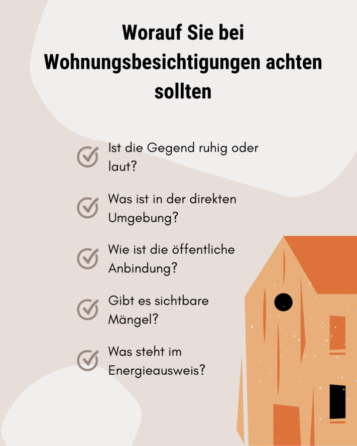

Будь то ваш первый дом, третья за год совместная квартира или новое пристанище для всей семьи - все, кто **ищет новое жилье**, сталкиваются с одной и той же проблемой. Ситуация на рынке жилья напряженная: Доступные квартиры в дефиците, а арендная плата продолжает расти. Однако всегда можно найти хорошие квартиры или отремонтировать старые многоквартирные дома. Вы должны быть хорошо подготовлены к этим возможностям, чтобы иметь возможность заявить о себе на фоне многочисленных конкурентов.

В этой статье вы узнаете 10 советов, которые обязательно нужно иметь в виду при поиске квартиры.

## 1\. Определите критерии, прежде чем искать квартиру

Прежде чем приступать к активному поиску квартир, следует подумать об общих условиях, которым должна соответствовать квартира вашей мечты. Какой **район** вам подходит? Насколько большой должна быть квартира? И сколько **комнат** вам нужно?

Решающим критерием для многих является **арендная плата**. Правило 30 % гласит, что в идеале стоимость аренды не должна превышать 30 % от вашего чистого дохода. Однако следует оставаться реалистом и не устанавливать слишком много критериев исключения. Это связано с тем, что предложение квартир ограничено, и поиск идеальной квартиры в большинстве случаев напоминает поиск иголки в стоге сена.

Контрольный список для идеального поиска квартиры.

## 2\. важные документы, которые должны быть у вас на руках до начала поиска квартиры

Чтобы убедить будущего арендодателя в своих достоинствах, необходимо произвести хорошее первое впечатление. **Сопроводительное письмо**, в котором, помимо обычных фактов, вы указываете личные качества, будет более запоминающимся, чем стандартные фразы. Вы также можете произвести впечатление на потенциального арендодателя с помощью **профиля** или резюме. Если возможно, попросите у своего нынешнего арендодателя **справку об отсутствии задолженностей по арендной плате** или даже рекомендательное письмо. В любом случае вам понадобятся последние расчетные листки и **кредитная история Schufa**.



## 3\. проверьте свои требования, прежде чем искать квартиру

Индекс арендной платы продолжает расти, что затрудняет поиск доступного жилья для многих людей. Когда дела идут совсем туго, людям с низкими доходами предоставляется государственная помощь.

- **Сертификат о праве на жилье** подтверждает, что квартиросъемщик имеет право на вселение в субсидируемую государством квартиру. Однако для получения сертификата жилец должен соответствовать определенным критериям. Например, его доход не должен превышать установленного предела. Ваш местный орган власти уточнит, имеете ли вы на это право.
- **Жилищное пособие** - это субсидия на аренду жилья для семей с низким доходом. Федеральное министерство жилищного строительства, городского развития и строительства предлагает онлайн-калькулятор жилищного пособия, с помощью которого вы можете проверить, имеете ли вы на него право. Вы также можете подать заявление на получение жилищного пособия в местный орган власти.

Люди, которые больше не могут позволить себе арендную плату в своем городе, имеют право на социальное жилье.

## 4\. находить дома в повседневной жизни

Существует несколько повседневных способов поиска квартир. Например, некоторые арендодатели дают объявления в **местных газетах** или расклеивают **объявления** по городу. Поэтому стоит быть начеку. **Друзья** или **знакомые** также могут знать, кто ищет жильцов или где в данный момент свободна квартира.

Если это отнимает слишком много времени, вы можете обратиться в более официальные агентства. Арендаторы также могут воспользоваться услугами **агентов по недвижимости** для поиска жилья, но при этом они берут комиссию. Согласно закону, комиссия агента по недвижимости не может превышать двух чистых холодных арендных платежей плюс НДС. Еще один вариант - обратиться напрямую в **компании по управлению недвижимостью**. Они часто имеют [обзор]() и могут предложить квартиры, которые скоро освободятся.



## 5\. найти квартиру в интернете

В эпоху цифровых технологий первым побуждением при поиске квартиры является просмотр **онлайн-порталов**. Будь то ImmobilienScout24, Immowelt или объявления - здесь представлен широкий выбор предложений. В связи с высоким спросом на рынке жилья некоторые порталы недвижимости предлагают даже модели премиум-класса, которые дают поисковикам преимущества перед конкурентами. Вы также можете сами рекламировать поиск, а не просто отвечать на объявления о продаже недвижимости.

Возможно, вы и так проводите много времени в **социальных сетях** - так почему бы не воспользоваться "роевым интеллектом" Facebook, Instagram и им подобных? Вы можете объявить о поиске квартиры в своем статусе, попросить людей поделиться им, а затем просмотреть группы, созданные специально для поиска квартиры.

Поиск квартиры часто бывает непростым.

## 6\. найти квартиры с помощью поискового запроса

Тот, кто уже активно ищет квартиру, знает, что многие арендодатели завалены заявками. В описаниях часто указывается, что в данный момент заявки не принимаются или что не на все заявки можно ответить.

Чтобы быстро реагировать на новые объявления о продаже квартир, мы рекомендуем активировать **поисковый запрос** на порталах недвижимости. В этом случае вы будете получать **push-уведомления** в режиме реального времени, когда появляются новости и изменения. Такое оповещение позволит вам быстрее реагировать на объявления и повысит ваши шансы найти квартиру.

## 7\. обмен жильем как альтернатива

В крупных городах, в частности, предложение недвижимости невелико по сравнению со спросом. Если вы ищете новое жилье и не можете найти то, что вам нужно, обмен квартирами или домами может стать привлекательной альтернативой. Таким образом, вы можете получить недвижимость, которой нет на рынке жилья. Преимущество заключается в том, что обе стороны могут быть уверены в том, что найдут подходящее жилье.

Для этого существуют **обменные агентства**, специализирующиеся на недвижимости, но некоторые люди, заинтересованные в обмене, также размещают свои объявления на известных порталах недвижимости. Чтобы заранее отсеять неподходящие предложения, следует прямо в объявлении указать ключевые детали желаемой квартиры. Если речь идет об аренде, хозяин должен заранее дать согласие на обмен.

## 8 Это важно при просмотре квартиры

Когда дело доходит до просмотра квартиры, необходимо учесть несколько моментов, чтобы определить, действительно ли она подходит. В идеале нужно назначить просмотр на то время, когда в квартире еще достаточно **дневного света**, чтобы вы могли оценить ее с лучшей стороны. Однако самым важным критерием является то, комфортно ли вам в этом **районе** и в этой квартире.

Полезные советы по просмотру квартир.

Квартира находится на оживленной дороге или железнодорожной ветке? У вас нет **машины**, а ближайший супермаркет находится в 5 километрах? Были ли уже проблемы с плесенью в квартире или предвидятся ли большие **расходы на отопление**? Если предыдущий арендатор присутствует при просмотре, вы также можете спросить его о причинах переезда. Постарайтесь узнать как можно больше, не будучи слишком навязчивым.

Возможно, вам придется взять с собой **мебель или технику, оставшуюся от предыдущего жильца**, или даже поставить условие, чтобы получить скидку. Если вы хотите въехать с крупногабаритной мебелью, лучше попросить **план квартиры** или самостоятельно измерить комнаты, в которых вы хотите ее разместить.

## 9\. как произвести хорошее впечатление на арендодателей

Дружеский телефонный звонок или приятное письмо производят хорошее первое впечатление. Но как убедить арендодателей? Вы можете заранее узнать у потенциального арендодателя, какие документы ему нужны, и принести их прямо на просмотр квартиры. Разумеется, вы должны прийти **вовремя**. Если вы приедете раньше, то сможете изучить район, в котором вы хотели бы жить в будущем.

Не притворяйтесь, а представляйте себя **подлинно**. Это создаст у хозяина квартиры лучшее впечатление о вас, и вы покажетесь ему приятным и располагающим к себе человеком. Одевайтесь **опрятно**, но и здесь все то же самое: не скрывайте своего истинного "я". Постарайтесь разговорить арендодателя во время просмотра. В идеале вам следует заранее продумать вопросы, которые вы хотели бы задать. Если после просмотра вы все еще заинтересованы, сообщите об этом арендодателю как можно скорее, чтобы выделится среди других заинтересованных лиц.

## 10\. ведение обзора при поиске жилья

Ориентироваться в джунглях недвижимости не так-то просто. Особенно если вы заинтересованы в нескольких объектах, легко запутаться. Чтобы не забыть о квартире или даже случайно связаться с ней дважды, стоит с самого начала использовать хорошую структуру. Бесплатный [шаблон от SeaTable]() идеально подходит для этого.

Вы можете ввести свои критерии в шаблон и сравнить все потенциальные квартиры с первого взгляда. Помимо фотографий, вы также можете добавить контактные данные арендодателя и даты. После успешного просмотра вы можете записать свои впечатления, чтобы не забыть ни одной детали. Хорошая организация облегчит вам поиск квартиры и принятие окончательного решения о покупке квартиры вашей мечты.

Чтобы использовать SeaTable, достаточно бесплатно зарегистрироваться. Затем вы можете добавить [шаблон]() в свою базу и добавить свои собственные данные.
