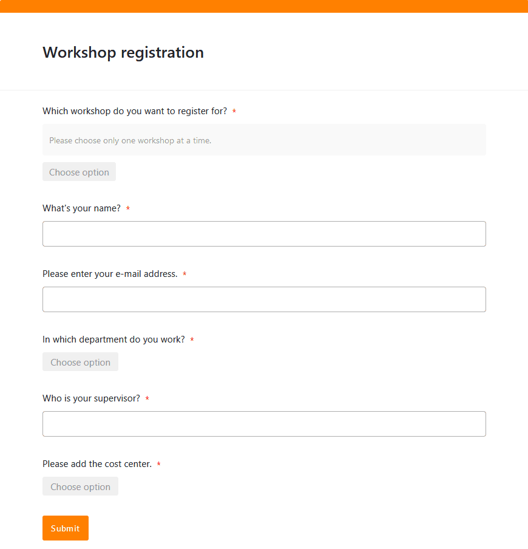
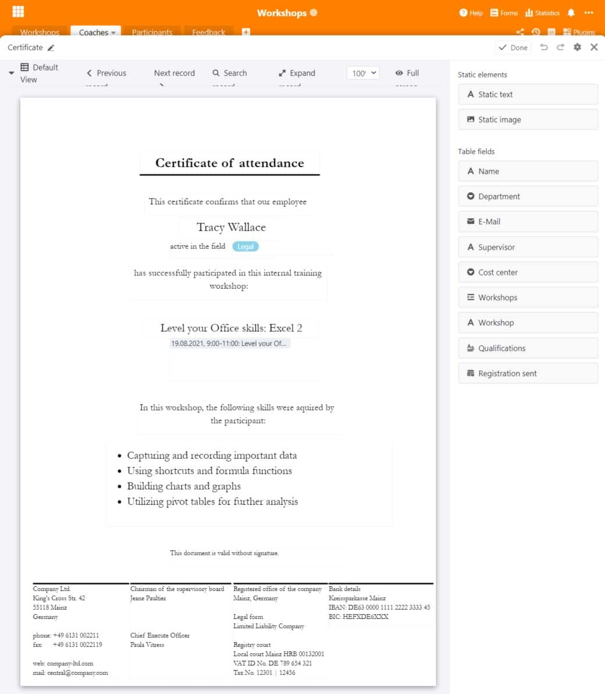

Lebenslanges Lernen ist heutzutage eines der wichtigsten Dinge, wenn es um **berufliche Qualifikationen** und **Persönlichkeitsentwicklung** geht. Ob Workshop, Schulung oder Weiterbildung: Als Arbeitgeber ist es essenziell für Sie, dass Sie Ihre Mitarbeiter fördern und ihnen Angebote zur Weiterentwicklung bieten. Denn das zählt bei vielen Arbeitnehmern heute zu einem attraktiven Job dazu und **Ihr Unternehmen profitiert** auf vielerlei Weise von gut geschulten Mitarbeitern.

Sie möchten einen **Workshop planen** oder gar die gesamte **Personalentwicklung** managen? Dann stehen Sie vermutlich vor einer Mammutaufgabe, weil dies viel Aufwand mit sich bringt. Dieser Artikel liefert Ihnen nützliche Informationen rund um die **Organisation von Workshops und Weiterbildungen**. Wenn Sie für Ihre Workshop-Planung eine passende Vorlage suchen, werden Sie ebenfalls hier fündig.

## Warum Workshops und Weiterbildungen wichtig sind

Mitarbeiter sind die kostbarste Ressource eines Unternehmens. Daher liegt es in Ihrem Interesse, Ihre **Human Resources** zu fördern und Ihr Unternehmen dadurch noch wertvoller zu machen. Weiterbildungen, Schulungen und Workshops können Sie demnach als **nachhaltige Investition** in Ihr Unternehmen betrachten. Denn die neuen Skills und das Know-how, das sich Ihre Mitarbeiter aneignen, kommt nicht nur ihnen, sondern auch dem Unternehmen zugute.

Je nach Komplexität des Themas und Expertise in Ihrem Unternehmen können Sie entweder **interne Workshops** mit Ihren Mitarbeitern durchführen, externe Fachleute zu einer **Inhouse-Schulung** dazuholen oder **externe Weiterbildungen**, zum Beispiel bei der Agentur für Arbeit, einer IHK oder Akademie, in Anspruch nehmen.

**Drei Beispiele für interne Mitarbeiter-Workshops:**

- **Onboarding**: Vor allem für die Einarbeitung am Anfang sind Workshops unerlässlich, um neue Mitarbeiter mit der Unternehmenskultur, bestehenden Prozessen und Software-Anwendungen vertraut zu machen.
- **Lean Management**: Wenn Sie Ihre Geschäftsprozesse optimieren möchten, tragen gezielte Workshops mit Ihren Mitarbeitern dazu bei, Arbeitsabläufe zu verschlanken, zu verbessern und effizienter zu gestalten.
- **Change Management**: Wenn große, strukturelle Veränderungen in Ihrem Unternehmen anstehen, können Workshops dabei helfen, diese den Mitarbeitern Stück für Stück näherzubringen.

### Workshops: Ein Must-have für attraktive Arbeitgeber

Für Sie und Ihre Mitarbeiter haben Weiterbildungen, Schulungen und Workshops natürlich einige Vorteile. Zum einen erweitern Ihre Mitarbeiter ihre **Qualifikationen** und erlernen **neue Skills**, die sie im Arbeitsalltag einsetzen können. Das macht sie zu wertvollen Teammitgliedern, die an den Aufgaben in ihren individuellen Positionen wachsen.

Zum anderen entwickeln Ihre Mitarbeiter **bessere Aufstiegschancen**, da neue Kompetenzen und Führungsqualitäten ihr Einsatzgebiet erweitern können. Dadurch können Sie Ihren **Bedarf an Fach- und Führungskräften** gegebenenfalls aus der eigenen Belegschaft decken. Und zu guter Letzt sind Workshops auch eine spannende **Abwechslung** für Arbeitnehmer, wenn sich im Arbeitsalltag gerade keine neuen Aufgaben und Projekte ergeben.

{{< warning headline="Mitarbeiterbindung und -zufriedenheit" text="Regelmäßige Weiterbildungen, Schulungen und Workshops können nicht nur die **Produktivität** und **Einsatzfähigkeit**, sondern auch die [Zufriedenheit](https://www.personalwerk.de/hr-wissen/glossaruebersicht/detail/news/mitarbeiterzufriedenheit) Ihrer Mitarbeiter steigern. Sie fühlen sich ernst genommen und sehen es als positives Signal, wenn Sie ihre Meinung hören wollen, sie in Veränderungen einbinden oder ihnen die Möglichkeit bieten, sich weiterzuentwickeln. Das stärkt die **Mitarbeiterbindung** an das Unternehmen und hat langfristig zur Folge, dass die Fluktuation sinkt und Sie weniger Zeit und Geld für das Suchen und Rekrutieren neuer Mitarbeiter ausgeben müssen." />}}

## Workshops managen – mit der richtigen Software ein Klacks

Das Planen, Organisieren und Managen von Workshops kann in größeren Unternehmen schnell unübersichtlich werden. Es gilt eine **Menge an unterschiedlichen Daten** zu verwalten. Dafür ist es sinnvoll, in gute Lösungen zu investieren, die den Aufwand auf ein Minimum reduzieren. Hier setzt SeaTable an: Als **leistungsfähige Software** mit praktischen und hochflexiblen Funktionen ist SeaTable ein ideales Tool für die Organisation und Verwaltung von Workshops.

Mit SeaTable haben Sie Ihre Workshops und Weiterbildungsmaßnahmen immer im Blick und bündeln alle Informationen an einem zentralen Sammelpunkt. Sie managen nicht nur Ihre Workshops, sondern auch die Coaches sowie die Anmeldungen und das Feedback der Teilnehmer.

[Unsere kostenlose Vorlage]() für Sie enthält vier verschiedene Tabellen, welche die wichtigsten Prozesse bei der Workshop-Planung abdecken.

## Zielgruppe definieren und Bedarf ermitteln

Sie möchten Ihre Personalentwicklung vorantreiben und neue Weiterbildungsmöglichkeiten anbieten? Das Wichtigste dabei ist, dass Sie in engem **Austausch mit den potenziellen Teilnehmern** stehen und immer im Hinterkopf behalten, an wen sich der Workshop oder die Weiterbildung richtet. Sollen Ihre Führungskräfte ein Kommunikationstraining erhalten oder soll Ihr Marketing-Team in einem Workshop die neue Corporate Identity erarbeiten? Je nach **Zielgruppe** und **Thema** muss ein Workshop ganz anders aussehen.

Selbstverständlich sollten Sie Ihr Angebot an den Bedarf anpassen und ermitteln, wo in Ihrem Unternehmen **Wissentransfer** nötig ist. Wenn Ihr Unternehmen international agiert, könnten Ihre Mitarbeiter großes Interesse an einem Business-English-Kurs haben, mit dem sie ihre **Sprachkenntnisse** auffrischen können. Vermutlich benötigen alle Neueinsteiger eine Schulung in **IT-Sicherheit** und eine Einführung in die genutzten **Software-Anwendungen**.

Verschaffen Sie sich einen Überblick über alle Workshops, Schulungen und Weiterbildungsmaßnahmen, die in Ihrem Unternehmen bereits stattfinden oder für die es zusätzlichen Bedarf gibt. Dazu können Sie alle wichtigen Informationen und Dokumente zu einem Workshop einfach in einer Datenbank erfassen. Die Verknüpfung mit anderen Tabellen ermöglicht hierbei die direkte Zuordnung zu einem Coach.

## Coaches für den Workshop suchen

Je nachdem, ob die notwendige Expertise zu einem Thema in Ihrem Unternehmen vorhanden ist, können Sie entweder **Ihre Mitarbeiter** oder **externe Fachleute** als Coaches für Ihre Workshops gewinnen. Prüfen Sie, ob die Coaches geeignet sind, einen Workshop mit dem gewünschten Erfolg durchzuführen. Darüber hinaus sollten Sie Informationen wie Kontaktdaten, Foto und Qualifikation der Coaches hinterlegen.

Mit dem Seitendesign-Plugin ist es außerdem möglich, mit den in der Tabelle enthaltenen Daten einen **Steckbrief** zu erstellen und diesen im PDF-Format abzuspeichern.

## Dauer und Agenda des Workshops festlegen

Ein Workshop, wie Ihre Mitarbeiter [Reisekosten einreichen und Auslagen erstattet bekommen]() können, sollte nicht länger als eine Stunde dauern, während ein Führungskräfte-Training mehrere Stunden pro Woche oder ganze Tage in Anspruch nehmen kann. Dem **Pensum** entsprechend sollte der Coach eine **Agenda** festlegen und planen, wie viele Inhalte in der Zeit vermittelt werden können. Die **Termine** der Kurse können Sie mit dem **Kalender** visuell darstellen und Ihren Mitarbeitern in der Monatsübersicht einen klaren Überblick über die Termine verschaffen.

## Location und Catering buchen

Wo soll Ihr Workshop stattfinden? Wenn Ihr Unternehmen an seinen Standorten über ausreichend große **Meetingräume** verfügt, empfiehlt es sich, Workshops in Ihren eigenen Räumlichkeiten abzuhalten. Dadurch können Ihre Mitarbeiter die Termine leicht in Ihren Büroalltag integrieren. Für ganztägige Workshops oder falls Sie keine freien Räume im Büro haben, können Sie auch Konferenzräume in **Co-Working-Spaces** oder **Tagungshotels** anmieten.

Dort können Sie gleich das **Catering für die Mittagspause** dazubuchen, wohingegen Sie es in den eigenen Firmenräumen selbst organisieren müssen (sofern Ihr Standort keine Kantine oder Cafeteria besitzt). Auch kleine Snacks sowie Kaltgetränke, Kaffee und Tee kommen immer gut an und halten Ihre Workshop-Teilnehmer bei Laune.

## Anmeldungen online verwalten

Als Nächstes müssen Sie die potenziellen Teilnehmer einladen und notieren, wer an welchem Termin teilnimmt. Wenn Sie Ihre Workshops bereits in einer Datenbank erfasst haben, ist es ein Leichtes, die **Anmeldungen** online zu verwalten. Über ein [Webformular](), mit dem sich die Teilnehmer für jeden Workshop registrieren können, können Sie das in SeaTable mühelos umsetzen. Dadurch sparen Sie sich das Hin- und Hersenden von **Termineinladungen** per E-Mail.

Eine Tabelle sammelt alle Anmeldungen und die von Ihren Teilnehmern eingetragenen Daten. Praktisch: Wenn die Teilnehmer einen Workshop auswählen, ist ihre Anmeldung direkt dem richtigen Workshop in der verknüpften Tabelle zugeordnet.

## Während des Workshops: Methoden und Materialien

Je nach Thema des Workshops eignen sich unterschiedliche Methoden und Materialien, um die gewünschten Ziele zu erreichen:

- Die **Erwartungsabfrage** ist ein Muss bei jedem Workshop. Fragen Sie Ihre Teilnehmer gleich zu Beginn, was sie sich von dem Workshop erwarten und welche Aspekte auf jeden Fall geklärt werden sollen. Am Ende blicken Sie auf Ihre Notizen zurück: Wenn Sie alle Punkte abhaken können, können Sie und Ihre Teilnehmer zufrieden sein.
- Als Einstieg können Sie die Teilnehmer auch bitten, Gedanken und Ideen zum Thema des Workshops in den Raum zu werfen. Am effektivsten ist das **Brainstorming** in einer offenen Atmosphäre frei von Kritik und Vorurteilen.
- Zum visuellen Darstellen und Ordnen von Gedanken und Ideen empfiehlt sich eine **Mindmap**. Sie können diese an eine Tafel oder Flipchart schreiben oder auf Papierkarten, die Sie an einer Wand aufhängen. Für einen Online-Workshop können Sie zum Beispiel ein [Miro-Board](https://miro.com/) nutzen.
- **Interaktive Rollenspiele** bieten sich beispielsweise für ein Führungskräfte-Training an, weil man die Perspektive verschiedener Teammitglieder einnehmen und den Umgang mit Konflikten üben kann.
- Eine weitere Methode, bei der man ein Thema aus unterschiedlichen Perspektiven beleuchtet, sind **die 6 Denkhüte** von de Bono. Dabei teilen Sie die Teilnehmer in sechs Gruppen ein: Der weiße Hut steht für Fakten, der rote für Emotionen, der gelbe für Chancen, der schwarze für Risiken, der grüne für Ideen und der blaue für Strukturen.



## Zertifikate erstellen

Um die **Teilnahme am Workshop zu bescheinigen**, können Sie jedem Teilnehmer ein Zertifikat ausstellen. Mit dem [Seitendesign-Plugin]() in SeaTable ersparen Sie sich dabei viel Arbeit. Das Plugin verwendet die bereits eingetragenen Informationen in der Tabelle und kann diese für jeden Teilnehmer individuell in das Layout des Teilnahmezertifikats einfügen. Mithilfe einer Schaltfläche können Sie per Knopfdruck personalisierte Dokumente erstellen und im PDF-Format speichern.

## Feedback zum Workshop einholen und auswerten

Was wären Workshops und Weiterbildungsmaßnahmen ohne Feedback? Zur Evaluation können Sie entweder **Papierbögen** nutzen, die Sie am Ende des Workshops von den Teilnehmern ausfüllen lassen, oder Sie setzen erneut auf ein **Webformular**. Dieses hat den Vorteil, dass die Teilnehmer die Bewertung direkt digital erfassen. So ist das Feedback immer lesbar und sofort mit den Workshops und Coaches verknüpft. Die Teilnehmer können Workshop und Coach sowohl auf einer Rating-Skala als auch in Freitextfeldern bewerten.

Das gesammelte Feedback können Sie in SeaTable einfach **auswerten**, indem Sie beispielsweise den Median oder Durchschnitt einer [Rating-Spalte]() in der [Statuszeile]() anzeigen lassen oder die offenen Antworten in den [Text-Spalten]() für die Weiterentwicklung der Workshops nutzen. Wenn es auffällig viel **Kritik** an einem Kurs gibt, kann der Trainer entweder Verbesserungen vornehmen oder ausgetauscht werden. Kommt etwa oft das Feedback, dass wichtige Aspekte gefehlt haben, könnte das ein Hinweis darauf sein, dass Sie diesen mehr Zeit einräumen und den Workshop verlängern sollten. Sie könnten ebenso einen neuen Workshop ins Leben rufen, der sich genau auf diese Aspekte konzentriert und so die Bedürfnisse Ihrer Teilnehmer erfüllt.

## Fazit: Workshop planen mit SeaTable

Mit SeaTable können Sie jeden Vorgang rund um die Workshop-Planung sinnvoll abbilden und alle Daten mühelos verwalten. Im Vordergrund steht dabei immer die größtmögliche Effizienz für Sie, Ihre Mitarbeiter und andere Beteiligte. Denkbar sind auch noch weitere Tabellen und Prozesse, die Sie flexibel nach Ihren Wünschen ergänzen können, wie etwa die Buchung von Meetingräumen oder eine Inventarliste Ihrer Materialien.

[Registrieren Sie sich]() noch heute kostenlos und probieren Sie unsere [Vorlage]() direkt aus! Die Funktionen lassen sich für eine Vielzahl weiterer Anwendungsfälle nutzen.
