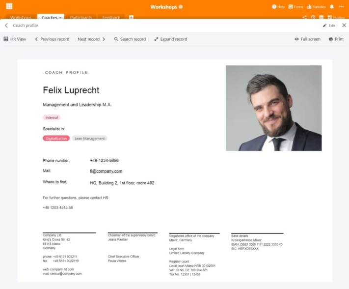

Nowadays, lifelong learning is one of the most important things when it comes to **professional qualifications** and **personal development**. Whether it's a workshop, training or further education: As an employer, it is essential that you support your employees and offer them opportunities for further development. For many employees today, this is part of an attractive job and **your company benefits** in many ways from well-trained employees.

Would you like to **plan** a **workshop** or even manage the entire **personnel development** process? Then you are probably facing a mammoth task, because it involves a lot of effort. This article provides you with useful information on **organizing workshops and training courses**. If you are looking for a suitable template for your workshop planning, you will also find it here.

## Why workshops and further training are important

Employees are a company's most valuable resource. It is therefore in your interest to develop your **human resources** and thus make your company even more valuable. Further education, training and workshops can therefore be seen as a **sustainable investment** in your company. After all, the new skills and know-how that your employees acquire will not only benefit them, but also the company.

Depending on the complexity of the topic and the expertise in your company, you can either hold **internal workshops** with your employees, bring in external experts for **in-house training** or take advantage of **external training courses**, for example at the Federal Employment Agency, a Chamber of Industry and Commerce or an academy.

**Three examples of internal employee workshops:**

- **Onboarding**: Workshops are essential, especially for initial training, in order to familiarize new employees with the corporate culture, existing processes and software applications.
- **Lean management**: If you want to optimize your business processes, targeted workshops with your employees help to streamline and improve workflows and make them more efficient.
- **Change management**: If major structural changes are imminent in your company, workshops can help to bring them closer to your employees step by step.

### Workshops: A must-have for attractive employers

Further training, courses and workshops naturally have several advantages for you and your employees. On the one hand, your employees expand their **qualifications** and learn **new skills** that they can use in their day-to-day work. This makes them valuable team members who grow with the tasks in their individual positions.

On the other hand, your employees develop **better promotion prospects**, as new skills and leadership qualities can expand their field of activity. This allows you to cover your **need for specialists and managers** from your own workforce if necessary. And last but not least, workshops are also an exciting **diversion** for employees when there are no new tasks and projects in their day-to-day work.

{{< warning headline="Employee loyalty and satisfaction" text="Regular further education, training and workshops can not only increase **productivity** and **employability**, but also the [satisfaction](https://www.personalwerk.de/hr-wissen/glossaruebersicht/detail/news/mitarbeiterzufriedenheit) of your employees. They feel taken seriously and see it as a positive signal when you want to hear their opinion, involve them in changes or offer them the opportunity to develop further. This strengthens **employee loyalty** to the company and, in the long term, reduces staff turnover and means you have to spend less time and money looking for and recruiting new employees." />}}

## Managing workshops - a breeze with the right software

Planning, organizing and managing workshops can quickly become confusing in larger companies. There is a **lot of different data** to manage. Therefore, it makes sense to invest in good solutions that reduce the effort to a minimum. This is where SeaTable comes in: As **powerful software** with practical and highly flexible functions, SeaTable is an ideal tool for organizing and managing workshops.

With SeaTable, you always have an overview of your workshops and training measures and bundle all information in a central collection point. You not only manage your workshops, but also the coaches, registrations and participant feedback.

[Our free template]() for you contains four different tables that cover the most important processes in workshop planning.

## Define target group and determine needs

Would you like to drive forward your personnel development and offer new training opportunities? The most important thing is that you are in close **contact with potential participants** and always keep in mind who the workshop or training course is aimed at. Should your managers receive communication training or should your marketing team develop the new corporate identity in a workshop? Depending on the **target group** and **topic**, a workshop must look completely different.

Of course, you should tailor your offer to your needs and identify where **knowledge transfer** is required in your company. If your company operates internationally, your employees may be very interested in a business English course to brush up on their **language skills**. All new starters will probably need training in **IT security** and an introduction to the **software applications** they use.

Get an overview of all workshops, training courses and further training measures that are already taking place in your company or for which there is additional demand. You can easily record all important information and documents relating to a workshop in a database. The link to other tables enables direct assignment to a coach.

## Find coaches for the workshop

Depending on whether the necessary expertise on a topic is available in your company, you can either recruit **your employees** or **external experts** as coaches for your workshops. Check whether the coaches are suitable to conduct a workshop with the desired success. You should also provide information such as contact details, photo and qualifications of the coaches.

With the page design plugin, it is also possible to create a **profile** with the data contained in the table and save it in PDF format.

## Determine the duration and agenda of the workshop

A workshop on how your employees can [submit travel expenses and be reimbursed for expenses]() should not take longer than an hour, whereas a management training course can take several hours a week or even whole days. Depending on the **workload**, the coach should set an **agenda** and plan how much content can be covered in the time available. You can use the **calendar** to visualize the **dates of** the courses and give your employees a clear overview of the dates in the monthly overview.

## Book location and catering

Where should your workshop take place? If your company has sufficiently large **meeting rooms** at its locations, it is advisable to hold workshops on your own premises. This makes it easy for your employees to integrate the events into their daily office routine. For all-day workshops or if you don't have any free rooms in the office, you can also rent conference rooms in **co-working spaces** or **conference hotels**.

You can book **catering for the lunch break** there, whereas you have to organize it yourself on your own company premises (if your location does not have a canteen or cafeteria). Small snacks as well as cold drinks, coffee and tea are always well received and keep your workshop participants happy.

## Manage registrations online

Next, you need to invite potential participants and make a note of who is attending which event. If you have already recorded your workshops in a database, it is easy to manage **registrations** online. You can do this effortlessly in SeaTable using a [web form]() that participants can use to register for each workshop. This saves you having to send **invitations** back and forth by e-mail.

A table collects all registrations and the data entered by your participants. Practical: When participants select a workshop, their registration is directly assigned to the correct workshop in the linked table.

## During the workshop: Methods and materials

Depending on the topic of the workshop, different methods and materials are suitable for achieving the desired goals:

- **Asking about expectations** is a must for every workshop. Ask your participants right at the beginning what they expect from the workshop and which aspects should definitely be clarified. At the end, look back at your notes: if you can tick off all the points, you and your participants can be satisfied.
- As an introduction, you can also ask the participants to throw thoughts and ideas on the topic of the workshop into the room. **Brainstorming** is most effective in an open atmosphere free from criticism and prejudice.
- A **mind map** is recommended for visualizing and organizing thoughts and ideas. You can write these on a blackboard or flipchart or on paper cards that you hang up on a wall. For an online workshop, you can use a [miro board](https://miro.com/), for example.
- **Interactive role plays** are ideal for management training, for example, because you can take on the perspective of different team members and practise dealing with conflicts.
- Another method in which a topic is examined from different perspectives is de Bono's **6 thinking hats**. You divide the participants into six groups: The white hat stands for facts, the red one for emotions, the yellow one for opportunities, the black one for risks, the green one for ideas and the blue one for structures.



## Create certificates

You can issue a certificate to each participant to **certify their participation in the workshop**. The [page design plugin]() in SeaTable saves you a lot of work. The plugin uses the information already entered in the table and can insert it individually for each participant in the layout of the certificate of attendance. With the help of a button, you can create personalized documents at the touch of a button and save them in PDF format.

## Obtaining and evaluating feedback on the workshop

What would workshops and training measures be without feedback? You can either use **paper forms** for evaluation, which you have the participants fill out at the end of the workshop, or you can use a **web form** again. This has the advantage that participants can enter their evaluation directly in digital form. This means that the feedback is always legible and immediately linked to the workshops and coaches. Participants can rate the workshop and coach both on a rating scale and in free text fields.

You can easily **evaluate** the collected feedback in SeaTable, for example by displaying the median or average of a [rating column]() in the [status bar]() or by using the open answers in the [text columns]() to further develop the workshops. If there is a conspicuous amount of **criticism** of a course, the trainer can either make improvements or be replaced. For example, if there is frequent feedback that important aspects are missing, this could be an indication that you should give them more time and extend the workshop. You could also create a new workshop that focuses precisely on these aspects and thus meets the needs of your participants.

## Conclusion: Planning a workshop with SeaTable

With SeaTable, you can map every process related to workshop planning and manage all data effortlessly. The focus is always on the greatest possible efficiency for you, your employees and other participants. Other tables and processes are also conceivable, which you can add flexibly according to your requirements, such as booking meeting rooms or an inventory list of your materials.

[Register]() for free today and try out our [template]() straight away! The functions can be used for a variety of other applications.
