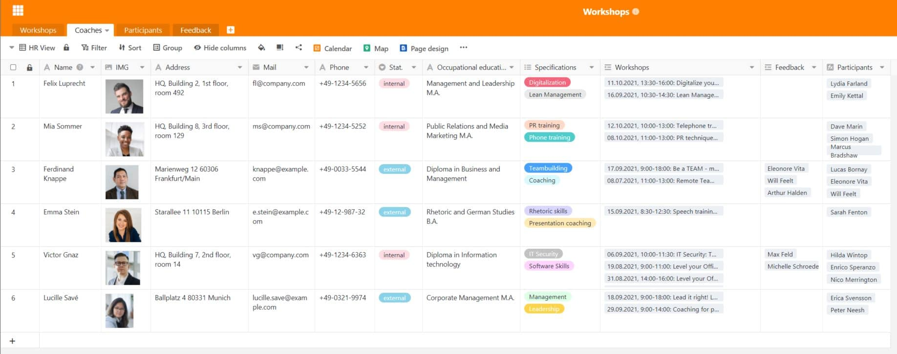

Hoy en día, el aprendizaje permanente es una de las cosas más importantes cuando se trata de **cualificación profesional** y **desarrollo personal**. Ya se trate de un taller, de formación o de formación continua: Como empresario, es esencial que apoye a sus empleados y les ofrezca oportunidades de perfeccionamiento. Para muchos empleados de hoy en día, esto forma parte de un trabajo atractivo y **su empresa se beneficia** de muchas maneras de unos empleados bien formados.

¿Le gustaría **planificar** un **taller** o incluso gestionar todo el programa de **desarrollo del personal**? Entonces probablemente se enfrente a una tarea titánica, porque implica mucho esfuerzo. En este artículo encontrará información útil sobre la **organización de talleres y cursos de formación**. Si busca una plantilla adecuada para la planificación de su taller, también la encontrará aquí.

## Por qué son importantes los talleres y la formación continua

Los empleados son el recurso más valioso de una empresa. Por lo tanto, le interesa desarrollar sus **recursos humanos** y hacer que su empresa sea aún más valiosa. Por ello, la formación continua y los talleres pueden considerarse una **inversión sostenible** en su empresa. Al fin y al cabo, las nuevas habilidades y conocimientos que adquieran sus empleados no sólo les beneficiarán a ellos, sino también a la empresa.

Dependiendo de la complejidad del tema y de los conocimientos de su empresa, puede organizar **talleres internos** con sus empleados, traer expertos externos para **formación interna** o aprovechar **cursos de formación externos**, por ejemplo en la Agencia Federal de Empleo, una Cámara de Industria y Comercio o una academia.

**Tres ejemplos de talleres internos para empleados:**

- **Incorporación**: los talleres son esenciales, sobre todo para la formación inicial, a fin de familiarizar a los nuevos empleados con la cultura corporativa, los procesos existentes y las aplicaciones informáticas.
- **Gestión ajustada**: si quiere optimizar sus procesos empresariales, los talleres específicos con sus empleados ayudan a racionalizar y mejorar los flujos de trabajo y a hacerlos más eficientes.
- **Gestión del cambio**: si son inminentes cambios estructurales importantes en su empresa, los talleres pueden ayudar a familiarizar a los empleados con ellos paso a paso.

### Talleres: Imprescindibles para empleadores atractivos

Naturalmente, la formación continua, los cursos y los talleres tienen una serie de ventajas para usted y sus empleados. Por un lado, sus empleados amplían sus **cualificaciones** y aprenden **nuevas habilidades** que pueden utilizar en su trabajo diario. Esto los convierte en valiosos miembros del equipo que crecen con las tareas de sus puestos individuales.

En segundo lugar, sus empleados desarrollan **mejores perspectivas de promoción**, ya que las nuevas competencias y cualidades de liderazgo pueden ampliar su campo de trabajo. Esto le permite cubrir su **necesidad de especialistas y directivos** de su propia plantilla en caso necesario. Y por último, aunque no por ello menos importante, los talleres son también un **cambio** emocionante para los empleados cuando no hay nuevas tareas y proyectos en su trabajo diario.

{{< warning headline="Lealtad y satisfacción de los empleados" text="La formación continua, la formación y los talleres regulares no sólo pueden aumentar **la productividad** y **la empleabilidad**, sino también la [satisfacción](https://www.personalwerk.de/hr-wissen/glossaruebersicht/detail/news/mitarbeiterzufriedenheit) de sus empleados. Se sienten tomados en serio y ven como una señal positiva que usted quiera escuchar su opinión, hacerles partícipes de los cambios u ofrecerles la oportunidad de seguir desarrollándose. Esto refuerza **la lealtad de los empleados** a la empresa y, a largo plazo, reduce la rotación de personal y significa que tiene que dedicar menos tiempo y dinero a buscar y contratar nuevos empleados." />}}

## Gestión de talleres: un juego de niños con el software adecuado

La planificación, organización y gestión de talleres puede resultar confusa en las grandes empresas. Hay **muchos datos diferentes** que gestionar. Por lo tanto, tiene sentido invertir en buenas soluciones que minimicen el esfuerzo. Aquí es donde entra SeaTable: Como **potente software** con funciones prácticas y muy flexibles, SeaTable es una herramienta ideal para organizar y gestionar talleres.

Con SeaTable, siempre tendrá una visión general de sus talleres y programas de formación y podrá agrupar toda la información en un punto de recogida central. No solo gestiona sus talleres, sino también a los entrenadores, las inscripciones y los comentarios de los participantes.

[Nuestra plantilla gratuita]() contiene cuatro tablas diferentes que abarcan los procesos más importantes de la planificación de talleres.

## Definir el grupo destinatario y determinar las necesidades

¿Quiere impulsar el desarrollo de su personal y ofrecer nuevas oportunidades de formación? Lo más importante es que mantenga un estrecho **diálogo con los posibles participantes** y tenga siempre presente a quién va dirigido el taller o curso de formación. ¿Deben sus directivos recibir formación en comunicación o debe su equipo de marketing desarrollar la nueva identidad corporativa en un taller? Dependiendo del **grupo destinatario** y del **tema**, un taller tiene que tener un aspecto muy diferente.

Por supuesto, debe adaptar su oferta a sus necesidades e identificar dónde se requiere la **transferencia de conocimientos** en su empresa. Si su empresa opera a escala internacional, sus empleados pueden estar muy interesados en un curso de inglés comercial para refrescar sus **conocimientos lingüísticos**. Es probable que todos los nuevos empleados necesiten formación en **seguridad informática** y una introducción a las **aplicaciones de software** que utilizan.

Obtenga una visión general de todos los talleres, cursos de formación y medidas de formación continua que ya se están impartiendo en su empresa o para los que existe una demanda adicional. Puede registrar fácilmente en una base de datos toda la información y los documentos importantes relativos a un taller. El enlace con otras tablas permite la asignación directa a un tutor.

## Encontrar entrenadores para el taller

Dependiendo de si en su empresa se dispone de los conocimientos necesarios sobre un tema, puede contratar a **sus empleados** o a **expertos externos** como formadores para sus talleres. Compruebe si los entrenadores son adecuados para dirigir un taller con el éxito deseado. También debe facilitar información como datos de contacto, foto y cualificaciones de los entrenadores.

Con el plugin de diseño de páginas, también es posible crear un **perfil** con los datos contenidos en la tabla y guardarlo en formato PDF.

## Determinar la duración y el orden del día del taller

Un taller sobre cómo sus empleados pueden [presentar los gastos de viaje y recibir el reembolso de los gastos]() no debería durar más de una hora, mientras que un programa de formación para directivos puede llevar varias horas a la semana o incluso días enteros. Dependiendo de la **carga de trabajo**, el tutor debe establecer una **agenda** y planificar cuánto contenido puede abarcarse en el tiempo disponible. Puede utilizar el **calendario** para visualizar las **fechas de** los cursos y ofrecer a sus empleados una visión clara de las fechas en el resumen mensual.

## Reservar ubicación y catering

¿Dónde debe celebrarse el taller? Si su empresa dispone de **salas de** reuniones suficientemente grandes en sus instalaciones, es aconsejable celebrar los talleres en sus propios locales. De este modo, sus empleados podrán integrar fácilmente los actos en su rutina diaria de oficina. Para talleres de todo el día o si no dispone de salas libres en la oficina, también puede alquilar salas de conferencias en **espacios de co-working** u **hoteles de conferencias**.

Allí podrá reservar el **servicio de catering para la pausa del almuerzo**, mientras que en su empresa tendrá que organizarlo usted mismo (a no ser que su centro disponga de cantina o cafetería). Los pequeños tentempiés, las bebidas frías, el café y el té son siempre bien recibidos y mantienen contentos a los participantes en el taller.

## Gestionar inscripciones en línea

A continuación, debe invitar a los posibles participantes y anotar quién asiste a cada acto. Si ya ha registrado sus talleres en una base de datos, es fácil gestionar **las inscripciones** en línea. Puede hacerlo sin esfuerzo en SeaTable mediante un [formulario web]() que los participantes pueden utilizar para inscribirse en cada taller. Esto le ahorra tener que enviar **invitaciones** de un lado a otro por correo electrónico.

Una tabla recoge todas las inscripciones y los datos introducidos por sus participantes. Práctico: cuando los participantes seleccionan un taller, su inscripción se asigna directamente al taller correcto en la tabla vinculada.

## Durante el taller: Métodos y materiales

Dependiendo del tema del taller, hay distintos métodos y materiales adecuados para alcanzar los objetivos deseados:

- Preguntar **sobre las expectativas** es imprescindible en todos los talleres. Pregunte a los participantes desde el principio qué esperan del taller y qué aspectos deben aclararse. Al final, repase sus notas: si puede marcar todos los puntos, tanto usted como sus participantes estarán satisfechos.
- Como introducción, también puedes pedir a los participantes que lancen a la sala sus pensamientos e ideas sobre el tema del taller. La **lluvia de ideas** es más eficaz en un ambiente abierto, sin críticas ni prejuicios.
- Se recomienda utilizar un **mapa mental** para visualizar y organizar pensamientos e ideas. Puedes escribirlos en una pizarra o rotafolio o en tarjetas de papel que cuelgas en la pared. Para un taller en línea, puedes utilizar un [tablero miro](https://miro.com/), por ejemplo.
- Los **juegos de rol interactivos** son ideales para la formación de directivos, por ejemplo, porque permiten adoptar la perspectiva de distintos miembros del equipo y practicar la resolución de conflictos.
- Otro método que permite analizar un tema desde distintas perspectivas es el de los **6 sombreros para pensar** de De Bono. Se divide a los participantes en seis grupos: El sombrero blanco representa los hechos, el rojo las emociones, el amarillo las oportunidades, el negro los riesgos, el verde las ideas y el azul las estructuras.



## Crear certificados

Para **certificar la participación en el taller**, puede expedir un certificado a cada participante. El plugin de [diseño de páginas]() de SeaTable le ahorra mucho trabajo. El plugin utiliza la información ya introducida en la tabla y puede insertarla individualmente para cada participante en el diseño del certificado de asistencia. Con sólo pulsar un botón, podrá crear documentos personalizados y guardarlos en formato PDF.

## Obtener y evaluar los comentarios sobre el taller

¿Qué sería de los talleres y programas de formación sin feedback? Para la evaluación se pueden utilizar **formularios en papel**, que los participantes deben rellenar al final del taller, o bien un **formulario web**. Esto tiene la ventaja de que los participantes pueden introducir su evaluación directamente en formato digital. Esto significa que las opiniones son siempre legibles y se relacionan inmediatamente con los talleres y los entrenadores. Los participantes pueden valorar el taller y el coach tanto en una escala de puntuación como en campos de texto libre.

Puede **analizar** fácilmente los comentarios recogidos en SeaTable, por ejemplo mostrando la mediana o la media de una [columna de valoración]() en la [barra de estado]() o utilizando las respuestas abiertas en las [columnas de texto]() para seguir desarrollando los talleres. Si un curso recibe muchas **críticas**, el formador puede mejorar o ser sustituido. Por ejemplo, si hay comentarios frecuentes de que faltan aspectos importantes, esto podría ser una indicación de que debería darles más tiempo y ampliar el taller. También podría crear un nuevo taller centrado precisamente en esos aspectos y satisfacer así las necesidades de sus participantes.

## Conclusión: Planificación de un taller con SeaTable

Con SeaTable, puede planificar todos los procesos relacionados con la planificación de talleres y gestionar todos los datos sin esfuerzo. El objetivo es siempre maximizar la eficiencia para usted, sus empleados y los demás participantes. También son posibles otras tablas y procesos, que puede añadir de forma flexible según sus necesidades, como la reserva de salas de reuniones o una lista de inventario de sus materiales.

[Regístrese]() gratis hoy mismo y pruebe nuestra plantilla [de]() inmediato. Las funciones pueden utilizarse para otras muchas aplicaciones.
