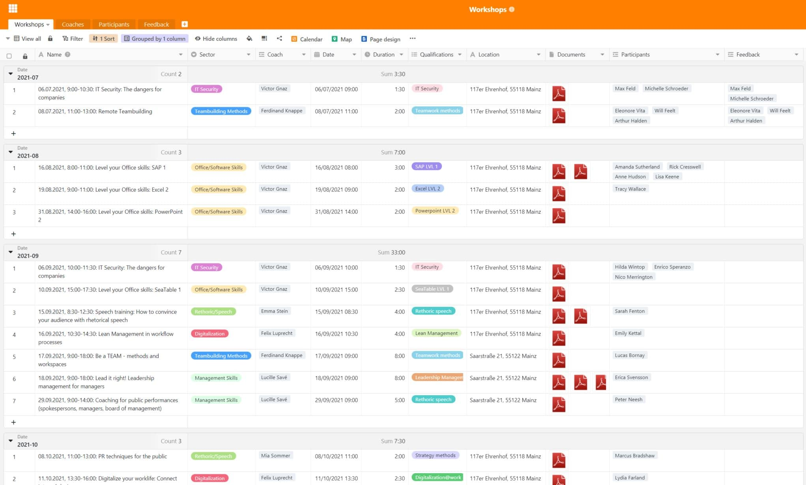
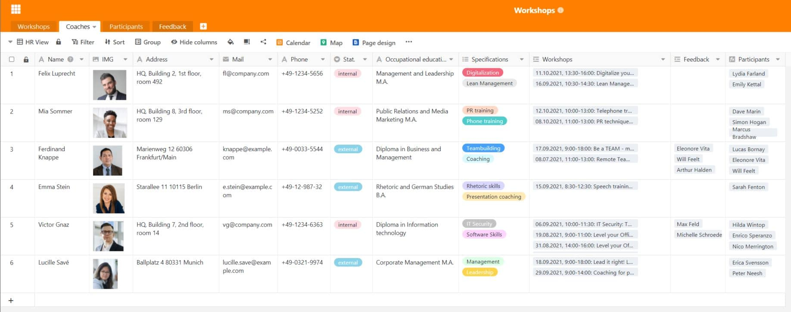
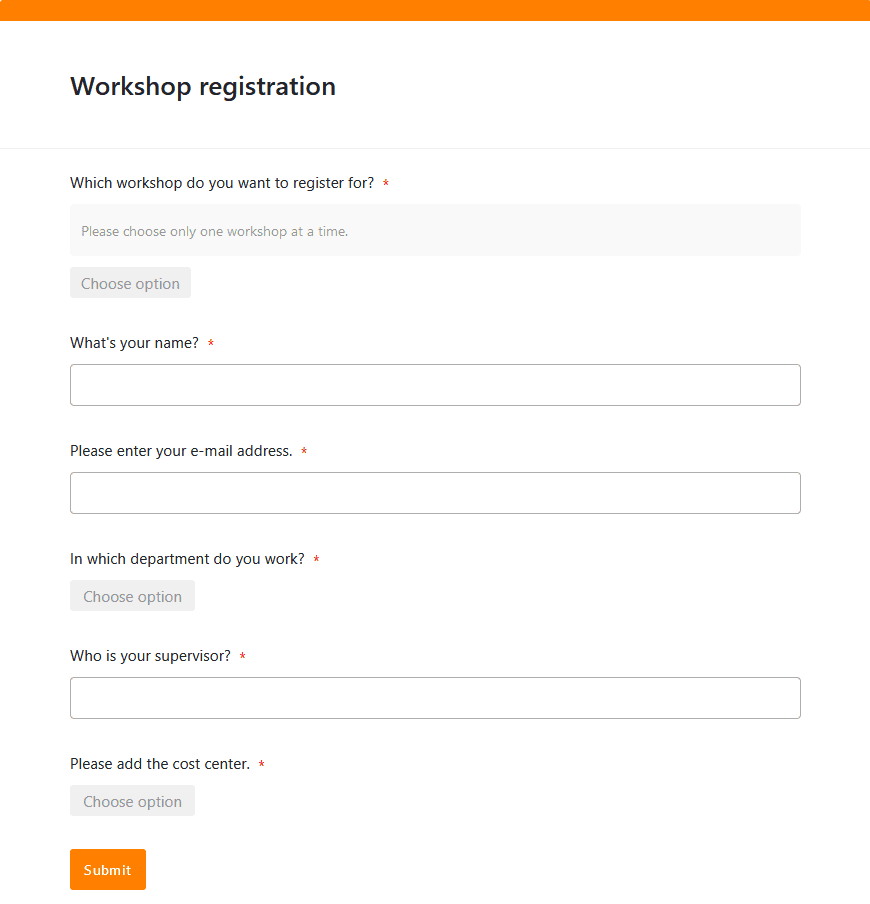
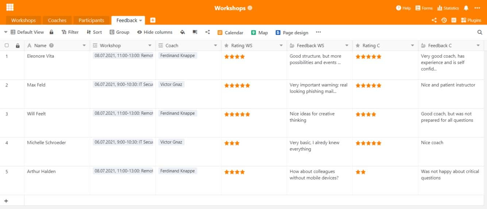

L’apprentissage tout au long de la vie est l’une des choses les plus importantes de nos jours lorsqu’il s’agit de **qualifications professionnelles** et de **développement personnel** . Qu’il s’agisse d’un atelier, d’une formation ou d’une formation continue : en tant qu’employeur, il est essentiel que vous souteniez vos collaborateurs et leur offriez des possibilités de développement. Après tout, il s’agit d’un emploi attrayant pour de nombreux employés aujourd’hui et **votre entreprise bénéficie** à bien des égards d’employés bien formés.

Vous souhaitez **planifier** un **atelier** ou même gérer l'ensemble du **développement du personnel**? Dans ce cas, vous êtes probablement confronté à une tâche colossale, car cela implique beaucoup d'efforts. Cet article vous fournit des informations utiles sur l'**organisation d'ateliers et de formations**. Si vous cherchez un modèle approprié pour la planification de votre atelier, vous le trouverez également ici.

## Pourquoi les ateliers et les formations continues sont importants

Les collaborateurs sont la ressource la plus précieuse d'une entreprise. Il est donc dans votre intérêt de promouvoir vos **ressources humaines** et de rendre ainsi votre entreprise encore plus précieuse. Vous pouvez donc considérer les formations continues, les formations et les ateliers comme un **investissement durable** dans votre entreprise. En effet, les nouvelles compétences et le savoir-faire que vos collaborateurs acquièrent ne profitent pas seulement à eux, mais aussi à l'entreprise.

Selon la complexité du sujet et l'expertise de votre entreprise, vous pouvez soit organiser **des ateliers internes** avec vos collaborateurs, soit faire appel à des spécialistes externes pour une **formation en interne**, soit faire appel à **des formations externes**, par exemple auprès de l'agence pour l'emploi, d'une chambre de commerce et d'industrie ou d'une académie.

**Trois exemples d'ateliers internes pour les collaborateurs :**

- **Onboarding**: les ateliers sont indispensables, surtout pour l'intégration au début, afin de familiariser les nouveaux collaborateurs avec la culture d'entreprise, les processus existants et les applications logicielles.
- **Lean Management**: si vous souhaitez optimiser vos processus d'entreprise, des ateliers ciblés avec vos collaborateurs contribuent à alléger, à améliorer et à rendre plus efficaces les processus de travail.
- **Gestion du changement**: si des changements structurels importants sont prévus dans votre entreprise, des ateliers peuvent vous aider à les faire comprendre petit à petit à vos collaborateurs.

### Les ateliers de travail : Un must pour les employeurs attractifs

Pour vous et vos collaborateurs, les formations continues, les formations et les ateliers présentent bien sûr plusieurs avantages. D'une part, vos collaborateurs élargissent leurs **qualifications** et acquièrent **de nouvelles compétences** qu'ils peuvent utiliser dans leur travail quotidien. Cela fait d'eux des membres précieux de l'équipe, qui grandissent en accomplissant les tâches liées à leurs postes individuels.

D'autre part, vos collaborateurs développent **de meilleures chances de promotion**, car de nouvelles compétences et qualités de direction peuvent élargir leur champ d'action. Cela vous permet de couvrir vos **besoins en personnel qualifié et de direction**, le cas échéant, à partir de votre propre personnel. Enfin, les ateliers constituent également un **changement** passionnant pour les employés lorsqu'il n'y a pas de nouvelles tâches ou de nouveaux projets dans leur travail quotidien.

{{< warning headline="Fidélisation et satisfaction des employés" text="Des formations continues, des formations et des ateliers réguliers peuvent non seulement augmenter la **productivité** et la **capacité d'intervention**, mais aussi la [satisfaction de](https://www.personalwerk.de/hr-wissen/glossaruebersicht/detail/news/mitarbeiterzufriedenheit) vos collaborateurs. Ils se sentent pris au sérieux et considèrent comme un signal positif le fait que vous souhaitiez écouter leur avis, les impliquer dans les changements ou leur offrir la possibilité d'évoluer. Cela renforce l'**attachement des collaborateurs** à l'entreprise et a pour conséquence, à long terme, de réduire le taux de rotation du personnel et de vous faire dépenser moins de temps et d'argent pour la recherche et le recrutement de nouveaux collaborateurs." />}}

## Gérer des ateliers - un jeu d'enfant avec le bon logiciel

La planification, l’organisation et la gestion d’ateliers peuvent rapidement devenir déroutantes dans les grandes entreprises. Il y a **beaucoup de données différentes** à gérer. Pour y parvenir, il est judicieux d’investir dans de bonnes solutions qui réduisent l’effort au minimum. C’est là qu’intervient SeaTable : en tant que **logiciel puissant** avec des fonctions pratiques et très flexibles, SeaTable est un outil idéal pour l’organisation et la gestion d’ateliers.

Avec SeaTable, vous avez toujours une vue d'ensemble de vos ateliers et de vos formations et vous rassemblez toutes les informations en un point central. Vous gérez non seulement vos ateliers, mais aussi les coachs ainsi que les inscriptions et le feedback des participants.

[Le modèle que nous vous proposons gratuitement]() contient quatre tableaux différents qui couvrent les principaux processus de planification d'un atelier.

## Définir le groupe cible et déterminer les besoins

Vous souhaitez faire progresser le développement de votre personnel et proposer de nouvelles possibilités de formation continue ? Le plus important est d'avoir un **échange** étroit **avec les participants potentiels** et de toujours garder à l'esprit à qui s'adresse l'atelier ou la formation continue. Vos cadres doivent-ils recevoir une formation en communication ou votre équipe marketing doit-elle élaborer la nouvelle identité d'entreprise dans le cadre d'un atelier ? Selon le **groupe cible** et **le thème**, un atelier doit être très différent.

Bien entendu, vous devez adapter votre offre aux besoins et déterminer les domaines dans lesquels **un transfert de connaissances** est nécessaire dans votre entreprise. Si votre entreprise est active au niveau international, vos collaborateurs pourraient être très intéressés par un cours d'anglais des affaires qui leur permettrait de rafraîchir leurs **connaissances linguistiques**. Il est probable que tous les nouveaux arrivants aient besoin d'une formation en **sécurité informatique** et d'une introduction aux **applications logicielles** qu'ils utilisent.

Obtenez une vue d'ensemble de tous les ateliers, formations et mesures de formation continue qui ont déjà lieu dans votre entreprise ou pour lesquels il existe un besoin supplémentaire. Pour ce faire, vous pouvez facilement saisir dans une base de données toutes les informations et tous les documents importants relatifs à un atelier. Le lien avec d'autres tableaux permet une attribution directe à un coach.

## Chercher des coachs pour l'atelier

Selon que l'expertise nécessaire sur un sujet est disponible dans votre entreprise, vous pouvez faire appel soit **à vos collaborateurs**, soit à **des experts externes** pour coacher vos ateliers. Vérifiez si les coachs sont aptes à mener un atelier avec le succès souhaité. En outre, vous devriez déposer des informations telles que les coordonnées, la photo et les qualifications des coachs.

Grâce au plugin de conception de pages, il est également possible de créer une **fiche descriptive** avec les données contenues dans le tableau et de l'enregistrer au format PDF.

## Définir la durée et l'ordre du jour de l'atelier

Un atelier sur la façon dont vos employés peuvent [soumettre leurs frais de déplacement et se faire rembourser](https://seatable.io/fr/auslagenerstattung/) ne devrait pas durer plus d’une heure, tandis qu’une séance de formation au leadership peut prendre plusieurs heures par semaine ou des journées complètes. En fonction de la **charge de travail**, le coach doit établir un **ordre du jour** et planifier la quantité de contenu qui peut être enseignée dans le temps. Vous pouvez afficher visuellement les dates des cours avec le **calendrier** et donner à vos employés un aperçu clair des **dates** dans l’aperçu mensuel.

## Réserver un lieu et un traiteur

Où souhaitez-vous que votre atelier ait lieu ? Si votre entreprise dispose de **salles de réunion** suffisamment grandes sur ses sites, c’est une bonne idée d’organiser des ateliers dans vos propres locaux. Cela permet à vos employés d’intégrer facilement les rendez-vous dans leur vie quotidienne au bureau. Pour les ateliers d’une journée complète ou si vous n’avez pas de salles libres au bureau, vous pouvez également louer des salles de conférence dans **des espaces de coworking** ou des **hôtels de conférence** .

Là, vous pouvez réserver la **restauration pour la pause déjeuner** , tandis que vous devez l’organiser vous-même dans les locaux de votre entreprise (si votre site ne dispose pas d’une cantine ou d’une cafétéria). Les petites collations ainsi que les boissons fraîches, le café et le thé sont toujours bien accueillis et satisfont les participants à votre atelier.

## Gérer les inscriptions en ligne

Ensuite, vous devez inviter les participants potentiels et noter qui assiste à quelle date. Si vous avez déjà vos ateliers dans une base de données, il est facile de gérer **les inscriptions** en ligne. Vous pouvez facilement l’implémenter dans SeaTable via un [formulaire Web](https://seatable.io/fr/docs/webformulare/webformulare/) que les participants peuvent utiliser pour s’inscrire à chaque atelier. Cela vous évite d’avoir à envoyer des **invitations à des rendez-vous** par e-mail.

Un tableau rassemble toutes les inscriptions et les données saisies par vos participants. Pratique : Lorsque les participants sélectionnent un atelier, leur inscription est directement attribuée à l’atelier approprié dans le tableau lié.

## Pendant l'atelier : Méthodes et matériel

Selon le thème de l'atelier, différentes méthodes et différents matériaux conviennent pour atteindre les objectifs souhaités :

- La **question des attentes** est indispensable à chaque atelier. Dès le début, demandez à vos participants ce qu’ils attendent de l’atelier et quels aspects doivent absolument être clarifiés. À la fin, relisez vos notes : si vous pouvez cocher tous les points, vous et vos participants pouvez être satisfaits.
- En guise d’introduction, vous pouvez également demander aux participants de lancer des réflexions et des idées sur le thème de l’atelier dans la salle. **Le brainstorming** est plus efficace dans une atmosphère ouverte, exempte de critiques et de préjugés.
- Pour la représentation visuelle et l’organisation des pensées et des idées, une **carte mentale** est recommandée. Vous pouvez les écrire sur un tableau noir ou un tableau à feuilles mobiles, ou sur des cartes en papier que vous accrochez au mur. Pour un atelier en ligne, par exemple, vous pouvez utiliser un [tableau Miro](https://miro.com/) .
- **Les jeux de rôle interactifs** sont idéaux pour la formation au leadership, par exemple, car vous pouvez adopter le point de vue de différents membres de l’équipe et vous entraîner à gérer les conflits.
- Une autre méthode pour examiner un sujet sous différents angles est **les 6 chapeaux de la pensée de de Bono** . Vous divisez les participants en six groupes : le chapeau blanc représente les faits, le rouge les émotions, le jaune les opportunités, le noir les risques, le vert les idées et le bleu les structures.



## Créer des certificats

Pour **certifier la participation à l’atelier**, vous pouvez délivrer un certificat à chaque participant. Avec le [plugin de conception de page](https://seatable.io/fr/docs/seitendesign-plugin/anleitung-zum-seitendesign-plugin/) de SeaTable, vous pouvez vous épargner beaucoup de travail. Le plugin utilise les informations déjà saisies dans le tableau et peut les insérer individuellement dans la mise en page du certificat de participation pour chaque participant. À l’aide d’un bouton, vous pouvez créer des documents personnalisés d’une simple pression sur un bouton et les enregistrer au format PDF.

## Demander un feedback sur l'atelier et l'évaluer

Que seraient les ateliers et les formations continues sans feedback ? Pour l'évaluation, vous pouvez soit utiliser **des formulaires papier** que vous faites remplir par les participants à la fin de l'atelier, soit miser à nouveau sur un **formulaire web**. Ce dernier présente l'avantage que les participants saisissent directement l'évaluation sous forme numérique. Ainsi, le feedback est toujours lisible et immédiatement lié aux ateliers et aux coachs. Les participants peuvent évaluer l'atelier et le coach aussi bien sur une échelle de notation que dans des champs de texte libre.

Vous pouvez facilement **évaluer** les commentaires recueillis dans SeaTable, par exemple en affichant la médiane ou la moyenne d’une [colonne d’évaluation](https://seatable.io/fr/docs/auswahlspalten/die-rating-spalte/) dans la [barre d’état](https://seatable.io/fr/docs/ansichtsoptionen/die-status-zeile-und-ihre-funktionen/) ou en utilisant les réponses ouvertes dans les [colonnes de texte](https://seatable.io/fr/docs/text-und-zahlen/die-spalten-text-und-formatierter-text/) pour le développement ultérieur des ateliers. S’il y a une quantité notable de **critiques** à l’égard d’un cours, le formateur peut soit apporter des améliorations, soit être remplacé. Si, par exemple, il y a souvent des commentaires indiquant que des aspects importants ont été manqués, cela pourrait indiquer que vous devriez leur donner plus de temps et prolonger l’atelier. Vous pouvez également créer un nouvel atelier qui se concentre sur ces aspects pour répondre aux besoins de vos participants.

## Conclusion : Planifier un atelier avec SeaTable

Avec SeaTable, vous pouvez représenter chaque processus lié à la planification d'un atelier et gérer toutes les données sans effort. L'objectif est toujours d'être le plus efficace possible pour vous, vos collaborateurs et les autres personnes concernées. D'autres tableaux et processus sont également envisageables, que vous pouvez compléter de manière flexible en fonction de vos besoins, comme par exemple la réservation de salles de réunion ou un inventaire de votre matériel.

[Inscrivez-vous]() gratuitement dès aujourd’hui et essayez notre [modèle]() tout de suite ! Les fonctions peuvent être utilisées pour une variété d’autres cas d’utilisation.
