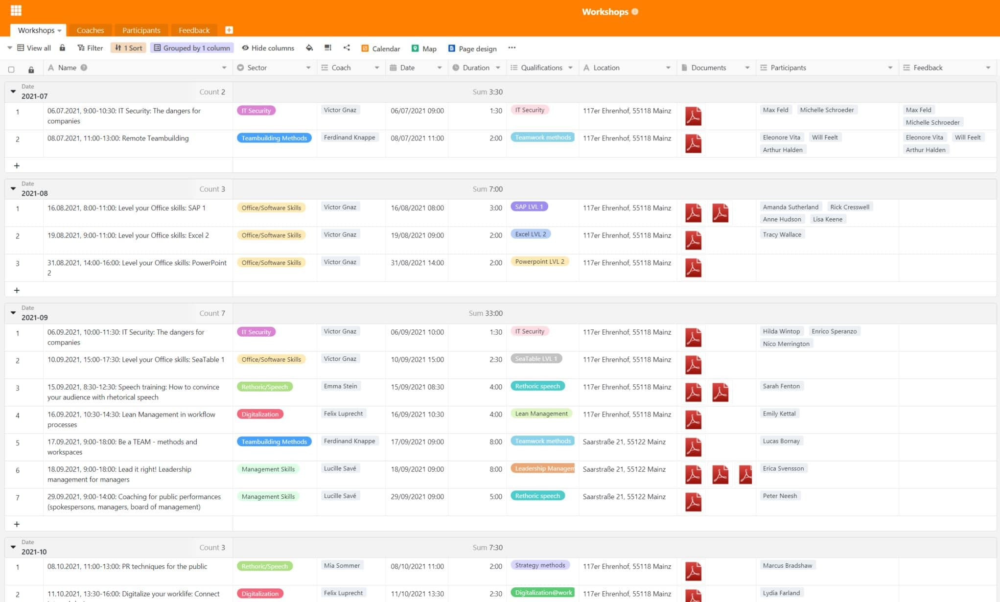
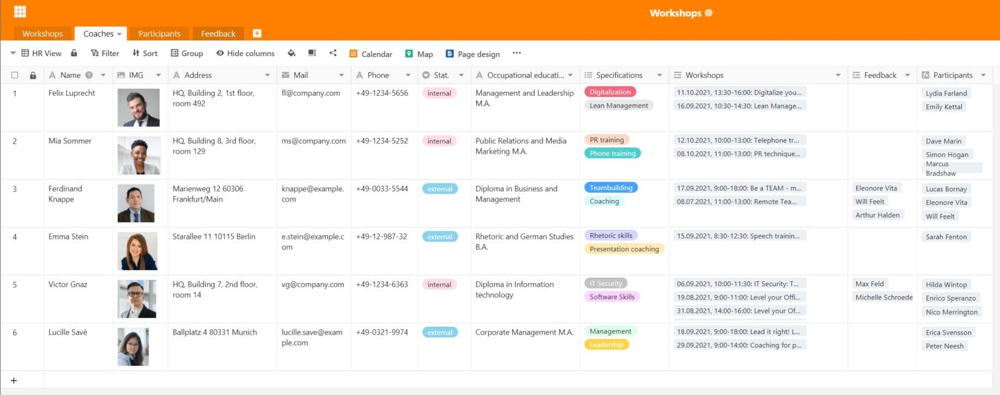
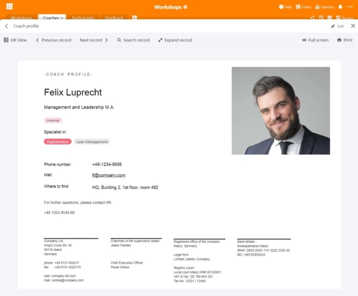
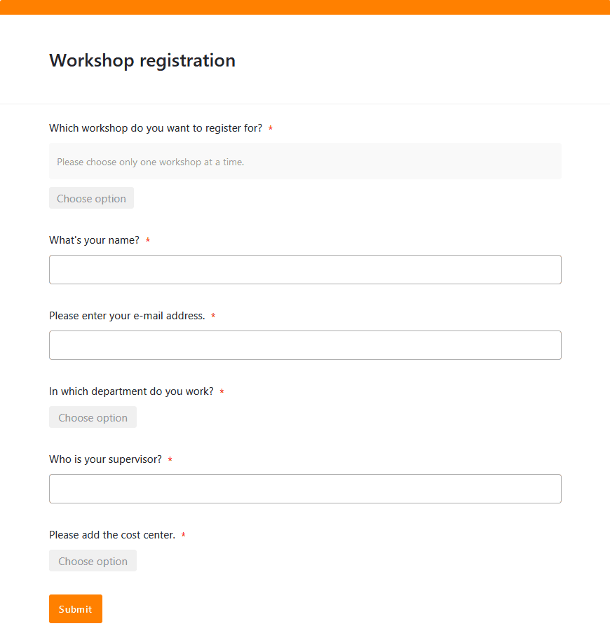
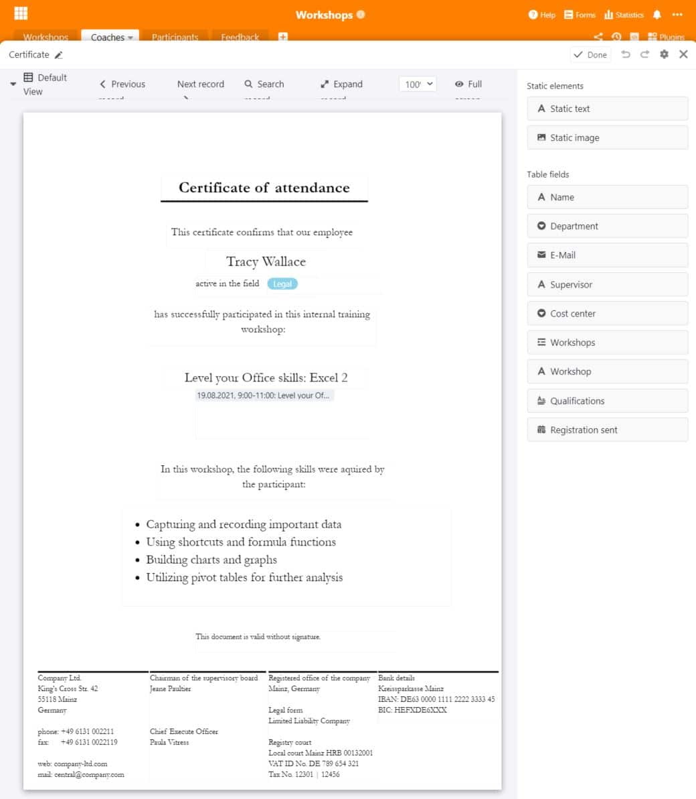
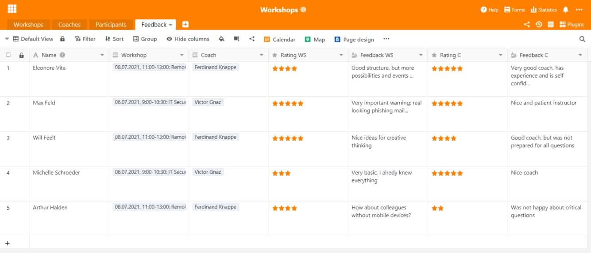

Atualmente, a aprendizagem ao longo da vida é um dos aspetos mais importantes no que diz respeito às **qualificações profissionais** e ao **desenvolvimento pessoal**. Quer se trate de um workshop, de uma formação ou de um curso superior: Como empregador, é essencial que apoie os seus empregados e lhes ofereça oportunidades de desenvolvimento. Hoje em dia, para muitos trabalhadores, isto faz parte de um emprego atrativo e **a sua empresa beneficia** de muitas formas com trabalhadores bem formados.

Gostaria de **planear** um **workshop** ou mesmo de gerir todo o programa **de desenvolvimento do pessoal**? Então, provavelmente, está a enfrentar uma tarefa gigantesca, porque envolve muito esforço. Este artigo fornece-lhe informações úteis sobre a **organização de workshops e cursos de formação**. Se estiver à procura de um modelo adequado para o planeamento do seu workshop, também o encontrará aqui.

## Porque é que os workshops e a formação contínua são importantes

Os trabalhadores são o recurso mais valioso de uma empresa. Por conseguinte, é do seu interesse desenvolver os seus [recursos humanos]() e, assim, tornar a sua empresa ainda mais valiosa. A educação contínua, a formação e os workshops podem, por isso, ser vistos como um [investimento]() sustentável na sua empresa. Afinal de contas, as novas competências e conhecimentos que os seus empregados adquirem não só os beneficiarão a eles, mas também à empresa.

Consoante a complexidade do tema e os conhecimentos da sua empresa, pode organizar **workshops internos** com os seus empregados, recorrer a peritos externos para **formação interna** ou tirar partido de **cursos de formação externos**, por exemplo, na Agência Federal de Emprego, numa Câmara de Indústria e Comércio ou numa academia.

### Três exemplos de workshops internos para trabalhadores

- [Integração](): Os workshops são essenciais, especialmente para a formação inicial, para familiarizar os novos funcionários com a cultura da empresa, os processos existentes e as aplicações de software.
- **Gestão Lean**: Se pretende otimizar os seus processos empresariais, os workshops orientados para os seus empregados ajudam a racionalizar e a melhorar os fluxos de trabalho, tornando-os mais eficientes.
- [Gestão da mudança](): Se estiverem iminentes grandes mudanças estruturais na sua empresa, os workshops podem ajudar a familiarizar os empregados com essas mudanças, passo a passo.

### Workshops: Um elemento indispensável para empregadores atrativos

A formação contínua, os cursos e os workshops têm, naturalmente, uma série de vantagens para si e para os seus colaboradores. Por um lado, os seus empregados aumentam as suas **qualificações** e aprendem **novas competências** que podem utilizar no seu trabalho quotidiano. Isto torna-os membros valiosos da equipa que crescem com as tarefas nas suas posições individuais.

Por outro lado, os seus empregados têm **melhores perspetivas de promoção**, uma vez que as novas competências e qualidades de liderança podem alargar o seu campo de trabalho. Isto permite-lhe cobrir a [necessidade de especialistas e gestores]() da sua própria força de trabalho, se necessário. E, por último, mas não menos importante, os workshops são também uma **mudança de ritmo** estimulante para os empregados quando não há novas tarefas e projetos no seu trabalho diário.



A formação contínua, os cursos e os workshops regulares podem não só aumentar a **produtividade** e a **empregabilidade**, mas também a satisfação dos seus empregados. Eles sentem-se levados a sério e veem como um sinal positivo o facto de querer ouvir a sua opinião, envolvê-los em mudanças ou oferecer-lhes a oportunidade de se desenvolverem mais. Isto reforça **a lealdade dos empregados** à empresa e, a longo prazo, reduz a rotação do pessoal, o que significa que tem de gastar menos tempo e dinheiro a [procurar e a recrutar novos empregados]().



## Gerir workshops – uma tarefa fácil com o software certo

O planeamento, a organização e a gestão de workshops podem tornar-se rapidamente confusos nas grandes empresas. Há **muitos dados diferentes** para gerir. Por isso, faz sentido investir em boas soluções que minimizem o esforço envolvido. É aqui que entra o SeaTable: Sendo um **software poderoso** com funções práticas e altamente flexíveis, o SeaTable é a ferramenta ideal para a organização e gestão de workshops.

Com o SeaTable, tem sempre uma visão geral dos seus workshops e programas de formação e pode agrupar todas as informações num ponto de recolha central. Não só gere os seus workshops, como também os coaches, as inscrições e o feedback dos participantes.



[O nosso modelo gratuito]() para si contém quatro quadros diferentes que abrangem os processos mais importantes no planeamento de workshops.

## Definir o grupo-alvo e determinar as necessidades

Gostaria de promover o desenvolvimento do seu pessoal e oferecer novas oportunidades de formação? O mais importante é manter um **diálogo** estreito **com os potenciais participantes** e ter sempre em mente a quem se destina o workshop ou o curso de formação. Os seus gestores devem receber formação em comunicação ou a sua equipa de marketing deve desenvolver a nova identidade da empresa num workshop? Dependendo do **grupo-alvo** e do **tópico**, um workshop tem de ter um aspeto completamente diferente.

Naturalmente, deve adaptar a sua oferta às suas necessidades e identificar as áreas em que a **transferência de conhecimentos** é necessária na sua empresa. Se a sua empresa opera a nível internacional, os seus empregados podem estar muito interessados num curso de inglês comercial para aperfeiçoar as suas **competências linguísticas**. Todos os recém-chegados precisarão provavelmente de formação em **segurança informática** e de uma introdução às **aplicações informáticas** que utilizam.

Obtenha uma visão geral de todos os workshops, cursos de formação e medidas de formação contínua que já estão a decorrer na sua empresa ou para os quais existe uma procura adicional. Pode registar facilmente todas as informações e documentos importantes relacionados com um workshop numa [base de dados](). A ligação a outras tabelas permite a atribuição direta a um coach.

## Encontrar coaches para o workshop

Dependendo do facto de a sua empresa dispor dos conhecimentos necessários sobre um determinado tópico, pode recrutar **os seus empregados** ou **peritos externos** como coaches para os seus workshops. Verifique se os coaches são adequados para conduzir um workshop com o sucesso desejado. Deve também fornecer informações como os dados de contacto, fotografia e qualificações dos coaches.

Com o plugin de conceção de páginas, também é possível criar um **perfil** com os dados contidos na tabela e guardá-lo em formato PDF.

## Determinar a duração e a ordem de trabalhos do workshop

Um workshop sobre a forma como os seus empregados podem [apresentar as despesas de deslocação e ser reembolsados]() não deve demorar mais de uma hora, ao passo que um programa de formação em gestão pode demorar várias horas por semana ou mesmo dias inteiros. Em função do **volume de trabalho**, o coach deve estabelecer uma **agenda** e planear a quantidade de conteúdos que podem ser abordados no tempo disponível. Pode utilizar o **calendário** para visualizar as **datas** dos cursos e dar aos seus empregados uma visão clara das datas na visão geral mensal.

## Reservar o local e o catering

Onde deve ser realizado o seu workshop? Se a sua empresa dispuser de **salas de reunião** suficientemente grandes nas suas instalações, é aconselhável realizar workshops nas suas próprias instalações. Desta forma, é mais fácil para os seus empregados integrarem os eventos na sua rotina diária de trabalho. Para workshops de um dia inteiro ou se não tiver salas livres no escritório, pode também alugar salas de conferência em **espaços de co-working** ou **hotéis de conferências**.

Pode reservar aí o **catering para a pausa para o almoço**, ao passo que tem de ser você a organizá-lo nas instalações da sua empresa (a menos que o seu local de trabalho tenha uma cantina ou refeitório). Pequenos lanches, bem como bebidas frias, café e chá são sempre bem recebidos e mantêm os participantes do workshop satisfeitos.

## Gerir as inscrições em linha

Em seguida, é necessário convidar os potenciais participantes e tomar nota de quem vai participar em cada evento. Se já registou os seus workshops numa base de dados, é fácil gerir **as inscrições** em linha. Pode fazê-lo sem esforço no SeaTable, utilizando um [formulário Web]() que os participantes podem utilizar para se inscreverem em cada workshop. Isto evita que tenha de enviar **convites** por correio eletrónico.

Uma tabela reúne todas as inscrições e os dados introduzidos pelos participantes. Prático: Quando os participantes selecionam um workshop, a sua inscrição é diretamente atribuída ao workshop correto na tabela associada.

## Durante o workshop: Métodos e materiais

Dependendo do tema do workshop, diferentes métodos e materiais são adequados para alcançar os objetivos desejados:

- **Perguntar sobre as expectativas** é uma obrigação para qualquer workshop. Pergunte aos participantes logo no início o que esperam do workshop e quais os aspetos que devem, sem falta, ser esclarecidos. No fim, olhe para as suas notas: se conseguir assinalar todos os pontos, você e os seus participantes podem ficar satisfeitos.
- Como introdução, pode também pedir aos participantes que lancem na sala pensamentos e ideias sobre o tema do workshop. **O brainstorming** é mais eficaz num ambiente aberto, livre de críticas e preconceitos.
- Um **mapa mental** é recomendado para visualizar e organizar pensamentos e ideias. Pode escrevê-los num quadro negro ou flipchart ou em cartões de papel que pendura na parede. Para um workshop em linha, pode utilizar um [quadro miro](https://miro.com/), por exemplo.
- As **dramatizações interativas** são ideais para a formação em gestão, por exemplo, porque é possível assumir a perspetiva de diferentes membros da equipa e praticar a gestão de conflitos.
- Outro método que permite analisar um tópico de diferentes perspetivas é o dos **6 chapéus do pensamento** de De Bono. Divida os participantes em seis grupos: O chapéu branco representa os factos, o chapéu vermelho as emoções, o chapéu amarelo as oportunidades, o chapéu preto os riscos, o chapéu verde as ideias e o chapéu azul as estruturas.



## Criar certificados

Para **certificar a participação no workshop**, pode emitir um certificado para cada participante. O [plugin de design de páginas]() do SeaTable poupa-lhe muito trabalho. O plugin utiliza as informações já introduzidas na tabela e pode inseri-las individualmente para cada participante no layout do certificado de presença. Com a ajuda de um botão, pode criar documentos personalizados com o toque de um botão e guardá-los em formato PDF.

## Obter e avaliar o feedback sobre o workshop

O que seria dos workshops e dos programas de formação sem feedback? Pode utilizar **formulários em papel** para a avaliação, que os participantes devem preencher no final do workshop, ou pode utilizar novamente um **formulário Web**. Esta opção tem a vantagem de os participantes poderem introduzir a avaliação diretamente em formato digital. Isto significa que o feedback é sempre legível e imediatamente associado aos workshops e aos coaches. Os participantes podem avaliar o workshop e o coach numa escala de classificação e em campos de texto livre.

Pode **analisar** facilmente o feedback recolhido no SeaTable, por exemplo, apresentando a mediana ou a média de uma [coluna de classificação]() na [barra de estado]() ou utilizando as respostas abertas nas [colunas de texto]() para desenvolver mais os workshops. Se houver uma quantidade considerável de **críticas** a um curso, o coach pode fazer melhorias ou ser substituído. Por exemplo, se houver um feedback frequente de que faltam aspetos importantes, isso pode ser uma indicação de que lhes deve dar mais tempo e prolongar o workshop. Também pode criar um novo workshop que se concentre precisamente nesses aspetos e que, assim, satisfaça as necessidades dos seus participantes.

## Conclusão: Planear um workshop com o SeaTable

Com o SeaTable, pode mapear todos os processos relacionados com o planeamento de workshops e gerir todos os dados sem esforço. O objetivo é sempre maximizar a eficiência para si, para os seus colaboradores e para os outros participantes. Também são possíveis outras tabelas e processos, que pode adicionar de forma flexível de acordo com as suas necessidades, como a reserva de salas de reunião ou uma lista de inventário dos seus materiais.



[Registe-se]() gratuitamente hoje e experimente o nosso [modelo]() imediatamente! As funções podem ser utilizadas para uma variedade de outras aplicações.
