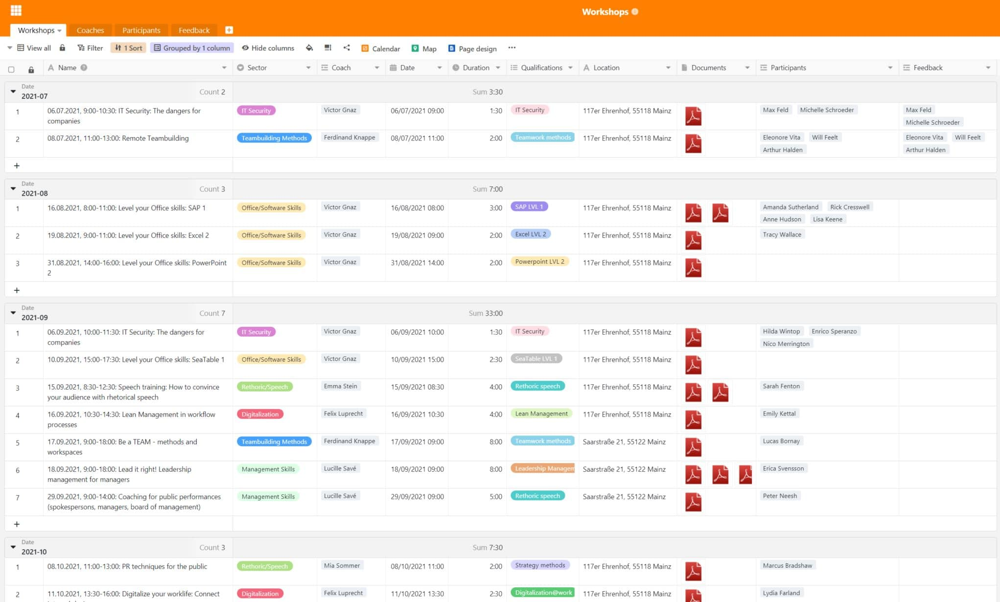
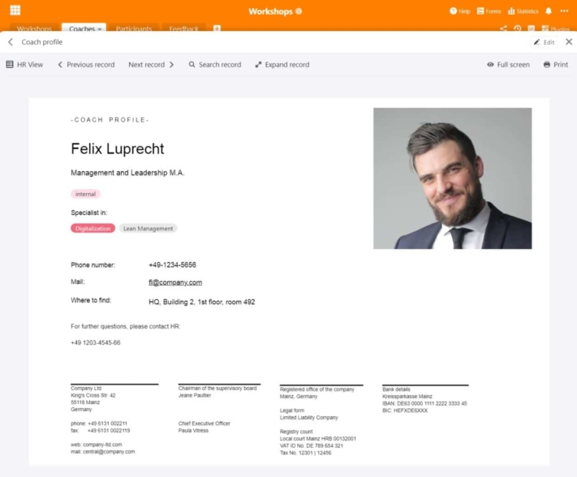
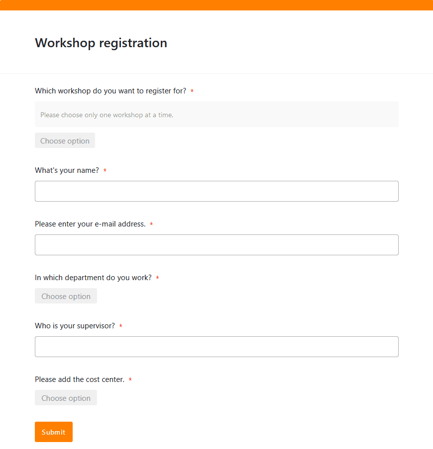
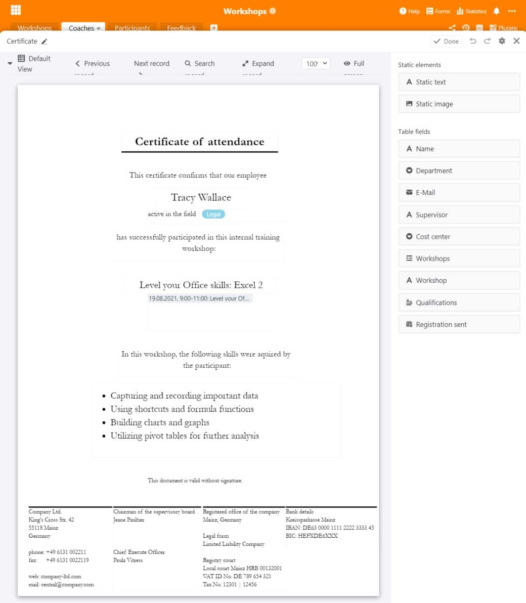

В наши дни обучение в течение всей жизни - одна из самых важных вещей, когда речь идет о **профессиональной квалификации** и **личном развитии**. Будь то семинар, тренинг или дальнейшее образование: Как работодатель, вы должны поддерживать своих сотрудников и предлагать им возможности для дальнейшего развития. Для многих сотрудников сегодня это является частью привлекательной работы, и **ваша компания** во многом выигрывает от хорошо обученных сотрудников.

Хотите **спланировать семинар** или даже управлять всей программой **развития персонала**? Тогда перед вами наверняка стоит непростая задача, поскольку она требует больших усилий. В этой статье вы найдете полезную информацию об **организации семинаров и тренингов**. Если вы ищете подходящий шаблон для планирования семинара, вы также найдете его здесь.

## Почему важны семинары и дальнейшее обучение

Сотрудники - это самый ценный ресурс компании. Поэтому в ваших интересах развивать свои **кадры** и тем самым делать компанию еще более ценной. Поэтому повышение квалификации, тренинги и семинары можно рассматривать как **стабильные инвестиции** в вашу компанию. Ведь новые навыки и знания, которые приобретают ваши сотрудники, пойдут на пользу не только им, но и компании.

В зависимости от сложности темы и опыта вашей компании вы можете проводить **внутренние семинары** с сотрудниками, привлекать внешних экспертов для **внутреннего обучения** или воспользоваться **внешними учебными курсами**, например, в Федеральном агентстве по трудоустройству, Торгово-промышленной палате или академии.

**Три примера внутренних семинаров для сотрудников:**

- **Ввод в должность**: семинары необходимы, особенно для первоначального обучения, чтобы ознакомить новых сотрудников с корпоративной культурой, существующими процессами и программными приложениями.
- **Бережливое управление**: если вы хотите оптимизировать свои бизнес-процессы, целевые семинары с сотрудниками помогут упорядочить и улучшить рабочие процессы и сделать их более эффективными.
- **Управление изменениями**: если в вашей компании грядут серьезные структурные изменения, семинары помогут пошагово ознакомить сотрудников с ними.

### Семинары: Обязательное условие для привлекательных работодателей

Повышение квалификации, курсы и семинары, естественно, имеют ряд преимуществ для вас и ваших сотрудников. С одной стороны, ваши сотрудники повышают свою **квалификацию** и приобретают **новые навыки**, которые они могут использовать в своей повседневной работе. Это делает их ценными членами команды, которые растут вместе с задачами на своих должностях.

Во-вторых, у ваших сотрудников **улучшаются перспективы продвижения по службе**, поскольку новые навыки и лидерские качества могут расширить сферу их деятельности. Это позволит вам при необходимости покрыть **потребность в специалистах и руководителях** за счет собственных сотрудников. И последнее, но не менее важное: семинары - это еще и увлекательная **перемена** для сотрудников, когда в их повседневной работе нет новых задач и проектов.

{{< warning headline="Лояльность и удовлетворенность сотрудников" text="Регулярное повышение квалификации, тренинги и семинары могут не только повысить **производительность** и **трудоспособность**, но и удовлетворенность ваших сотрудников. Они чувствуют, что к ним относятся серьезно, и воспринимают как позитивный сигнал, когда вы хотите услышать их мнение, вовлечь их в изменения или предложить им возможность дальнейшего развития. Это повышает **лояльность сотрудников** к компании, а в долгосрочной перспективе снижает текучесть кадров и означает, что вам придется тратить меньше времени и денег на поиск и найм новых сотрудников." />}}

## Управление семинарами - проще простого с помощью правильного программного обеспечения

Планирование, организация и управление семинарами может быстро запутаться в больших компаниях. Приходится управлять **множеством различных данных**. Поэтому имеет смысл инвестировать в хорошие решения, которые минимизируют усилия. Именно здесь на помощь приходит SeaTable: **Мощное программное обеспечение** с практичными и очень гибкими функциями, SeaTable является идеальным инструментом для организации и управления семинарами.

С помощью SeaTable вы всегда будете иметь представление о своих семинарах и учебных программах и сможете собрать всю информацию в одном месте. Вы управляете не только семинарами, но и тренерами, регистрацией и отзывами участников.

[Наш бесплатный шаблон]() содержит четыре различных таблицы, которые охватывают наиболее важные процессы при планировании семинара.

## Определите целевую группу и определите потребности

Хотите ускорить развитие своего персонала и предложить новые возможности для обучения? Самое главное, чтобы вы вели тесный **диалог с потенциальными участниками** и всегда помнили о том, на кого рассчитан семинар или тренинг. Должны ли ваши менеджеры пройти тренинг по коммуникации или команда маркетологов разработать новый фирменный стиль на семинаре? В зависимости от **целевой группы** и **темы** семинар должен выглядеть совершенно по-разному.

Конечно, вы должны адаптировать свое предложение к вашим потребностям и определить, где в вашей компании требуется **передача знаний**. Если ваша компания работает на международном уровне, то вашим сотрудникам может быть интересен курс делового английского, чтобы подтянуть свои **языковые навыки**. Всем новым сотрудникам, скорее всего, понадобится обучение по **информационной безопасности** и знакомство с **программными приложениями**, которые они используют.

Получите обзор всех семинаров, учебных курсов и мероприятий по повышению квалификации, которые уже проводятся в вашей компании или на которые есть дополнительный спрос. Вы можете легко занести всю важную информацию и документы, относящиеся к семинару, в базу данных. Связь с другими таблицами позволяет напрямую назначить тренера.

## Найдите тренеров для семинара

В зависимости от того, есть ли в вашей компании необходимые знания и опыт по той или иной теме, вы можете привлекать для проведения семинаров либо **своих сотрудников**, либо **внешних экспертов** в качестве тренеров. Убедитесь, что тренеры подходят для проведения семинара с желаемым успехом. Вы также должны предоставить такую информацию, как контактные данные, фото и квалификацию тренеров.

С помощью плагина для оформления страниц можно также создать **профиль** с данными, содержащимися в таблице, и сохранить его в формате PDF.

## Определите продолжительность и повестку дня семинара

Семинар о том, как ваши сотрудники могут [представлять командировочные расходы и получать их компенсацию](), не должен занимать более часа, в то время как программа обучения руководителей может занимать несколько часов в неделю или даже целые дни. В зависимости от **объема работы** тренер должен составить **повестку дня** и спланировать, сколько материалов можно охватить за отведенное время. Вы можете использовать **календарь** для визуализации **дат** курсов и дать своим сотрудникам четкое представление о них в ежемесячном обзоре.

## Забронируйте место и кейтеринг

Где должен проходить ваш семинар? Если ваша компания располагает достаточно большими **конференц-залами**, целесообразно проводить семинары на своей территории. Так вашим сотрудникам будет проще интегрировать мероприятия в повседневную офисную рутину. Для проведения семинаров в течение всего дня или если в офисе нет свободных помещений, вы можете арендовать конференц-залы в **коворкинг-пространствах** или **конференц-отелях**.

Там вы можете заказать **питание на обеденный перерыв**, в то время как на территории вашей компании вам придется организовывать его самостоятельно (если только на вашем предприятии нет столовой или кафетерия). Небольшие закуски, а также прохладительные напитки, кофе и чай всегда хорошо воспринимаются и радуют участников семинара.

## Управление регистрациями в режиме онлайн

Затем вам нужно пригласить потенциальных участников и записать, кто на каком мероприятии присутствует. Если вы уже зарегистрировали свои семинары в базе данных, вам будет легко управлять **регистрацией** в режиме онлайн. Это можно легко сделать в SeaTable с помощью [веб-формы](), которую участники могут использовать для регистрации на каждый семинар. Это избавит вас от необходимости рассылать **приглашения** по электронной почте.

В таблице собраны все регистрации и данные, введенные вашими участниками. Практика: Когда участники выбирают семинар, их регистрация напрямую относится к нужному семинару в связанной таблице.

## Во время семинара: Методы и материалы

В зависимости от темы мастер-класса для достижения поставленных целей подходят различные методы и материалы:

- **Спросите об ожиданиях** - это обязательное условие каждого семинара. В самом начале спросите участников, чего они ожидают от семинара и какие моменты следует обязательно прояснить. В конце просмотрите свои записи: если вам удалось отметить все пункты, вы и ваши участники можете быть довольны.
- В качестве вступления можно также попросить участников разбросать по комнате мысли и идеи по теме семинара. **Мозговой штурм** наиболее эффективен в открытой атмосфере, свободной от критики и предрассудков.
- Для визуализации и упорядочивания мыслей и идей рекомендуется использовать **карту ума**. Вы можете написать их на доске или флипчарте или на бумажных карточках, которые вы повесите на стену. Для онлайн-семинара можно использовать, например, [доску Миро](https://miro.com/).
- **Интерактивные ролевые игры** идеально подходят, например, для тренингов по менеджменту, поскольку вы можете взять на себя роль разных членов команды и попрактиковаться в разрешении конфликтов.
- Еще один метод, позволяющий проанализировать тему с разных точек зрения, - " **6 шляп мышления** " де Боно. Вы делите участников на шесть групп: Белая шляпа - факты, красная - эмоции, желтая - возможности, черная - риски, зеленая - идеи и синяя - структуры.



## Создание сертификатов

Чтобы **подтвердить участие в семинаре**, вы можете выдать сертификат каждому участнику. [Плагин оформления страниц]() в SeaTable сэкономит вам много работы. Плагин использует уже введенную в таблицу информацию и может вставить ее индивидуально для каждого участника в макет сертификата посещаемости. С помощью кнопки вы можете создавать персонализированные документы одним нажатием и сохранять их в формате PDF.

## Получение и оценка отзывов о семинаре

Что бы представляли собой семинары и учебные программы без обратной связи? Для оценки можно использовать либо **бумажные формы**, которые участники заполняют в конце семинара, либо **веб-форму**. Преимущество такой формы в том, что участники могут вводить оценку непосредственно в цифровой форме. Это означает, что отзывы всегда читаемы и сразу же связаны с семинарами и тренерами. Участники могут оценить семинар и тренера как по шкале оценок, так и в свободных текстовых полях.

Вы можете легко **проанализировать** собранные отзывы в SeaTable, например, отобразить медиану или среднее значение в [колонке рейтинга]() в [строке состояния]() или использовать открытые ответы в [текстовых колонках]() для дальнейшего развития семинаров. Если в адрес курса поступает много **критики**, тренер может либо внести улучшения, либо быть заменен. Например, если в отзывах часто говорится о том, что важные аспекты упущены, это может быть признаком того, что вам следует уделить ему больше времени и продлить семинар. Вы также можете создать новый семинар, который будет сфокусирован именно на этих аспектах и таким образом удовлетворит потребности ваших участников.

## Заключение: Планирование семинара с помощью SeaTable

С помощью SeaTable вы можете отобразить все процессы, связанные с планированием семинаров, и управлять всеми данными без особых усилий. В центре внимания всегда находится максимальная эффективность для вас, ваших сотрудников и других участников. Вы можете создавать и другие таблицы и процессы, которые можно гибко дополнять в соответствии с вашими требованиями, например, бронирование переговорных комнат или инвентаризационный список материалов.

[Зарегистрируйтесь]() бесплатно и попробуйте наш [шаблон]() прямо сейчас! Функции могут быть использованы для множества других приложений.
