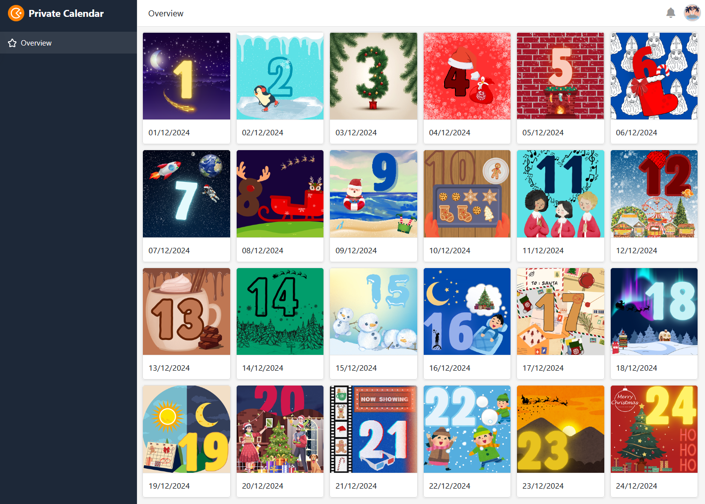

La Navidad está a la vuelta de la esquina y la expectación es cada vez mayor. Pero antes de que el gran regalo aguarde en Nochebuena, aún queda una puertecita por abrir cada día del calendario de Adviento.

¿Le gustaría hacer calendarios de Adviento personalizados para sus seres queridos y llenarlos de pequeños regalos? ¿O prefiere un calendario de adviento digital para compartirlo con familiares, amigos o compañeros de trabajo? La plantilla de calendario de adviento de SeaTable le ayudará con todo esto.

Crea una vista para cada persona a la que quieras sorprender con un calendario de adviento y piensa qué sorpresa debe esconderse detrás de cada puerta (tabla 2). Facilítate la compra de los rellenos del calendario y deja que SeaTable calcule el número de regalos que necesitas (tabla 3). También hay un refrán navideño y un vídeo de YouTube para descubrir detrás de cada puerta. Con la ayuda de una app, podrás mostrar las fotos de todas las puertecitas en una bonita galería.

También hemos creado un calendario de adviento digital para empresas, en el que cada puerta esconde una idea navideña con la que puedes sorprender a tus empleados o clientes (Tabla 1). Déjate inspirar y utiliza nuestra plantilla con app incluida para crear un calendario de adviento digital para tu empresa.

Sólo tienes que compartir el enlace a tu calendario digital de Adviento con familiares, amigos y compañeros de trabajo, ¡y contagiar el espíritu navideño! Encontrará más consejos e ideas en los artículos de nuestro blog:

Haz tu propio calendario de Adviento: 24 ideas para rellenarlo

Regalos de Navidad para sus empleados y clientes

## Plantilla interactiva

Desplácese por nuestra plantilla incrustada interactivamente o lea la descripción haciendo clic en el símbolo i que aparece tras el nombre de la plantilla. Esto le dará una mejor idea de las funciones. Si tiene alguna pregunta o problema, le recomendamos que utilice nuestrasección de ayuda.
