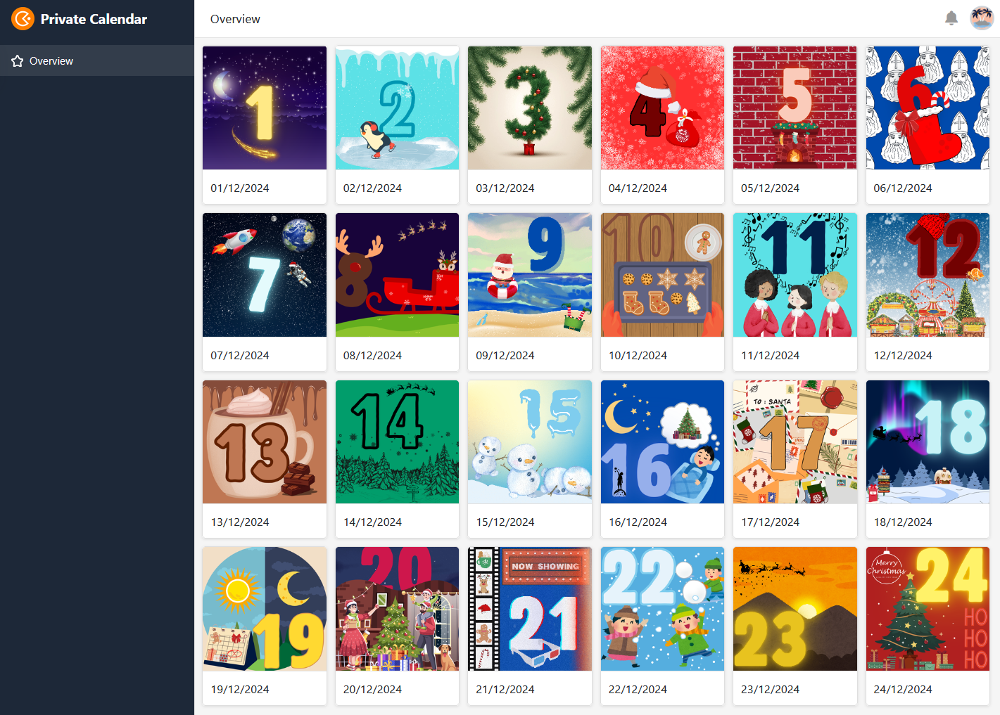

O Natal está mesmo ao virar da esquina e a expetativa é cada vez maior. Mas antes do grande presente que o espera na véspera de Natal, há ainda uma pequena porta para abrir todos os dias no calendário do Advento.

Gostaria de fazer calendários do Advento personalizados para os seus entes queridos e enchê-los com pequenos presentes? Ou prefere um calendário do advento digital para partilhar com a família, amigos ou colegas? O modelo de calendário do advento da SeaTable ajudá-lo-á em tudo isto!

Crie uma vista para cada pessoa que pretende surpreender com um calendário do advento e pense que surpresa deve ser escondida atrás de que porta (quadro 2). Facilite a compra dos recheios do calendário e deixe o SeaTable calcular o número de presentes necessários (quadro 3). Há também um ditado de Natal e um vídeo do YouTube para descobrir atrás de cada porta. Com a ajuda de uma aplicação, pode apresentar as imagens de todas as portinhas numa bela galeria.

Também criámos um calendário do advento digital para empresas, em que cada porta esconde uma ideia de Natal que pode utilizar para surpreender os seus empregados ou clientes (Quadro 1). Deixe-se inspirar e utilize o nosso modelo, incluindo a aplicação, para criar um calendário do advento digital para a sua empresa.

Basta partilhar a ligação para o seu calendário do Advento digital com a família, amigos e colegas e espalhar o espírito natalício! Pode encontrar mais dicas e ideias nos artigos do nosso blogue:

Faça o seu próprio calendário do Advento: 24 ideias para preencher

Presentes de Natal para os seus empregados e clientes

## Modelo interativo

Percorra o nosso modelo incorporado de forma interactiva ou leia a descrição clicando no símbolo i a seguir ao nome do modelo. Isto dar-lhe-á uma melhor noção das funções. Se tiver dúvidas ou problemas, recomendamos que utilize a nossasecção de ajuda.
