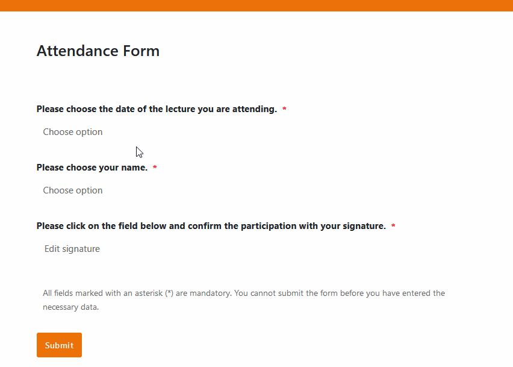

¿Ofrece cursos de salud y deporte? ¿Trabaja en un centro educativo o planifica otros eventos presenciales o virtuales? Entonces, ¡una lista de asistencia digital es justo lo que necesita! Descúbralo todo sobre laplantilla de lista de asistencia gratuitade SeaTable y las ventajas en comparación con una lista de asistencia convencional en Excel o listas manuscritas en papel.

## ¿Qué es una lista de asistencia?

Los participantes en un acto inscriben su asistencia en una lista de asistencia para confirmar su presencia en una cita.

## ¿Es lo mismo una lista de asistencia que una lista de participantes?

No, una lista de asistentes no es lo mismo que una lista de participantes. Pero la lista de participantes es más o menos el modelo de la lista de asistentes: Mientras que unalista de participantesmuestra qué personas se han inscrito en un acto -independientemente de que se presenten o no-, lalista de asistentesdocumenta la asistencia real de personas a un acto.

Puede planificar sus eventoscon antelacióncon una plantilla de lista de asistencia. Sin embargo, puede hacer firmar la lista de asistenciaen las fechas correspondientes. Hoy en día, la lista de asistencia suele crearsedigitalmenteutilizando una plantilla de Excel, pero sigue imprimiéndose enpapelpara firmarla. A continuación le explicamos cómo hacerlo de otro modo.

## ¿Por qué necesita una lista de asistencia?

Con una lista de asistencia, puede llevar un registro de quién ha asistido a qué fechas. A partir de ahí, puede, por ejemplo, expedir uncertificadodeasistencia a los participantes en un curso. En las reuniones también puede exigirse una lista de participantes firmada para que las votaciones sean realmente vinculantes. Basándose en elíndice de asistencia, también puede sacar conclusiones sobre la acogida del acto por parte de los participantes.

## Requisitos legales de la lista de participantes

Preste atención alReglamento General de Protección de Datos (RGPD) en cada lista de participantes que sirva de plantilla para una lista de asistencia. En particular, si se trata de datos personales sensibles, como direcciones o datos sanitarios, los participantes deben haber dado su consentimiento para el tratamiento de sus datos.

Es igualmente importanteprotegerla lista de asistentes, por ejemplo en Excel,de accesos no autorizados. Una solución informática que le permita autorizar el acceso a la lista de asistentes sólo a determinadas personas ofrece mejor protección que una plantilla de Excel. También debe comprobar si estáobligado a conservarla lista de asistentes a su acto.

## ¿Qué debe incluir en una lista de participantes?

Usted decide qué datos solicita a sus participantes. Sin embargo, si crea una lista de participantes, algunos datos son siempre necesarios: se trata de losnombresydatos de contacto(dirección de correo electrónico, número de teléfono) de los participantes. Además, en función de la finalidad del acto, también pueden ser relevantes ladirección, lafecha de nacimiento, elsexoo determinadosconocimientos y cualificaciones previos.

En una lista de asistencia, nunca debe olvidar eltítulo y la fecha del evento, así como un campo para lafirma. Por supuesto, también encontrará toda esta información en la plantilla de lista de asistencia de SeaTable, por lo que no tendrá que crear una nueva plantilla de Excel para su lista de asistencia.

## Cómo crear una plantilla para su lista de asistencia sin Excel

SeaTable combina la potencia de una base de datos con la sencillez de una plantilla de Excel para crear una lista de asistencia. Si desea introducir información adicional además de los datos de muestra, puede personalizar nuestra plantilla de lista de asistencia gratuita para adaptarla a sus necesidades añadiendo columnas para la información necesaria.

## El modelo de lista de asistencia con la lista integrada de participantes

SeaTable facilita la organización y gestión de eventos como cursos, seminarios o sesiones de formación. En la primera tabla, enumere primero todas lasfechas de su evento. Aquí también puede introducir detalles sobre el profesor, el lugar y la duración, así comolos documentos. Hemos tomado como ejemplo una serie de conferencias en una universidad.

La segunda tabla contiene laplantilla de la lista de participantes. Aquí se almacena la información (por ejemplo, número de matrícula, titulación y dirección de correo electrónico) de los estudiantes que se han inscrito en la clase. Al final del periodo de clase, puede crearcertificados de asistenciacon sólo pulsar un botón para aquellos que hayan asistido regularmente a la clase.

## Recogida automática de datos con formularios web

Utilice formularios web intuitivos en los que sus participantes puedanfirmar digitalmenteeintroducir los datos ellos mismos. Una vez enviados, los datos se guardanautomáticamenteen sus tablas. La plantilla de lista de asistencia de la tabla 3 también funciona conenlacesa las tablas 1 y 2: los participantes sólo tienen que seleccionar la fecha actual y su nombre en la lista de participantes antes de confirmar su asistencia con su firma.

También puede utilizar un formulario web para realizar unaencuesta de evaluacióntras el acto, en la que los participantes puedan aportar sus comentarios y valoraciones.

## Resumen de las ventajas del modelo de lista de asistencia

​

-Gratis: Para utilizar la plantilla de lista de asistencia de SeaTable,sólo tiene que registrarse gratuitamentecon su dirección de correo electrónico.

-Menos esfuerzo: Deje que sus asistentes introduzcan datos a través de formularios web, que terminarán automáticamente en su plantilla de lista de asistentes. Gestiona todos los datos digitalmente y no vuelvas a escanear listas de asistencia en papel.

-Intuitivo: gracias a su diseño de fácil manejo, la introducción de datos es rápida y menos propensa a errores que con una lista de participantes en Excel o grabaciones manuales.

-Flexible:añada tantas columnas como desee y personalice la plantilla de la lista de asistencia según sus necesidades. A diferencia de una lista de asistentes de Excel, también puedes guardar archivos, imágenes y firmas.

-Protección de datos: el almacenamiento seguro y conforme al GDPR de los datos de los participantes en la nube o en las instalaciones permite un control total, al igual que los derechos de acceso granulares.

-Cómoda: se puede acceder a la lista de asistentes en línea desde cualquier lugar y en cualquier momento, y además está protegida contra pérdidas. Si lo desea, también puede exportar la plantilla de la lista de participantes como archivo Excel o CSV e imprimirla.

-Potente: Benefíciese del creador de aplicaciones integrado, de las numerosas opciones de visualización y de las funciones de filtrado, clasificación y agrupación para la preparación de datos.

-Siempreal día: Manténgase siempre al día gracias a las funciones de comunicación, el historial completo de cambios y la actualización en tiempo real.

-Escalable: Nuestra solución crece con su empresa, independientemente de si tiene uno o mil participantes.

## Plantilla interactiva

Desplácese por nuestra plantilla incrustada de forma interactiva o lea la descripción haciendo clic en el  situado detrás del nombre de la plantilla. Esto le dará una mejor idea de las funciones de la plantilla de lista de asistencia. Si tiene alguna pregunta o problema, le recomendamos que utilice nuestra [sección de ayuda]().

​
