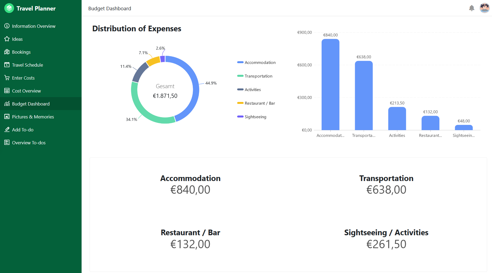

Our travel planner with integrated travel app is the perfect companion for all vacationers and explorers. It helps you to plan your trip, collect ideas and book activities, track your expenses, record memories and never forget a to-do.

### Possible activities and picturesque photos

Before each trip, you can collect possible excursion destinations and activities. Increase your anticipation with beautiful pictures of the hotels, restaurants and places you want to visit and create a schedule with all the activities you have booked. You can upload photos of your memories during and after the trip.

### Travel documents and to-dos

Upload important documents such as booking confirmations directly to the cloud so you can access them from anywhere in the world. Make a list of all the to-dos you need to complete before you set off so that you can fully enjoy your trip.

### Monitor your expenditure

The app in this template also helps you to conveniently record your expenses using a form. Using simple statistics, you can see exactly how much you have spent on what at the end of the trip.

## Interactive template

Scroll through our interactively embedded template or read the description by clicking on the i symbol after the template name. This will give you a better feel for the functions. If you have any questions or require further information, we recommend ourblog articleand thehelp section.
