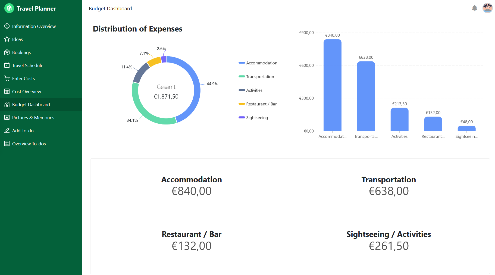

Наш планировщик путешествий с интегрированным приложением - идеальный помощник для всех путешественников и исследователей. Он поможет вам спланировать поездку, собрать идеи и забронировать мероприятия, отследить расходы, записать воспоминания и никогда не забыть о делах.

### Возможные виды деятельности и живописные фотографии

Перед каждой поездкой вы можете собрать возможные экскурсионные направления и мероприятия. Усиливайте предвкушение с помощью красивых фотографий отелей, ресторанов и мест, которые вы хотите посетить, и составляйте расписание со всеми мероприятиями, которые вы забронировали. Вы можете загружать фотографии своих воспоминаний во время и после поездки.

### Путевые документы и дела

Загрузите важные документы, такие как подтверждения бронирования, прямо в облако, чтобы иметь к ним доступ из любой точки мира. Составьте список дел, которые необходимо выполнить до отъезда, чтобы в полной мере насладиться путешествием.

### Контролируйте свои расходы

Приложение в этом шаблоне также поможет вам удобно записывать свои расходы с помощью формы. Используя простую статистику, в конце поездки вы сможете точно узнать, сколько и на что вы потратили.

## Интерактивный шаблон

Прокрутите наш интерактивно встроенный шаблон или прочитайте описание, нажав на символ i после названия шаблона. Это позволит вам лучше понять функции. Если у вас возникли вопросы или вам нужна дополнительная информация, мы рекомендуемстатьюв нашемблогеираздел помощи.
