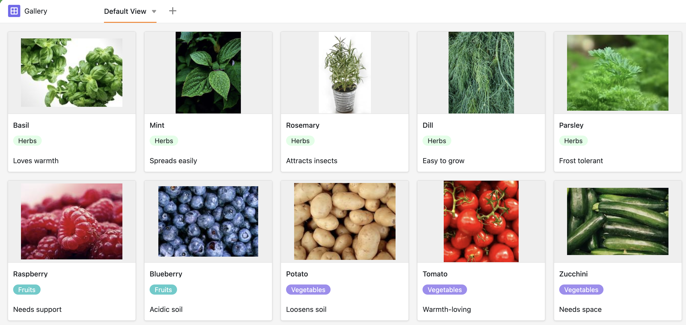

Ein strukturierter Pflanzplan in SeaTable hilft Ihnen dabei, Ihren Garten nachhaltig und effizient zu gestalten. Ob Sie ein Blumenbeet anlegen, Gemüse anpflanzen oder einfach Ihr Beet planen möchten – mit dieser Vorlage behalten Sie Bepflanzung, Pflege und Erntezeiten zentral im Blick.

## Planen Sie Ihre Beete mit System

In der zentralen Tabelle erfassen Sie Ihr Beet – inklusive Reihen, Bepflanzung und Fruchtfolge. Besonders praktisch: Die Verlinkung zu den Pflanzen erleichtert Ihnen die schnelle Planung über mehrere Jahre hinweg. So lässt sich SeaTable ganz einfach als intuitiver Beetplaner nutzen.

## Erstellen Sie Ihr eigenes Pflanzenlexikon

Die zweite Tabelle ist Ihre persönliche Pflanzenenzyklopädie: Ob Zierpflanzen, Kräuter oder Nutzpflanzen – hier speichern Sie alle Infos zu Winterhärte, Lebensdauer, Größe oder geeigneten Beetnachbarn. Das hilft nicht nur beim Planen, sondern gibt Ihnen auch beim Beet anlegen neue Ideen und Inspirationen.

## Tracken Sie Ihre Gartenerfolge im Detail

Sie möchten wissen, ob Ihre Arbeit Früchte trägt? In der Tracker-Tabelle dokumentieren Sie Ihre Erntemengen, beobachten Schädlingsbefall oder vergleichen die Wirkung von Dünger. So lässt sich Ihr Garten systematisch verbessern – Jahr für Jahr.

## Die Vorteile eines digitalen Pflanzplans mit SeaTable

- Kostenlos starten:​Die Free-Version bietet alles, was Sie brauchen, um Ihren Pflanzplan zu erstellen und direkt loszulegen.
- Individuell anpassbar:​Gestalten Sie Ihre Vorlage nach Ihren Wünschen – vom einfachen Beet bis zur komplexen Mischkultur.
- Zentral & mobil verfügbar:​Ob im Garten, auf dem Balkon oder am Schreibtisch – Sie haben Ihre Planung immer dabei.
- Visuell & übersichtlich:​Galerie, Kanban und Timeline sorgen dafür, dass Sie nie den Überblick verlieren.
- Beet anlegen für Faule:​Mit dieser Vorlage ist der praktischen Einstieg in die Gartenplanung kinderleicht.

Kostenlos starten:​Die Free-Version bietet alles, was Sie brauchen, um Ihren Pflanzplan zu erstellen und direkt loszulegen.

Individuell anpassbar:​Gestalten Sie Ihre Vorlage nach Ihren Wünschen – vom einfachen Beet bis zur komplexen Mischkultur.

Zentral & mobil verfügbar:​Ob im Garten, auf dem Balkon oder am Schreibtisch – Sie haben Ihre Planung immer dabei.

Visuell & übersichtlich:​Galerie, Kanban und Timeline sorgen dafür, dass Sie nie den Überblick verlieren.

Beet anlegen für Faule:​Mit dieser Vorlage ist der praktischen Einstieg in die Gartenplanung kinderleicht.

​

## Interaktives Template

Scrollen Sie durch unser interaktiv eingebettetes Template oder lesen Sie die Beschreibung, indem Sie auf das  hinter dem Vorlagennamen klicken. So bekommen Sie ein besseres Gefühl für die Funktionen. Haben Sie Fragen? Schauen Sie doch mal in unseren [Hilfebereich]().

​
