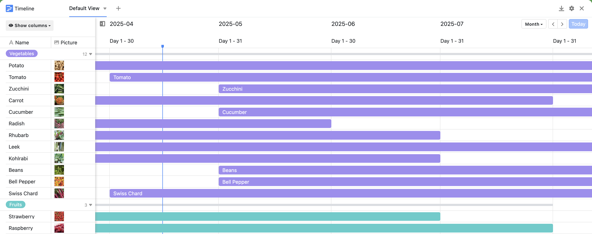
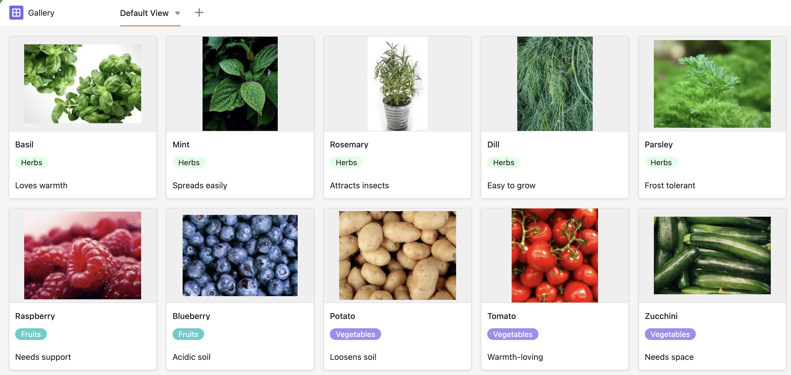

Un plan de plantación estructurado en SeaTable le ayuda a organizar su jardín de forma sostenible y eficiente. Tanto si desea crear un parterre, plantar hortalizas o simplemente planificar su parterre, con esta plantilla podrá mantener una visión centralizada de los tiempos de plantación, cuidado y cosecha.

## Planifique sus camas con un sistema

En la tabla central puede anotar su parterre, incluidas las hileras, la plantación y la rotación de cultivos. Especialmente práctico: los enlaces a las plantas le facilitan la planificación rápida a lo largo de varios años. Esto hace que SeaTable sea muy fácil de usar como planificador intuitivo de bancales.

## Crea tu propia enciclopedia de plantas

La segunda tabla es tu enciclopedia personal de plantas: ya sean plantas ornamentales, hierbas aromáticas o plantas útiles, aquí puedes guardar toda la información sobre resistencia al invierno, vida útil, tamaño o vecinos de arriate adecuados. Esto no sólo le ayudará a planificar, sino que también le aportará nuevas ideas e inspiración a la hora de plantar los arriates.

## Haga un seguimiento detallado de sus éxitos en jardinería

¿Le gustaría saber si su trabajo está dando frutos? Utilice la tabla de seguimiento para documentar las cantidades cosechadas, observar las plagas o comparar el efecto de los fertilizantes. Así podrá mejorar sistemáticamente su huerto, año tras año.

## Las ventajas de un plan de plantación digital con SeaTable

- Empiece gratis:La versión gratuita le ofrece todo lo que necesita para crear su plan de plantación y empezar de inmediato.
- Personalizable:diseñe su plantilla según sus deseos, desde camas sencillas hasta complejos cultivos mixtos.
- Disponibilidad centralizada y móvil:ya sea en el jardín, en el balcón o en su escritorio, siempre tendrá su planificación a mano.
- Visual y claro:Galería, Kanban y Cronograma garantizan que nunca pierdas la visión de conjunto.
- Crear un arriate para los perezosos:con esta plantilla, empezar a planificar el jardín es un juego de niños.

Empiece gratis:La versión gratuita le ofrece todo lo que necesita para crear su plan de plantación y empezar de inmediato.

Personalizable:diseñe su plantilla según sus deseos, desde camas sencillas hasta complejos cultivos mixtos.

Disponibilidad centralizada y móvil:ya sea en el jardín, en el balcón o en su escritorio, siempre tendrá su planificación a mano.

Visual y claro:Galería, Kanban y Cronograma garantizan que nunca pierdas la visión de conjunto.

Crear un arriate para los perezosos:con esta plantilla, empezar a planificar el jardín es un juego de niños.

​

## Plantilla interactiva

Desplácese por nuestra plantilla incrustada interactivamente o lea la descripción haciendo clic en el  que aparece tras el nombre de la plantilla. Así conocerá mejor las funciones. ¿Tiene alguna pregunta? Eche un vistazo a nuestra [sección de ayuda]().

​
