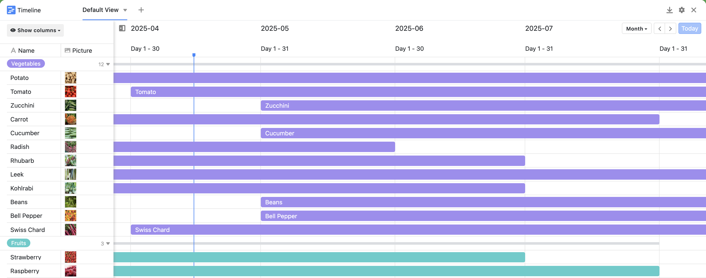

Un plan de plantation structuré dans SeaTable vous aide à aménager votre jardin de manière durable et efficace. Que vous souhaitiez créer un parterre de fleurs, planter des légumes ou simplement planifier votre parterre, ce modèle vous permet de garder un œil central sur les plantations, l'entretien et les périodes de récolte.

## Planifiez vos parterres avec méthode

Dans le tableau central, vous saisissez votre parterre - y compris les rangées, les plantations et la rotation des cultures. Particulièrement pratique : le lien vers les plantes vous facilite la planification rapide sur plusieurs années. Ainsi, SeaTable peut être utilisé facilement comme planificateur intuitif de parterres.

## Créez votre propre dictionnaire des plantes

Le deuxième tableau est votre encyclopédie personnelle des plantes : qu'il s'agisse de plantes ornementales, d'herbes aromatiques ou de plantes utiles, vous enregistrez ici toutes les informations sur la résistance au froid, la durée de vie, la taille ou les voisins de plate-bande appropriés. Cela vous aide non seulement à planifier, mais vous donne également de nouvelles idées et inspirations lors de la création de massifs.

## Suivez en détail les résultats de votre jardin

Vous voulez savoir si votre travail porte ses fruits ? Dans le tableau de suivi, vous documentez vos récoltes, observez les attaques de parasites ou comparez l'effet des engrais. Vous pouvez ainsi améliorer systématiquement votre jardin, année après année.

## Les avantages d'un plan de plantation numérique avec SeaTable

- Démarrer gratuitement :la version gratuite offre tout ce dont vous avez besoin pour créer votre plan de plantation et vous lancer directement.
- Personnalisable :personnalisez votre modèle selon vos besoins, de la simple plate-bande à la culture mixte complexe.
- Disponible de manière centralisée & mobile :que vous soyez dans le jardin, sur le balcon ou à votre bureau, vous avez toujours votre planning avec vous.
- Visuel & clair :la galerie, le Kanban et la ligne de temps permettent de ne jamais perdre la vue d'ensemble.
- Créer un parterre pour les paresseux:Avec ce modèle, il est très facile de commencer à planifier son jardin de manière pratique.

Démarrer gratuitement :la version gratuite offre tout ce dont vous avez besoin pour créer votre plan de plantation et vous lancer directement.

Personnalisable :personnalisez votre modèle selon vos besoins, de la simple plate-bande à la culture mixte complexe.

Disponible de manière centralisée & mobile :que vous soyez dans le jardin, sur le balcon ou à votre bureau, vous avez toujours votre planning avec vous.

Visuel & clair :la galerie, le Kanban et la ligne de temps permettent de ne jamais perdre la vue d'ensemble.

Créer un parterre pour les paresseux:Avec ce modèle, il est très facile de commencer à planifier son jardin de manière pratique.

​

## Modèle interactif

Faites défiler notre modèle intégré de manière interactive ou lisez la description en cliquant sur  derrière le nom du modèle. Vous aurez ainsi une meilleure idée de ses fonctions. Vous avez des questions ? N'hésitez pas à consulter notre [rubrique d'aide]().

​
