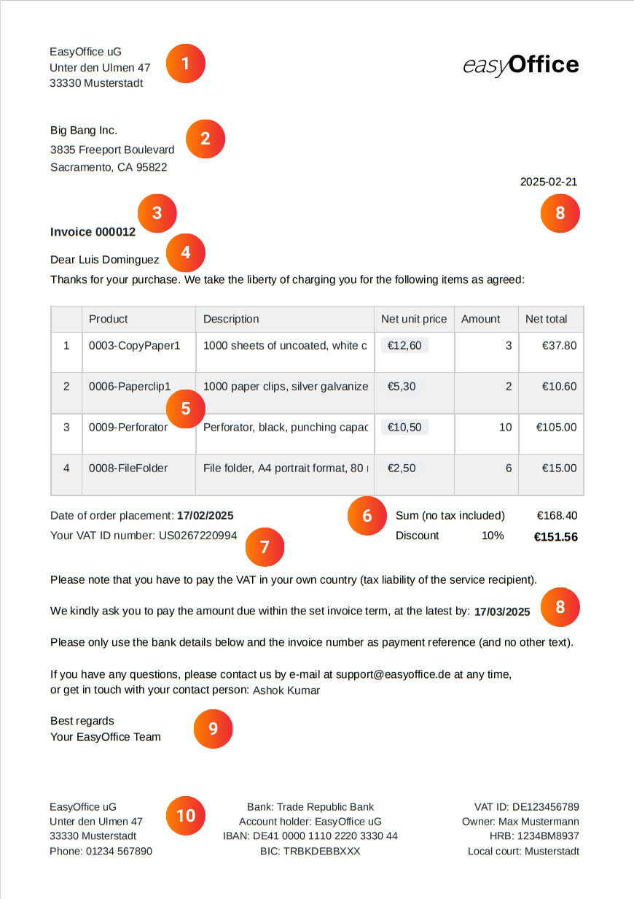

## Writing an invoice: The template that meets your needs

The most time-consuming and tedious task for entrepreneurs is ofteninvoicing. Especially companies with many orders often don't have the time to manually write every invoice. With our free invoice template for small businesses and large companies, you can optimize and automate your invoicing process, freeing up more resources for your core business.

## Why you should take a look at this invoice template

-Save time: This digital invoice template allows you to automatically generate, send and save your invoices. This reduces manual entries and minimizes your administrative workload.

-No errors: thanks to automated invoice creation using dynamic fields and formulas, there are no calculation or typing errors in the invoice template (Excel, for example, has clear disadvantages here).

-Central storage: Keep all customer, product and invoice data in one place. Because unlike an Excel template, an invoice in SeaTable can link all existing data together.

-Sustainability: With SeaTable, your invoicing is completely paperless - without time-consuming and expensive dispatch, but simply at the touch of a button by e-mail.

## How to create a professional invoice

If you've never had to write an invoice before, you probably don't know where to start. In this case, our invoice template will help you enormously, as it already contains all the elements you need to create a correct invoice.

The following mandatory information should not be missing from any invoice template:

1. when you write an invoice, thenameandaddress of your companyusually form the letterhead together with yourcompany logo.

2. you need thenameandaddress of the client/customernot only for the delivery, but also for tax reasons - because services to companies are taxable where the client is based.

3.subject lineandinvoice number: A clear, consecutive numbering of your invoices makes it easier to assign them in future correspondence with your customers.

4. the directsalutationwith the name of the contact person gives your invoice letter a personal touch.

5 The exact service description with the individualitems (type, price and quantity of the service)forms the main part of your invoice. Create this carefully: it must be clear which products or services you have sold.

6 Now it's time to get down to business: add up the individual items to thenet amount, deduct adiscountif necessary and, for domestic customers, also calculate thegross amountincluding VAT.

7 For business customers abroad, you will need theVAT identification numberwhen you issue an invoice. Point out to these customers that they must pay the VAT in their respective country themselves (tax liability of the recipient of the service).

8. date and validity: Don't forget thecurrent datewhen you create the invoice and add a deadline by which the customer can pay the invoice. As a rule, the period between invoice creation anddue dateshould be a few weeks.

9. conclude the letter with a friendly cover letter includingcontact informationand agreeting.

10. yourbank details,VAT IDand other relevant company data should be included in the letterhead of your invoice template.

## The many functions of this invoice template

- Ourinvoice templatecan be customized according to your wishes and needs. Design the invoice template with the page design plugin and use a variety ofcolumn typesandvisualization options.

- Create your invoice template in differentlanguagesor for differentcountriesand define dependencies so that the right invoice template is always selected automatically.

- As soon as you have filled in the invoice template with your data and individual designs, the invoice is createdautomaticallyand free of chargeat the touch of a button- without any further effort on your part.

- You can also automate the sending process: Integration with your e-mail provider allows you to write an invoice with just one click andsendit directlyby e-mail.

- Use thestatisticsintegrated into the invoice template to gain valuable insights from your figures and data and make well-founded decisions.

## Writing invoices efficiently - it can be that simple

SeaTable's invoice template makes creating and managing invoices a breeze. The template for your invoice helps you to clearly organizeproducts,customersandorders, automatically create an invoice and save it as a PDF ready for dispatch.

Thanks to intelligentlinks, the invoice template is fed with relevant data from various tables: Customer information, order items and prices flow together seamlessly, whileformulasautomatically calculate discounts and VAT. In this way, large companies and small businesses alike can use the invoice template to maintain an overview at all times and save valuable time.

### Creating an invoice made easy

The page design plugin is particularly practical for the invoice template, allowing you to designindividual invoice layouts in several languages. A single click is all it takes tocreate and saveaPDF invoice- SeaTable automatically uses the appropriate invoice template depending on the customer's country. Thanks to theuser-friendly interface, you can create an invoice in no time at all. Sending is also integrated: With an additionalbutton, the finished invoice can be sent directly to the customer by e-mail. The entire invoicing process runsefficientlyandsmoothly, without the need for laborious copying or manual typing.

### More than just an invoice template

In addition to creating invoices, the invoice template offers valuable additional functions that support your business. The statistics function makes it easy toevaluate sales figures and turnover, while the gallery plugin gives you a clear overview of yourproduct portfolio. Thanks to SeaTable's flexible customization options, you can tailor columns, calculations and views to your needs andcreateaPDF invoicethat fits your business perfectly.

## Advantages of SeaTable as invoicing software

-Free of charge: The invoice template is free of charge, especially for small businesses. This is because SeaTable offers a free basic version that already includes numerous functions. This means you can get started straight away and use the invoice template.

-Collaborative: Thanks to real-time synchronization, SeaTable makes team collaboration much easier. Multiple users can work on tables, update data in the invoice template and leave comments at the same time.

-Flexible: SeaTable is much more than just a database. Thanks to its versatile customization options, it can be used for a wide range of applications and seamlessly integrated into various business processes.

-Secure: Your data is optimally protected with SeaTable. You have the choice of storing it in the cloud or on-premises. Thanks to GDPR compliance and individual access rights, you retain full control over your sensitive information at all times.

-Convenient: If you create an invoice online, it can be accessed from anywhere and at any time and is also protected against loss. Unlike an Excel template, the invoice can also be designed to be visually appealing.

-Scalable: From the first use with a few employees to a company-wide solution for large teams - SeaTable grows with your requirements. Of course, you can also create your invoice as a small business with this template.

## Why use the SeaTable invoice template?

Whether as an invoice template for small businesses or invoicing software for large companies - with SeaTable it's child's play to create an invoice for every order. Use the automated invoice creation function to create and send one invoice after another for free in no time at all. This gives you more time for the important things instead of wasting valuable hours writing invoices.

If you would like to use the invoice template free of charge,simply register with your e-mail address.

## Interactive template

Scroll through our interactively embedded template or read the description by clicking on the  after the template name. This will give you a better feel for the functions of the invoice template. If you have any questions, we can recommend our [help section]().
