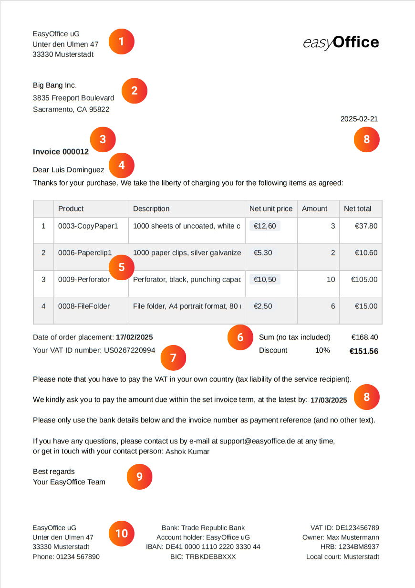
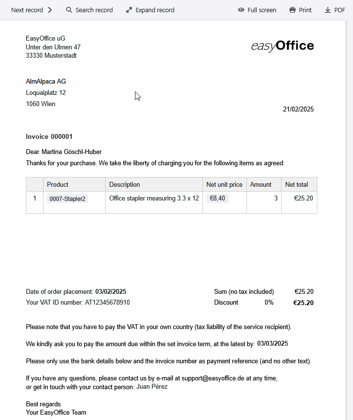
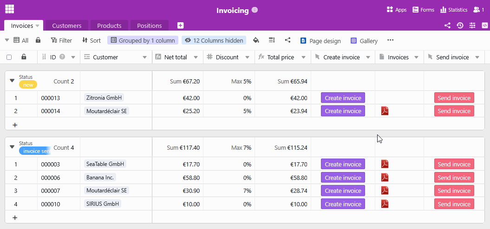

## Redactar una factura: La plantilla que satisface sus necesidades

La tarea más tediosa y que más tiempo consume a los empresarios suele ser lafacturación. Especialmente las empresas con muchos pedidos no suelen tener tiempo para redactar manualmente cada factura. Con nuestra plantilla de factura gratuita para pequeñas y grandes empresas, puedes optimizar y automatizar tu proceso de facturación, liberando más recursos para tu actividad principal.

## Por qué debería echar un vistazo a este modelo de factura

-Ahorre tiempo: Esta plantilla de factura digital le permite generar, enviar y guardar automáticamente sus facturas. Esto reduce las entradas manuales y minimiza su carga de trabajo administrativo.

-Sin errores: gracias a la creación automatizada de facturas mediante campos dinámicos y fórmulas, no hay errores de cálculo ni de escritura en la plantilla de factura (Excel, por ejemplo, tiene claras desventajas en este aspecto).

-Almacenamiento centralizado: conserve todos los datos relativos a clientes, productos y facturas en un único lugar. Porque a diferencia de una plantilla de Excel, una factura en SeaTable puede vincular todos los datos existentes.

-Sostenibilidad: con SeaTable, su facturación se realiza completamente sin papel, sin necesidad de largos y costosos envíos, sino simplemente pulsando un botón por correo electrónico.

## Cómo crear una factura profesional

Si nunca ha tenido que redactar una factura, probablemente no sepa por dónde empezar. En ese caso, nuestra plantilla de factura te ayudará enormemente, pues ya contiene todos los elementos que necesitas para crear una factura correcta.

La siguiente información obligatoria no debe faltar en ningún modelo de factura:

1. cuando redacta una factura, elnombrey ladirección de su empresasuelen formar el membrete junto conel logotipo desuempresa.

2. necesita elnombrey ladirección del clienteno sólo para la entrega, sino también por motivos fiscales, ya que los servicios a empresas están sujetos a impuestos en el lugar donde tiene su sede el cliente.

3.asuntoynúmero de factura: la numeración única y consecutiva de sus facturas facilita su asignación en la futura correspondencia con sus clientes.

4. elsaludodirecto con el nombre de la persona de contacto da a su carta de factura un toque personal.

5 La descripción exacta del servicio con los elementos individuales(tipo, precio y cantidad del servicio)constituye la parte principal de su factura. Elabórela con cuidado: debe quedar claro qué productos o servicios ha vendido.

6 Ahora es el momento de ponerse manos a la obra: sume los distintos conceptos para obtener elimporte neto, deduzca undescuentosi es necesario y, en el caso de los clientes nacionales, calcule también elimporte bruto, IVA incluido.

7 En el caso de clientes comerciales en el extranjero, necesitará elnúmero de identificación a efectos del IVAcuando emita una factura. Señale a estos clientes que deben pagar ellos mismos el IVA en sus respectivos países (responsabilidad fiscal del destinatario del servicio).

8. Fecha y validez: No olvide lafecha actualal crear la factura y añada una fecha límite para que el cliente pueda pagarla. Por regla general, el periodo entre la creación de la factura y lafecha de vencimientodebe ser de unas semanas.

9. concluya la carta con una carta de presentación amistosa que incluyainformación de contactoy unsaludo.

10. en el membrete de su modelo de factura deben figurar susdatos bancarios, suNIFy otros datos pertinentes de la empresa.

## Las numerosas funciones de este modelo de factura

- Nuestraplantilla defactura puede personalizarse según sus deseos y necesidades. Diseñe la plantilla de factura con el plugin de diseño de páginas y utilice diversostipos de columnasyopciones de visualización.

- Cree su plantilla de factura en diferentesidiomaso para diferentespaísesy defina dependencias para que siempre se seleccione automáticamente la plantilla de factura correcta.

- En cuanto haya rellenado la plantilla de factura con sus datos y diseños individuales, la factura se creaautomáticamentey de forma gratuitacon sólo pulsar un botón, sin ningún esfuerzo adicional por su parte.

- También puede automatizar el proceso de envío: La integración con su proveedor de correo electrónico le permite crear una factura con un solo clic yenviarladirectamentepor correo electrónico.

- Utilice lasestadísticasintegradas en la plantilla de factura para obtener información valiosa de sus cifras y datos y tomar decisiones bien fundadas.

## Redactar facturas con eficacia: así de sencillo

Con la plantilla de factura de SeaTable, crear y gestionar facturas es un juego de niños. La plantilla para su factura le ayuda a organizar claramentelos productos,clientesypedidos, crear automáticamente una factura y guardarla como PDF lista para su envío.

Gracias a losenlacesinteligentes, la plantilla de factura se alimenta con los datos pertinentes de varias tablas: La información del cliente, los artículos del pedido y los precios fluyen sin problemas, mientras quelas fórmulascalculan automáticamente los descuentos y el IVA. Esto significa que tanto las grandes empresas como las pequeñas pueden utilizar la plantilla de factura para mantener una visión general en todo momento y ahorrar un tiempo valioso.

### Facilitar la creación de facturas

El plugin de diseño de páginas es especialmente práctico para la plantilla de factura, ya que permite creardiseños de factura personalizados en varios idiomas. Basta un clic paracrear y guardarunafactura en PDF: SeaTable utiliza automáticamente la plantilla de factura adecuada en función del país del cliente. Gracias a susencilla interfaz, podrá crear una factura en un abrir y cerrar de ojos. El envío también está integrado: Con unbotónadicional, la factura terminada puede enviarse directamente al cliente por correo electrónico. Todo el proceso de facturación se lleva a cabo deforma eficienteysin problemas, sin necesidad de laboriosas copias o mecanografía manual.

### Más que un modelo de factura

Además de crear facturas, la plantilla de facturas ofrece valiosas funciones adicionales que le ayudarán en su negocio. La función de estadísticas facilita elanálisis de las cifras de ventas y el volumen de negocios, mientras que el complemento de galería le ofrece una visión clara de sucartera de productos. Gracias a las flexibles opciones de personalización de SeaTable, podrá adaptar las columnas, los cálculos y las vistas a sus necesidades individuales y crear unafactura en PDFque se ajuste perfectamente a su negocio.

## Ventajas de SeaTable como software de facturación

-Gratuita: La plantilla de factura es gratuita, especialmente para las pequeñas empresas. Esto se debe a que SeaTable ofrece una versión básica gratuita que ya incluye numerosas funciones. Esto significa que puede empezar a utilizar la plantilla de factura inmediatamente.

-Colaboración: Gracias a la sincronización en tiempo real, SeaTable facilita enormemente la colaboración en equipo. Varios usuarios pueden trabajar en tablas, actualizar datos en la plantilla de factura y dejar comentarios al mismo tiempo.

-Flexible: SeaTable es mucho más que una base de datos. Gracias a sus versátiles opciones de personalización, puede utilizarse para una amplia gama de aplicaciones e integrarse a la perfección en diversos procesos empresariales.

-Seguro: Sus datos están protegidos de forma óptima con SeaTable. Puede elegir entre almacenarlos en la nube o en sus instalaciones. Gracias al cumplimiento de la normativa GDPR y a los derechos de acceso individuales, conservará el control total de su información confidencial en todo momento.

-Cómoda: si crea una factura en línea, puede acceder a ella desde cualquier lugar y en cualquier momento, y además está protegida contra pérdidas. A diferencia de una plantilla de Excel, la factura también puede diseñarse para que sea visualmente atractiva.

-Escalable: Desde el primer uso con unos pocos empleados hasta una solución para toda la empresa para grandes equipos - SeaTable crece con sus necesidades. Por supuesto, también puede utilizar esta plantilla para crear su factura como pequeña empresa.

## ¿Por qué utilizar el modelo de factura SeaTable?

Ya sea como plantilla de factura para pequeñas empresas o como software de facturación para grandes empresas, SeaTable facilita la creación de una factura para cada pedido. Utilice la función de facturación automatizada para crear y enviar una factura tras otra en un abrir y cerrar de ojos, de forma gratuita. Así tendrá más tiempo para las cosas importantes en lugar de perder valiosas horas redactando facturas.

Si desea utilizar la plantilla de factura gratuitamente,sólo tiene que registrarse con su dirección de correo electrónico.

## Plantilla interactiva

Desplácese por nuestra plantilla incrustada de forma interactiva o lea la descripción haciendo clic en el  que aparece tras el nombre de la plantilla. Esto le dará una mejor idea de las funciones de la plantilla de factura. Si tiene alguna duda, le recomendamos nuestra [sección de ayuda]().
