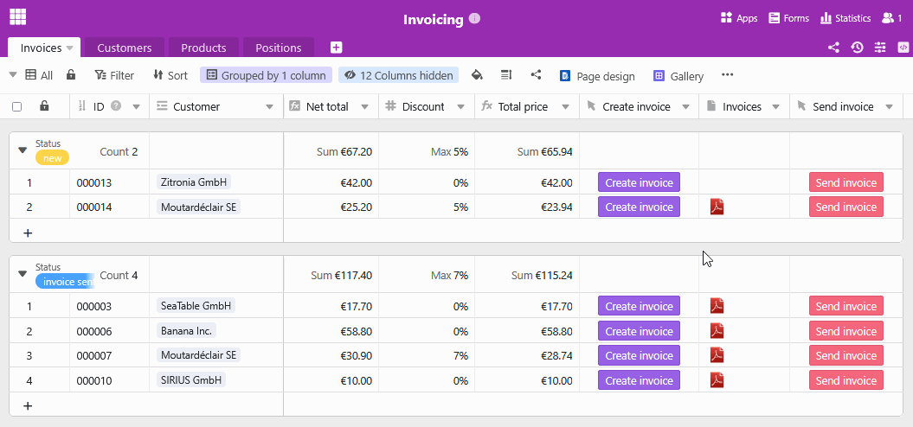

## Redigir uma fatura: O modelo que satisfaz as suas necessidades

A tarefa mais demorada e entediante para os empresários é frequentemente afaturação. Especialmente as empresas com muitas encomendas, muitas vezes não têm tempo para redigir manualmente todas as facturas. Com o nosso modelo de faturação gratuito para pequenas e grandes empresas, pode otimizar e automatizar o seu processo de faturação, libertando mais recursos para a sua atividade principal.

## Por que razão deve dar uma vista de olhos a este modelo de fatura

-Poupe tempo: Este modelo de fatura digital permite-lhe gerar, enviar e guardar automaticamente as suas facturas. Isto reduz as entradas manuais e minimiza o seu volume de trabalho administrativo.

-Sem erros: Graças à criação automática de facturas utilizando campos dinâmicos e fórmulas, não há erros de cálculo ou de digitação no modelo de fatura (o Excel, por exemplo, tem claras desvantagens neste aspeto).

-Armazenamento centralizado: Mantenha todos os dados relativos a clientes, produtos e facturas num único local. Porque, ao contrário de um modelo Excel, uma fatura no SeaTable pode ligar todos os dados existentes.

-Sustentabilidade: Com o SeaTable, a sua faturação é completamente sem papel - sem expedições demoradas e dispendiosas, mas simplesmente com o toque de um botão por correio eletrónico.

## Como criar uma fatura profissional

Se nunca teve de redigir uma fatura antes, provavelmente não sabe por onde começar. Neste caso, o nosso modelo de fatura irá ajudá-lo imenso, uma vez que já contém todos os elementos de que necessita para criar uma fatura correta.

As seguintes informações obrigatórias não devem faltar em nenhum modelo de fatura:

1. Quando redige uma fatura, onomeeo endereço da sua empresaconstituem normalmente o papel timbrado, juntamente como logótipoda suaempresa.

2. é necessário onomeeo endereço do clientenão só para a entrega, mas também por razões fiscais, uma vez que os serviços prestados a empresas são tributáveis no local onde o cliente está estabelecido.

3.Assuntoenúmero da fatura: A numeração única e consecutiva das suas facturas facilita a sua atribuição na correspondência futura com os seus clientes.

4. Asaudaçãodireta com o nome da pessoa a contactar dá um toque pessoal à sua carta de faturação.

5 A descrição exacta do serviço com oselementosindividuais(tipo, preço e quantidade do serviço)constitui a parte principal da sua fatura. Crie-a cuidadosamente: deve ser claro quais os produtos ou serviços que vendeu.

6 Agora é hora de pôr mãos à obra: somar as rubricas individuais para obter omontante líquido, deduzir umdesconto, se necessário, e, para os clientes nacionais, calcular também omontante bruto, incluindo o IVA.

7 Para os clientes comerciais no estrangeiro, é necessário onúmero de identificaçãopara efeitos deIVAquando se emite uma fatura. Chame a atenção destes clientes para o facto de terem de pagar eles próprios o IVA no respetivo país (responsabilidade fiscal do destinatário do serviço).

8. data e validade: Não se esqueça dadata atualquando criar a fatura e acrescente um prazo para o cliente pagar a fatura. Regra geral, o período entre a criação da fatura ea data de vencimentodeve ser de algumas semanas.

9. concluir a carta com uma carta de apresentação amigável que incluainformações de contactoe umasaudação.

    10.Osseusdados bancários, o seu númerode IVAe outros dados relevantes da empresa devem ser incluídos no cabeçalho do seu modelo de fatura.

## As várias funções deste modelo de fatura

- O nossomodelo de faturapode ser personalizado de acordo com os seus desejos e necessidades. Crie o modelo de faturação com o plug-in de design de página e utilize uma variedade detipos de colunaseopções de visualização.

- Crie o seu modelo de fatura em diferenteslínguasou para diferentespaísese defina dependências para que o modelo de fatura correto seja sempre selecionado automaticamente.

- Assim que tiver preenchido o modelo de fatura com os seus dados e desenhos individuais, a fatura é criadaautomaticamentee gratuitamentecom o toque de um botão- sem qualquer esforço adicional da sua parte.

- Pode também automatizar o processo de expedição: A integração com o seu fornecedor de correio eletrónico permite-lhe criar uma fatura com apenas um clique e enviá-la diretamentepor correio eletrónico.

- Utilize asestatísticasintegradas no modelo de fatura para obter informações valiosas dos seus números e dados e tomar decisões bem fundamentadas.

## Redigir facturas de forma eficiente - pode ser tão simples quanto isso

Com o modelo de faturação do SeaTable, criar e gerir facturas é uma brincadeira de crianças. O modelo para a sua fatura ajuda-o a organizar claramenteos produtos,os clienteseas encomendas, a criar automaticamente uma fatura e a guardá-la em PDF, pronta para ser enviada.

Graças aligaçõesinteligentes, o modelo de fatura é alimentado com dados relevantes de várias tabelas: As informações sobre o cliente, os artigos da encomenda e os preços são integrados sem problemas, enquantoas fórmulascalculam automaticamente os descontos e o IVA. Isto significa que tanto as grandes empresas como as pequenas empresas podem utilizar o modelo de fatura para manter uma visão geral em qualquer altura e poupar tempo valioso.

### Criação de facturas facilitada

O plugin de design de páginas é particularmente prático para o modelo de faturação, permitindo-lhe criarlayouts de faturação personalizados em vários idiomas. Basta um único clique paracriar e guardarumafatura em PDF- o SeaTable utiliza automaticamente o modelo de fatura adequado em função do país do cliente. Graças àinterface de fácil utilização, é possível criar uma fatura em pouco tempo. O envio também está integrado: Com umbotãoadicional, a fatura finalizada pode ser enviada diretamente para o cliente por correio eletrónico. Todo o processo de faturação decorre deformaeficientee sem problemas, sem necessidade de cópias laboriosas ou de digitação manual.

### Mais do que um simples modelo de fatura

Para além de criar facturas, o modelo de fatura oferece funções adicionais valiosas que apoiam o seu negócio. A função de estatísticas facilita aanálise dos números de vendas e do volume de negócios, enquanto o plug-in da galeria lhe dá uma visão clara da suacarteira de produtos. Graças às opções de personalização flexíveis do SeaTable, pode adaptar colunas, cálculos e vistas às suas necessidades individuais e criar umafatura em PDFque se adapte perfeitamente à sua empresa.

## Vantagens do SeaTable como software de faturação

-Gratuito: O modelo de fatura é gratuito, especialmente para as pequenas empresas. Isto deve-se ao facto de o SeaTable oferecer uma versão básica gratuita que já inclui numerosas funções. Isto significa que pode começar imediatamente a utilizar o modelo de fatura.

-Colaboração: Graças à sincronização em tempo real, o SeaTable facilita muito a colaboração em equipa. Vários utilizadores podem trabalhar em tabelas, atualizar dados no modelo de fatura e deixar comentários ao mesmo tempo.

-Flexível: O SeaTable é muito mais do que uma simples base de dados. Graças às suas versáteis opções de personalização, pode ser utilizado para uma vasta gama de aplicações e perfeitamente integrado em vários processos empresariais.

-Seguro: Os seus dados estão protegidos de forma óptima com o SeaTable. Tem a opção de os armazenar na nuvem ou no local. Graças à conformidade com o RGPD e aos direitos de acesso individuais, mantém sempre o controlo total sobre as suas informações sensíveis.

-Prático: Se criar uma fatura em linha, pode aceder à mesma em qualquer lugar e a qualquer momento, estando também protegida contra perdas. Ao contrário de um modelo Excel, a fatura também pode ser concebida de forma a ser visualmente apelativa.

-Escalável: Desde a primeira utilização com alguns empregados até uma solução para toda a empresa para grandes equipas - o SeaTable cresce com as suas necessidades. Naturalmente, também pode utilizar este modelo para criar a sua fatura como uma pequena empresa.

## Porquê utilizar o modelo de fatura SeaTable?

Quer seja um modelo de faturação para pequenas empresas ou um software de faturação para grandes empresas, o SeaTable facilita a criação de uma fatura para cada encomenda. Utilize a função de faturação automatizada para criar e enviar uma fatura após outra em pouco tempo, gratuitamente. Isto dá-lhe mais tempo para as coisas importantes em vez de perder horas valiosas a escrever facturas.

Se pretender utilizar o modelo de fatura gratuitamente,basta registar-se com o seu endereço eletrónico.

## Modelo interativo

Percorra o nosso modelo incorporado de forma interactiva ou leia a descrição clicando no símbolo i a seguir ao nome do modelo. Isto dar-lhe-á uma melhor noção das funções do modelo de faturação. Se tiver alguma dúvida, recomendamos a nossasecção de ajuda.
