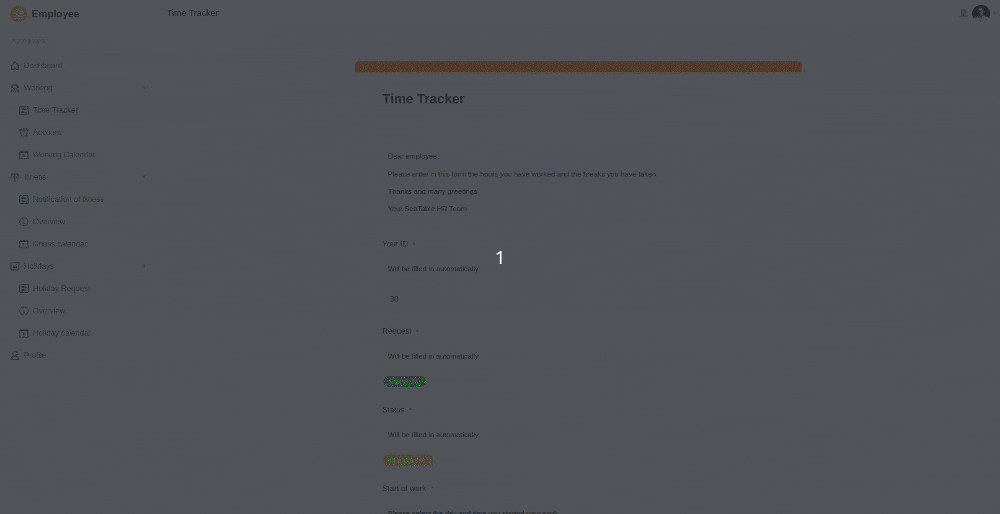
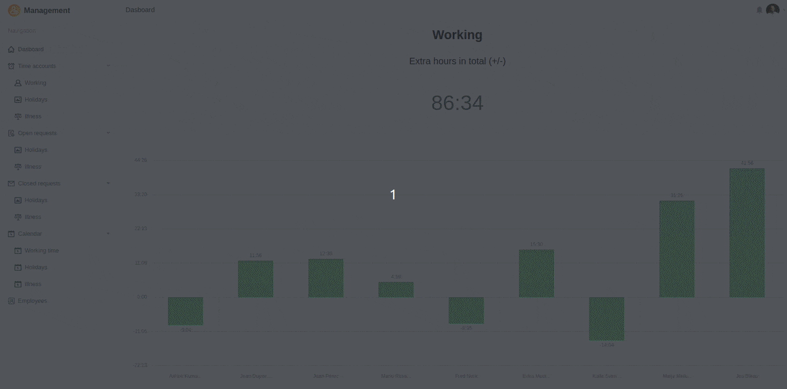

Vous souhaitez mettre en œuvre la saisie du temps de travail prescrite par l'UE dans votre entreprise ? Alors découvrez notre modèle sophistiqué pour une saisie du temps de travail simple, efficace et conforme à la législation. Avec l'abonnement Enterprise, vous disposez de l'intégralité du modèle sans frais supplémentaires, mais vous pouvez également utiliser le modèle (sans automatisation) avec l'abonnement Plus ou un compte gratuit Free.

Le premier tableau de la base contient tous les horaires de travail, les demandes de congé et les arrêts maladie de vos collaborateurs. Il y a quatre vues d'administration générales qui vous permettent de garder une vue d'ensemble de toutes les présences et absences des membres de votre équipe. Dans le deuxième tableau, vous saisissez toutes les données importantes concernant les collaborateurs. Il est important d'attribuer à chaque membre de l'équipe un identifiant unique qui permet de filtrer les vues personnelles. Pour tout savoir à ce sujet, regardez notrevidéo explicative sur YouTube.

Dans une application pour employés construite avec SeaTable, vous pouvez rendre la saisie de données intuitive et conviviale en demandant à vos employés de saisir les heures de travail, les demandes de congé et les congés maladie dans des formulaires web. Vous pouvez également ajouter des instructions concrètes aux champs de saisie afin de guider les personnes qui remplissent les formulaires tout au long du processus.

Lorsque vos employés remplissent les formulaires web, SeaTable ajoute de nouvelles entrées dans les tableaux correspondants, que le cadre responsable peut ensuite valider ou rejeter dans une application de gestion. Sur votre tableau de bord, vous pouvez intégrer des statistiques qui vous permettent, à vous et à vos cadres, de garder un œil sur toutes les heures supplémentaires, les congés et les arrêts maladie de vos employés. Des calendriers permettent en outre de présenter les données dans un aperçu calendaire.

Bien entendu, vous pouvez utiliser de nombreuses autres fonctionnalités de SeaTable pour développer, selon vos besoins, votre propre application de gestion du temps de travail dans votre entreprise. Sur la base de la base de données des employés, le modèle peut être étendu à volonté avec des tableaux et des colonnes, par exemple pour le calcul des salaires, les formations internes et les plans d'équipes. Révolutionnez votre gestion des ressources humaines avec SeaTable ! Pour en savoir plus sur la saisie du temps de travail,cliquez ici.

​

## Modèle interactif

Faites défiler notre modèle intégré de manière interactive ou lisez la description en cliquant sur  derrière le nom du modèle. Vous aurez ainsi une meilleure idée des fonctions. En cas de doute, nous vous recommandons de consulter notre [rubrique d'aide]().
