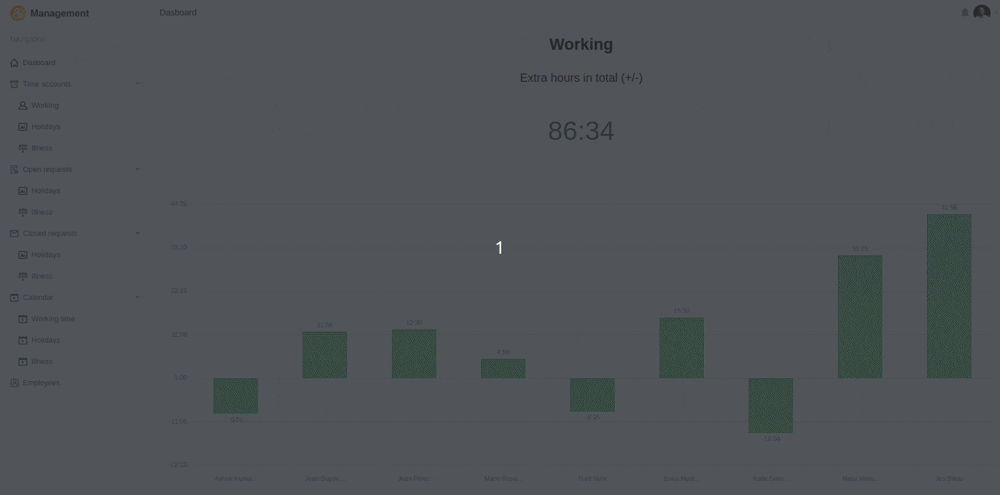

Quer implementar na sua empresa o registo obrigatório do tempo de trabalho da UE? Então descubra o nosso modelo sofisticado de registo de tempo de trabalho simples, eficiente e em conformidade com a lei. Com uma assinatura Enterprise, o modelo está totalmente disponível para si sem custos adicionais, mas também pode utilizar o modelo (sem automatismos) com uma assinatura Plus ou uma conta gratuita.

A primeira tabela da Base contém todos os horários de trabalho, pedidos de férias e notificações de doença dos seus empregados. Existem quatro vistas administrativas abrangentes que lhe dão uma visão completa de todas as presenças e ausências dos membros da sua equipa. No segundo quadro, são introduzidos todos os dados relevantes dos empregados. É importante que atribua a cada membro da equipa um ID único com o qual as vistas pessoais podem ser filtradas. Pode saber tudo sobre este assunto no nossovídeo explicativo no YouTube.

Num aplicativo de empregados construído com SeaTable, pode tornar a entrada de dados intuitiva e de fácil utilização, fazendo com que os seus empregados entrem nas horas de trabalho, pedidos de férias e licenças por doença em formulários web. Ao fazê-lo, pode fornecer os campos de entrada com instruções concretas para guiar aqueles que os completam em segurança ao longo do processo.

Quando os seus empregados preenchem os formulários web, a SeaTable acrescenta novas entradas às tabelas correspondentes, que o gestor responsável pode então aprovar ou rejeitar numa aplicação de gestão. No seu painel de bordo, pode incluir estatísticas que lhe permitem, a si e aos seus gestores, acompanhar as horas extraordinárias, as férias e as baixas por doença de todos os seus empregados. Os calendários também lhe permitem exibir os dados numa visão geral do calendário.

É claro que pode utilizar muitas mais funcionalidades do SeaTable para desenvolver a sua própria aplicação para registar o tempo de trabalho na sua empresa, inteiramente de acordo com os seus desejos. O modelo pode ser alargado com qualquer número de tabelas e colunas com base na base de dados dos empregados, por exemplo, para a contabilidade dos salários, formação interna e horários de turnos. Revolucione a sua gestão de RH com o SeaTable! Pode encontrar mais informações sobre o tema do registo do tempo de trabalhoaqui.

​

## Modelo interativo

Percorra o nosso modelo incorporado de forma interactiva ou leia a descrição clicando no símbolo i a seguir ao nome do modelo. Isto dar-lhe-á uma melhor noção das funções. Se tiver alguma dúvida, recomendamos a nossasecção de ajuda.
