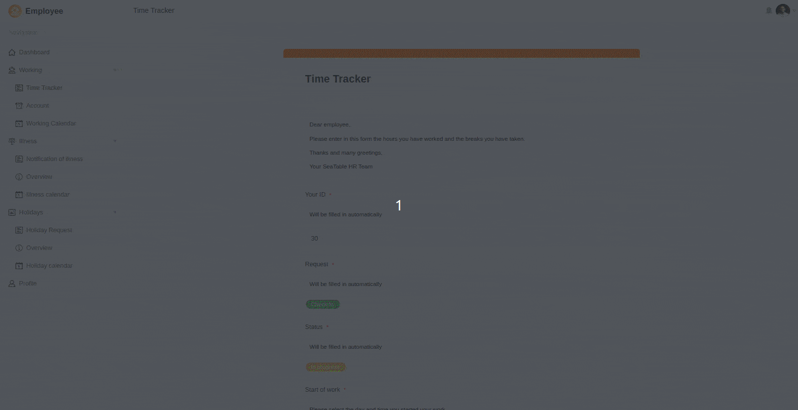

Вы хотите внедрить в своей компании обязательный учет рабочего времени, принятый в ЕС? Тогда откройте для себя наш сложный шаблон для простого, эффективного и соответствующего законодательству учета рабочего времени. При подписке Enterprise шаблон полностью доступен для вас без дополнительной платы, но вы также можете использовать шаблон (без автоматизации) при подписке Plus или бесплатной учетной записи.

Первая таблица в Base содержит все рабочие часы, заявления на отпуск и уведомления о болезни ваших сотрудников. Есть четыре общих представления администратора, которые дают вам полный обзор всех явок и неявок членов вашей команды. Во второй таблице вы вводите все необходимые данные о сотрудниках. Важно, чтобы каждому члену команды был присвоен уникальный идентификатор, по которому можно фильтровать личные представления. Вы можете узнать все об этом из нашегопояснительного видео на YouTube.

В приложении для сотрудников, созданном с помощью SeaTable, вы можете сделать ввод данных интуитивно понятным и удобным для пользователей, предоставив своим сотрудникам возможность вводить рабочие часы, заявления на отпуск и больничный лист в веб-формы. При этом вы можете снабдить поля ввода конкретными инструкциями, чтобы безопасно провести заполняющих их сотрудников через весь процесс.

Когда ваши сотрудники заполняют веб-формы, SeaTable добавляет новые записи в соответствующие таблицы, которые ответственный менеджер может затем одобрить или отклонить в приложении управления. На приборной панели вы можете включить статистику, которая позволит вам и вашим менеджерам отслеживать все сверхурочные, праздничные и больничные дни ваших сотрудников. Календари также позволяют отображать данные в виде календарного обзора.

Конечно, вы можете использовать многие другие возможности SeaTable, чтобы разработать собственное приложение для учета рабочего времени в вашей компании, полностью соответствующее вашим пожеланиям. Шаблон может быть расширен любым количеством таблиц и столбцов на основе базы данных сотрудников, например, для учета заработной платы, внутреннего обучения и расписания смен. Революционизируйте управление персоналом с помощью SeaTable! Больше по теме учета рабочего времени вы можете найтиздесь.

​

## Интерактивный шаблон

Прокрутите наш интерактивно встроенный шаблон или прочитайте описание, нажав на символ i после названия шаблона. Это позволит вам лучше понять функции. Если у вас возникнут вопросы, рекомендуем воспользоваться нашимразделом помощи.
