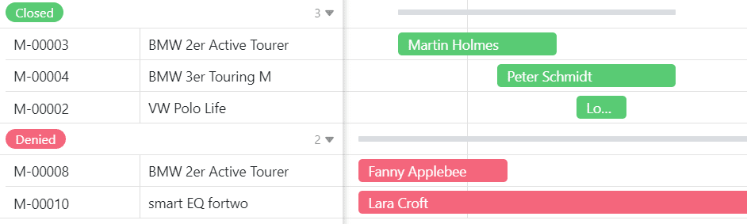

## Optimice la gestión de su flota con nuestro software gratuito de gestión de flotas

¿Está buscandoun software de gestión de flotaseficiente? Con nuestra plantilla gratuita podrás tener siempre controlado toda tu flota. Ya seancamiones, turismos, vehículos comerciales o vehículos de empresa: todos los vehículos pueden gestionarse de forma centralizada.

- Gestión integral de flotas:registre todos los datos relevantes sobre su flota de vehículos, desde las especificaciones técnicas hasta la última inspección.
- Reservas y pedidos sencillos:los empleados pueden reservar vehículos cómodamente en línea. Los protocolos de entrega y las solicitudes de reserva se registran automáticamente.
- Planificación de mantenimiento eficiente:nunca más vuelva a perder citas importantes de mantenimiento o reparación. Puede planificar y documentar todas las citas de forma centralizada a través de la gestión de flotas digital.
- Transparencia de costos:al registrarlos viajesy los gastos en detalle, obtendrá una descripción general completa de los costos actuales de su flota.
- Personalización flexible:La plantilla de gestión de flotas es totalmente personalizable y puede adaptarse a las necesidades individuales de su empresa.

Gestión integral de flotas:registre todos los datos relevantes sobre su flota de vehículos, desde las especificaciones técnicas hasta la última inspección.

Reservas y pedidos sencillos:los empleados pueden reservar vehículos cómodamente en línea. Los protocolos de entrega y las solicitudes de reserva se registran automáticamente.

Planificación de mantenimiento eficiente:nunca más vuelva a perder citas importantes de mantenimiento o reparación. Puede planificar y documentar todas las citas de forma centralizada a través de la gestión de flotas digital.

Transparencia de costos:al registrarlos viajesy los gastos en detalle, obtendrá una descripción general completa de los costos actuales de su flota.

Personalización flexible:La plantilla de gestión de flotas es totalmente personalizable y puede adaptarse a las necesidades individuales de su empresa.

## Ventajas de nuestro software de gestión de flotas de un vistazo

Nuestrosoftware de gestión de flotasle ahorra tiempo y recursos. Al gestionar todos los datos de los vehículos de forma centralizada, evita la duplicación del trabajo y reduce el riesgo de errores.

•Gratuito: Para utilizar nuestro software de gestión de flotas de forma gratuita, solo necesitasregistrartecon tu dirección de correo electrónico.

•Cómodo: gracias al software de gestión de flotas digitales, sus datos son accesibles desde cualquier lugar y en cualquier momento y están protegidos contra pérdidas.

•Intuitivo: la gestión de flotas es fácil de entender y, a diferencia de una plantilla de Excel de gestión de flotas, es gratuita, visualmente atractiva y menos propensa a errores.

•Flexible: agregue tablas, columnas y archivos como desee y adapte el software de gestión de flotas a sus necesidades individuales sin cargo.

-Protección de datos: el almacenamiento seguro y conforme al GDPR de los datos en la nube o en las instalaciones permite un control total, al igual que los derechos de acceso granulares.

•Potente: donde otras herramientas como una plantilla de Excel para gestión de flotas (desde gratuitas hasta costosas) alcanzan sus límites, SeaTable apenas está comenzando. ¡Esto hace que trabajar con grandes datos sea divertido!

-Siempreal día: Manténgase siempre al día gracias a las funciones de comunicación, el historial completo de cambios y la actualización en tiempo real.

-Escalable: Nuestra solución crece con su equipo, independientemente de si tiene uno o mil empleados.

## Gestión clara de flotas sin plantilla Excel gratis

Con el software de gestión de flotas podrás planificar con precisión el uso de tus vehículos. A continuación te explicamos cómo puedes gestionar fácilmente reservas, devoluciones, reparaciones y citas de inspección.

El primer paso es compilar unadescripción general de sus vehículos: puede ingresar cualquier información que sea importante para usted. Con diferentestipos de columnasyvistas,puedes diseñar la gestión de tu flota de la forma que desees. A diferencia de una plantilla de Excel de gestión de flotas, puedes cargar fotos de forma gratuita que se pueden ver en elcomplemento de galería. Agregue información adicional como marca, modelo, matrícula y kilometraje para describir sus vehículos. También se pueden cargar encolumnas de archivosotros documentos como contratos de compra, certificados de seguro o facturas.

A continuación encontrará más razones por las que nuestro software de gestión de flotas es muy superior a la gestión de flotas en Excel.

### Gestión de reservas

Gestiona todas tusreservasde vehículos en una sola tabla. Para realizar una reserva, los empleados interesados utilizan unformulario webbasado en las columnas de esta tabla. Allí ingresan los datos de contacto, seleccionan el vehículo deseado y especifican el periodo de uso.

Después de enviarla, la solicitud aparece inmediatamente en tu tabla y puedes procesarla. Como las tablas estánvinculadas, puedes asignar cada solicitud a un empleado y al vehículo deseado. A continuación, compruebe si el vehículo está disponible en el momento deseado o si ya está reservado para ese periodo. Para ello, utilice elcomplemento Timeline, que muestra claramente las superposiciones de reservas.

Como en nuestro ejemplo, puedes rechazar la solicitud que llegue más tarde. SeaTable le permite utilizar botones paraautomatizarciertos procesos en el software de gestión de flotas e iniciarlos con solo un clic. Esto le permite procesar fácilmente las solicitudes y rechazar o confirmar la reserva del vehículo con solo tocar un botón. Luego se enviará uncorreo electrónico preestablecidoal solicitante con la información relevante.

### Vigilar el mantenimiento

Dado que siempre debe documentar elestado actual de sus vehículos,los protocolos de entregason esenciales en la gestión de flotas. Puede usarlo para registrar directamentecualquier dañou otros signos de desgaste. Para ello, utilice nuevamente un formulario web, que aparece directamente en la tabla después del envío. Si es necesariorealizar reparaciones, puede documentar el progreso de la reparación en la quinta tabla.

Para mantener todos los vehículos listos para su uso, es necesario estar atento periódicamente a citas comoinspeccionesycambios de neumáticos. La inspección principal delTÜV, que se realiza cada dos años en Alemania, también es obligatoria para que los vehículos de su flota puedan seguir participando con seguridad en el tráfico.Las notificacionespreestablecidas le permiten informar a todos los involucrados de manera oportuna sobre las próximas citas. Esto significa que no tiene que mirar el calendario de su software de gestión de flotas todos los días: SeaTable le envía recordatorios automáticamente en el momento adecuado.

## ¿Por qué SeaTable?

SeaTable es una poderosa plataforma sin código para crear bases de datos y aplicaciones. Con nuestra plantilla podrás digitalizar fácilmentela gestión de tu flota. Como software de gestión de flotas, SeaTable es gratuito o mucho más barato que otros proveedores de gestión de flotas.

Encontrará más información y consejos sobre cómo sacar el máximo partido a nuestrosoftware de gestiónde flotasen nuestro artículo del blog sobregestión de flotas.

Con nuestra plantilla gratuita parala gestión de flotas digitales, podrás optimizar tus procesos y reducir tus costes. ¡Pruébalo ahora y compruébalo tú mismo!

## Plantilla interactiva

Desplácese por nuestra plantilla incrustada de forma interactiva o lea la descripción haciendo clic en el  que aparece tras el nombre de la plantilla. Esto le dará una mejor idea de las funciones del software gratuito de gestión de flotas. Si tiene alguna pregunta o problema, le recomendamos nuestra [sección de ayuda]().
