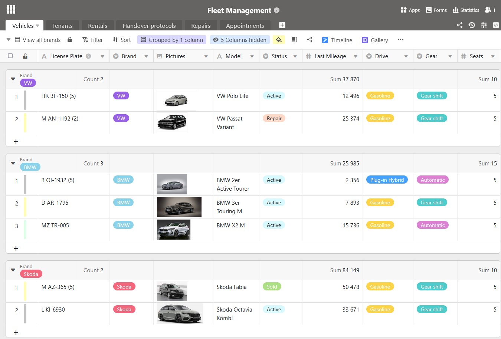
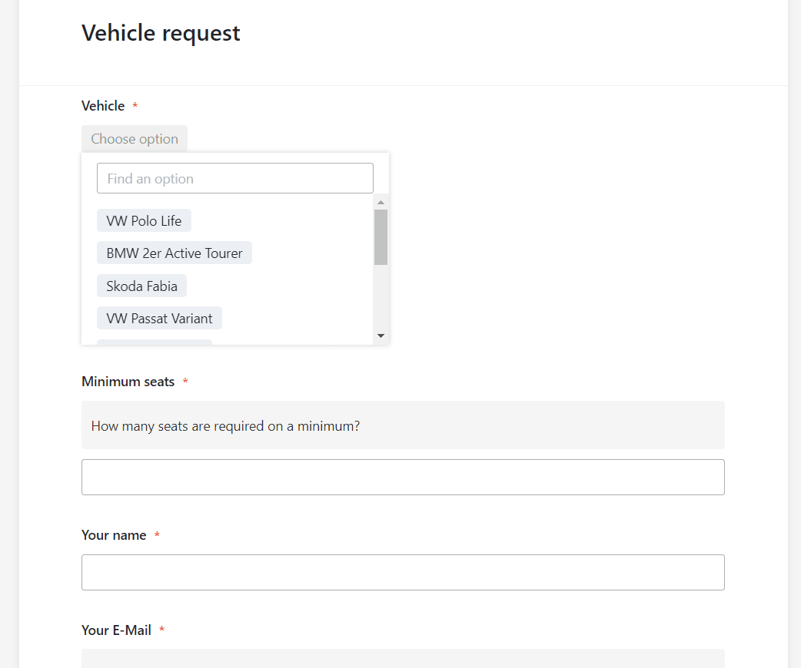
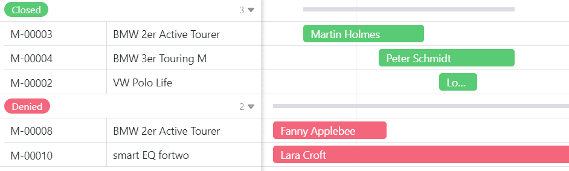

## Optimize a gestão da sua frota com o nosso software de gestão de frotas gratuito

Você está procurandoum software de gerenciamento de frotaeficiente? Com nosso modelo gratuito, você pode sempre monitorar toda a sua frota. Sejamcaminhões, carros, veículos comerciais ou carros de empresa, todos os veículos podem ser gerenciados centralmente.

- Gestão abrangente de frotas:registre todos os dados relevantes sobre sua frota de veículos – desde as especificações técnicas até a última inspeção.
- Fácil reserva e reserva:os funcionários podem reservar veículos on-line de forma prática. Os protocolos de transferência e solicitações de reserva são registrados automaticamente.
- Planejamento de manutenção eficiente:nunca mais perca compromissos importantes de manutenção ou reparo. Você pode planejar e documentar todos os compromissos centralmente por meio do gerenciamento digital de frotas.
- Transparência de custos:ao registrarviagense despesas detalhadamente, você obtém uma visão geral abrangente dos custos contínuos da sua frota.
- Personalização flexível:O modelo de gestão de frotas é totalmente personalizável e pode ser adaptado às necessidades individuais da sua empresa.

Gestão abrangente de frotas:registre todos os dados relevantes sobre sua frota de veículos – desde as especificações técnicas até a última inspeção.

Fácil reserva e reserva:os funcionários podem reservar veículos on-line de forma prática. Os protocolos de transferência e solicitações de reserva são registrados automaticamente.

Planejamento de manutenção eficiente:nunca mais perca compromissos importantes de manutenção ou reparo. Você pode planejar e documentar todos os compromissos centralmente por meio do gerenciamento digital de frotas.

Transparência de custos:ao registrarviagense despesas detalhadamente, você obtém uma visão geral abrangente dos custos contínuos da sua frota.

Personalização flexível:O modelo de gestão de frotas é totalmente personalizável e pode ser adaptado às necessidades individuais da sua empresa.

## Vantagens do nosso software de gestão de frotas em resumo

Onossosoftware de gestão de frotaspermite-lhe poupar tempo e recursos. Ao gerir todos os dados dos veículos de forma centralizada, evita a duplicação de trabalho e reduz o risco de erros.

•Gratuito: Para usar nosso software de gerenciamento de frotas gratuitamente, você só precisa seregistrarcom seu endereço de e-mail.

•Conveniente: Graças ao software de gerenciamento digital de frotas, seus dados podem ser acessados de qualquer lugar e a qualquer hora, além de estarem protegidos contra perdas.

•Intuitivo: O gerenciamento de frotas é fácil de entender e, ao contrário de um modelo de gerenciamento de frotas do Excel, é gratuito, visualmente atraente e menos propenso a erros.

•Flexível: adicione tabelas, colunas e arquivos como desejar e adapte o software de gerenciamento de frotas às suas necessidades individuais gratuitamente.

-Proteção de dados: O armazenamento seguro e compatível com o RGPD dos dados na nuvem ou no local permite um controlo total, tal como os direitos de acesso granulares.

•Poderoso: onde outras ferramentas, como um modelo Excel de gerenciamento de frotas (gratuito ou caro) atingem seus limites, o SeaTable está apenas começando. Isso torna o trabalho com big data divertido!

-Sempre atualizado: Mantenha-se sempre atualizado graças às funções de comunicação, ao histórico completo de alterações e à atualização em tempo real.

-Escalável: A nossa solução cresce com a sua equipa - independentemente de ter um ou mil funcionários.

## Gestão clara de frotas sem modelo Excel grátis

Com o software de gerenciamento de frotas você pode planejar o uso de seus veículos com precisão. Abaixo explicamos como você pode gerenciar facilmente reservas, devoluções, reparos e agendamentos de inspeção.

O primeiro passo é compilar umavisão geral dos seus veículos: você pode inserir qualquer informação que seja importante para você. Com diferentestipos de colunasevisualizações,você pode projetar o gerenciamento de sua frota da maneira que desejar. Ao contrário de um modelo de Excel de gerenciamento de frota, você pode carregar fotos gratuitamente que podem ser vistas noplugin de galeria. Adicione informações adicionais, como marca, modelo, placa e quilometragem para descrever seus veículos. Outros documentos, como contratos de compra, certificados de seguro ou faturas, também podem ser carregados emcolunas de arquivo.

Abaixo você encontrará mais motivos pelos quais nosso software de gerenciamento de frotas é muito superior ao gerenciamento de frotas no Excel.

### Gerir marcações e reservas

Gerencie todas as suasreservasde veículos em uma única tabela. Para fazer uma reserva, os funcionários interessados usam umformulário webbaseado nas colunas desta tabela. Lá, eles inserem os dados de contato, selecionam o veículo desejado e especificam o período de utilização.

Após o envio, a solicitação aparece imediatamente na sua tabela e você pode processá-la. Como as tabelas estãovinculadas, você pode atribuir cada solicitação a um funcionário e ao veículo desejado. Em seguida, verifique se o veículo estará disponível no horário desejado ou se já estará reservado para esse período. Para fazer isso, use oplugin Timeline, que mostra claramente as sobreposições de reservas.

Como em nosso exemplo, você pode rejeitar a solicitação que chegou depois. O SeaTable permite que você use botões paraautomatizardeterminados processos no software de gerenciamento de frotas e iniciá-los com apenas um clique. Isso permite que você processe facilmente as solicitações e rejeite ou confirme a reserva do veículo com o toque de um botão. Ume-mail predefinidoserá enviado ao candidato com as informações relevantes.

### Manter um olho na manutenção

Como você deve sempre documentar acondição atual dos seus veículos,os protocolos de entregasão essenciais no gerenciamento de frotas. Você pode usá-lo para registrar diretamentequalquer danoou outro sinal de desgaste. Para fazer isso, use novamente um formulário web, que aparece diretamente na tabela após o envio. Se forem necessáriosreparos, você pode documentar o andamento do reparo na quinta tabela.

Para manter todos os veículos prontos para uso, você deve ficar de olho regularmente em compromissos comoinspeçõesetrocas de pneus. A inspeção principal doTÜV, que ocorre a cada dois anos na Alemanha, também é obrigatória para que os veículos da sua frota possam continuar a participar com segurança do trânsito.Notificaçõespredefinidas permitem que você informe todos os envolvidos em tempo hábil sobre os próximos compromissos. Isso significa que você não precisa olhar o calendário do seu software de gerenciamento de frota todos os dias – o SeaTable envia lembretes automaticamente na hora certa.

## Porquê o SeaTable?

SeaTable é uma poderosa plataforma sem código para criar bancos de dados e aplicativos. Com nosso modelo você pode digitalizar facilmente suagestão de frota. Como software de gerenciamento de frotas, o SeaTable é gratuito ou muito mais barato do que outros provedores de gerenciamento de frotas.

Pode encontrar mais informações e dicas sobre como tirar o máximo partido do nossosoftware de gestão de frotasno nosso artigo do blogue sobregestão de frotas.

Com nosso modelo gratuito paragerenciamento digital de frotas, você pode otimizar seus processos e reduzir seus custos. Experimente agora e veja você mesmo!

## Modelo interativo

Percorra o nosso modelo incorporado de forma interactiva ou leia a descrição clicando no símbolo i a seguir ao nome do modelo. Isto dar-lhe-á uma melhor noção das funções do software de gestão de frotas gratuito. Se tiver dúvidas ou problemas, recomendamos a nossasecção de ajuda.
