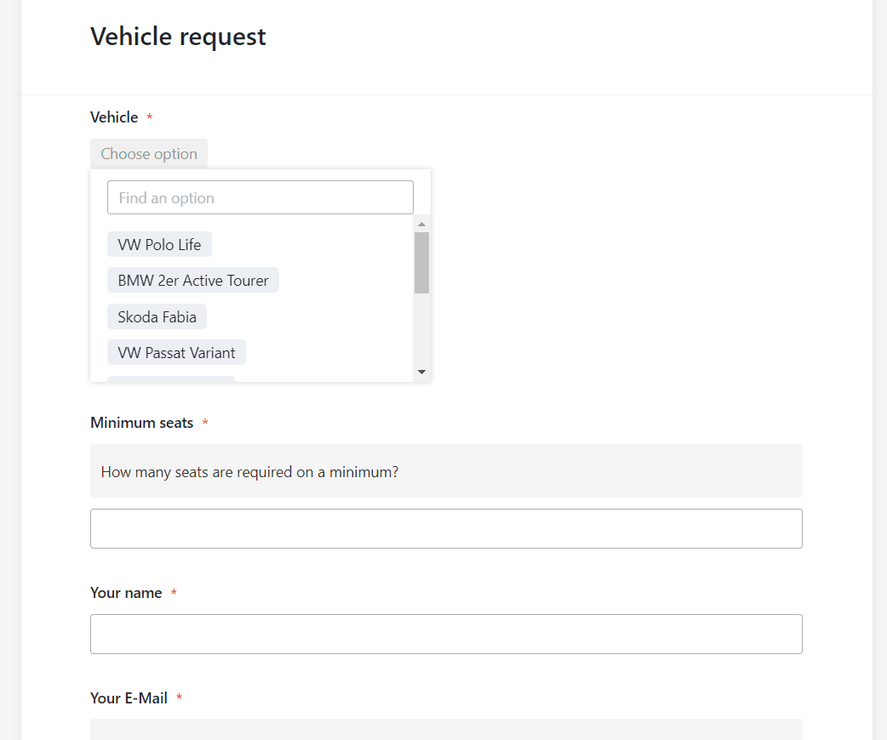

## Оптимизируйте управление автопарком с помощью нашего бесплатного программного обеспечения для управления автопарком

Вы ищете эффективноепрограммное обеспечение для управления автопарком? С помощью нашего бесплатного шаблона вы всегда сможете отслеживать весь свой автопарк. Будь тогрузовики, легковые автомобили, коммерческие автомобили или служебные автомобили— всеми транспортными средствами можно управлять централизованно.

- Комплексное управление автопарком:регистрируйте все необходимые данные о вашем автопарке — от технических характеристик до последнего техосмотра.
- Простое бронирование и резервирование:сотрудники могут удобно бронировать автомобили онлайн. Протоколы передачи и запросы на бронирование регистрируются автоматически.
- Эффективное планирование технического обслуживания:больше никогда не пропускайте важные мероприятия по техническому обслуживанию или ремонту. Вы можете планировать и документировать все встречи централизованно с помощью цифрового управления автопарком.
- Прозрачность расходов:детально регистрируяпоездкии расходы, вы получаете полную картину текущих расходов вашего автопарка.
- Гибкая настройка:шаблон управления автопарком полностью настраивается и может быть адаптирован к индивидуальным потребностям вашей компании.

Комплексное управление автопарком:регистрируйте все необходимые данные о вашем автопарке — от технических характеристик до последнего техосмотра.

Простое бронирование и резервирование:сотрудники могут удобно бронировать автомобили онлайн. Протоколы передачи и запросы на бронирование регистрируются автоматически.

Эффективное планирование технического обслуживания:больше никогда не пропускайте важные мероприятия по техническому обслуживанию или ремонту. Вы можете планировать и документировать все встречи централизованно с помощью цифрового управления автопарком.

Прозрачность расходов:детально регистрируяпоездкии расходы, вы получаете полную картину текущих расходов вашего автопарка.

Гибкая настройка:шаблон управления автопарком полностью настраивается и может быть адаптирован к индивидуальным потребностям вашей компании.

## Краткий обзор преимуществ нашего программного обеспечения для управления автопарком

Нашепрограммное обеспечение для управления автопаркомэкономит ваше время и ресурсы. Благодаря централизованному управлению всеми данными о транспортных средствах вы избежите дублирования работы и снизите риск ошибок.

•Бесплатно: чтобы бесплатно использовать наше программное обеспечение для управления автопарком, вам нужно толькозарегистрироваться, указав свой адрес электронной почты.

•Удобно: благодаря программному обеспечению для цифрового управления автопарком ваши данные доступны из любого места и в любое время, при этом они защищены от потери.

•Интуитивно понятное: удобное для пользователя управление автопарком легко понять, и, в отличие от шаблона Excel для управления автопарком, оно бесплатно, визуально привлекательно и менее подвержено ошибкам.

•Гибкость: добавляйте таблицы, столбцы и файлы по своему усмотрению и бесплатно адаптируйте программное обеспечение для управления автопарком к своим индивидуальным потребностям.

-Защита данных: безопасное и соответствующее требованиям GDPR хранение данных в облаке или в помещениях позволяет полностью контролировать их, а также предоставлять подробные права доступа.

•Мощный: там, где другие инструменты, такие как шаблон Excel для управления автопарком (от бесплатного до дорогого), достигают своих пределов, SeaTable только начинает. Это делает работу с большими данными увлекательной!

-Всегда в курсе событий: всегда оставайтесь в курсе событий благодаря функциям связи, полной истории изменений и обновлению в режиме реального времени.

-Масштабируемость: наше решение растет вместе с вашей командой - независимо от того, один у вас сотрудник или тысяча.

## Бесплатное управление автопарком без шаблона Excel

С помощью программного обеспечения для управления автопарком вы можете точно планировать использование своих транспортных средств. Ниже мы объясним, как вы можете легко управлять заказами, возвратами, ремонтами и осмотрами.

Первый шаг — составитьобзор ваших транспортных средств: вы можете ввести любую важную для вас информацию. Используя различныетипы столбцовипредставления,вы можете организовать управление своим автопарком так, как вам удобно. В отличие от шаблона Excel для управления автопарком, вы можете бесплатно загружать фотографии, которые можно просматривать вплагине галереи. Добавьте дополнительную информацию, такую как марка, модель, номерной знак и пробег, для описания вашего транспортного средства. Другие документы, такие как договоры купли-продажи, страховые свидетельства или счета-фактуры, также можно загружать встолбцы файлов.

Ниже вы найдете дополнительные причины, по которым наше программное обеспечение для управления автопарком намного превосходит систему управления автопарком в Excel.

### Управление бронированиями и резервированием

Управляйте всемибронированиямитранспортных средств в одной таблице. Для бронирования заинтересованные сотрудники используютвеб-форму, составленную на основе столбцов этой таблицы. Там они вводят контактные данные, выбирают желаемое транспортное средство и указывают период использования.

После отправки запрос сразу же появляется в вашей таблице и вы можете его обработать. Поскольку таблицысвязаны, вы можете назначить каждый запрос определенному сотруднику и желаемому транспортному средству. Затем проверьте, доступен ли автомобиль в желаемое время или он уже забронирован на этот период. Для этого используйтеплагин Timeline, который наглядно показывает совпадения бронирований.

Как и в нашем примере, вы можете отклонить запрос, поступивший позже. SeaTable позволяет использовать кнопки дляавтоматизацииопределенных процессов в программном обеспечении для управления автопарком и запускать их всего одним щелчком мыши. Это позволяет вам легко обрабатывать заявки и отклонять или подтверждать бронирование автомобиля одним нажатием кнопки. Затем заявителю будет отправленопредварительно заданное электронное письмос соответствующей информацией.

### Следим за техническим обслуживанием

Поскольку вам всегда следует документироватьтекущее состояние ваших транспортных средств,протоколы передачиимеют важное значение в управлении автопарком. Вы можете использовать его для непосредственной регистрациилюбых поврежденийили других признаков износа. Для этого снова воспользуйтесь веб-формой, которая появляется непосредственно в таблице после отправки. Если требуетсяремонт, вы можете задокументировать ход ремонта в пятой таблице.

Чтобы все транспортные средства были готовы к использованию, вам следует регулярно следить за проведением таких мероприятий, кактехосмотризамена шин. Основной техосмотрTÜV, который проводится в Германии каждые два года, также является обязательным, чтобы транспортные средства вашего автопарка могли продолжать безопасно участвовать в дорожном движении. Предустановленныеуведомленияпозволяют своевременно информировать всех участников о предстоящих встречах. Это значит, что вам не придется каждый день заглядывать в календарь вашего программного обеспечения для управления автопарком — SeaTable автоматически отправляет вам напоминания в нужное время.

## Почему именно SeaTable?

SeaTable — мощная платформа для создания баз данных и приложений без написания кода. С помощью нашего шаблона вы можете легко оцифроватьуправление своим автопарком. SeaTable — это программное обеспечение для управления автопарком, которое можно использовать бесплатно или гораздо дешевле, чем у других поставщиков услуг по управлению автопарком.

Дополнительную информацию и советы о том, как максимально эффективно использовать нашепрограммное обеспечение для управления автопарком, вы найдете в статье нашего блога обуправлении автопарком.

С помощью нашего бесплатного шаблона дляцифрового управления автопаркомвы сможете оптимизировать свои процессы и сократить расходы. Попробуйте сейчас и убедитесь сами!

## Интерактивный шаблон

Прокрутите наш интерактивный встроенный шаблон или прочитайте описание, нажав на символ i после названия шаблона. Это позволит вам лучше понять функции бесплатного программного обеспечения для управления автопарком. Если у вас возникнут вопросы или проблемы, рекомендуем воспользоваться нашимразделом помощи.
