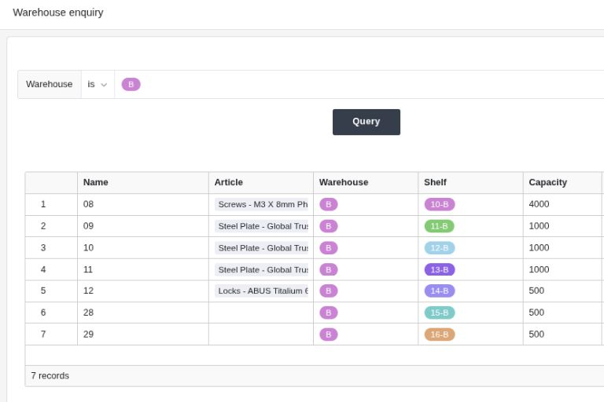

Behalten Sie stets den Überblick über Ihre Lagerbestände und die Auslastung Ihres Lagerplatzes – ohne teure Spezialsoftware oder eine unübersichtliche Lagerverwaltung in Excel. Mit der Lagersoftware von SeaTable managen Sie Ihr Lager **einfach, schnell, übersichtlich und automatisiert**.



## Behalten Sie mit unserer Vorlage für Ihre einfache Lagerverwaltung den Überblick

Ihnen fehlen Echtzeitdaten für aussagkräftige Auswertungen? Jetzt nicht mehr! Oder vermissen Sie ein automatisiertes Benachrichtigungssystem, wenn Lagerbestände kritisch werden? In wenigen Klicks eingerichtet – ohne Programmierkenntnisse oder Mehrkosten! Die einfache **No-Code Lagermanagement Vorlage** von SeaTable bietet

- **Übersicht über alle Produkte** mit Bestand, Einkaufspreis, Lieferzeit etc.
- **Warenein- und ausgänge**
- **Lagerort** der Produkte und Auslastung deiner Lager
- **Dashboards für Echtzeit-Auswertungen** z. B. Lagerumschlagshäufigkeit oder Lagerflächen-Nutzungsgrad

## SeaTable ist Ihre Lagerverwaltung Software, weil ...

- es Ihnen **kollaboratives Arbeiten** an gemeinsamen Daten in Echtzeit ermöglicht – anders als bei einer Lagerverwaltung in Excel.
- es sich individuell **an Ihre spezifischen Lagersoftware Anforderungen anpassen** lässt – ohne Programmierkenntnisse oder teure Zusatzfunktionen.
- es **unendlich skalierbar und erweiterbar ist** – machen Sie aus Ihrem Lagermanagement z. B. ein vollwertiges [Supply Chain Management]() oder ERP-System.
- es ausschließlich auf Servern in Deutschland gehostet wird und dadurch **100 % DSGVO-konform** ist.
- Sie durch **individuelle Nutzerberechtigungen**. entscheiden, wer welche Informationen sehen oder bearbeiten darf.
- Sie mit SeaTable Server Ihre Lagerverwaltung online **bei Bedarf auch on-premises** nutzen können.

## Lagerverwaltung Software in der Cloud

SeaTable ist eine vollwertige No-Code Datenbanklösung und bietet alle Funktionen integriert an, die für eine moderne Lagerverwaltung in der Cloud benötigt werden. Verknüpfen Sie Ihre Produktdaten mit Ihren Lagerdaten, bauen Sie ein eigenes System zur **Lagerverwaltung mit Frontend**, automatisieren Sie Benachrichtigungen und verbinden Sie Drittanbietersoftware dank **integrierter API** – einfach, schnell und ohne technische Integration.

## Einfache Lagerverwaltung online dank benutzerfreundlicher Oberfläche

SeaTable eignet sich als Lagerverwaltungssoftware speziell für kleine Unternehmen oder Handwerksbetriebe, die Ihr Produkt- oder Materiallager effizienter organisieren möchten und die nach einer **Alternative zur Lagerverwaltung in Excel** suchen oder denen Spezialsoftware zu unflexibel oder teuer ist. Denn SeaTable bietet beides: eine vollwertige, anpassbare und skalierbare Datenbank für verschiedenste Anwendungsfälle und eine Lagerverwaltung App als Frontend.

## Bauen Sie sich mit SeaTable Ihre Lagerverwaltung Software

Unsere Vorlage ermöglicht es Ihnen ein umfassendes System zur Lagerverwaltung mit wenigen Klicks aufzubauen. Da SeaTable vollkommen flexibel anpassbar ist können Sie auch die Vorlage nach Ihrem individuellen Bedarf anpassen und zusätzliche Spalten, Tables, Benachrichtigungen, Automatisierungen, Verknüpfungen u.v.m. hinzufügen – oder um weitere Komponenten wie ein **Lieferantenmanagement** erweitern. Setzen Sie Ihr eigenes System zur Lagerverwaltung um!

### Alle Artikeldaten auf einen Blick

Legen Sie Ihre Produkte und Artikel im Table "Article Master" an und verknüpfen Sie es mit der Table "Warehouses and Capacity", um jederzeit den aktuellen Lagerbestand zu haben. Neue Artikel oder Produkte legen Sie ganz einfach über ein Formular an.

### Warenein- und ausgänge einfach erfassen

Buchen Sie Lagerein- und -ausgänge einfach über ein Formular in der Lagerverwaltung App ein. Erfassen Sie dazu neben dem Bestand und ggf. einer Zustandsbeschreibung auch den Lagerort – z. B. Warenhaus und Lagerort – von dem der Bestand abgebucht werden soll. So bleiben Ihre Lagerdaten jederzeit aktuell!

### Lagerplatzbelegung und Lagerauslastung auf einen Blick

Die Auslastung Ihrer Lagerplätze und Lagerräume erfassen Sie im Table "Warehouses and Capacity". Dieses Table ist mit Ihrer Produktübersicht und dem Warenein- und -ausgang verknüpft. So wissen Sie jederzeit wie viel von welchem Produkt auf welchem Lagerplatz eingelagert ist und können den **Warenumschlag und den Lagerflächen-Nutzungsgrad auswerten** – und so rechtzeitig auf Mehr- oder Minderbedarfe reagieren.

### Integrierte Benachrichtigungen

Ein Artikel wurde falsch eingebucht und nun ist ein Lagerplatz überbucht? Oder der Sicherheitsbestand wurde unterschritten und es muss nachbestellt werden? Nutzen Sie die automatisierten Benachrichtigungen damit kritische Bestandveränderungen in Ihrem Lager nicht mehr übersehen werden.

### Übersichtliche Frontend App für Lagerverwaltung

Nutzen Sie die No-Code Universal App als Lagerverwaltung Online Frontend und erstellen Sie mit wenigen Klicks Formulare, übersichtliche Ansichten oder Dashboards mit relevanten KPI für Ihre Analysen. Die Bestands- und Lagerabfrage bietet **gezielte Bestandsinformationen** zu einzelnen Produkten oder **Belegungsinformationen zu Lagerorten** – ohne umständliche manuelle Suchen.

## Die perfekte Alternative zu teurer Lagerverwaltung Software  

Spezielle Lagerverwaltungssoftware lässt sich oft nur im Rahmen eines größeren Warenwirtschafts- oder ERP-Systems nutzen und wird dadurch schnell teuer. Kostenlose Anbieter sind dagegen oft nicht flexibel genug und es fehlt an wichtigen Kernfuktionen, die für ein effizientes System zur Lagerverwaltung unerlässlich sind. SeaTable überzeugt durch seine Flexibilität und Anpassbarkeit, die es ermöglicht, auch dynamische Prozesse in Ihrer Lagerverwaltungssoftware einfach abzubilden.

- **keine Integrations-Kosten** oder IT-Aufwände
- **keine Excel-Formel-Kenntnisse notwendig**
- **einfache Anbindung von Drittanbieter-Tools** durch integrierte API
- **flexibel und skalierbar**

## FAQ – Lagerverwaltungssoftware


Mit der Lagerverwaltungssoftware von SeaTable erfassen Sie alle relevanten Produkt- und Lagerdaten in einer Datenbank. So behalten Sie stets den Überblick über Ihre Lagerbestände, die Lagerorte und die Auslastung Ihrer Warenlager. Dank der integrierten Statistiken können Sie Lagerdaten wie Lagerumschlagshäufigkeit, Lagerreichweite, Durchschnittlicher Lagerbestand oder Lagerflächen-Nutzungsgrad jederzeit in Echtzeit analysieren und Entscheidungen ableiten.



Anbieter kostenloser Lager Software oder eine Excel-Vorlage Lagersoftware bieten in der Regel entweder nur begrenzte kostenlose Basis-Versionen, die schnell teuer werden, wenn Ihr Bedarf steigt, oder stellen ein System zur Verfügung, dass nicht mit Ihren Anforderungen wächst. SeaTable dagegen bietet bereits im Free Abo alle notwendigen Funktionen für eine effiziente Lagerverwaltungssoftware. Sie können unbegrenzt skalieren und zahlen für zusätzlichen Kapazitäten oder Features erst, wenn Sie sie brauchen.



Die Software Lagerverwaltung von SeaTable kann jeden Anwendungsfall abdecken. Möchten Sie Ihre Lagersoftware zu einem vollwertigen Warenwirtschaftssystem erweitern? Ihre komplette Supply Chain managen? Oder vielleicht ein ERP-System aufbauen? Die einfache Lagerverwaltung Software von SeaTable ist nur der Anfang und lässt sich zu jedem Datenmanagement Anwendungsfall ausbauen, den Sie benötigen.
