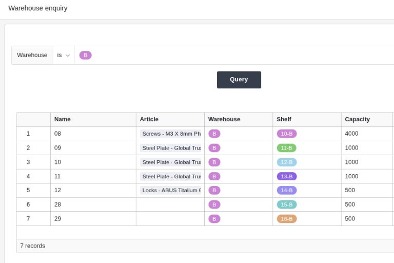
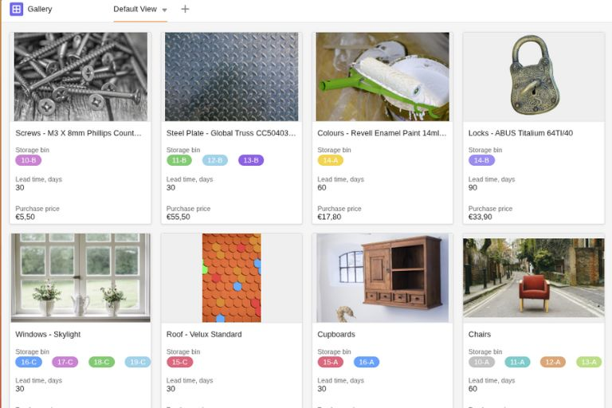
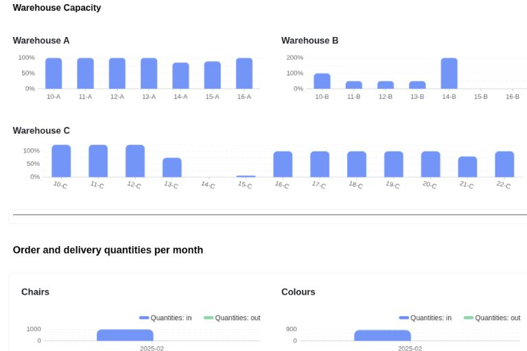

Mantenga siempre una visión general de sus niveles de existencias y de la utilización de su espacio de almacenamiento, sin necesidad de costosos programas informáticos especiales ni de una confusa gestión de almacén en Excel. Con el software de almacén de SeaTable, podrá gestionar su almacén **de forma sencilla, rápida, clara y automática**.



## Mantenga una visión general con nuestra plantilla para la gestión sencilla de su almacén

¿Le faltan datos en tiempo real para realizar análisis significativos? Ya no. ¿O echa de menos un sistema de notificación automatizado cuando los niveles de existencias se vuelven críticos? Configúrelo en unos pocos clics, ¡sin conocimientos de programación ni costes adicionales! La sencilla plantilla **sin código** de gestión de almacenes de SeaTable ofrece

- **Vista general de todos los productos** con existencias, precio de compra, plazo de entrega, etc.
- **Entrada y salida de mercancías**
- **Ubicación de los productos** y utilización de sus almacenes
- **Cuadros de mando para análisis en tiempo real**, por ejemplo, índice de rotación de existencias o índice de utilización del espacio de almacenamiento

## SeaTable es su software de gestión de almacenes porque ...

- le permite trabajar **en colaboración** sobre datos compartidos en tiempo real - a diferencia de la gestión de almacenes en Excel.
- puede personalizarse **según sus necesidades específicas de software de almacén** - sin conocimientos de programación ni costosas funciones adicionales.
- es **infinitamente escalable y ampliable** - convierta su gestión de almacén en un sistema completo de [gestión de la cadena de suministro]() o ERP, por ejemplo.
- está alojado exclusivamente en servidores de Alemania y, por lo tanto, **cumple al 100% la GDPR**.
- usted decide quién puede ver o editar qué información mediante **autorizaciones individuales de usuario**.
- con SeaTable Server puede utilizar su gestión de almacén online **si lo desea también on-premises**.

## Software de gestión de almacenes en la nube

SeaTable es una solución completa de base de datos sin código y ofrece todas las funciones integradas necesarias para la gestión moderna de almacenes en la nube. Vincule los datos de sus productos con los de su almacén, construya su propio sistema de **gestión de almacenes con front end**, automatice las notificaciones y conecte software de terceros gracias a la **API integrada**, de forma sencilla, rápida y sin integración técnica.

## Gestión sencilla del almacén en línea gracias a una interfaz fácil de usar

SeaTable es especialmente adecuado como software de gestión de almacenes para pequeñas empresas o negocios artesanales que desean organizar su almacén de productos o materiales de forma más eficiente y buscan una **alternativa a la gestión de almacenes en Excel** o para quienes un software especial resulta demasiado inflexible o caro. SeaTable ofrece ambas cosas: una base de datos completa, personalizable y escalable para una amplia gama de aplicaciones y una aplicación de gestión de almacenes como interfaz.

## Construya su propio software de gestión de almacenes con SeaTable

Nuestra plantilla le permite construir un completo sistema de gestión de almacenes con sólo unos clics. Dado que SeaTable es completamente personalizable, también puede adaptar la plantilla a sus necesidades individuales y añadir columnas adicionales, tablas, notificaciones, automatizaciones, enlaces y mucho más, o ampliarla con componentes adicionales como la **gestión de proveedores**. ¡Realice su propio sistema de gestión de almacenes!

### Todos los datos del artículo de un vistazo

Cree sus productos y artículos en la tabla "Maestro de artículos" y vincúlela a la tabla "Almacenes y capacidad" para disponer en todo momento del nivel de existencias actual. Puede crear fácilmente nuevos artículos o productos mediante un formulario.

### Registre fácilmente las entradas y salidas de mercancías.

Registre fácilmente las entradas y salidas de mercancías mediante un formulario en la aplicación de gestión de almacenes. Además de las existencias y, si es necesario, una descripción de su estado, introduzca también el almacén del que se van a cargar las existencias. Así mantendrá actualizados en todo momento los datos de su almacén.

### Ocupación del almacén y utilización del almacén de un vistazo

Registre la utilización de sus almacenes y salas de almacenamiento en la tabla "Almacenes y capacidad". Esta tabla está vinculada a su resumen de productos y a las entradas y salidas de mercancías. De este modo, siempre sabrá qué cantidad de qué producto se almacena en cada almacén y podrá analizar la **rotación de mercancías y la tasa de utilización del espacio de almacenamiento**, y reaccionar así a tiempo ante un exceso o una reducción de las necesidades.

### Notificaciones integradas

¿Se registró un artículo incorrectamente y ahora una ubicación está sobrecargada? ¿O el nivel de existencias de seguridad se ha rebajado y hay que volver a pedirlo? Utilice las notificaciones automatizadas para que los cambios críticos de existencias en su almacén ya no se pasen por alto.

### Aplicación front-end clara para la gestión de almacenes

Utilice la aplicación universal sin código como front-end en línea para la gestión del almacén y cree formularios, vistas claras o cuadros de mando con los KPI relevantes para sus análisis con sólo unos clics. La consulta de existencias y almacenes proporciona **información específica sobre las existencias** de productos individuales o **información sobre la ocupación de los almacenes**, sin engorrosas búsquedas manuales.

## La alternativa perfecta al costoso software de gestión de almacenes

A menudo, el software especializado de gestión de almacenes sólo puede utilizarse como parte de un sistema más amplio de gestión de mercancías o ERP, por lo que rápidamente resulta caro. Por otra parte, los proveedores gratuitos no suelen ser lo suficientemente flexibles y carecen de funciones básicas importantes que son esenciales para un sistema de gestión de almacenes eficaz. SeaTable impresiona por su flexibilidad y capacidad de personalización, que facilita la asignación de procesos incluso dinámicos en su software de gestión de almacenes.

- **Sin costes de integración** ni esfuerzo informático
- **no requiere conocimientos de fórmulas de Excel**
- **fácil conexión de herramientas de terceros** gracias a la API integrada
- **flexible y escalable**

## FAQ - Software de gestión de almacenes


Con el software de gestión de almacenes de SeaTable, puede registrar todos los datos relevantes del producto y del almacén en una base de datos. Esto significa que siempre tendrá una visión general de sus niveles de existencias, ubicaciones de almacenamiento y utilización del almacén. Gracias a las estadísticas integradas, podrá analizar en cualquier momento y en tiempo real datos del almacén como el índice de rotación de existencias, el rango de existencias, el nivel medio de existencias o el índice de utilización del espacio del almacén y tomar decisiones.



Los proveedores de software de almacén gratuito o de un software de almacén con plantilla Excel suelen ofrecer sólo versiones básicas gratuitas limitadas, que se encarecen rápidamente a medida que aumentan sus necesidades, o bien proporcionan un sistema que no crece con sus requisitos. SeaTable, en cambio, ya ofrece todas las funciones necesarias para un software de gestión de almacenes eficaz en la suscripción gratuita. Puede escalar indefinidamente y sólo pagar por capacidad o funciones adicionales cuando las necesite.



El software de gestión de almacenes de SeaTable puede cubrir cualquier caso de uso. ¿Desea ampliar su software de almacén y convertirlo en un completo sistema de gestión de mercancías? ¿Gestionar toda su cadena de suministro? ¿O quizás establecer un sistema ERP? El sencillo software de gestión de almacenes de SeaTable es sólo el principio y puede ampliarse a cualquier caso de uso de gestión de datos que necesite.
