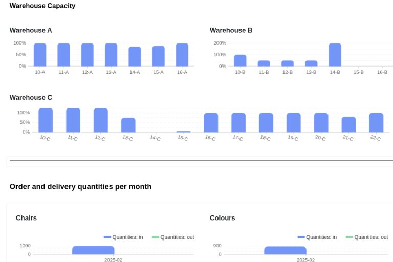

Mantenha sempre uma visão geral dos seus níveis de stock e da utilização do seu espaço de armazenamento - sem software especial dispendioso ou uma gestão de armazém confusa em Excel. Com o software de armazém da SeaTable, pode gerir o seu armazém de forma **simples, rápida, clara e automática**.



## Mantenha uma visão geral com o nosso modelo para a gestão simples do seu armazém

Está a perder dados em tempo real para avaliações significativas? Já não precisa! Ou sente falta de um sistema de notificação automática quando os níveis de stock se tornam críticos? Configure-o em apenas alguns cliques - sem conhecimentos de programação ou custos adicionais! O simples **modelo de gestão de armazém sem código** da SeaTable oferece-lhe

- **Visão geral de todos os produtos** com stock, preço de compra, prazo de entrega, etc.
- **Entrada e saída de mercadorias**
- **Localização de armazenamento** dos produtos e utilização dos seus armazéns
- **Painéis de controlo para avaliações em tempo real**, por exemplo, taxa de rotação de stocks ou taxa de utilização do espaço de armazenamento

## O SeaTable é o seu software de gestão de armazéns porque ...

- permite-lhe trabalhar **colaborativamente** em dados partilhados em tempo real - ao contrário da gestão de armazéns em Excel.
- pode ser **personalizado** individualmente de acordo com os requisitos específicos do seu software de armazém - sem conhecimentos de programação ou funções adicionais dispendiosas.
- é **infinitamente escalável e expansível** - transforme a sua gestão de armazém num sistema completo de [gestão da cadeia de fornecimento]() ou ERP, por exemplo.
- está alojado exclusivamente em servidores na Alemanha e, por conseguinte, está **100% em conformidade com o RGPD**.
- pode decidir quem pode ver ou editar que informação através de **autorizações individuais de utilizador**.
- com o SeaTable Server pode utilizar a sua gestão de armazém online **se necessário também no local**.

## Software de gestão de armazéns na nuvem

O SeaTable é uma solução completa de base de dados sem código e oferece todas as funções integradas necessárias para a gestão moderna de armazéns na nuvem. Ligue os dados dos seus produtos aos dados do seu armazém, crie o seu próprio sistema de **gestão de armazém com front end**, automatize as notificações e ligue software de terceiros graças à **API integrada** - de forma fácil, rápida e sem integração técnica.

## Gestão fácil do armazém online graças à interface de fácil utilização

O SeaTable é particularmente adequado como software de gestão de armazém para pequenas empresas ou empresas artesanais que pretendem organizar o seu armazém de produtos ou materiais de forma mais eficiente e procuram uma **alternativa à gestão de armazém em Excel** ou para quem um software especial é demasiado inflexível ou dispendioso. O SeaTable oferece ambos: uma base de dados completa, personalizável e escalável para uma vasta gama de aplicações e uma aplicação de gestão de armazém como front end.

## Crie o seu próprio software de gestão de armazéns com o SeaTable

O nosso modelo permite-lhe construir um sistema de gestão de armazém abrangente com apenas alguns cliques. Uma vez que o SeaTable é completamente personalizável, também pode adaptar o modelo às suas necessidades individuais e adicionar colunas, tabelas, notificações, automatizações, ligações e muito mais - ou ampliá-lo com componentes adicionais, tais como **gestão de fornecedores**. Implemente o seu próprio sistema de gestão de armazéns!

### Todos os dados do artigo num relance

Crie os seus produtos e artigos na tabela "Mestre de artigos" e ligue-a à tabela "Armazéns e capacidade" para ter sempre o nível de stock atual. Pode criar facilmente novos artigos ou produtos utilizando um formulário.

### Registe facilmente as entradas e saídas de mercadorias

Introduza simplesmente as entradas e saídas de mercadorias através de um formulário na aplicação de gestão de armazém. Para além do stock e, se necessário, de uma descrição do estado, introduza também o local de armazenamento - por exemplo, armazém e local de armazenamento - a partir do qual o stock deve ser registado. Isto mantém os dados do seu armazém sempre actualizados!

### Veja rapidamente a ocupação das posições no depósito e a utilização do armazém

Registe a utilização dos seus locais de armazenamento e salas de armazenamento na tabela "Armazéns e capacidade". Esta tabela está ligada à sua visão geral de produtos e às entradas e saídas de mercadorias. Isto significa que sabe sempre quanto de cada produto está armazenado em cada posição no depósito e pode avaliar o **volume de mercadorias e a taxa de utilização do espaço de armazenamento** - e assim reagir atempadamente a necessidades excessivas ou reduzidas.

### Notificações integradas

Um artigo foi registado incorretamente e agora uma posição no armazém está sobrelotada? Ou o stock de segurança não foi atingido e precisa de fazer uma nova encomenda? Utilize as notificações automáticas para que as alterações críticas de stock no seu armazém não passem despercebidas.

### Aplicação de front-end clara para gestão de armazéns

Utilize a aplicação universal sem código como um front-end online de gestão de armazém e crie formulários, vistas claras ou painéis de controlo com KPIs relevantes para as suas análises com apenas alguns cliques. A consulta de stock e armazém fornece **informações de stock direcionadas** sobre produtos individuais ou **informações de ocupação em locais de armazenamento** - sem pesquisas manuais complicadas.

## A alternativa perfeita ao dispendioso software de gestão de armazéns

Muitas vezes, o software especializado de gestão de armazéns só pode ser utilizado como parte de um sistema de gestão de mercadorias ou ERP de maior dimensão e, por isso, torna-se rapidamente dispendioso. Os fornecedores gratuitos, por outro lado, muitas vezes não são suficientemente flexíveis e carecem de importantes funções essenciais para um sistema de gestão de armazém eficiente. O SeaTable impressiona pela sua flexibilidade e capacidade de personalização, o que facilita o mapeamento de processos dinâmicos no seu software de gestão de armazém.

- **Sem custos de integração** ou esforço de TI
- **não necessita de conhecimentos de fórmulas Excel**
- **fácil ligação de ferramentas de terceiros** através da API integrada
- **flexível e escalável**

## FAQ - Software de gestão de armazéns


Com o software de gestão de armazém da SeaTable, pode registar todos os dados relevantes do produto e do armazém numa base de dados. Isto significa que tem sempre uma visão geral dos seus níveis de stock, locais de armazenamento e utilização da capacidade do armazém. Graças às estatísticas integradas, pode analisar os dados do armazém, como a taxa de rotação do inventário, o intervalo de armazenamento, o nível médio de stock ou a taxa de utilização do espaço de armazenamento, em qualquer altura e em tempo real, e tomar decisões.



Os fornecedores de software de armazém gratuito ou de um modelo de software de armazém em Excel geralmente oferecem apenas versões básicas gratuitas e limitadas, que rapidamente se tornam caras à medida que as suas necessidades aumentam, ou fornecem um sistema que não cresce com as suas necessidades. O SeaTable, por outro lado, oferece todas as funções necessárias para um software de gestão de armazém eficiente, mesmo com uma subscrição gratuita. Pode escalar indefinidamente e só pagar por capacidade ou funcionalidades adicionais quando precisar delas.



O software de gestão de armazéns da SeaTable pode abranger qualquer caso de utilização. Gostaria de expandir o seu software de armazém para um sistema de gestão de inventário completo? Gerir toda a sua cadeia de fornecimento? Ou talvez configurar um sistema ERP? O software simples de gestão de armazéns da SeaTable é apenas o começo e pode ser alargado a qualquer caso de utilização de gestão de dados de que necessite.
