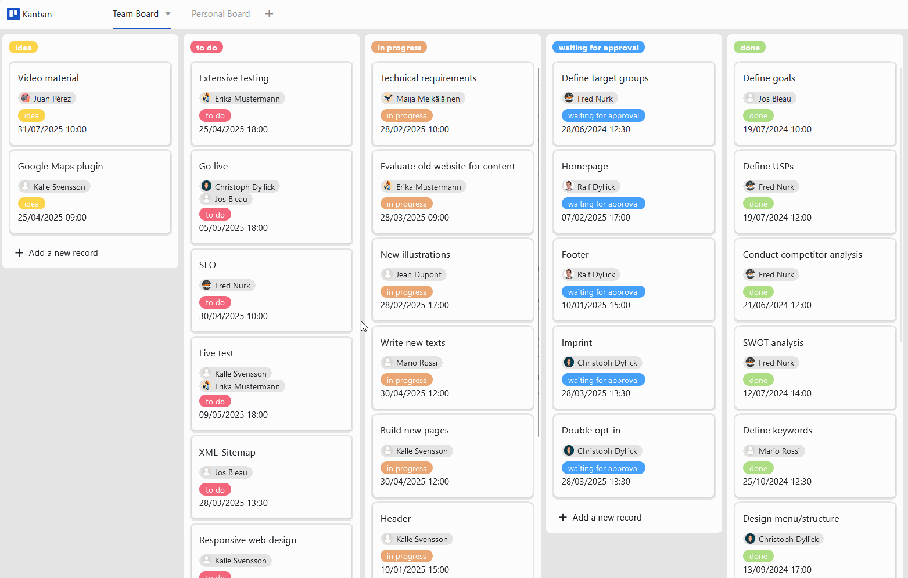

Lagestión de proyectosrequiere un enfoque estructurado. Muchos equipos utilizan el método Kanban para ello, ya sea en el desarrollo de software, el marketing o la gestión de productos. Un tablero Kanban digital no sólo es adecuado para innumerables aplicaciones, sino que también hace que los procesos sean más claros y eficientes. Si desea empezar con un tablero Kanban típico de forma gratuita, le recomendamos la plantilla de tablero Kanban de SeaTable.

## ¿Qué es un tablero Kanban?

Una plantilla de tablero Kanban consta de tarjetas en las que se anotan las tareas importantes y columnas que representan las etapas del proceso. En función del estado del proceso, las tarjetas pasan por las distintas estaciones: El resultado es un flujo continuo de tarjetas, por ejemplo de "por hacer" a "en curso" y a "hecho". En resumen: el tablero Kanban sirve para visualizar flujos de trabajo.

## ¿Cómo crear un tablero Kanban digital?

Para crear un tablero Kanban digital, tienes numerosasherramientas de gestión de proyectosentre las que elegir, como Asana, Monday o Trello, que pueden funcionar como software para tableros Kanban. Sin embargo, a pesar de sus respectivos puntos fuertes, estas herramientas suelen alcanzar sus límites cuando se trata de grandes cantidades de datos y funciones avanzadas de gestión de datos.

Aquí es donde la base de datos sin código SeaTable entra en juego y ofrece unsoftware de tablero Kanban flexiblemente personalizable y gratuitoque también es adecuado para big data. Visualice todo el proceso de su proyecto en SeaTable y diseñe la plantilla de tablero Kanban según sus necesidades. No importa si desea visualizar un tablero Kanban clásico por estado de trabajo o un proceso interno especial: SeaTable le ofrece la flexibilidad que necesita para sus flujos de trabajo.

La gran ventaja: SeaTable puede utilizarse no sólo como software de tablero Kanban, sino también para innumerables aplicaciones más, por ejemplo, en gestión de proyectos, marketing o desarrollo de software. Esto le proporciona una solución todo en uno y reduce el uso de diferentes programas.

## Resumen de las ventajas de la plantilla de tablero Kanban

-Gratuito: Para utilizar el tablero Kanban gratuitamente,sólo tiene que registrarsecon su dirección de correo electrónico.

-Intuitivo: La plantilla de tablero Kanban es fácil de entender y menos propensa a errores que un tablero Kanban en Excel o tarjetas escritas a mano.

-Flexible:añada tantas columnas como desee y personalice la plantilla según sus necesidades.

-Protección de datos: el almacenamiento seguro y conforme al GDPR de los datos en la nube o en las instalaciones permite un control total, al igual que los derechos de acceso granulares.

-Cómodo: Si crea su tablero Kanban digital en línea, podrá acceder a él desde cualquier lugar y en cualquier momento, y además estará protegido contra pérdidas.

-Potente: Donde otras herramientas llegan a sus límites, SeaTable realmente se pone en marcha. ¡Esto hace que trabajar con big data sea divertido!

-Siempreal día: Manténgase siempre al día gracias a las funciones de comunicación, el historial completo de cambios y la actualización en tiempo real.

-Escalable: Nuestra solución crece con su equipo, independientemente de si tiene uno o mil empleados.

## Cómo funciona la plantilla de tablero Kanban

Nuestra plantilla de tablero Kanban ya visualiza un ejemplo de proyecto completo con diferentes tareas. Cree primero la estructura de datos deseada en lavista general tabulardetareas, por ejemplo para registrar información sobre el estado, los responsables, las subtareas y los plazos.

Existen variasvistasque puede utilizar para estructurar los datos o hacer hincapié en determinados aspectos. En la vista de proyecto, por ejemplo, las tareas se agrupan según la fase del proyecto a la que están vinculadas. Para comunicarse con los miembros de su equipo en SeaTable, por ejemplo si desea cederles tareas, sólo tiene quecomentarla tarea correspondiente, marcar a la persona con @ y ésta recibirá unanotificación.

Para visualizar sus tareas en un tablero Kanban de forma gratuita, utilice el plugin Kanban (o alternativamente la aplicación Kanban) de SeaTable. Selecciona una columna de selección única con todas las opciones que necesites paraagrupar tus tarjetas de tareas por estado. Ahora puede simplementearrastrar y soltarcada tarjeta de una columna a la siguiente - ¡y el estado de la tarea se ajusta al instante! Enriquezca sus hojas de ruta con la información adicional que desee de su hoja de cálculo.

## Cómo crear un tablero Kanban digital personal

En nuestra plantilla de tablero Kanban, hemos asignado los miembros responsables del equipo a las tareas mediante unacolumna de empleado. Esto le permite agrupar todas las tareas por miembro del equipo en una vista de equipo ofiltrarlastareas por el usuario actualen una vista personal. Ahora puede crear un tablero Kanban basado en estas vistas: ¡gratis, cómodo y personalizable en cualquier momento! En el tablero personal, cada uno sólo ve sus propias tareas: De esta manera, todo el mundo sabe lo que hay que hacer y puede concentrarse en sulista de tareas individuales.

## Plantilla interactiva

Desplácese por nuestra plantilla incrustada de forma interactiva o lea la descripción haciendo clic en el  que aparece tras el nombre de la plantilla. Esto le dará una mejor idea de las funciones de la plantilla Kanban Board. Si tiene alguna pregunta, nuestra [sección de ayuda]()está a su disposición.
