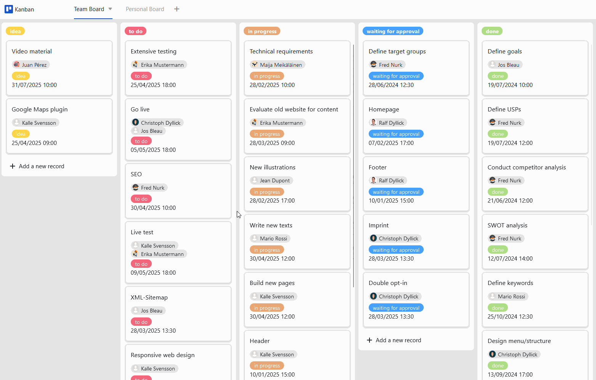

É necessária uma abordagem estruturada nagestão de projectos. Muitas equipas utilizam o método Kanban para este fim - seja no desenvolvimento de software, marketing ou gestão de produtos. Um quadro Kanban digital não só é adequado para inúmeras aplicações, como também torna os processos mais claros e eficientes. Se quiser começar com um quadro Kanban típico e gratuito, recomendamos o modelo de quadro Kanban da SeaTable.

## O que é um quadro Kanban?

Um modelo de quadro Kanban consiste em cartões nos quais são anotadas tarefas importantes e colunas que representam etapas do processo. Dependendo do estado de processamento, os cartões passam pelas várias estações: Isto resulta num fluxo contínuo de cartões, por exemplo, de "a fazer" para "em curso" e para "concluído". Em suma: o quadro Kanban é utilizado para visualizar fluxos de trabalho.

## Como é que se pode criar um quadro Kanban digital?

Para criar um quadro Kanban digital, tem à sua disposição váriasferramentas de gestão de projectos, como Asana, Monday ou Trello, que podem funcionar como software de quadro Kanban. No entanto, apesar dos seus respectivos pontos fortes, estas ferramentas atingem frequentemente os seus limites quando se trata de grandes quantidades de dados e de funções avançadas de gestão de dados.

É aqui que entra a base de dados sem código SeaTable, que oferece umsoftware de quadro Kanban flexível, personalizável e gratuito, que também é adequado para grandes volumes de dados. Visualize todo o processo do seu projeto no SeaTable e conceba o modelo de quadro Kanban de acordo com as suas necessidades! Não importa se pretende visualizar um quadro Kanban clássico por estado de trabalho ou um processo interno especial: O SeaTable oferece-lhe a flexibilidade de que necessita para os seus fluxos de trabalho.

A grande vantagem: o SeaTable pode ser utilizado não só como software de quadro Kanban, mas também para inúmeras outras aplicações, por exemplo, na gestão de projectos, marketing ou desenvolvimento de software. Isto dá-lhe uma solução tudo-em-um e reduz a utilização de diferentes programas.

## Vantagens do modelo de quadro Kanban num relance

-Gratuito: Para utilizar o quadro Kanban gratuitamente,basta registar-secom o seu endereço de correio eletrónico.

-Intuitivo: O modelo de quadro Kanban de fácil utilização é fácil de compreender e menos propenso a erros do que um quadro Kanban em Excel ou cartões manuscritos.

-Flexível:Adicione quantas colunas quiser e personalize o modelo de acordo com as suas necessidades individuais.

-Proteção de dados: O armazenamento seguro e compatível com o RGPD dos dados na nuvem ou no local permite um controlo total, tal como os direitos de acesso granulares.

-Prático: Se criar o seu quadro Kanban digital em linha, pode aceder-lhe a partir de qualquer lugar e a qualquer momento, estando também protegido contra perdas.

-Poderoso: Quando outras ferramentas atingem os seus limites, o SeaTable começa realmente a trabalhar. Isto torna o trabalho com grandes volumes de dados divertido!

-Sempre atualizado: Mantenha-se sempre atualizado graças às funções de comunicação, ao histórico completo de alterações e à atualização em tempo real.

-Escalável: A nossa solução cresce com a sua equipa - independentemente de ter um ou mil funcionários.

## Como funciona o modelo de quadro Kanban

O nosso modelo de quadro Kanban já visualiza um exemplo de projeto abrangente com diferentes tarefas. Primeiro, crie a estrutura de dados desejada navisão geral da tarefa tabular, por exemplo, para registar informações sobre o estado, as pessoas responsáveis, as subtarefas e os prazos.

Existem váriasvisõescom as quais é possível estruturar os dados ou enfatizar determinados aspectos. Na vista de projeto, por exemplo, as tarefas são agrupadas de acordo com a fase do projeto a que estão ligadas. Para comunicar com os membros da sua equipa no SeaTable, por exemplo, se pretender entregar-lhes tarefas, bastacomentara tarefa relevante, marcar a pessoa com @ e ela receberá umanotificação.

Para visualizar as suas tarefas num quadro Kanban gratuitamente, utilize o plugin Kanban (ou, em alternativa, a aplicação Kanban) do SeaTable. Selecione uma coluna de seleção única com todas as opções de que necessita paraagruparos seuscartões de tarefas por estado. Agora pode simplesmentearrastar e largarcada cartão de uma coluna para a seguinte - e o estado da tarefa ajusta-se instantaneamente! Enriqueça os seus cartões de tarefas com informações adicionais da sua folha de cálculo, conforme desejar.

## Como criar um quadro Kanban pessoal e digital

No nosso modelo de Quadro Kanban, atribuímos os membros responsáveis da equipa às tarefas através de umacoluna de colaboradores. Isto permite-lhe agrupar todas as tarefas por membro da equipa numa vista de equipa oufiltrarastarefas pelo utilizador atualnuma vista pessoal. Pode agora criar um quadro Kanban com base nestas visualizações - gratuito, cómodo e personalizável em qualquer altura! No quadro pessoal, cada um vê apenas as suas próprias tarefas: Desta forma, todos sabem o que tem de ser feito e podem concentrar-se na sualista de tarefas individual.

## Modelo interativo

Percorra o nosso modelo incorporado de forma interactiva ou leia a descrição clicando no símbolo i a seguir ao nome do modelo. Isto dar-lhe-á uma melhor noção das funções do modelo Quadro Kanban. Se tiver alguma dúvida, a nossasecção de ajudaestá à sua disposição.
