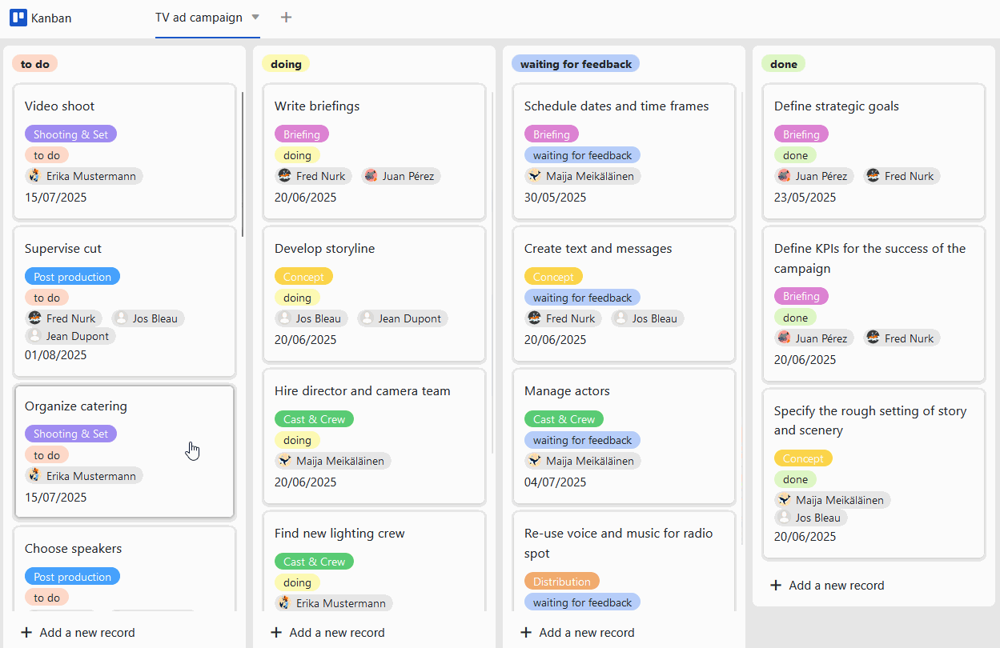

Project managementrequires precise planning of all upcoming tasks. However, this can quickly become confusing, especially for larger projects: You have to define the tasks, time horizons and responsibilities in advance, keep an eye on progress during the project and always be able to react flexibly to changes in plans. Normally, specialproject management toolsare required for this, but they often cost a lot of money. It's a good thing that SeaTable'sfree project plan templateis available! You can easily create a project plan according to your wishes.

## How the project plan template works

The project plan template is based on thewaterfall methodto create a classic project plan. This has the advantage that you can display tasks in chronological order in a clearproject schedule. In SeaTable, you use thetimeline pluginfor this, which displays the tasks in the form of bars on atimeline(also known as a Gantt chart). You can also use the integratedKanban boardto plan agile projects.

In the tabular overview of the project plan template, you can always keep an eye on the project sections and the associatedtasks for the entire team. If you want to createpersonal views, simply use the filter function to display only the tasks of an individual team member. Create tasks that you assign to your team members with all associatedsubtasksanddeadlines. You can also send them anotification.

To communicate with your team members, you can simplycommenton the tasks. If you mark a team member with @, he or she will also receive a notification. You can also upload, save and editdocuments and filesrelated to the task directly in a file column, which is not possible with a project plan in Excel, for example.

## Special features of the project plan template

​

### Create a classic project plan with the timeline plugin

- To create a project plan from the tasks, you need two columns with astartdateand anend date. The timeline plugin uses these columns to display the time extension of the tasks as bars in a project schedule.
- This is very useful for visualizingsuccessive processes, identifyingoverlapswhen planning resources and maintaining an overview of the entire project.
- You can customize thewidthanddetail ofthe timeline in the project plan template by selecting the annual, quarterly, monthly, weekly or daily view.
- Bydisplaying additional columnsfrom the table, you can add all the information you need to this overview.

To create a project plan from the tasks, you need two columns with astartdateand anend date. The timeline plugin uses these columns to display the time extension of the tasks as bars in a project schedule.

This is very useful for visualizingsuccessive processes, identifyingoverlapswhen planning resources and maintaining an overview of the entire project.

You can customize thewidthanddetail ofthe timeline in the project plan template by selecting the annual, quarterly, monthly, weekly or daily view.

Bydisplaying additional columnsfrom the table, you can add all the information you need to this overview.

### Planning agile projects with the Kanban plugin

- The Kanban plugin is ideal forvisualizing agile workflows. To do this, you should first display all thestagesthat your tasks go through in a single selection column (here: "Status").
- As soon as you select this column for aKanban board, all tasks in the project plan template are grouped according to their respective status (here: to do, in progress, waiting for feedback, completed).
- Now you and your team members candrag and dropeach task card from one column to the next - and thestatusadjusts immediately! If you wish, you can enrich your cards with additional information from other table columns.

The Kanban plugin is ideal forvisualizing agile workflows. To do this, you should first display all thestagesthat your tasks go through in a single selection column (here: "Status").

As soon as you select this column for aKanban board, all tasks in the project plan template are grouped according to their respective status (here: to do, in progress, waiting for feedback, completed).

Now you and your team members candrag and dropeach task card from one column to the next - and thestatusadjusts immediately! If you wish, you can enrich your cards with additional information from other table columns.

## Advantages of the project plan template at a glance

-Free: To use our template to create a project plan like in Excel for free,simply registerwith your e-mail address.

-Intuitive: The user-friendly project plan template is easy to understand and less error-prone than a project plan in Excel or plans on paper.

-Flexible:Add as many columns as you like and adapt the project plan example to your individual requirements.

-Data protection: The secure and GDPR-compliant storage of data in the cloud or on-premises enables full control, as do the granular access rights.

-Convenient: If you create a project plan and save it online, it is accessible from anywhere and at any time and at the same time protected against loss.

-Powerful: Where other tools for project planning (with or without a template) reach their limits, SeaTable really gets started. This makes working with big data fun!

-Always up to date: Always stay up to date thanks to the communication functions, complete change history and real-time updating.

-Scalable: Our solution grows with your team - regardless of whether you have one or a thousand employees.

## Interactive template

Scroll through our interactively embedded template or read the description by clicking on the  after the template name. This will give you a better feel for the functions of the project plan template. If you have any questions, we recommend that you use our [help section]().
