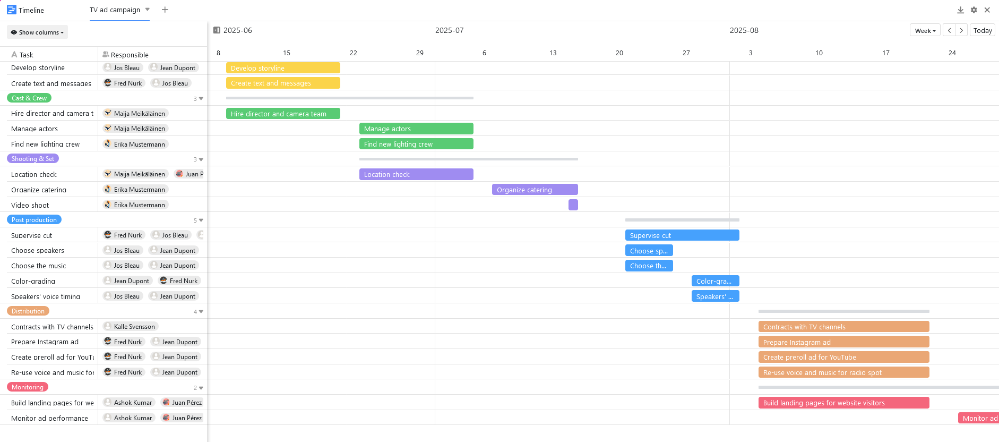

A gestão de projectosrequer um planeamento preciso de todas as tarefas futuras. No entanto, isto pode tornar-se rapidamente confuso, especialmente em projectos de maior dimensão: É necessário definir antecipadamente as tarefas, os horizontes temporais e as responsabilidades, acompanhar o progresso durante o projeto e ser sempre capaz de reagir de forma flexível a alterações nos planos. Normalmente, são necessáriasferramentasespeciaisde gestão de projectospara este efeito, mas estas custam muitas vezes muito dinheiro. É bom que omodelo de plano de projeto gratuitoda SeaTable esteja disponível! Permite-lhe criar facilmente um plano de projeto de acordo com os seus desejos.

## Como funciona o modelo de plano de projeto

O modelo de plano de projeto baseia-se nométodo de cascatapara criar um plano de projeto clássico. Este método tem a vantagem de permitir a visualização de tarefas consecutivas numcalendário de projetoclaro. No SeaTable, é utilizado oplugin de linha de tempopara este efeito, que apresenta as tarefas sob a forma de barras numalinha de tempo(também conhecido como gráfico de Gantt). Também pode utilizar oquadro Kanbanintegrado para planear projectos ágeis.

Na visão geral tabular do modelo de plano de projeto, pode sempre acompanhar as secções do projeto e astarefasassociadasde toda a equipa. Se pretender criarvistas personalizadas, basta utilizar a função de filtro para apresentar apenas as tarefas de um membro individual da equipa. Crie tarefas que atribui aos membros da sua equipa com todas assubtarefaseprazosassociados. Pode também enviar-lhes umanotificação.

Para comunicar com os membros da sua equipa, pode simplesmentecomentaras tarefas. Se marcar um membro da equipa com @, ele ou ela também receberá uma notificação. Também pode carregar, guardar e editardocumentos e ficheirosrelacionados com a tarefa diretamente numa coluna de ficheiros, o que não é possível com um plano de projeto em Excel, por exemplo.

## Caraterísticas especiais do modelo de plano de projeto

​

### Criar um plano de projeto clássico com o plugin de cronologia

- Para criar um plano de projeto a partir das tarefas, são necessárias duas colunas com umadatade inícioe umadata de fim. O plugin da linha de tempo utiliza estas colunas para apresentar a extensão temporal das tarefas como barras num calendário de projeto.
- Isto é muito útil para visualizarprocessos sucessivos, identificarsobreposiçõesao planear recursos e manter uma visão geral de todo o projeto.
- Pode personalizar alargurae odetalhe dalinha de tempo no modelo de plano de projeto selecionando a vista anual, trimestral, mensal, semanal ou diária.
- Aoexibir colunas adicionaisda tabela, é possível adicionar todas as informações necessárias a essa síntese.

Para criar um plano de projeto a partir das tarefas, são necessárias duas colunas com umadatade inícioe umadata de fim. O plugin da linha de tempo utiliza estas colunas para apresentar a extensão temporal das tarefas como barras num calendário de projeto.

Isto é muito útil para visualizarprocessos sucessivos, identificarsobreposiçõesao planear recursos e manter uma visão geral de todo o projeto.

Pode personalizar alargurae odetalhe dalinha de tempo no modelo de plano de projeto selecionando a vista anual, trimestral, mensal, semanal ou diária.

Aoexibir colunas adicionaisda tabela, é possível adicionar todas as informações necessárias a essa síntese.

### Planear projectos ágeis com o plugin Kanban

- O plugin Kanban é ideal paravisualizar fluxos de trabalho ágeis. Para tal, deve começar por visualizar todas asfasespelas quais passam as suas tarefas numa única coluna de seleção (aqui: "Estado").
- Assim que selecionar esta coluna para umquadro Kanban, todas as tarefas no modelo de plano de projeto são agrupadas de acordo com o respetivo estado (aqui: a fazer, em curso, à espera de feedback, concluído).
- Agora, você e os membros da sua equipa podem arrastare largarcada cartão de tarefa de uma coluna para a outra - e oestadoé imediatamente ajustado! Se desejar, pode enriquecer os seus cartões com informações adicionais de outras colunas da tabela.

O plugin Kanban é ideal paravisualizar fluxos de trabalho ágeis. Para tal, deve começar por visualizar todas asfasespelas quais passam as suas tarefas numa única coluna de seleção (aqui: "Estado").

Assim que selecionar esta coluna para umquadro Kanban, todas as tarefas no modelo de plano de projeto são agrupadas de acordo com o respetivo estado (aqui: a fazer, em curso, à espera de feedback, concluído).

Agora, você e os membros da sua equipa podem arrastare largarcada cartão de tarefa de uma coluna para a outra - e oestadoé imediatamente ajustado! Se desejar, pode enriquecer os seus cartões com informações adicionais de outras colunas da tabela.

## Vantagens do modelo de plano de projeto em resumo

-Gratuito: Para utilizar o nosso modelo para criar um plano de projeto em Excel gratuitamente,basta registar-secom o seu endereço de correio eletrónico.

-Intuitivo: O modelo de plano de projeto de fácil utilização é fácil de compreender e menos propenso a erros do que um plano de projeto em Excel ou planos em papel.

-Flexível:Adicione as colunas que quiser e personalize o exemplo de plano de projeto de acordo com as suas necessidades individuais.

-Proteção de dados: O armazenamento seguro e compatível com o RGPD dos dados na nuvem ou no local permite um controlo total, tal como os direitos de acesso granulares.

-Prático: Se criar um plano de projeto e o guardar em linha, fica acessível a partir de qualquer lugar e em qualquer altura e, ao mesmo tempo, protegido contra perdas.

-Potente: Quando outras ferramentas para o planeamento de projectos (com ou sem modelo) atingem os seus limites, o SeaTable começa realmente a trabalhar. Isto torna o trabalho com grandes volumes de dados divertido!

-Sempre atualizado: Mantenha-se sempre atualizado graças às funções de comunicação, ao histórico completo de alterações e à atualização em tempo real.

-Escalável: A nossa solução cresce com a sua equipa - independentemente de ter um ou mil funcionários.

## Modelo interativo

Percorra o nosso modelo incorporado de forma interactiva ou leia a descrição clicando no símbolo i a seguir ao nome do modelo. Isto dar-lhe-á uma melhor noção das funções do modelo de plano de projeto. Se tiver alguma dúvida, recomendamos que utilize a nossasecção de ajuda.
