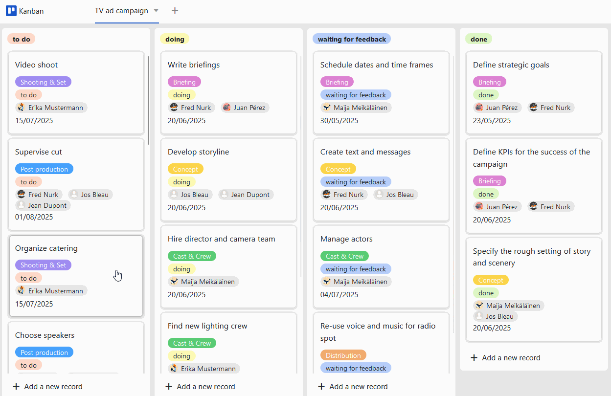

Управление проектамитребует точного планирования всех предстоящих задач. Однако это может быстро запутать, особенно если речь идет о крупных проектах: Вы должны заранее определить задачи, сроки и ответственность, следить за ходом проекта и всегда уметь гибко реагировать на изменения в планах. Обычно для этого требуются специальныеинструменты управления проектами, но зачастую они стоят немалых денег. Хорошо, что в SeaTable естьбесплатный шаблон плана проекта! С его помощью вы легко создадите план проекта в соответствии с вашими пожеланиями.

## Как работает шаблон плана проекта

Шаблон плана проекта основан наметоде водопададля создания классического плана проекта. Преимущество этого метода заключается в том, что вы можете визуализировать последовательные задачи в четкомграфике проекта. В SeaTable для этого используетсяплагин timeline, который отображает задачи в виде полос навременной шкале(также известной как диаграмма Ганта). Для планирования agile-проектов вы также можете использовать встроеннуюдоску Kanban.

В табличном обзоре шаблона плана проекта вы всегда можете следить за разделами проекта и связанными с нимизадачами для всей команды. Если вы хотите создатьперсонализированные представления, просто воспользуйтесь функцией фильтрации, чтобы отобразить только задачи отдельного члена команды. Создавайте задачи, которые вы назначаете членам своей команды, со всеми связанными с нимиподзадачамиисроками выполнения. Вы также можете отправить имуведомление.

Чтобы общаться с членами команды, можно простокомментироватьзадания. Если вы отметите члена команды знаком @, он также получит уведомление. Кроме того, вы можете загружать, сохранять и редактироватьдокументы и файлы, относящиеся к задаче, прямо в колонке файлов, что невозможно, например, при работе с планом проекта в Excel.

## Особенности шаблона плана проекта

​

### Создайте классический план проекта с помощью плагина timeline

- Чтобы создать план проекта на основе задач, вам понадобятся два столбца сдатойначалаидатой окончания. Плагин timeline использует эти столбцы для отображения временной продолжительности задач в виде полос в расписании проекта.
- Это очень полезно для визуализациипоследовательных процессов, выявлениядублированияпри планировании ресурсов и ведения общего обзора всего проекта.
- Вы можете настроитьширинуидетализациювременной шкалы в шаблоне плана проекта, выбрав годовой, квартальный, месячный, еженедельный или ежедневный вид.
- Отображая дополнительные столбцытаблицы, вы можете добавить всю необходимую информацию в этот обзор.

Чтобы создать план проекта на основе задач, вам понадобятся два столбца сдатойначалаидатой окончания. Плагин timeline использует эти столбцы для отображения временной продолжительности задач в виде полос в расписании проекта.

Это очень полезно для визуализациипоследовательных процессов, выявлениядублированияпри планировании ресурсов и ведения общего обзора всего проекта.

Вы можете настроитьширинуидетализациювременной шкалы в шаблоне плана проекта, выбрав годовой, квартальный, месячный, еженедельный или ежедневный вид.

Отображая дополнительные столбцытаблицы, вы можете добавить всю необходимую информацию в этот обзор.

### Планирование agile-проектов с помощью плагина Kanban

- Плагин Kanban идеально подходит длявизуализации рабочих процессов agile. Для этого сначала нужно представить всеэтапы, которые проходят ваши задачи, в одном столбце выбора (здесь: "Статус").
- Как только вы выберете этот столбец длядоски Kanban, все задачи в шаблоне плана проекта будут сгруппированы по соответствующему статусу (здесь: предстоит сделать, в процессе выполнения, ожидание ответа, завершено).
- Теперь вы и члены вашей команды можетеперетаскиватькарточки задач из одного столбца в другой - истатусбудет немедленно изменен! При желании вы можете дополнить карточки дополнительной информацией из других колонок таблицы.

Плагин Kanban идеально подходит длявизуализации рабочих процессов agile. Для этого сначала нужно представить всеэтапы, которые проходят ваши задачи, в одном столбце выбора (здесь: "Статус").

Как только вы выберете этот столбец длядоски Kanban, все задачи в шаблоне плана проекта будут сгруппированы по соответствующему статусу (здесь: предстоит сделать, в процессе выполнения, ожидание ответа, завершено).

Теперь вы и члены вашей команды можетеперетаскиватькарточки задач из одного столбца в другой - истатусбудет немедленно изменен! При желании вы можете дополнить карточки дополнительной информацией из других колонок таблицы.

## Преимущества шаблона плана проекта с первого взгляда

-Бесплатно: Чтобы использовать наш шаблон для создания плана проекта в Excel бесплатно,просто зарегистрируйтесь, указав свой адрес электронной почты.

-Интуитивно понятный: Удобный шаблон плана проекта прост в понимании и меньше подвержен ошибкам, чем план проекта в Excel или планы на бумаге.

-Гибкость:добавьте столько столбцов, сколько хотите, и настройте пример плана проекта в соответствии с вашими индивидуальными требованиями.

-Защита данных: безопасное и соответствующее требованиям GDPR хранение данных в облаке или в помещениях позволяет полностью контролировать их, а также предоставлять подробные права доступа.

-Удобно: если вы создадите план проекта и сохраните его в Интернете, он будет доступен из любого места и в любое время и в то же время защищен от потери.

-Мощный: там, где другие инструменты для планирования проектов (с шаблоном или без него) достигают своего предела, SeaTable действительно начинает работать. Это делает работу с большими данными увлекательной!

-Всегда в курсе событий: всегда оставайтесь в курсе событий благодаря функциям связи, полной истории изменений и обновлению в режиме реального времени.

-Масштабируемость: наше решение растет вместе с вашей командой - независимо от того, один у вас сотрудник или тысяча.

## Интерактивный шаблон

Прокрутите наш интерактивно встроенный шаблон или прочитайте описание, нажав на символ i после названия шаблона. Это позволит вам лучше понять функции шаблона "План проекта". Если у вас возникнут вопросы, рекомендуем воспользоваться нашимразделом помощи.
