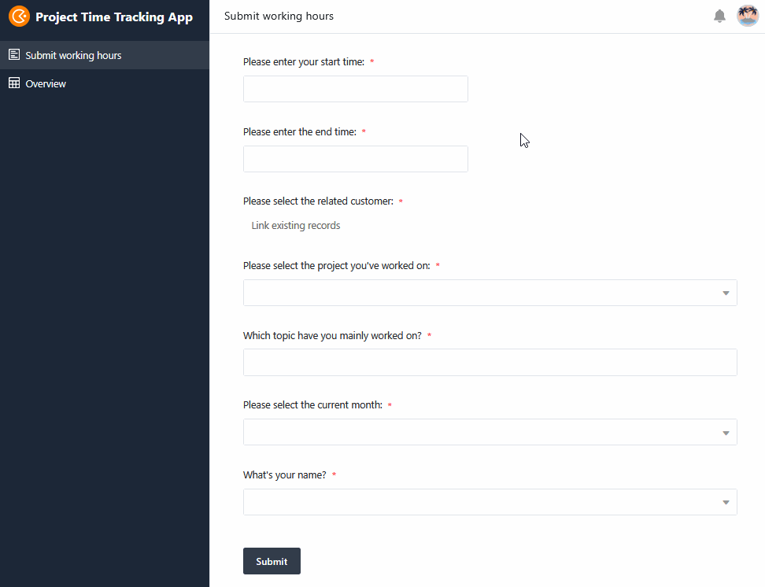

As a service provider, you are probably familiar with this: The working day is over and once again you haven't managed toaccurately record all project times. Now you have to estimate pi times thumbs how long you and your employees have worked on certain projects. But the motto is"time is money"!

One thing is clear:whether architects, craftsmen, management consultants, freelancers or agencies - no one enjoys recording project times. But without correct and complete project time recording, you cannot create reliable invoices.

It's a good thing that SeaTable has a simpleproject time tracking templatethat you can use to generate invoices for your customers right away! You can also use aproject time tracking appto record project times conveniently and intuitively - free of charge!

## Simple project time recording, free of charge via web & app

In SeaTable, project time tracking is free of charge, just like an Excel template. However, there are numerous functions that go far beyond project time tracking in Excel:

- Free and flexibly customizable template
- Record project times via web & app on your PC, tablet or smartphone
- Quickly allocate time to projects, customers and employees
- Real-time overview of all services provided
- Precise evaluation with views for projects, employees and customers
- Quick and easy invoicing

## Tips for your project time recording

Althoughworking time recordinggoes hand in hand with project time recording, it is usually not carried out as meticulously as it should be. In fact, this often only happens days later, which greatly distorts the actual time required. As a result, valuable hours are lost that you could actually charge your customers for. Furthermore, there are certain activities that are often not included in the project time recording, even though they are of course part of it. These includecustomer or project-related emails, phone calls and meetings.

We have these tips to help you avoid losing money:

1. always encourage yourself and your employees to record project times conscientiously and continuously.

2. note down times to the minute or even stop the time with a project time recording app.

3. also factor in the time you need to communicate with customers or coordinate the project.

4. make project time recording particularly easy with a template in which you can also create invoices.

## How to record project times with a template: free, simple and clear

Recording yourproject times is easy with SeaTable. With our project time recording template, you can not only record your project times precisely, but also assign them directly to customers, projects and employees. The hours can bedisplayed, grouped and totaledin different views dependingon the customer, project or employee. This gives you clarity about how time-consuming your projects are and how the workload in the team is developing.

For example, is there a customer who is always exceeding the estimated project times with long phone calls and coordination loops? Or is one employee drowning in work while others still have capacity? Use statistics to evaluate how long you are working on which projects and which customer is taking up a particularly large amount of time. Continuous project time tracking also provides you with information on how to realistically plan future projects.

Tip:
If you need a more comprehensive project time tracking template in which you can plan, estimate and track resources across many projects, we recommend ourproject portfolio template.

​

## Conveniently record project times from anywhere with the project time recording app

With SeaTable's intuitive app builder, you cancreateyour ownproject time tracking app to suit your needs. You can use this web app to conveniently record project times at any time and on any device (PC, smartphone or tablet). Need to quickly add a few hours on the go? No problem with the mobile-optimized app!

We have already added a form to the project time recording app that guides your team members through the process of recording their project times. The data entered then appears immediately in the tabular overview. You can also set a special filter there so that the current user only ever sees their own project times.

## More accurate billing, more profit: get started now with the project time tracking template!

With the SeaTable page design plugin, you cancreate invoices for your customers directlybased on the project times entered. Create a new document for each month to display the corresponding columns from the second table. Sophisticated formulas there automatically calculate all the figures you need by multiplying the cumulative hours by the hourly rates, calculating the VAT and the total amount.

If you click through the data records in the page design plugin, you can download an invoice as a PDF for each customer. The information (customer address etc.) changes automatically so that you can use the same template for invoicing all projects.

## Advantages of the project time recording template at a glance

- Free of charge: To use our template to create a simple project time tracking system free of charge, all you have to do isregisterwith your e-mail address.
- Intuitive: The user-friendly project time recording app is easy to understand and less prone to errors than project time recording in Excel or timesheets on paper.
- Flexible: Add as many elements as you like and adapt the project time recording template to your individual requirements.
- Data protection: The secure and GDPR-compliant storage of data in the cloud or on-premises enables full control, as do the granular access rights.
- Convenient: Thanks to online project time recording, your data is accessible from anywhere and at any time and
  protected from loss at the same time.
- Powerful: Where other tools reach their limits when it comes to time recording for your projects, SeaTable is just getting started.
  SeaTable really gets started. This makes working with big data fun!
- Always up to date: Always stay up to date thanks to the communication functions, complete change history and real-time updating.
- Scalable: Our solution grows with your team - regardless of whether you have one or a thousand employees.

## Interactive template

Scroll through our interactively embedded template or read the description by clicking on the  after the template name. This will give you a better feel for the functions of the project time tracking template. our [help section]()offers you support if you have any questions.
