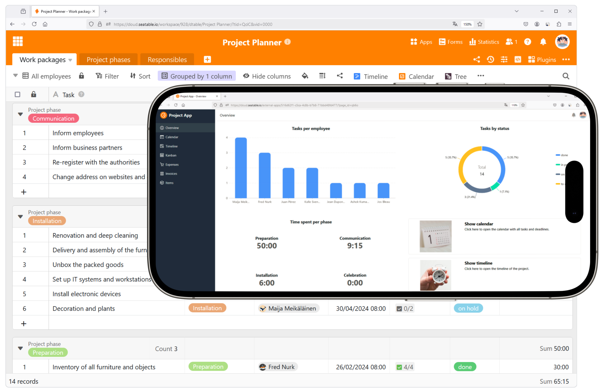
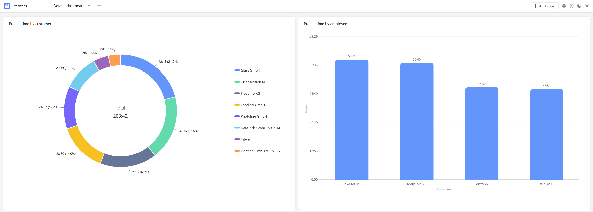

Como proveedor de servicios, probablemente le resulte familiar: Se acaba la jornada laboral y, una vez más, no ha conseguidoregistrar con precisión todos los tiempos de los proyectos. Ahora tiene que calcular cuánto tiempo han trabajado usted y sus empleados en determinados proyectos. Sin embargo, el lema es"el tiempo es oro".

Una cosa está clara:ya sean arquitectos, comerciantes, consultores de gestión, autónomos o agencias, a nadie le gusta registrar los tiempos de los proyectos. Pero sin un registro de tiempos de proyecto correcto y completo, no se pueden crear facturas fiables.

Por suerte, SeaTable dispone de una sencillaplantilla de registro de tiempos de proyectoscon la que podrá generar facturas para sus clientes de forma inmediata. También puede utilizar unaaplicación de seguimiento del tiempo delproyecto para registrar los tiempos del proyecto de forma cómoda e intuitiva, ¡gratis!

## Registro sencillo y gratuito del tiempo dedicado al proyecto a través de la web y la aplicación

En SeaTable, el seguimiento del tiempo de los proyectos es gratuito, igual que una plantilla de Excel. Sin embargo, hay numerosas funciones que van mucho más allá del seguimiento del tiempo del proyecto en Excel:

- Plantilla gratuita y flexible

- Registre los tiempos del proyecto a través de la web y la aplicación en su PC, tableta o smartphone

- Asigne rápidamente tiempo a proyectos, clientes y empleados

- Visión general en tiempo real de todos los servicios prestados

- Evaluación precisa con vistas a proyectos, empleados y clientes

- Facturación rápida y sencilla

## Consejos para registrar el tiempo de su proyecto

Aunque elregistro del tiempo de trabajova de la mano del registro del tiempo de proyecto, no suele llevarse a cabo con la meticulosidad que debería. A menudo se realiza días después, lo que distorsiona en gran medida el tiempo real necesario. Como resultado, se pierden horas valiosas que podría cobrar a sus clientes. Además, hay ciertas actividades que a menudo ni siquiera se incluyen en el registro de tiempo del proyecto, aunque por supuesto forman parte de él. Entre ellas se incluyenlos correos electrónicos, las llamadas telefónicas y las reuniones relacionadas con el cliente o el proyecto.

Tenemos estos consejos para ayudarle a evitar perder dinero:

1. anime siempre a sus empleados y a usted mismo a registrar los tiempos de los proyectos de forma concienzuda y continua.

2. anota las horas al minuto o incluso detén el tiempo con una aplicación de grabación de tiempo de proyectos.

3. Ten en cuenta también el tiempo que necesitas para comunicarte con los clientes o coordinar el proyecto.

4. facilite especialmente el registro del tiempo de los proyectos con una plantilla en la que también puede crear facturas.

## Cómo registrar los tiempos de un proyecto con una plantilla: gratis, sencillo y claro

Registrar lostiemposde susproyectos es fácil con SeaTable. Con nuestra plantilla de registro de tiempos de proyectos, no sólo puede registrar los tiempos de sus proyectos con precisión, sino también asignarlos directamente a clientes, proyectos y empleados. Las horas puedenvisualizarse, agruparse y totalizarseen distintas vistas enfunción del cliente, el proyecto o el empleado. Esto le permite saber con claridad cuánto tiempo consumen sus proyectos y cómo evoluciona la carga de trabajo en el equipo.

Por ejemplo, ¿hay un cliente que siempre está sobrepasando los plazos estimados del proyecto con largas llamadas telefónicas y bucles de coordinación? ¿O hay un empleado que se está ahogando en trabajo mientras los demás aún tienen capacidad? Utilice las estadísticas para analizar cuánto tiempo se está trabajando en qué proyectos y qué cliente está ocupando una cantidad de tiempo especialmente grande. El seguimiento continuo del tiempo de los proyectos también le proporciona información sobre cómo planificar de forma realista los proyectos futuros.

Consejo:
Si necesita una plantilla de seguimiento temporal de proyectos más completa en la que pueda planificar, estimar y realizar un seguimiento de los recursos de muchos proyectos, le recomendamos nuestraplantilla de cartera de proyectos.

​

## Registre cómodamente los tiempos de los proyectos desde cualquier lugar con la aplicación de registro de tiempos de proyectos

Con el constructor de aplicaciones intuitivo de SeaTable, puedecrearsu propiaaplicación de seguimiento del tiempo del proyecto para satisfacer sus necesidades. Puede utilizar esta aplicación web para registrar cómodamente los tiempos del proyecto en cualquier momento y en cualquier dispositivo (PC, smartphone o tableta). ¿Necesita añadir rápidamente algunas horas sobre la marcha? No hay problema con la aplicación optimizada para móviles.

Ya hemos añadido un formulario a la aplicación de registro de tiempos de proyectos que guía a los miembros de su equipo a través del proceso de registro de los tiempos de sus proyectos. Los datos introducidos aparecen inmediatamente en la vista general tabular. También puede establecer un filtro especial para que el usuario actual sólo vea los tiempos de su propio proyecto.

## Facturación más precisa, más beneficios: ¡empieza ahora con la plantilla de control de tiempo de proyectos!

Con el plugin de diseño de páginas SeaTable, puedecrear facturas para sus clientes directamenteen función de los tiempos de proyecto introducidos. Cree un nuevo documento para cada mes para mostrar las columnas correspondientes de la segunda tabla. Sofisticadas fórmulas calculan automáticamente todas las cifras que necesita multiplicando las horas acumuladas por las tarifas horarias, calculando el IVA y el importe total.

Si hace clic en los registros de datos del plugin de diseño de páginas, podrá descargar una factura en formato PDF para cada cliente. La información (dirección del cliente, etc.) cambia automáticamente para que puedas utilizar la misma plantilla para facturar todos los proyectos.

## Resumen de las ventajas de la plantilla de registro de tiempos de proyectos

​

-Gratuito: Para realizar un registro de tiempo de proyecto sencillo de forma gratuita con nuestra plantilla, sólo tiene queregistrarsecon su dirección de correo electrónico.

-Intuitiva: la aplicación de registro de tiempos de proyectos es fácil de usar y menos propensa a errores que el registro de tiempos de proyectos en Excel o las hojas de horas en papel.

-Flexible: Añada tantos elementos como desee y personalice la plantilla de registro de tiempo de proyectos según sus necesidades individuales.

-Protección de datos: el almacenamiento seguro y conforme al GDPR de los datos en la nube o en las instalaciones permite un control total, al igual que los derechos de acceso granulares.

-Comodidad: gracias al registro de tiempos de proyecto en línea, sus datos son accesibles desde cualquier lugar y en cualquier momento y
al mismo tiempo, protegidos contra pérdidas.

-Potente: Donde otras herramientas alcanzan sus límites cuando se trata de registrar el tiempo para sus proyectos, SeaTable apenas está comenzando.
SeaTable realmente se pone en marcha. ¡Esto hace que trabajar con big data sea divertido!

-Siempreal día: Manténgase siempre al día gracias a las funciones de comunicación, el historial completo de cambios y la actualización en tiempo real.

-Escalable: Nuestra solución crece con su equipo, independientemente de si tiene uno o mil empleados.

## Plantilla interactiva

Desplácese por nuestra plantilla incrustada de forma interactiva o lea la descripción haciendo clic en el símbolo i que aparece tras el nombre de la plantilla. Esto le dará una mejor idea de las funciones de la plantilla de seguimiento temporal de proyectos. Nuestrasección de ayudale ofrece soporte si tiene alguna pregunta.
