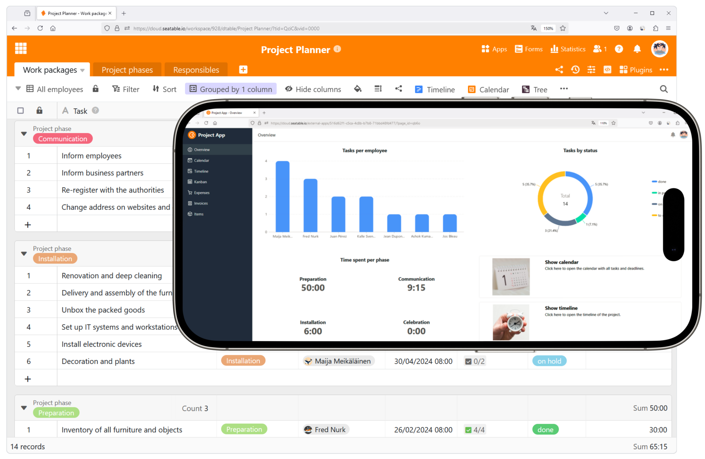
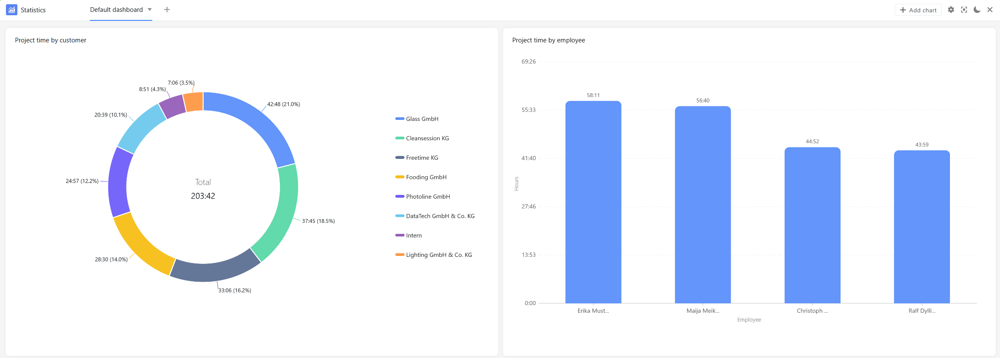
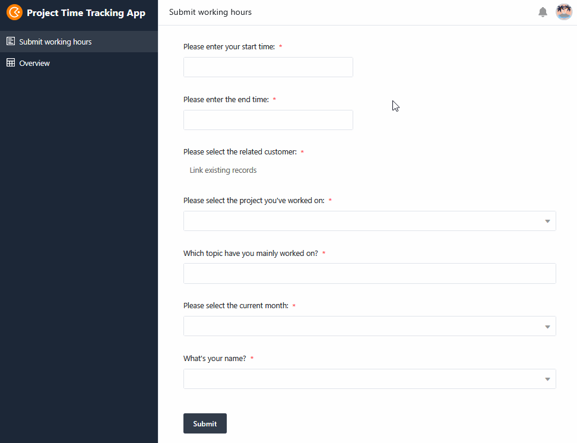
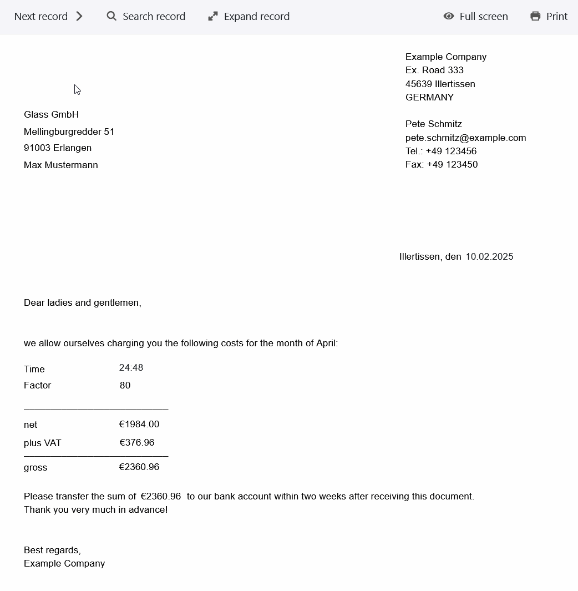

En tant que prestataire de services, vous connaissez certainement cette situation : La journée de travail est terminée et vous n'avez de nouveau pas réussi àsaisir précisément toutes les heures consacrées aux projets. Vous devez maintenant estimer au pouce près combien de temps vous et vos collaborateurs avez travaillé sur certains projets. Et pourtant, la devise est"le temps, c'est de l'argent" !

Il est clair que, qu'il s'agisse d'architectes, d'artisans, de conseillers en entreprise, de freelances ou d'agences, personne ne prend plaisir à saisir les temps de projet. Mais sans une saisie correcte et complète des temps de projet, vous ne pouvez pas établir de décomptes fiables.

Heureusement, SeaTable propose unmodèlesimplede saisie des temps de projetqui vous permet ensuite de générer immédiatement des factures pour vos clients ! Uneapplication de saisie de temps de projetvous permet également de saisir des temps de projet de manière particulièrement pratique et intuitive - et ce gratuitement !

## Saisie simple des temps de projet, gratuite par web & app

Dans SeaTable, la saisie du temps de projet est gratuite, comme un modèle Excel. Cependant, il existe de nombreuses fonctions qui vont bien au-delà de la saisie du temps de projet dans Excel :

- Modèle gratuit et personnalisable

- Saisie des temps de projet par web & app sur votre PC, tablette ou smartphone

- Attribuer rapidement les charges de temps aux projets, clients et collaborateurs

- Aperçu en temps réel de tous les services fournis

- Évaluation précise avec des vues pour les projets, les collaborateurs et les clients

- Facturation simple et rapide

## Conseils pour votre saisie du temps de projet

Bien que la saisiedu temps de travailaille de pair avec la saisie du temps de projet, celle-ci n'est généralement pas effectuée de manière aussi méticuleuse qu'elle devrait l'être. Souvent, elle n'est même effectuée que plusieurs jours plus tard, ce qui déforme fortement le temps réellement nécessaire. Vous perdez ainsi des heures précieuses que vous pourriez en fait facturer à vos clients. En outre, il existe certaines activités qui ne sont souvent pas prises en compte dans la saisie du temps de projet, bien qu'elles en fassent naturellement partie. Il s'agit notammentdes e-mails, des appels téléphoniques et des réunions liés aux clients ou aux projets.

Voici quelques conseils pour vous éviter de perdre de l'argent :

1. insistez toujours auprès de vos collaborateurs et de vous-même sur la nécessité d'enregistrer consciencieusement et continuellement les temps consacrés aux projets.

2. notez les heures à la minute près ou chronométrez même le temps à l'aide d'une application de saisie du temps de projet.

3. prévoyez également le temps nécessaire pour communiquer avec les clients ou coordonner le projet.

4. facilitez-vous particulièrement la saisie du temps de projet avec un modèle dans lequel vous pouvez également créer des factures.

## Comment saisir les temps de projet avec un modèle : gratuit, simple et clair

Avec SeaTable, la saisie destemps de projet est un jeu d'enfant. En effet, notre modèle de saisie des temps de projet vous permet non seulement de saisir vos temps de projet avec précision, mais aussi de les attribuer directement aux clients, aux projets et aux collaborateurs. Vous pouvez ainsiafficher, regrouper et totaliserles heures dans différentes vues en fonctiondu client, du projet ou de l'employé. Cela vous permet de savoir clairement à quel point vos projets sont chronophages et comment évolue la charge de travail au sein de l'équipe.

Y a-t-il par exemple un client qui dépasse toujours les temps de projet prévus avec de longs appels téléphoniques et des boucles de coordination ? Ou est-ce qu'un collaborateur est submergé de travail alors que d'autres ont encore des capacités ? Évaluez à l'aide de statistiques combien de temps vous travaillez sur quels projets et quel client vous prend le plus de temps. Ainsi, la saisie continue du temps consacré aux projets vous permet également de planifier les projets futurs de manière réaliste.

Conseil:
Si vous avez besoin d'un modèle de feuille de temps de projet plus complet, dans lequel vous pouvez planifier, estimer et suivre les ressources sur de nombreux projets, nous vous recommandons notremodèle de portefeuille de projets.

## Avec l'application de saisie des temps de projet, saisissez facilement vos temps de projet où que vous soyez.

Grâce à l'App-Builder intuitif de SeaTable, vous pouvez créer vous-même uneapplication de saisie des temps de projet selon vos besoins. Cette application web vous permet de saisir facilement des temps de projet à tout moment et sur n'importe quel terminal (PC, smartphone ou tablette). Vous avez besoin d'ajouter rapidement quelques heures en cours de route ? Avec l'app optimisée pour les mobiles, aucun problème !

Dans l'application de saisie des temps de projet, nous avons déjà ajouté un formulaire qui guide les membres de votre équipe à travers le processus de saisie de leurs temps de projet. Les données saisies apparaissent ensuite immédiatement dans l'aperçu sous forme de tableau. Vous pouvez d'ailleurs y définir un filtre spécial afin que l'utilisateur actuel ne voie toujours que ses propres temps de projet.

## Une facturation plus précise, des bénéfices plus importants : commencez dès maintenant avec le modèle de saisie des temps de projet !

Le plug-in de conception de pages de SeaTable vous permet decréer directement des factures pour vos clientssur la base des heures de projet inscrites. Créez un nouveau document pour chaque mois afin d'afficher les colonnes correspondantes du deuxième tableau. Là, des formules sophistiquées calculent automatiquement tous les chiffres dont vous avez besoin en multipliant les heures cumulées par les taux horaires, en calculant la TVA et le montant total.

En cliquant sur les enregistrements dans le plug-in de conception de page, vous pouvez télécharger une facture au format PDF pour chaque client. Les informations (adresse du client, etc.) changent automatiquement, ce qui vous permet d'utiliser le même modèle pour la facturation de tous les projets.

## Avantages du modèle de saisie des temps de projet en un coup d'œil

-Gratuit: pour réaliser gratuitement une saisie simple du temps de projet avec notre modèle, il vous suffit devous inscrireavec votre adresse e-mail.

-Intuitif: l'application conviviale de saisie des temps de projet est facile à comprendre et moins sujette aux erreurs que la saisie des temps de projet dans Excel ou les feuilles d'heures sur papier.

-Flexible: ajoutez autant d'éléments que vous le souhaitez et adaptez le modèle de saisie des temps de projet à vos souhaits individuels.

-Protection des données: le stockage sécurisé et conforme au RGPD des données dans le cloud ou sur site permet un contrôle total, tout comme les droits d'accès granulaires.

-Confortable: grâce à la saisie des temps de projet en ligne, vos données sont accessibles de partout et à tout moment, tout en étant protégées contre la perte.
tout en étant protégées contre la perte.

-Puissant: là où d'autres outils atteignent leurs limites pour la saisie des temps de vos projets, TableaTable commence.
SeaTable commence vraiment. C'est ainsi que travailler avec des données volumineuses devient un plaisir !

-Toujours à jour: restez toujours à jour grâce aux fonctions de communication, à l'historique complet des modifications et à la mise à jour en temps réel.

-Évolutive: notre solution évolue avec votre équipe, que vous ayez un ou mille collaborateurs.

## Modèle interactif

Faites défiler notre modèle intégré de manière interactive ou lisez la description en cliquant sur  derrière le nom du modèle. Vous aurez ainsi une meilleure idée des fonctions du modèle de saisie des temps de projet. notre [rubrique d'aide]()vous offre un soutien en cas de questions.
