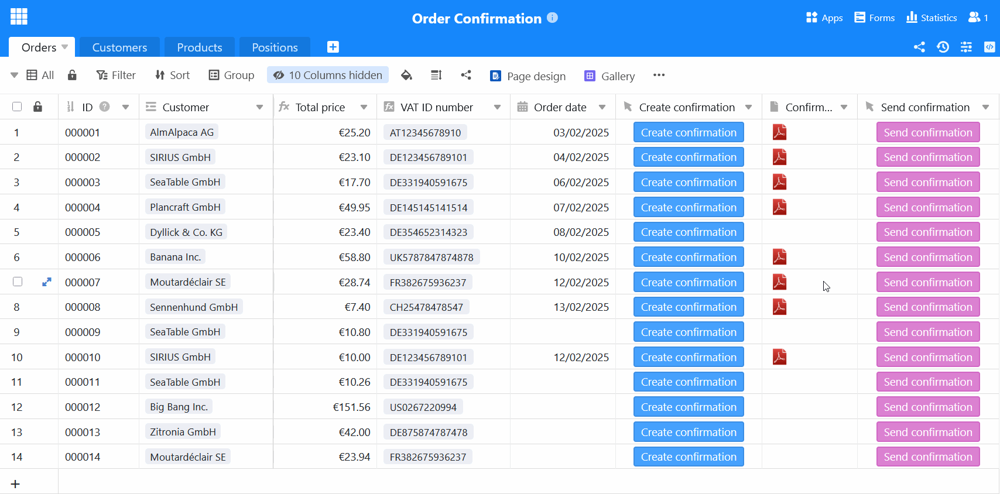

Herzlichen Glückwunsch! Wieder hat ein Kunde Ihr Angebot angenommen. Bevor es mit der Leistungserbringung losgehen kann, müssen Sie nur noch eine Auftragsbestätigung schreiben. Vor allem, wenn Sie häufig Aufträge abwickeln, sollten Sie aber nicht jedes Mal von Neuem eine Auftragsbestätigung erstellen. Nutzen Sie dafür lieber die **Auftragsbestätigung Vorlage** von SeaTable, mit der Sie jedes Angebot schriftlich bestätigen können – kostenlos, bequem und sicher!

## Vorteile einer Vorlage für die Auftragsbestätigung

Wenn Sie eine Auftragsbestätigung Vorlage nutzen, profitieren Sie von zahlreichen Verbesserungen, die Ihren Prozess effizienter, einfacher und robuster machen.

- Zeit sparen: Unsere digitale Vorlage ermöglicht Ihnen die automatische Erstellung, den Versand und die Speicherung jeder Auftragsbestätigung. So reduzieren Sie manuelle Eingaben und minimieren Ihren Verwaltungsaufwand.
- Keine Fehler: Wenn Sie mithilfe der dynamischen Felder und Formeln automatisch die Auftragsbestätigung erstellen, gibt es keine Rechen- und Tippfehler wie bei einer Auftragsbestätigung Vorlage in Word.
- Zentrale Speicherung: In SeaTable können Sie alle bestehenden Daten rund um Ihre Kunden, Produkte und Aufträge speichern, miteinander verknüpfen und in Dokumente einbetten.
- Nachhaltigkeit: Mit SeaTable läuft Ihre Auftragsbestätigung vollständig papierlos ab – ohne aufwändigen und teuren Versand, sondern einfach auf Knopfdruck per E-Mail.

## Wann Sie eine Auftragsbestätigung erstellen sollten

Eine Auftragsbestätigung bezeichnet den Vorgang, bei dem einerseits ein Kunde Ihr Angebot annimmt und Sie andererseits dem Kunden bestätigen, dass Ihr Unternehmen den Auftrag zu den vereinbarten Konditionen ausführt. Beachten Sie dabei, dass die Auftragsbestätigung mit dem verhandelten Angebot übereinstimmen muss. Nur dann ist sierechtlich bindendundes kommt ein Vertrag zustande. Sind die Angaben (z. B. Leistungsumfang, Preis oder Menge) in Angebot und Auftragsbestätigung jedoch nichtidentisch, kommt kein Vertrag zustande und der Kunde muss erneut zustimmen.

Wenn im angenommenen Angebot bereits alles präzise geregelt ist, können Sie auchauf eine schriftliche Auftragsbestätigung verzichten. Dennoch ist sie sinnvoll, um Missverständnisse zu vermeiden, besonders wenn das Angebot mehrfach verändert wurde oder einige Zeit bis zur Angebotsannahme vergangen ist. In der Auftragsbestätigung können Sie auch Liefertermine und Zahlungsbedingungen regeln, sie ersetzt allerdings keine Rechnung. Die Auftragsbestätigung gibt nämlich nur den Preis der vereinbarten Leistungen an.

### Fälle, in denen eine schriftliche Auftragsbestätigung wichtig ist

- Ihr Kunde hat den Auftrag nur mündlich (z. B. am Telefon) erteilt.

- Ihr Kunde hat einen Auftrag erteilt, ohne zuvor ein Angebot dafür erhalten zu haben.

- Wesentliche Vertragsbedingungen sind im Angebot unklar geblieben.

- Aufgrund von Verhandlungen existieren mehrere Versionen Ihres Angebots.

- Ihr Kunde hat den Auftrag erst nach Ablauf der Angebotsfrist erteilt.

Sie können die Auftragsbestätigung auchvon Ihrem Kunden unterschreiben lassen, wenn Sie sichergehen möchten, dass er mit den Vertragsbedingungen einverstanden ist. Ebenso kann Ihr Kunde mit seiner Unterschrift das Angebot schriftlich bestätigen.

## Wie Sie eine professionelle Auftragsbestätigung erstellen

Es gibt zwar keine gesetzlichen Vorgaben, welche Informationen eine schriftliche Auftragsbestätigung enthalten muss, aber dieAngaben dürfen nicht vom angenommenen Angebot abweichen. Wenn Sie unsere Vorlage für die Auftragsbestätigung nutzen, sind Sie immer auf der sicheren Seite, da SeaTable dieselben Daten wie im entsprechenden Angebot verwendet.

Folgende Pflichtangaben sollten in keiner Auftragsbestätigung an Kunden fehlen:

1. Wenn Sie eine Auftragsbestätigung schreiben, bilden derNameund dieAdresse Ihres Unternehmensin der Regel zusammen mit IhremFirmenlogoden Briefkopf.

2. Den Namen und dieAdresse des Auftraggebers / Kunden benötigen Sie nicht nur für die Lieferung, sondern auch aus steuerlichen Gründen – denn Leistungen an Unternehmen sind dort zu versteuern, wo der Auftraggeber seinen Sitz hat.

3.Betreffzeile und Auftragsnummer: Eine eindeutige, fortlaufende Nummerierung Ihrer Aufträge erleichert die Zuordnung bei zukünftigem Schriftverkehr mit Ihren Kunden.

4. Die direkte Anrede mit dem Namen des Ansprechpartners verleiht Ihrer Auftragsbestätigung eine persönliche Note.

5. Die genaue Leistungsbeschreibung mit den einzelnen Positionen (Art, Preis und Menge) ​bildet den Hauptteil Ihrer Auftragsbestätigung. Es muss klar sein, in welchem Umfang Sie Ihre Produkte oder Dienstleistungen verkaufen.

6. Nun geht es ans Eingemachte: Addieren Sie die Einzelposten zum Nettobetragzusammen, ziehen Sie gegebenenfalls einen Rabatt ab und berechnen Sie bei Kunden im Inland auch den Bruttobetrag inklusive gesetzlicher Mehrwertsteuer.

7. Bei Unternehmenskunden im Ausland benötigen Sie die Umsatzsteuer-Identifikationsnummer. Weisen Sie diese Kunden darauf hin, dass sie die Umsatzsteuer in ihrem jeweiligen Land selbst zu entrichten haben (Steuerschuldnerschaft des Leistungsempfängers).

8. Vergessen Sie nicht das aktuelle Datum und das Datum der Auftragserteilung, wenn Sie eine Auftragsbestätigung schreiben. Optional können Sie auch einen Lieferterminnennen.

9. Schließen Sie den Text mit einem freundlichen Abbinder und einer Grußformel ab. Am besten weisen Sie bei einer Auftragsbestätigung an Kunden auch auf Ihre Allgemeinen Geschäftsbedingungen (AGB)​hin.

10. Im Brieffuß Ihrer Auftragsbestätigung Vorlage sollten Ihre Bankverbindung, Ihre Umsatzsteuer-ID und andere relevante Firmendaten Platz finden.

## Die vielfältigen Funktionen unserer Auftragsbestätigung Vorlage

• Unsere Auftragsbestätigung Vorlage können Sie individuell an Ihre Wünsche und Bedürfnisse anpassen. Gestalten Sie Ihre Auftragsbestätigung mit dem Muster im Seitendesign-Plugin und nutzen Sie vielfältige Spaltentypen und Visualisierungsmöglichkeiten.

• Erstellen Sie Ihre Auftragsbestätigung Muster in verschiedenen Sprachen bzw. für verschiedene Länder und definieren Sie Abhängigkeiten, sodass immer automatisch die passende Vorlage ausgewählt wird.

• Sobald Sie die Vorlage mit Ihren Daten und individuellen Designs befüllt haben, können Sie kostenlos und automatisiert per Knopfdruck die Auftragsbestätigung erstellen – ganz ohne weiteren Aufwand Ihrerseits.

• Auch den Versand können Sie automatisieren: Durch die Integration mit Ihrem E-Mail-Provider lässt sich mit nur einem Klick eine Auftragsbestätigung schreiben und direkt per E-Mail verschicken.

• Nutzen Sie die integrierten Statistiken, um wertvolle Erkenntnisse aus Ihren Zahlen und Daten zu gewinnen und fundierte Entscheidungen zu treffen.

## Auftragsbestätigung schreiben – so einfach kann es sein

Die Auftragsbestätigung Vorlage von SeaTable hilft Ihnen Produkte,Kunden und Bestellungen übersichtlich zu organisieren, automatisch eine Auftragsbestätigung zu erstellen und als PDF versandfertig zu speichern. Dank intelligenter Verknüpfungen speist sich die Auftragsbestätigung aus relevanten Daten verschiedener Tabellen: Kundeninformationen, Bestellpositionen und Preise fließen nahtlos zusammen, während Formeln automatisch Rabatte und Mehrwertsteuern berechnen.

### Auftragsbestätigung erstellen leicht gemacht

Besonders praktisch für die schriftliche Auftragsbestätigung ist das Seitendesign-Plugin, mit dem Sie Dokumente in mehreren Sprachen gestalten können. Ein einziger Klick genügt, um eine Auftragsbestätigung Vorlage als PDF zu speichern – je nach Land des Kunden nutzt SeaTable automatisch die passende Vorlage für die Auftragsbestätigung. Dank der benutzerfreundlichen Oberfläche können Sie so in kürzester Zeit eine Auftragsbestätigung schreiben. Auch der Versand ist integriert: Mit einem weiteren Button lässt sich die fertige Auftragsbestätigung direkt per E-Mail an den Kunden verschicken. So läuft der gesamte Prozess effizient und reibungslos, ohne umständliches Kopieren oder manuelles Tippen.

### Mehr als eine Auftragsbestätigung Vorlage

Sie benötigen auch eine Vorlage für Ihr Angebotoder Ihre Rechnung? Die Auftragsbestätigung ist zum Glück nur einer der unzähligen Anwendungsfälle von SeaTable. Nutzen Sie ebenso wertvolle Zusatzfunktionen: Statistiken ermöglichen Ihnen eine einfache Auswertung von Verkaufszahlen und Umsätzen, während das Galerie-Plugin eine Übersicht über Ihr Produktportfolio bietet. Dank der flexiblen Anpassungsmöglichkeiten von SeaTable können Sie Spalten, Berechnungen und Ansichten individuell auf Ihre Bedürfnisse abstimmen und so eine Anwendung erstellen, die genau zu Ihrem Unternehmen passt.

## Vorteile von SeaTable als Auftragsbestätigung Software

•Kostenlos: Die Auftragsbestätigung Vorlage ist kostenlos. Starten Sie mit der Free-Version von SeaTable, die bereits zahlreiche Funktionen umfasst. Bei Bedarf können Sie einfach upgraden, um mehr Funktionen oder Speicherplatz zu erhalten.

•Kollaborativ: Dank der Echtzeit-Synchronisation erleichtert SeaTable die Zusammenarbeit im Team erheblich. Mehrere Nutzer können gleichzeitig an Tabellen arbeiten, Daten aktualisieren und Kommentare hinterlassen.

•Bequem: Wenn Sie eine Auftragsbestätigung online erstellen, ist sie von überall und zu jeder Zeit zugänglich und gleichzeitig vor Verlust geschützt. Anders als bei einer Vorlage für die Auftragsbestätigung in Word können Sie zudem strukturiert Daten speichern und automatisch Dokumente generieren.

•Flexibel: SeaTable ist weit mehr als nur eine Datenbank. Durch seine vielseitigen Anpassungsmöglichkeiten lässt es sich für unterschiedlichste Anwendungsfälle (wie Angebot, Rechnung und Auftragsbestätigung) nutzen und nahtlos in verschiedene Geschäftsprozesse integrieren.

•Sicher: Ihre Daten sind bei SeaTable bestens geschützt. Sie haben die Wahl, ob Sie diese in der Cloud oder On-Premises speichern. Dank DSGVO-Konformität und individuellen Zugriffsrechten behalten Sie jederzeit die volle Kontrolle über Ihre Daten.

•Skalierbar: Von der ersten Nutzung mit wenigen Mitarbeitern bis hin zu einer unternehmensweiten Lösung – SeaTable wächst mit Ihren Anforderungen. Sie zahlen nur für die Funktionen und Ressourcen, die Sie wirklich nutzen.

## Machen Sie sich mit SeaTable die Auftragsbestätigung leicht

Ob als kostenlose Auftragsbestätigung Vorlage für Kleinunternehmer oder Auftragsbestätigung Software für Großkonzerne – mit SeaTable ist es ein Kinderspiel, für jeden Kunden eine Auftragsbestätigung zu schreiben. Nutzen Sie Automationen, um im Handumdrehen eine schriftliche Auftragsbestätigung nach der anderen zu erstellen und zu versenden. So haben Sie wieder mehr Zeit für die wichtigen Dinge, anstatt wertvolle Stunden mit der Auftragsbestätigung an Kunden zu verschwenden.

Wenn Sie die Auftragsbestätigung Vorlage kostenlos nutzen möchten,registrieren Sie sich einfachmit Ihrer E-Mail-Adresse.

## Interaktives Template

Scrollen Sie durch unser interaktiv eingebettetes Template oder lesen Sie die Beschreibung, indem Sie auf das  hinter dem Vorlagennamen klicken. So bekommen Sie ein besseres Gefühl für die Funktionen der Auftragsbestätigung Vorlage. Bei Fragen werfen Sie bitte einen Blick in unseren [Hilfebereich]().

​
