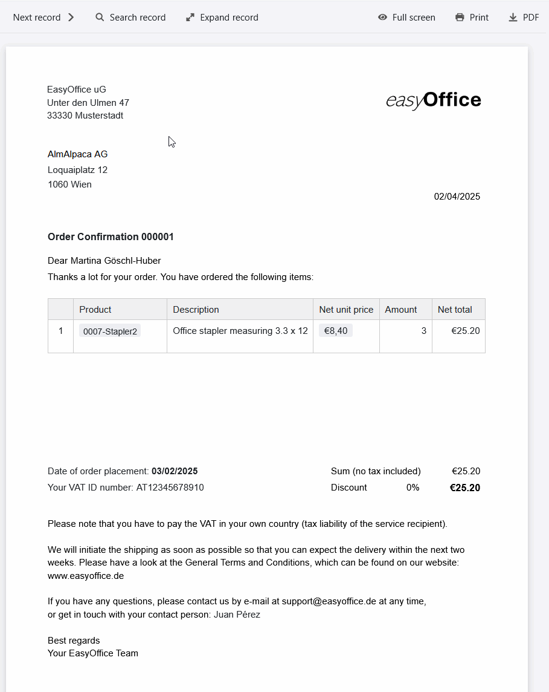
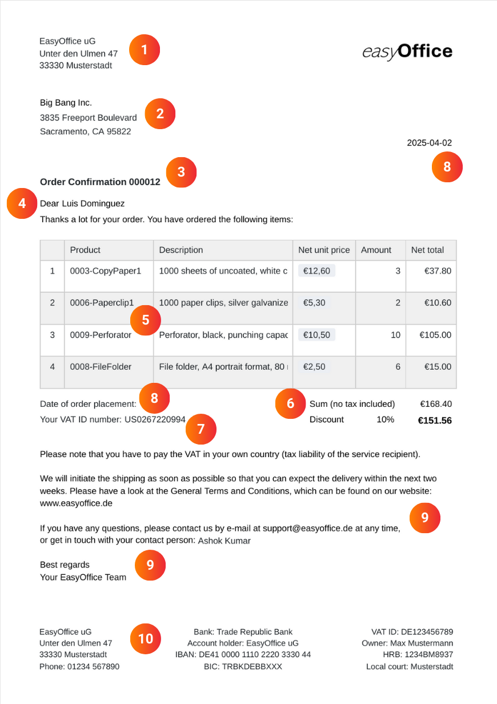
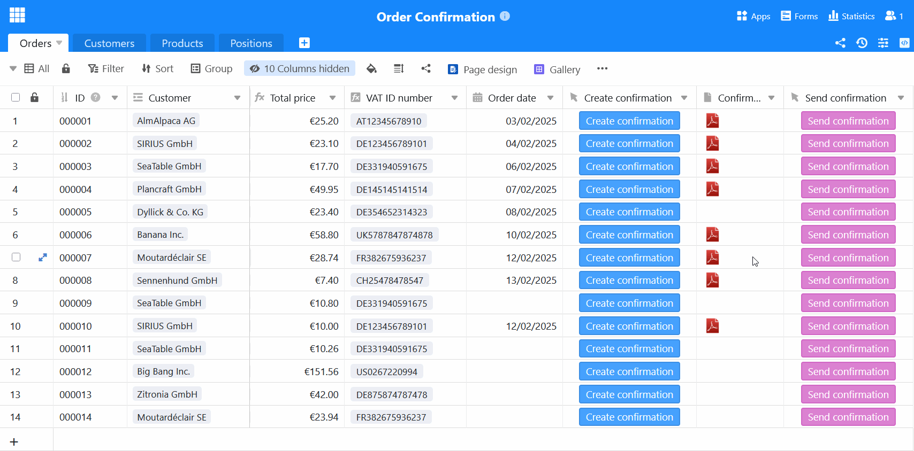

Congratulations! Another customer has accepted your offer. Before you can start providing the service, you just need towriteanorder confirmation. However, especially if you process orders frequently, you should not create an order confirmation every time. Instead, useSeaTable's order confirmation template, with which you can confirm every offer in writing - free of charge, conveniently and securely!

## Advantages of an order confirmation template

When you use an order confirmation template, you benefit from numerous improvements that make your process more efficient, simpler and more robust.

-Save time: Our digital template allows you to automatically create, send and save every order confirmation. This reduces manual entries and minimizes your administrative workload.

-No errors: If you create the order confirmation automatically using the dynamic fields and formulas, there are no calculation or typing errors as with an order confirmation template in Word.

-Central storage: In SeaTable you can store all existing data relating to your customers, products and orders, link them together and embed them in documents.

-Sustainability: With SeaTable, your order confirmation is completely paperless - without time-consuming and expensive dispatch, but simply at the touch of a button by e-mail.

## When you should create an order confirmation

An order confirmation is the process by which a customer accepts your offer and you confirm to the customer that your company will carry out the order on the agreed terms. Please note that the order confirmation must match the negotiated offer. Only then is itlegally bindinganda contract is concluded. However, if the details (e.g. scope of services, price or quantity) in the offer and order confirmation are notidentical, no contract is concluded and the customer must agree again.

If everything is already precisely regulated in the accepted offer, you can alsodispense with a written order confirmation. Nevertheless, it is useful to avoid misunderstandings, especially if the offer has been changed several times or if some time has passed since the offer was accepted. You can also specify delivery dates and payment terms in the order confirmation, but it does not replace an invoice. The order confirmation only states the price of the agreed services.

### Cases in which a written order confirmation is important

- Your customer has only placed the order verbally (e.g. on the phone).

- Your customer has placed an order without first having received a quote.

- Essential contractual conditions remained unclear in the offer.

- Several versions of your offer exist due to negotiations.

- Your customer has only placed the order after the offer deadline has expired.

You can alsohave your customer signthe order confirmation if you want to make sure that they agree to the terms of the contract. Your customer can also confirm the offer in writing with their signature.

## How to create a professional order confirmation

Although there are no legal requirements as to what information a written order confirmation must contain, thedetails must not deviate from the accepted offer. If you use our template for the order confirmation, you are always on the safe side, as SeaTable uses the same data as in the corresponding offer.

The following mandatory information should not be missing in any order confirmation to customers:

1. when you write an order confirmation, thenameandaddress of your companyusually form the letterhead together with yourcompany logo.

2. you need thenameandaddress of the client/customernot only for the delivery, but also for tax reasons - because services to companies are taxable where the client is based.

3.subject lineandorder number: A clear, consecutive numbering of your orders makes it easier to assign them in future correspondence with your customers.

4. the direct salutation with thename of the contact persongives your order confirmation a personal touch.

5 The exact service description with the individualitems (type, price and quantity)forms the main part of your order confirmation. It must be clear to what extent you are selling your products or services.

6 Now it's time to get down to business: add up the individual items to thenet amount, deduct adiscountif necessary and, for domestic customers, also calculate the gross amount including VAT.

7 For corporate customers abroad, you will need theVAT identification number. Inform these customers that they must pay the VAT in their respective country themselves (tax liability of the service recipient).

8. do not forget thecurrent dateand thedate the order was placedwhen you write an order confirmation. Optionally, you can also state adelivery date.

9. conclude the text with a friendly closing and agreeting. It is best to also refer to yourGeneral Terms and Conditions (GTC)when sending an order confirmation to customers.

10. yourbank details,VAT IDand other relevant company data should be included in the letterhead of your order confirmation template.

## The various functions of our order confirmation template

- You can customize our order confirmation template to suit your wishes and needs. Design your order confirmation with the template in thepage design pluginand use a variety of column types and visualization options.

- Create your order confirmation templatesin different languagesor for different countries and define dependencies so that the appropriate template is always selected automatically.

- As soon as you have filled the template with your data and individual designs, you can create the order confirmationautomaticallyand free of chargeat the touch of a button- without any further effort on your part.

- You can also automate the dispatch process: Integration with your e-mail provider allows you to write an order confirmation with just one click andsenditdirectly by e-mail.

- Use the integratedstatisticsto gain valuable insights from your figures and data and make well-founded decisions.

## Writing an order confirmation - it can be that simple

SeaTable's order confirmation template helps you to organizeproducts,customersandordersclearly, automatically create an order confirmation and save it as a PDF ready for dispatch. Thanks to intelligentlinks, the order confirmation is fed from relevant data from various tables: Customer information, order items and prices flow together seamlessly, whileformulasautomatically calculate discounts and VAT.

### Creating an order confirmation made easy

The page design plugin, which allows you to designdocuments in several languages, is particularly practical for written order confirmations. A single click is all it takes to save an order confirmation template as a PDF - depending on the customer's country, SeaTable automatically uses the appropriate template for the order confirmation. Thanks to theuser-friendly interface, you can write an order confirmation in no time at all. Shipping is also integrated: With an additional button, the finishedorder confirmationcan besent directly to the customer by e-mail. The entire process runs efficiently and smoothly, without the need for laborious copying or manual typing.

### More than an order confirmation template

Do you also need a template for yourquotationorinvoice? Fortunately, the order confirmation is just one of thecountless use casesof SeaTable. Take advantage of equally valuable additional functions:Statisticsallow you to easily evaluate sales figures and turnover, while thegallery pluginprovides an overview of yourproduct portfolio. Thanks to SeaTable's flexible customization options, you can tailor columns, calculations and views to your needs and create an application that fits your business perfectly.

## Advantages of SeaTable as order confirmation software

-Free of charge: The order confirmation template is free of charge. Start with the free version of SeaTable, which already includes numerous functions. If required, you can simply upgrade to get more functions or storage space.

-Collaborative: Thanks to real-time synchronization, SeaTable makes team collaboration much easier. Multiple users can work on tables, update data and leave comments at the same time.

-Convenient: If you create an order confirmation online, it can be accessed from anywhere and at any time and is also protected against loss. Unlike an order confirmation template in Word, you can also save structured data and generate documents automatically.

-Flexible: SeaTable is much more than just a database. Thanks to its versatile customization options, it can be used for a wide range of applications (such as quotations, invoices and order confirmations) and seamlessly integrated into various business processes.

-Secure: Your data is optimally protected with SeaTable. You have the choice of storing it in the cloud or on-premises. Thanks to GDPR compliance and individual access rights, you retain full control over your data at all times.

-Scalable: From initial use with just a few employees to a company-wide solution - SeaTable grows with your requirements. You only pay for the functions and resources that you actually use.

## Make order confirmation easy with SeaTable

Whether as a free order confirmation template for small businesses or order confirmation software for large corporations - with SeaTable it's child's play to write an order confirmation for every customer. Use automations to create and send one written order confirmation after another in no time at all. This gives you more time for the important things instead of wasting valuable hours confirming orders to customers.

If you would like to use the order confirmation template free of charge,simply registerwith your e-mail address.

## Interactive template

Scroll through our interactively embedded template or read the description by clicking on the  after the template name. This will give you a better feel for the functions of the order confirmation template. If you have any questions, please take a look at our [help section]().

​
