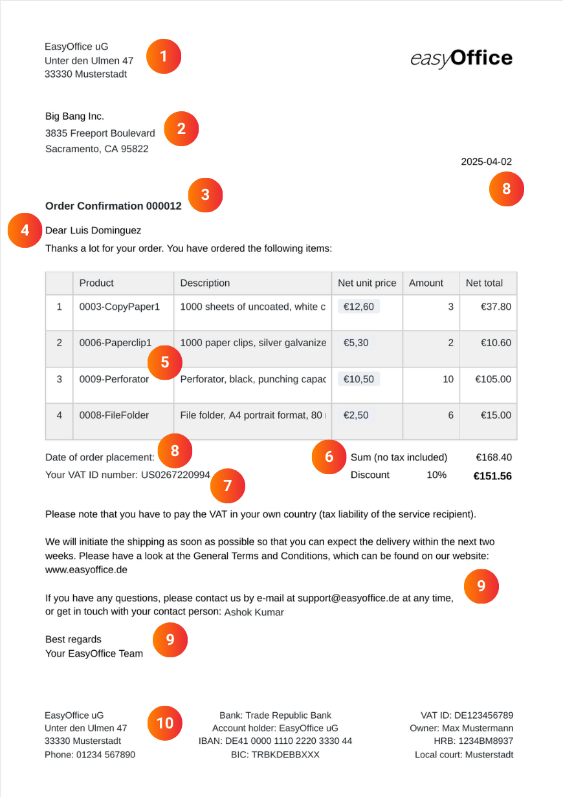

Enhorabuena. Otro cliente ha aceptado su oferta. Antes de empezar a prestar el servicio, sólo tiene queredactarunaconfirmacióndepedido. Sin embargo, especialmente si procesa pedidos con frecuencia, no debería crear una confirmación de pedido cada vez. En su lugar, utilicela plantilla de confirmación de pedido de SeaTable, con la que podrá confirmar cada oferta por escrito - ¡de forma gratuita, cómoda y segura!

## Ventajas de una plantilla de confirmación de pedido

Cuando utiliza una plantilla de confirmación de pedido, se beneficia de numerosas mejoras que hacen que su proceso sea más eficaz, sencillo y sólido.

- Ahorre tiempo: Nuestra plantilla digital le permite crear, enviar y guardar automáticamente cada confirmación de pedido. Esto reduce las entradas manuales y minimiza su carga de trabajo administrativo.

- Sin errores: Si crea la confirmación de pedido automáticamente utilizando los campos dinámicos y las fórmulas, no se producen errores de cálculo ni de escritura como con una plantilla de confirmación de pedido en Word.

- Almacenamiento centralizado: en SeaTable puede almacenar todos los datos existentes relativos a sus clientes, productos y pedidos, vincularlos entre sí e incrustarlos en documentos.

- Sostenibilidad: con SeaTable, la confirmación de su pedido se realiza completamente sin papel, sin necesidad de largos y costosos envíos, sino simplemente pulsando un botón por correo electrónico.

## Cuándo debe crear una confirmación de pedido

Una confirmación de pedido es el proceso por el cual un cliente acepta su oferta y usted confirma al cliente que su empresa cumplirá el pedido en las condiciones acordadas. Tenga en cuenta que la confirmación del pedido debe coincidir con la oferta negociada. Sólo entonces esjurídicamente vinculanteyse celebra un contrato. Sin embargo, si los detalles (por ejemplo, el alcance de los servicios, el precio o la cantidad) de la oferta y la confirmación del pedido no sonidénticos, no se celebra ningún contrato y el cliente debe aceptarlo de nuevo.

Si todo está ya regulado con precisión en la oferta aceptada, también puedeprescindir de una confirmación escrita del pedido. No obstante, es útil para evitar malentendidos, sobre todo si la oferta se ha modificado varias veces o si ha pasado algún tiempo desde que se aceptó la oferta. En la confirmación de pedido también se pueden especificar las fechas de entrega y las condiciones de pago, pero no sustituye a una factura. La confirmación de pedido sólo indica el precio de los servicios acordados.

### Casos en los que es importante una confirmación de pedido por escrito

- Su cliente sólo ha realizado el pedido verbalmente (por ejemplo, por teléfono).

- Su cliente ha realizado un pedido sin haber recibido antes un presupuesto.

- Las condiciones contractuales esenciales seguían sin estar claras en la oferta.

- Existen varias versiones de su oferta debido a las negociaciones.

- Su cliente ha realizado el pedido una vez expirado el plazo de la oferta.

También puedehacer que su cliente firmela confirmación del pedido si quiere asegurarse de que acepta las condiciones del contrato. Tu cliente también puede confirmar la oferta por escrito con su firma.

## Cómo crear una confirmación de pedido profesional

Aunque no existen requisitos legales sobre la información que debe contener una confirmación de pedido por escrito, losdetalles no deben desviarse de la oferta aceptada. Si utiliza nuestra plantilla para la confirmación del pedido, siempre irá sobre seguro, ya que SeaTable utiliza los mismos datos que en la oferta correspondiente.

La siguiente información obligatoria no debe faltar en ninguna confirmación de pedido a los clientes:

1. cuando redacta una confirmación de pedido, elnombrey ladirección de su empresasuelen formar el membrete junto conel logotipo desuempresa.

2. necesita elnombrey ladirección del clienteno sólo para la entrega, sino también por motivos fiscales, ya que los servicios a empresas están sujetos a impuestos en el lugar donde tiene su sede el cliente.

3.asuntoynúmero de pedido: una numeración clara y consecutiva de sus pedidos facilita su asignación en la futura correspondencia con sus clientes.

4 El saludo directo con elnombre de la persona de contactoda un toque personal a la confirmación de su pedido.

5 La descripción exacta del servicio con los elementos individuales(tipo, precio y cantidad)constituye la parte principal de su confirmación de pedido. Debe quedar claro en qué medida vende sus productos o servicios.

6 Ahora es el momento de ponerse manos a la obra: sume los distintos conceptos para obtener elimporte neto, deduzca undescuentosi es necesario y, en el caso de los clientes nacionales, calcule también el importe bruto, IVA incluido.

7 Para las empresas extranjeras, necesitará elnúmero de identificación a efectos del IVA. Señale a estos clientes que deben pagar ellos mismos el IVA en sus respectivos países (responsabilidad fiscal del destinatario del servicio).

8. no olvide lafecha actualy lafecha de realización del pedidocuando redacte una confirmación de pedido. Opcionalmente, también puede indicar unafecha de entrega.

9. concluya el texto con un cierre amistoso y unsaludo. Lo mejor es remitirse también a susCondiciones Generales de Contratación(CGC) cuando envíe una confirmación de pedido a los clientes.

10. susdatos bancarios,CIFy otros datos relevantes de la empresa deben incluirse en el membrete de su plantilla de confirmación de pedido.

## Las múltiples funciones de nuestra plantilla de confirmación de pedido

- Puede personalizar nuestra plantilla de confirmación de pedido para adaptarla a sus deseos y necesidades. Diseñe su confirmación de pedido con la plantilla delplugin de diseño de páginasy utilice diversos tipos de columnas y opciones de visualización.

- Cree sus plantillas de confirmación de pedidosen distintos idiomaso para distintos países y defina dependencias para que siempre se seleccione automáticamente la plantilla adecuada.

- En cuanto haya rellenado la plantilla con sus datos y diseños personalizados, podrá crear la confirmación de pedido deforma automáticay gratuitacon sólo pulsar un botón, sin ningún esfuerzo adicional por su parte.

- También puede automatizar el envío: La integración con su proveedor de correo electrónico le permite redactar una confirmación de pedido con un solo clic yenviarla directamente por correo electrónico.

- Utilice lasestadísticasintegradas para obtener información valiosa de sus cifras y datos y tomar decisiones bien fundadas.

## Redactar una confirmación de pedido puede ser así de sencillo

La plantilla de confirmación de pedidos de SeaTable le ayuda a organizar claramentelos productos,clientesypedidos, crear automáticamente una confirmación de pedido y guardarla como PDF lista para su envío. Gracias aenlacesinteligentes, la confirmación de pedido se alimenta de datos relevantes de varias tablas: La información del cliente, los artículos del pedido y los precios fluyen a la perfección, mientras quelas fórmulascalculan automáticamente los descuentos y el IVA.

### Creación sencilla de una confirmación de pedido

El plugin de diseño de páginas, que permite diseñardocumentos en varios idiomas, resulta especialmente práctico para las confirmaciones de pedido por escrito. Con un solo clic puede guardar una plantilla de confirmación de pedido en formato PDF: en función del país del cliente, SeaTable utiliza automáticamente la plantilla adecuada para la confirmación de pedido. Gracias a susencilla interfaz, podrá redactar una confirmación de pedido en un abrir y cerrar de ojos. El envío también está integrado: Con un botón adicional, laconfirmaciónde pedido finalizada puede enviarsedirectamente al cliente por correo electrónico. Todo el proceso se lleva a cabo de forma eficiente y sin problemas, sin necesidad de laboriosas copias o mecanografía manual.

### Más que una plantilla de confirmación de pedido

¿Necesita también una plantilla para supresupuestoofactura? Afortunadamente, la confirmación de pedido es sólo uno de losinnumerables casos de usode SeaTable. También puede utilizar valiosas funciones adicionales:Las estadísticasle permiten analizar fácilmente las cifras de ventas y el volumen de negocio, mientras que elplugin de galeríale ofrece una visión general de sucartera de productos. Gracias a las flexibles opciones de personalización de SeaTable, puede adaptar columnas, cálculos y vistas a sus necesidades individuales y crear una aplicación que se adapte perfectamente a su empresa.

## Ventajas de SeaTable como software de confirmación de pedidos

-Gratuito: La plantilla de confirmación de pedido es gratuita. Comience con la versión gratuita de SeaTable, que ya incluye numerosas funciones. Si lo desea, puede actualizarla para obtener más funciones o espacio de almacenamiento.

-Colaboración: Gracias a la sincronización en tiempo real, SeaTable facilita enormemente la colaboración en equipo. Varios usuarios pueden trabajar en tablas, actualizar datos y dejar comentarios al mismo tiempo.

-Cómoda: si crea una confirmación de pedido en línea, podrá acceder a ella desde cualquier lugar y en cualquier momento, y además estará protegida contra pérdidas. A diferencia de una plantilla de confirmación de pedido en Word, también puede guardar datos estructurados y generar documentos automáticamente.

-Flexible: SeaTable es mucho más que una base de datos. Gracias a sus versátiles opciones de personalización, puede utilizarse para una amplia gama de aplicaciones (como presupuestos, facturas y confirmaciones de pedidos) e integrarse a la perfección en diversos procesos empresariales.

-Seguro: Sus datos están protegidos de forma óptima con SeaTable. Puede elegir entre almacenarlos en la nube o en sus instalaciones. Gracias al cumplimiento de la normativa GDPR y a los derechos de acceso individuales, conservará el control total de sus datos en todo momento.

-Escalable: Desde el uso inicial con unos pocos empleados hasta una solución para toda la empresa, SeaTable crece con sus necesidades. Solo pagará por las funciones y los recursos que realmente utilice.

## Facilite la confirmación de pedidos con SeaTable

Ya sea como plantilla gratuita de confirmación de pedidos para pequeñas empresas o como software de confirmación de pedidos para grandes corporaciones, con SeaTable escribir una confirmación de pedido para cada cliente es un juego de niños. Utilice automatizaciones para crear y enviar una confirmación de pedido escrita tras otra en un abrir y cerrar de ojos. Así tendrá más tiempo para las cosas importantes en lugar de perder valiosas horas confirmando pedidos a los clientes.

Si desea utilizar gratuitamente la plantilla de confirmación de pedido,sólo tiene que registrarsecon su dirección de correo electrónico.

## Plantilla interactiva

Desplácese por nuestra plantilla incrustada de forma interactiva o lea la descripción haciendo clic en el símbolo i que aparece tras el nombre de la plantilla. Esto le dará una mejor idea de las funciones de la plantilla de confirmación de pedido. Si tiene alguna pregunta, eche un vistazo a nuestrasección de ayuda.

​
