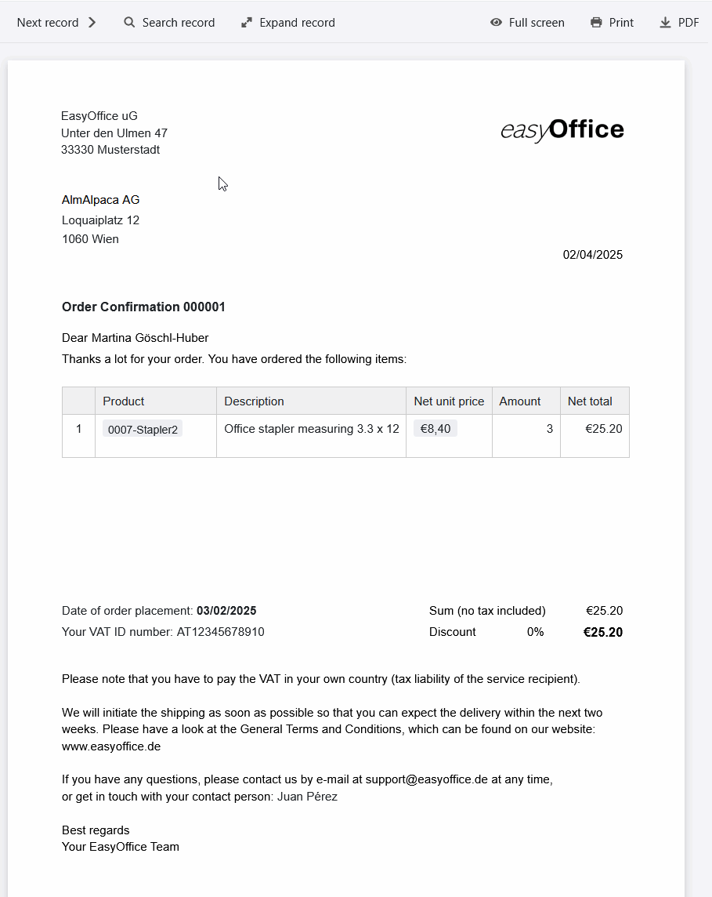

Nous vous félicitons ! Un autre client a accepté votre offre. Avant de pouvoir commencer à fournir la prestation, il ne vous reste plus qu'àrédigeruneconfirmation de commande. Mais si vous traitez souvent des commandes, il est préférable de ne pas rédiger une confirmation de commande à chaque fois. Utilisez plutôt lemodèle de confirmation de commande de SeaTable, qui vous permet de confirmer chaque offre par écrit - gratuitement, facilement et en toute sécurité !

## Avantages d'un modèle de confirmation de commande

En utilisant un modèle de confirmation de commande, vous bénéficierez de nombreuses améliorations qui rendront votre processus plus efficace, plus simple et plus robuste.

- Gagner du temps: Notre modèle numérique vous permet de créer, d'envoyer et d'enregistrer automatiquement chaque confirmation de commande. Vous réduisez ainsi les saisies manuelles et minimisez votre charge administrative.

- Pas d'erreurs: lorsque vous créez automatiquement la confirmation de commande à l'aide des champs et formules dynamiques, il n'y a pas d'erreurs de calcul ou de frappe comme avec un modèle de confirmation de commande dans Word.

- Stockage centralisé: SeaTable vous permet de stocker toutes les données existantes relatives à vos clients, produits et commandes, de les relier entre elles et de les intégrer dans des documents.

- Durabilité: avec SeaTable, votre confirmation de commande se déroule entièrement sans papier - sans envoi compliqué et coûteux, mais simplement en appuyant sur un bouton, par e-mail.

## Quand établir une confirmation de commande

Une confirmation de commande désigne le processus par lequel, d'une part, un client accepte votre offre et, d'autre part, vous confirmez au client que votre entreprise exécutera la commande aux conditions convenues. Notez que la confirmation de commande doit correspondre à l'offre négociée. Ce n'est qu'à cette condition qu'elle estjuridiquement contraignanteet qu'un contrat est conclu. Toutefois, si les informations (par exemple l'étendue des prestations, le prix ou la quantité) figurant dans l'offre et dans la confirmation de commande ne sont pasidentiques, aucun contrat n'est conclu et le client doit à nouveau donner son accord.

Si tout est déjà réglé avec précision dans l'offre acceptée, vous pouvez égalementvous passer d'une confirmation de commande écrite. Elle est néanmoins utile pour éviter les malentendus, surtout si l'offre a été modifiée à plusieurs reprises ou si un certain temps s'est écoulé depuis l'acceptation de l'offre. Dans la confirmation de commande, vous pouvez également régler les dates de livraison et les conditions de paiement, mais elle ne remplace pas une facture. En effet, la confirmation de commande n'indique que le prix des prestations convenues.

### Cas où une confirmation écrite de la commande est importante

- Votre client n'a passé la commande qu'oralement (par exemple au téléphone).

- Votre client a passé une commande sans avoir reçu d'offre préalable.

- Des conditions contractuelles essentielles sont restées floues dans l'offre.

- Suite à des négociations, il existe plusieurs versions de votre offre.

- Votre client n'a passé la commande qu'après l'expiration du délai de soumission des offres.

Vous pouvez égalementfaire signerla confirmation de commandepar votre clientsi vous voulez vous assurer qu'il est d'accord avec les termes du contrat. De même, votre client peut confirmer l'offre par écrit en la signant.

## Comment créer une confirmation de commande professionnelle

Bien qu'il n'existe aucune obligation légale concernant les informations que doit contenir une confirmation de commande écrite, lesdonnées ne doivent pas différer de l'offre acceptée. Si vous utilisez notre modèle de confirmation de commande, vous êtes toujours en sécurité, car SeaTable utilise les mêmes données que dans l'offre correspondante.

Les informations obligatoires suivantes ne devraient manquer dans aucune confirmation de commande adressée aux clients :

1. lorsque vous rédigez une confirmation de commande, lenomet l'adresse de votre entrepriseconstituent généralement l'en-tête, avecle logo devotresociété.

2. vous avez besoin dunomet de l'adresse du donneur d'ordre/clientnon seulement pour la livraison, mais aussi pour des raisons fiscales - car les prestations fournies à des entreprises sont imposables là où le donneur d'ordre a son siège.

3.ligne d'objetetnuméro de commande: une numérotation claire et continue de vos commandes facilite l'attribution lors d'une future correspondance avec vos clients.

4. l'adresse directe avec lenom de la personne de contactdonne une touche personnelle à votre confirmation de commande.

5. la description précise des prestations avec les différentespositions (type, prix et quantité)constitue la partie principale de votre confirmation de commande. Il doit être clair dans quelle mesure vous vendez vos produits ou services.

6. il faut maintenant entrer dans le vif du sujet : additionnez les différents postes pour obtenir lemontant net, déduisez éventuellement uneremiseet, pour les clients en Suisse, calculez également le montant brut, TVA légale incluse.

7) Pour les entreprises clientes à l'étranger, vous avez besoin dunuméro d'identification à la TVA. Indiquez à ces clients qu'ils doivent eux-mêmes s'acquitter de la TVA dans leur pays respectif (obligation fiscale du destinataire de la prestation).

8. n'oubliez pas ladate du jouret ladate de passation de la commandelorsque vous rédigez une confirmation de commande. En option, vous pouvez également mentionner unedate de livraison.

9. terminez le texte par un signe de ralliement amical et uneformule de salutations. Il est préférable de mentionner vosconditions générales de vente (CGV)lorsque vous confirmez une commande à un client.

10) Le pied de page de votre modèle de confirmation de commande doit contenir voscoordonnées bancaires, votrenuméro de TVAet d'autres informations pertinentes sur votre entreprise.

## Les multiples fonctions de notre modèle de confirmation de commande

- Vous pouvez adapter notre modèle de confirmation de commande à vos souhaits et besoins individuels. Créez votre confirmation de commande à l'aide du modèle dans leplug-in de conception de pageset utilisez de nombreux types de colonnes et de possibilités de visualisation.

- Créez vos modèles de confirmation de commandedans différentes languesou pour différents pays et définissez des dépendances afin que le modèle approprié soit toujours sélectionné automatiquement.

- Dès que vous avez rempli le modèle avec vos données et vos designs individuels, vous pouvez générer gratuitement etautomatiquementla confirmation de commandeen appuyant sur un bouton- sans aucun effort de votre part.

- Vous pouvez également automatiser l'envoi : Grâce à l'intégration avec votre fournisseur de messagerie, il est possible de rédiger une confirmation de commande en un seul clic et de l'envoyer directement par e-mail.

- Utilisez lesstatistiquesintégrées pour tirer de précieux enseignements de vos chiffres et données et prendre des décisions éclairées.

## Rédiger une confirmation de commande - cela peut être aussi simple que cela

Le modèle de confirmation de commande de SeaTable vous permet d'organiser clairement lesproduits,les clientsetles commandes, de créer automatiquement une confirmation de commande et de l'enregistrer au format PDF, prête à être envoyée. Grâce àdes liensintelligents, la confirmation de commande est alimentée par les données pertinentes de différents tableaux : Les informations sur les clients, les postes de commande et les prix s'intègrent parfaitement, tandis quedes formulescalculent automatiquement les remises et la TVA.

### Créer une confirmation de commande, c'est facile

Le plug-in de conception de page est particulièrement pratique pour les confirmations de commande écrites, car il permet de concevoirdes documents en plusieurs langues. Un seul clic suffit pour enregistrer un modèle de confirmation de commande au format PDF - selon le pays du client, SeaTable utilise automatiquement le modèle de confirmation de commande approprié. Grâce à l'interface conviviale, vous pouvez ainsi rédiger une confirmation de commande en un rien de temps. L'envoi est également intégré : Un autre bouton permet d'envoyerlaconfirmation de commandeterminéedirectement au client par e-mail. L'ensemble du processus se déroule ainsi de manière efficace et sans accroc, sans avoir à copier ou à taper manuellement.

### Plus qu'un modèle de confirmation de commande

Vous avez également besoin d'un modèle pour votredevisou votrefacture? La confirmation de commande n'est heureusement qu'un desinnombrables cas d'utilisationde SeaTable. Utilisez des fonctions supplémentaires tout aussi précieuses :Les statistiquesvous permettent d'évaluer facilement les chiffres de vente et le chiffre d'affaires, tandis que leplug-in de galerievous donne un aperçu de votreportefeuille de produits. Grâce aux possibilités de personnalisation flexibles de SeaTable, vous pouvez adapter les colonnes, les calculs et les affichages à vos besoins individuels et créer ainsi une application qui correspond exactement à votre entreprise.

## Avantages de SeaTable en tant que logiciel de confirmation de commande

-Gratuit: Le modèle de confirmation de commande est gratuit. Commencez avec la version gratuite de SeaTable, qui comprend déjà de nombreuses fonctionnalités. Si vous le souhaitez, il vous suffit de mettre à niveau votre version pour bénéficier de plus de fonctionnalités ou d'espace de stockage.

-Collaboratif: grâce à la synchronisation en temps réel, SeaTable facilite considérablement le travail en équipe. Plusieurs utilisateurs peuvent travailler simultanément sur des tableaux, mettre à jour des données et laisser des commentaires.

-Pratique: lorsque vous créez une confirmation de commande en ligne, elle est accessible de partout et à tout moment, tout en étant protégée contre la perte. Contrairement à un modèle de confirmation de commande dans Word, vous pouvez en outre enregistrer des données structurées et générer automatiquement des documents.

-Flexible: SeaTable est bien plus qu'une simple base de données. Grâce à ses multiples possibilités de personnalisation, elle peut être utilisée pour les cas d'application les plus divers (comme le devis, la facture et la confirmation de commande) et s'intégrer de manière transparente dans différents processus commerciaux.

-Sûr: vos données sont parfaitement protégées chez SeaTable. Vous avez le choix de les stocker dans le cloud ou sur site. Grâce à la conformité au RGPD et aux droits d'accès individuels, vous gardez à tout moment le contrôle total de vos données.

-Évolutif: de la première utilisation avec quelques collaborateurs à une solution à l'échelle de l'entreprise, SeaTable évolue en fonction de vos besoins. Vous ne payez que pour les fonctions et les ressources que vous utilisez réellement.

## Facilitez la confirmation de commande avec SeaTable

Qu'il s'agisse d'un modèle de confirmation de commande gratuit pour les petites entreprises ou d'un logiciel de confirmation de commande pour les grandes sociétés, avec SeaTable, c'est un jeu d'enfant de rédiger une confirmation de commande pour chaque client. Utilisez les automatismes pour créer et envoyer des confirmations de commande écrites les unes après les autres en un clin d'œil. Vous aurez ainsi plus de temps à consacrer aux choses importantes, au lieu de perdre de précieuses heures à confirmer des commandes à vos clients.

Si vous souhaitez utiliser gratuitement le modèle de confirmation de commande, il voussuffit de vous inscrireavec votre adresse e-mail.

## Modèle interactif

Faites défiler notre modèle intégré de manière interactive ou lisez la description en cliquant sur  derrière le nom du modèle. Vous aurez ainsi une meilleure idée des fonctions du modèle de confirmation de commande. Si vous avez des questions, n'hésitez pas à consulter notre [rubrique d'aide]().

​
